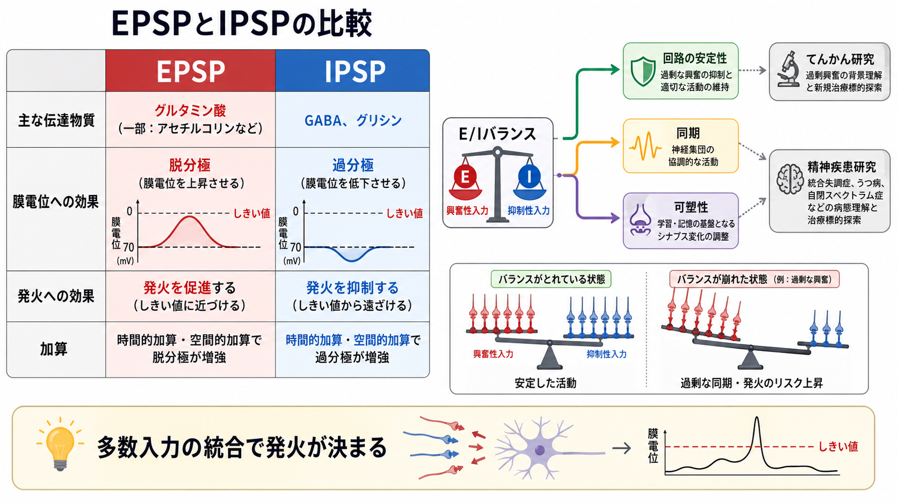
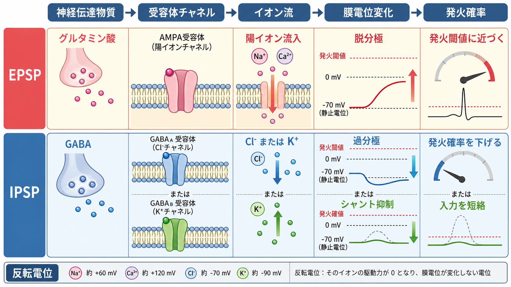

---
title: "EPSPとIPSPはどのように発火を調節するのか"
description: "興奮性入力と抑制性入力のバランスが、膜電位を通じてニューロンの発火確率を調節する仕組みを説明する。"
aliases:
  - "EPSPとIPSP"
  - "興奮性シナプス後電位と抑制性シナプス後電位"
tags:
  - neuroscience
  - basic-neuroscience
  - synapse
  - electrophysiology
  - obsidian
created: "2026-04-27"
updated: "2026-04-27"
draft: true
publish: false
status: draft
enableToc: true
---

# EPSPとIPSPはどのように発火を調節するのか

## 要点

- EPSP（興奮性シナプス後電位）は、膜電位を発火閾値へ近づけ、[[活動電位はどのように発生するのか|活動電位]]が生じる確率を高める。
- IPSP（抑制性シナプス後電位）は、膜電位を閾値から遠ざける、または膜コンダクタンスを上げて興奮性入力を弱めることで、発火確率を下げる。
- 1つのEPSPやIPSPだけで発火が決まることは少なく、多数の入力が時間的・空間的に加算され、[[軸索小丘はなぜ発火の起点になるのか|軸索小丘]]付近で閾値を超えるかどうかが重要になる。
- 「興奮か抑制か」は、単に膜電位が上がるか下がるかではなく、シナプス電流の反転電位、発火閾値、入力の場所、タイミング、膜コンダクタンスで決まる。

## この記事で答える問い

[[シナプス後電位とは何か|シナプス後電位]]は、ニューロンが受け取った入力をどのように「発火する／しない」という出力へ変換するのか。その中心にあるのが、EPSPとIPSPの加算、相殺、そして興奮と抑制のバランスである。

## まず結論

EPSPとIPSPは、ニューロンに対する単純な「オン／オフ信号」ではない。EPSPは多くの場合、[[グルタミン酸は脳で何をしているのか|グルタミン酸]]受容体を介して陽イオンを流し、膜電位を発火閾値へ近づける。IPSPは多くの場合、[[GABAは脳で何をしているのか|GABA]]受容体を介してCl^-やK^+の流れを変え、膜電位を閾値から遠ざける、または入力抵抗を下げてEPSPの効果を短絡する。[1]

重要なのは、ニューロンが受け取る入力が単発ではなく、多数のシナプスから連続的に入ってくる点である。個々のシナプス後電位は小さくても、それらが時間的・空間的に足し合わされ、総和が閾値を超えると発火が起こる。逆に、IPSPが同時に入ると、EPSPの総和が閾値に届かなくなることがある。[2]

## 背景

ニューロンは、[[シナプスとは何か|シナプス]]を通じて他の細胞から入力を受ける。シナプス前終末から放出された神経伝達物質がシナプス後膜の受容体に結合すると、[[イオンチャネルとは何か|イオンチャネル]]が開閉し、膜電位が一時的に変化する。この変化がシナプス後電位である。

中枢神経系の多くのシナプスでは、単一のEPSPは発火閾値よりかなり小さい。そのため、発火は「1つの強い入力」ではなく、「多数の弱い入力の統合」によって決まることが多い。[2] 樹状突起の形、膜の受動的性質、電位依存性チャネルなども、入力が細胞体や軸索初節に届くまでの大きさと時間経過を変える。[3]

## 基本概念

### EPSP

EPSPは excitatory postsynaptic potential の略で、日本語では興奮性シナプス後電位という。典型例では、AMPA受容体などのグルタミン酸受容体が開き、Na^+などの陽イオン流入により膜電位が脱分極する。脱分極は膜電位を発火閾値へ近づけるため、発火確率を高める。[1]

### IPSP

IPSPは inhibitory postsynaptic potential の略で、日本語では抑制性シナプス後電位という。典型例では、GABA_A受容体を介したCl^-チャネル、またはGABA_B受容体を介したK^+チャネルなどにより、発火確率が下がる。多くの成熟ニューロンではGABA_A受容体の作用は抑制的だが、それは「必ず過分極するから」ではない。反転電位が発火閾値より低いこと、そして膜コンダクタンス増加によるシャント抑制が重要である。[1][4]

### 反転電位と発火閾値

シナプス電流が膜電位をどちらへ動かすかは、反転電位で考えると見通しがよい。反転電位とは、そのチャネルを通る正味のイオン電流が0になる膜電位である。EPSPに関わる陽イオンチャネルの反転電位は多くの場合、発火閾値より正側にあるため、膜電位を閾値へ近づける。IPSPに関わるチャネルの反転電位は多くの場合、発火閾値より負側にあるため、膜電位を閾値未満に保ちやすい。[1] これは[[ネルンスト電位とは何か]]や[[静止膜電位はどのように生じるのか]]ともつながる。

## 仕組み

### 1. 時間的加算

同じシナプス、または近い入力が短い間隔で繰り返し入ると、前のEPSPが消え切る前に次のEPSPが重なり、膜電位の変化が大きくなる。これが時間的加算である。入力間隔が短く、膜時定数が長いほど、加算は起こりやすい。[2][3]

### 2. 空間的加算

別々のシナプスからほぼ同時に入力が入ると、それぞれのシナプス後電位が足し合わされる。樹状突起の遠位にある入力は、細胞体へ届くまでに減衰しやすいが、樹状突起の能動的チャネルやシナプスの配置によって、単純な足し算からずれることもある。[3]

### 3. IPSPによる相殺とシャント

IPSPは、EPSPと代数的に足し合わされて膜電位の上昇を小さくするだけではない。GABA_A受容体のように膜コンダクタンスを増やす入力は、膜抵抗を下げ、近くまたは遠位から来るEPSPの効果を「短絡」する。これをシャント抑制という。[4][5]

シャント抑制では、目に見える過分極が小さくても発火は抑えられる。つまり、記録上の膜電位変化が小さいからといって、抑制が弱いとは限らない。

### 4. 発火は軸索初節で判定される

統合された膜電位変化は、最終的に軸索初節で活動電位を開始できるかどうかに関わる。軸索初節には電位依存性Na^+チャネルが高密度に存在し、膜電位が閾値を超えると再生的な脱分極が起こる。したがって、樹状突起で起きたEPSPとIPSPは、位置や時間に応じて変形されながら、発火の起点へ集約される。

## 図解

上の3枚の図は、それぞれ次の内容に対応している。

1. EPSPとIPSPの比較、E/Iバランス、研究・臨床との接続。
2. EPSPとIPSPが受容体チャネル、イオン流、反転電位、膜電位変化を通じて発火確率を変える流れ。
3. 時間的加算と空間的加算により、単一入力ではなく入力の総和が発火を決める仕組み。

## 臨床・研究との接続

興奮性入力と抑制性入力のバランスは、皮質回路の情報処理、発火率、同期、代謝効率に関わる。計算モデル研究では、興奮性・抑制性シナプス電流のバランスが、単に発火を減らすだけでなく、スパイクあたりの情報効率やエネルギー効率を高めうることが示されている。[6]

一方で、E/Iバランスの乱れを「特定の疾患の単一原因」とみなすのは単純化しすぎである。例えば、GABA_A受容体を介した抑制は、Cl^-濃度、反転電位、コンダクタンス、細胞種、発達段階によって作用が変わる。[5][7] したがって、てんかん、発達障害、精神疾患などとの関係を考えるときも、個別診断や治療指示ではなく、回路機構を理解するための研究概念として扱う必要がある。

## よくある誤解

### 誤解1: EPSPは必ず発火を起こす

EPSPは発火確率を上げるが、単独で閾値を超えるとは限らない。多くの中枢シナプスの単一EPSPは小さく、他のEPSPとの加算やIPSPとの相互作用で結果が決まる。[2]

### 誤解2: IPSPは必ず膜電位を下げる

IPSPは発火確率を下げる入力であり、必ず過分極として見えるとは限らない。GABA_A受容体の反転電位が静止膜電位に近い場合、膜電位変化は小さくても、膜コンダクタンスの増加によってEPSPを弱めることがある。[1][4]

### 誤解3: 興奮性ニューロンは常に興奮だけ、抑制性ニューロンは常に抑制だけをする

一般に、[[興奮性ニューロンと抑制性ニューロンは何が違うのか|興奮性ニューロン]]はグルタミン酸作動性、抑制性ニューロンはGABA作動性であることが多い。しかし、シナプス作用の意味は、伝達物質だけでなく、受容体、イオン勾配、反転電位、発火閾値によって決まる。[[介在ニューロンは神経回路で何をしているのか|介在ニューロン]]の機能を理解するときも、この点が重要である。

## 関連ノート

- [[シナプス後電位とは何か]]
- [[シナプスとは何か]]
- [[活動電位はどのように発生するのか]]
- [[軸索小丘はなぜ発火の起点になるのか]]
- [[グルタミン酸は脳で何をしているのか]]
- [[GABAは脳で何をしているのか]]
- [[イオンチャネルとは何か]]
- [[ネルンスト電位とは何か]]
- [[静止膜電位はどのように生じるのか]]
- [[興奮性ニューロンと抑制性ニューロンは何が違うのか]]

## 関連ノート候補

- EPSPとは何か
- IPSPとは何か
- シャント抑制とは何か
- E/Iバランスとは何か
- 樹状突起統合とは何か
- GABA_A受容体とGABA_B受容体は何が違うのか

## MOC更新候補

- `content/00_MOC/` 以下の基礎神経科学またはシナプス関連MOCへ、本記事 `[[EPSPとIPSPはどのように発火を調節するのか]]` を追加候補とする。
- 並列実行時の競合を避けるため、本ジョブではMOCファイルを直接更新しない。

## 理解チェック

1. EPSPが発火確率を高めるのは、膜電位をどの方向へ動かすからか。
2. IPSPが過分極として見えない場合でも、発火を抑えられる理由は何か。
3. 時間的加算と空間的加算は、それぞれどのような入力の重なりを指すか。
4. 反転電位が発火閾値より正側か負側かは、シナプス作用の解釈にどう関わるか。
5. E/Iバランスを疾患説明に使うとき、どのような単純化を避けるべきか。

## 参考文献

[1] Purves D, Augustine GJ, Fitzpatrick D, et al., editors. *Neuroscience*. 2nd ed. Sunderland (MA): Sinauer Associates; 2001. Excitatory and Inhibitory Postsynaptic Potentials. NCBI Bookshelf. https://www.ncbi.nlm.nih.gov/books/NBK11117/

[2] Purves D, Augustine GJ, Fitzpatrick D, et al., editors. *Neuroscience*. 2nd ed. Sunderland (MA): Sinauer Associates; 2001. Summation of Synaptic Potentials. NCBI Bookshelf. https://www.ncbi.nlm.nih.gov/books/NBK11104/

[3] Magee JC. Dendritic integration of excitatory synaptic input. *Nature Reviews Neuroscience*. 2000;1:181-190. https://doi.org/10.1038/35044552

[4] Song I, Savtchenko L, Semyanov A. Tonic excitation or inhibition is set by GABA_A conductance in hippocampal interneurons. *Nature Communications*. 2011;2:376. https://doi.org/10.1038/ncomms1377

[5] Trevelyan AJ, Watkinson O. Does inhibition balance excitation in neocortex? *Progress in Biophysics and Molecular Biology*. 2005;87(1):109-143. https://doi.org/10.1016/j.pbiomolbio.2004.06.008

[6] Sengupta B, Laughlin SB, Niven JE. Balanced excitatory and inhibitory synaptic currents promote efficient coding and metabolic efficiency. *PLoS Computational Biology*. 2013;9(10):e1003263. https://doi.org/10.1371/journal.pcbi.1003263

[7] Kirmse K. Non-linear GABA_A receptors promote synaptic inhibition in developing neurons. *Pflügers Archiv - European Journal of Physiology*. 2022;474:181-183. https://doi.org/10.1007/s00424-021-02652-w

## 未解決問題

- 同じGABA_A受容体入力が、発達段階、細胞種、細胞内Cl^-濃度の違いによってどのように興奮性または抑制性へ変わるのか。
- 樹状突起上の入力位置とタイミングが、実際の行動中の発火パターンにどの程度影響するのか。
- E/Iバランスという概念を、疾患横断的な説明ではなく、測定可能な回路パラメータとしてどう定義するのか。
