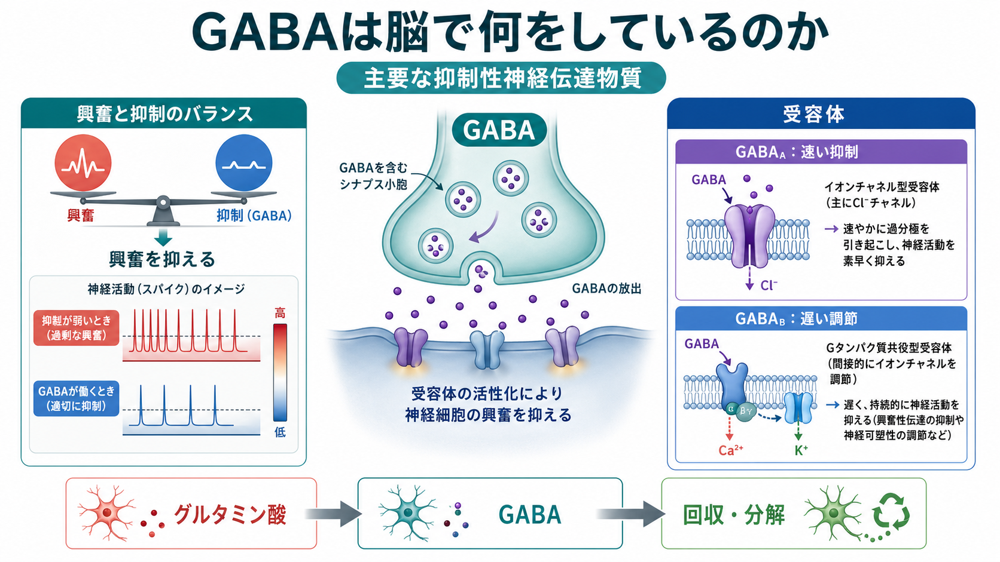
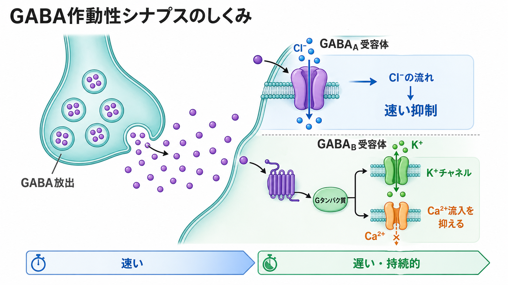
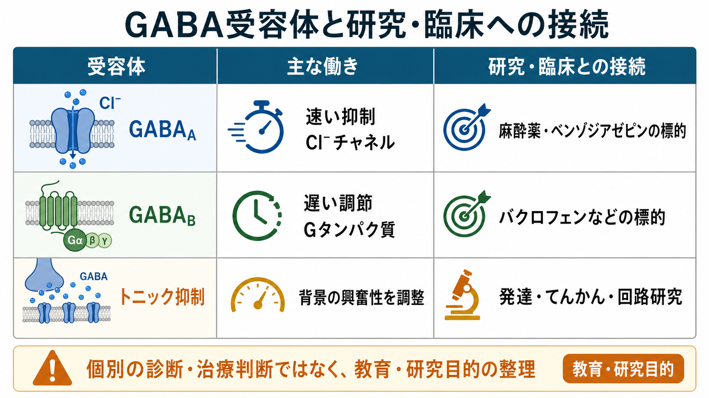

---
title: "GABAは脳で何をしているのか"
description: "主要な抑制性神経伝達物質であるGABAの基本作用、GABA_A受容体とGABA_B受容体、発達・臨床研究との接点を整理する。"
aliases:
  - "GABA"
  - "γ-アミノ酪酸"
  - "ガンマアミノ酪酸"
tags:
  - neuroscience
  - basic-neuroscience
  - neurotransmitter
  - inhibition
  - obsidian
created: "2026-04-27"
updated: "2026-04-27"
draft: true
publish: false
status: draft
enableToc: true
---

# GABAは脳で何をしているのか

## 要点

- GABA（gamma-aminobutyric acid、γ-アミノ酪酸）は、成熟した中枢神経系で中心的な抑制性神経伝達物質として働く。
- GABAの基本的な役割は、[[ニューロンとは何か|ニューロン]]が発火しすぎないようにし、[[活動電位はどのように発生するのか|活動電位]]の起こりやすさや神経回路のタイミングを調整することである[1]。
- 主な受容体は、速い抑制を担うイオンチャネル型のGABA_A受容体と、遅く持続的な調節を担うGタンパク質共役型のGABA_B受容体である[2][4]。
- GABAは単に「脳を止める物質」ではなく、興奮と抑制のバランス、リズム形成、感覚・運動・認知の精密な制御に関わる[3]。

## この記事で答える問い

GABAは、脳の中で何を「抑えて」いるのか。GABA_A受容体とGABA_B受容体は何が違うのか。そして、なぜGABAは神経科学・精神医学・薬理学でこれほど重要な概念なのか。

## まず結論

GABAは、神経活動を全体として弱めるだけの物質ではない。むしろ、興奮性入力の強さ、発火のタイミング、回路の同期、不要な信号の通過しにくさを細かく調整する「抑制の設計原理」である。[[シナプスとは何か|シナプス]]で放出されたGABAは、GABA_A受容体を介してミリ秒単位の速い抑制を生み、GABA_B受容体を介してより遅いシナプス前・シナプス後調節を行う[2][4]。

## 背景

脳の情報処理は、興奮性信号だけでは安定しない。[[興奮性ニューロンと抑制性ニューロンは何が違うのか|興奮性ニューロンと抑制性ニューロン]]の相互作用によって、回路は「反応するが暴走しない」状態を保つ。GABA作動性の[[介在ニューロンは神経回路で何をしているのか|介在ニューロン]]は、この安定化に大きく関わる。

興奮と抑制のバランスは、単純な足し算ではない。抑制がどの細胞のどの部位に、どのタイミングで、どの受容体を介して入るかによって、発火の確率、入力統合の時間窓、ネットワーク振動の位相が変わる[3]。そのためGABAは、神経活動の「ブレーキ」だけでなく「タイミングをそろえる制御信号」として理解した方がよい。

## 基本概念

### GABAはどこから来るのか

GABAは、興奮性神経伝達物質であるグルタミン酸から、グルタミン酸脱炭酸酵素（GAD）によって合成される。合成されたGABAは小胞に詰め込まれ、活動電位がシナプス前終末に到達するとカルシウム依存的に放出される[1]。放出後のGABAは、受容体に作用したあと、トランスポーターによって神経細胞やグリア細胞へ回収され、代謝経路に戻る[1]。

この流れは、[[化学シナプスと電気シナプスは何が違うのか|化学シナプス]]の典型的な仕組みに重なる。違いは、GABAが主に「次の細胞を発火しにくくする」方向に働く点である。

### 抑制とは何か

GABAによる抑制には、少なくとも二つの意味がある。

一つは、膜電位を発火しにくい方向へ動かす過分極である。もう一つは、膜コンダクタンスを増やして、興奮性入力が膜電位を大きく変えにくくするシャント抑制である。成熟した神経細胞では、GABA_A受容体が開くと主にCl⁻の透過性が変わり、[[静止膜電位はどのように生じるのか|静止膜電位]]やCl⁻の平衡電位との関係によって抑制効果が生じる[2]。

## 仕組み

### GABA_A受容体：速い抑制

GABA_A受容体は、GABAが結合すると開くリガンド作動性Cl⁻チャネルである。これは[[イオンチャネルとは何か|イオンチャネル]]型受容体なので、作用は速い。シナプスで短時間に高濃度のGABAが放出されると、GABA_A受容体が一過性に活性化し、ミリ秒単位の「相性抑制（phasic inhibition）」を生む[3]。

また、シナプス外や周辺にあるGABA_A受容体が、低濃度の環境GABAによって持続的に活性化される場合がある。これは「持続性抑制（tonic inhibition）」と呼ばれ、細胞全体の入力抵抗や興奮しやすさを背景レベルで調整する[3]。

### GABA_B受容体：遅い調節

GABA_B受容体はGタンパク質共役型受容体である。GABA_A受容体のように直接Cl⁻チャネルを開くのではなく、Gタンパク質を介してK⁺チャネルやCa²⁺チャネル、細胞内シグナルを調節する[4]。シナプス後ではK⁺チャネルの開口を通じて発火しにくさを高め、シナプス前ではCa²⁺流入を減らして神経伝達物質の放出を抑える[4]。

このためGABA_B受容体は、速いオン・オフというより、回路のゲインや持続的な抑制状態を調整する役割をもつ。

## 図解

GABAの働きを一枚で見るなら、次の三層で捉えるとわかりやすい。

| 層 | 何が起きるか | 主なポイント |
|---|---|---|
| 分子 | GABAがGABA_AまたはGABA_B受容体に結合する | 受容体タイプで速度と機構が違う |
| 細胞 | Cl⁻、K⁺、Ca²⁺などの流れが変わる | 発火確率や入力統合が変わる |
| 回路 | 興奮と抑制のバランス、同期、リズムが変わる | 抑制は情報処理の一部である |

## 臨床・研究との接続

GABA_A受容体は、ベンゾジアゼピン、バルビツール酸系薬、麻酔薬など多くの中枢神経系薬物の標的と関係する[5][7]。ただし、この記事は教育・研究目的の整理であり、個別の服薬判断や診断を述べるものではない。

GABA_B受容体は、バクロフェンなどの薬理作用や、シナプス前抑制・シナプス後抑制の研究で重要である[4][7]。また、てんかん、発達障害、統合失調症、不安、依存、睡眠、麻酔などの領域では、GABA作動性の変化が研究対象になっている[7][8]。ここで重要なのは、「GABAが少ないから症状が出る」といった単純な説明ではなく、細胞種、発達段階、受容体サブタイプ、回路文脈によって意味が変わる点である。

## よくある誤解

### 誤解1：GABAはいつでも抑制性である

成熟した脳ではGABAは主に抑制性に働くが、発達中の神経細胞ではCl⁻濃度勾配が異なるため、GABA_A受容体の活性化が脱分極性に働くことがある[6]。発達に伴ってKCC2などのCl⁻輸送機構が変化し、GABAの作用は抑制性へ移行する[6]。

### 誤解2：GABAは脳活動を単に下げる

GABAは活動を下げるだけではない。抑制の場所とタイミングによって、神経回路の同期、発火順序、信号選択性を作る。たとえば相性抑制は短い時間窓を作り、持続性抑制は背景の興奮しやすさを調整する[3]。

### 誤解3：GABA_AとGABA_Bは強さが違うだけである

両者は「強い・弱い」ではなく、仕組みが違う。GABA_A受容体はイオンチャネル型で速く、GABA_B受容体は代謝型で遅く、シナプス前の伝達物質放出も調節する[2][4]。

## 関連ノート

- [[ニューロンとは何か]]
- [[シナプスとは何か]]
- [[化学シナプスと電気シナプスは何が違うのか]]
- [[イオンチャネルとは何か]]
- [[静止膜電位はどのように生じるのか]]
- [[活動電位はどのように発生するのか]]
- [[介在ニューロンは神経回路で何をしているのか]]
- [[興奮性ニューロンと抑制性ニューロンは何が違うのか]]

### 関連ノート候補

- グルタミン酸は脳で何をしているのか
- 神経伝達物質とは何か
- 興奮と抑制のバランスとは何か
- GABA_A受容体とは何か
- GABA_B受容体とは何か
- ベンゾジアゼピンはGABA_A受容体にどう作用するのか

### MOC更新候補

- `content/00_MOC/` 配下の脳・神経科学系MOCに、本記事へのリンクを追加する候補。
- 並列実行中の競合を避けるため、このタスクではMOC本体は更新していない。

## 理解チェック

1. GABA_A受容体とGABA_B受容体の違いを、「受容体の種類」「作用速度」「主なイオン・シグナル」の三点で説明できるか。
2. GABAによる抑制が、過分極だけでなくシャント抑制としても働く理由を説明できるか。
3. 発達中の脳でGABAが脱分極性に働きうる理由を、Cl⁻濃度勾配とKCC2/NKCC1の観点から説明できるか。
4. 「GABAは脳活動をただ下げる物質である」という説明の限界を述べられるか。

## 参考文献

[1] Jewett, B. E., & Sharma, S. (2023). *Physiology, GABA*. StatPearls. NCBI Bookshelf. https://www.ncbi.nlm.nih.gov/books/NBK513311/

[2] Purves, D., Augustine, G. J., Fitzpatrick, D., et al. (2001). *Neuroscience, 2nd edition: GABA and Glycine Receptors*. NCBI Bookshelf. https://www.ncbi.nlm.nih.gov/books/NBK10977/

[3] Farrant, M., & Nusser, Z. (2005). Variations on an inhibitory theme: phasic and tonic activation of GABA_A receptors. *Nature Reviews Neuroscience, 6*, 215-229. https://doi.org/10.1038/nrn1625

[4] Gassmann, M., & Bettler, B. (2012). Regulation of neuronal GABA_B receptor functions by subunit composition. *Nature Reviews Neuroscience, 13*, 380-394. https://doi.org/10.1038/nrn3249

[5] Olsen, R. W., & Sieghart, W. (2008). International Union of Pharmacology. LXX. Subtypes of γ-aminobutyric acid_A receptors: classification on the basis of subunit composition, pharmacology, and function. *Pharmacological Reviews, 60*(3), 243-260. https://doi.org/10.1124/pr.108.00505

[6] Ben-Ari, Y. (2002). Excitatory actions of GABA during development: the nature of the nurture. *Nature Reviews Neuroscience, 3*, 728-739. https://doi.org/10.1038/nrn920

[7] Chen, R. J., & Sharma, S. (2025). *GABA Receptor*. StatPearls. NCBI Bookshelf. https://www.ncbi.nlm.nih.gov/books/n/statpearls/article-22014/

[8] Tang, X., Jaenisch, R., & Sur, M. (2021). The role of GABAergic signalling in neurodevelopmental disorders. *Nature Reviews Neuroscience, 22*, 290-307. https://doi.org/10.1038/s41583-021-00443-x

## 未解決問題

- GABA作動性の異常を、疾患横断的な「興奮・抑制バランス」の指標としてどこまで測定できるか。
- 受容体サブタイプ、細胞種、脳領域ごとのGABA作用を、臨床症状や行動指標にどう対応づけるか。
- 発達期のGABA作用の変化を、人間の発達・神経発達症研究でどの程度直接測定できるか。

## 更新ログ

- 2026-04-27: 初版作成。GABAの基本作用、GABA_A/GABA_B受容体、発達・臨床研究との接点、図解3点を追加。
