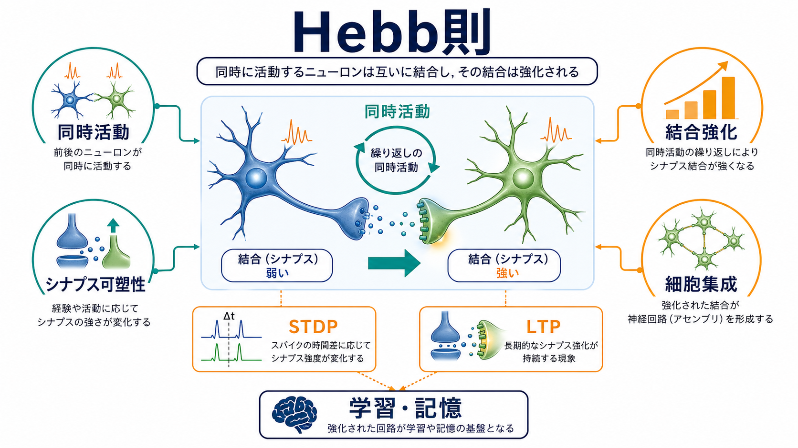
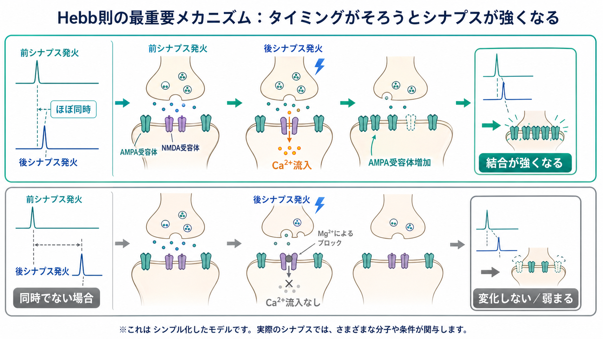
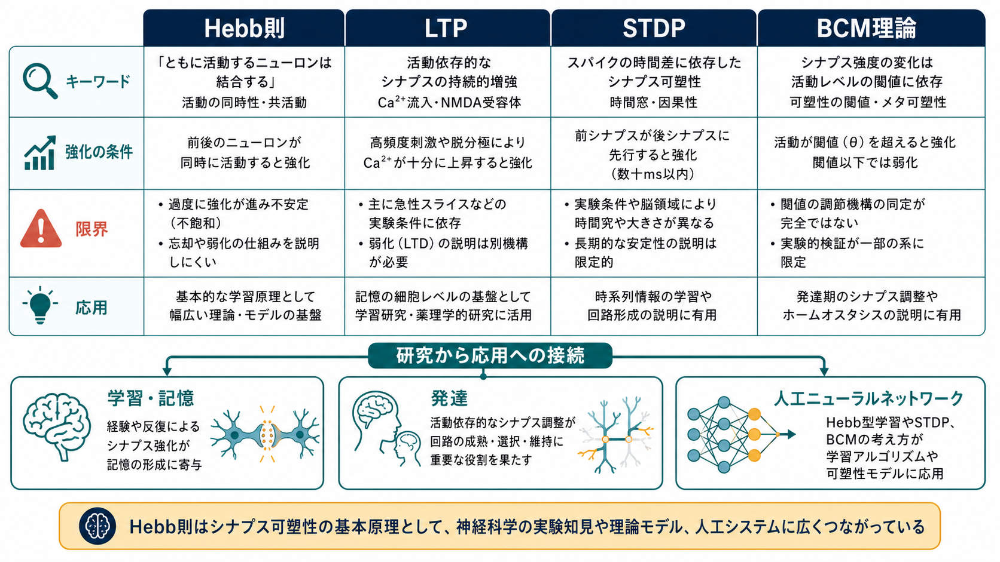

---
title: "Hebb則とは何か"
description: "同時に活動するニューロン間の結合が強まるというHebb則を、シナプス可塑性、LTP、STDP、BCM理論、学習・記憶研究との関係から整理する。"
aliases:
  - "Hebb則"
  - "ヘッブ則"
  - "Hebbian learning"
  - "Hebb学習"
tags:
  - neuroscience
  - basic-neuroscience
  - synapse
  - plasticity
  - learning
  - obsidian
created: "2026-04-27"
updated: "2026-04-27"
draft: true
publish: false
status: draft
enableToc: true
---

# Hebb則とは何か

## 要点

- Hebb則は、あるニューロンの活動が別のニューロンの発火に繰り返し寄与すると、その結合が強まる、という学習原理である。[1]
- 現代的には、[[シナプスとは何か|シナプス]]強度が活動履歴に応じて変わる[[シナプス可塑性とは何か|シナプス可塑性]]の考え方として読むと分かりやすい。[2][3]
- [[長期増強LTPとは何か|LTP]] はHebb則を支える代表的な実験現象だが、Hebb則そのものと完全に同一ではない。[2][4]
- STDPは、前シナプス発火と後シナプス発火の時間差が強化・弱化の方向を左右する、より時間精密なHebb型学習則である。[5][6]
- Hebb則は学習・記憶の強力な入口だが、抑制性回路、神経修飾、発達段階、恒常性、忘却、LTDを含めないと脳の学習全体は説明できない。[4][7][8]

## この記事で答える問い

1. Hebb則は何を主張する原理なのか。
2. Hebb則はシナプス可塑性、LTP、STDPとどう関係するのか。
3. 「同時に活動するニューロンは結合する」という説明は、どこまで正確なのか。
4. 学習・記憶、発達、人工ニューラルネットワークの理解にどう接続するのか。

## まず結論

Hebb則は、経験によって神経回路が変わる仕組みを、ニューロン活動の相関と結合強度の変化として捉える原理である。日常的には「同時に活動するニューロンは結びつく」と要約されるが、より正確には「ある細胞の活動が、別の細胞の発火に繰り返し関与すると、その細胞間の結合効率が高まる」という仮説である。[1]

この考え方は、[[ニューロンとは何か|ニューロン]]が固定配線ではなく、活動の履歴に応じて結合の重みを変えるという見方を開いた。現在では、海馬などで観察されるLTP、時間差に敏感なSTDP、活動レベルに応じて可塑性の閾値が変わるBCM理論などと接続される。[2][5][7]

ただし、Hebb則は「記憶の全説明」ではない。記憶には回路構造、分子機構、[[グルタミン酸は脳で何をしているのか|グルタミン酸]]受容体、[[アストロサイトはシナプスと代謝をどう支えているのか|アストロサイト]]、[[ミクログリアは脳の免疫細胞として何をしているのか|ミクログリア]]、睡眠、行動文脈、報酬や注意などが関わる。Hebb則は、その複雑な現象を「活動の共起が結合を変える」という最小原理から見通すための入口である。[4][8]

## 背景

Donald O. Hebb は 1949 年の *The Organization of Behavior* で、心理現象と神経回路をつなぐ理論を提示した。[1] 当時、記憶や知覚を細胞レベルの仕組みとして説明する直接的証拠は限られていたが、Hebbは、経験によってニューロン同士の結合が変わり、それが細胞集成や相系列の形成につながると考えた。

ここで重要なのは、Hebb則が単なる比喩ではなく、心理学、神経科学、計算論を結ぶ「学習の局所ルール」として機能した点である。局所ルールとは、各シナプスが自分の前シナプス活動と後シナプス活動をもとに重みを変える、という発想である。この発想は、後の[[受容体にはどのような種類があるのか|受容体]]研究、LTP/LTD研究、人工ニューラルネットワークの重み更新の考え方に影響した。[3][4][7]

## 基本概念

### シナプス強度

シナプス強度とは、ある前シナプス入力が後シナプス細胞をどれくらい強く変化させるかを表す。たとえば、同じ前シナプス発火でも、放出される神経伝達物質の量、後シナプス側のAMPA受容体数、NMDA受容体の状態、スパイン構造などによって、[[シナプス後電位とは何か|シナプス後電位]]の大きさは変わる。[4]

Hebb則でいう「結合が強まる」とは、必ずしも軸索が新しく伸びることだけを意味しない。短期的には受容体機能や放出確率の変化、長期的にはスパイン構造やシナプス数の変化も含みうる。

### 同時活動

Hebb則の中心は、前シナプス細胞と後シナプス細胞の活動が相関することである。前シナプス細胞が発火し、その入力が後シナプス細胞の[[活動電位はどのように発生するのか|活動電位]]発生に繰り返し寄与すると、その入力は将来さらに効きやすくなる。[1]

ただし「同時」といっても、完全に同じ時刻である必要はない。STDP研究では、前シナプス発火が後シナプス発火に数十ミリ秒程度先行する場合にLTPが起こりやすく、逆順や条件の違いによってLTDが起こりうることが示された。[5][6]

### 細胞集成

細胞集成とは、ある対象、経験、行動に関連して一緒に活動しやすくなったニューロン群のことである。Hebbの理論では、相互に強化された結合をもつニューロン群が、知覚や思考の単位として働くと考えられた。[1]

現代の言い方をすれば、細胞集成は「単一ニューロン」ではなく「活動パターン」として情報を表すという考えに近い。これは、記憶を一つの細胞や一つの分子に置くのではなく、回路内の結合重みと活動パターンに分散して捉える発想である。

## 仕組み

### 1. 前シナプス入力が後シナプス細胞を脱分極させる

興奮性シナプスでは、前シナプス終末からグルタミン酸が放出され、後シナプス膜のAMPA受容体などを通じて脱分極が起こる。単独の入力では小さい変化でも、複数入力が時間的・空間的に重なると、後シナプス細胞は発火しやすくなる。[3][4]

### 2. NMDA受容体が一致検出器として働く

多くの海馬LTPモデルでは、NMDA受容体が重要な役割を持つ。NMDA受容体はグルタミン酸結合だけでなく、後シナプス膜の脱分極によるMg2+ブロック解除を必要とするため、前シナプス入力と後シナプス脱分極の同時性を反映しやすい。[4]

### 3. Ca2+シグナルが受容体配置や構造を変える

NMDA受容体などからCa2+が流入すると、細胞内シグナルが活性化され、AMPA受容体の挿入・リン酸化、スパイン構造の変化、遺伝子発現などが誘導される。これにより、同じ入力が次回以降より大きな効果を持つようになる。[4]

### 4. 弱化と安定化も必要になる

もし「同時活動した結合は強くなる」だけなら、回路はすぐに飽和してしまう。実際の脳では、[[長期抑圧LTDとは何か|LTD]]、シナプス除去、抑制性回路、恒常性可塑性、メタ可塑性などが働き、強化と弱化のバランスが調整される。[4][7]

BCM理論はこの問題に対して、後シナプス活動の平均レベルに応じて可塑性の閾値が動く、という枠組みを与えた。活動が高すぎると強化しにくくなり、活動が低いと別の方向へ調整されるため、単純なHebb則の暴走を避ける理論として読める。[7]

## 図解

上の図1は、Hebb則を「同時活動」「結合強化」「細胞集成」「学習・記憶」の関係としてまとめたものである。図2は、前シナプス発火と後シナプス発火のタイミングがそろうと、Ca2+流入とAMPA受容体増加を通じて結合が強まる、という典型的な説明を示している。

図3は、Hebb則、LTP、STDP、BCM理論を比較したものである。Hebb則は広い原理、LTPは持続的な強化現象、STDPは時間差に依存する学習則、BCM理論は活動履歴に応じた閾値調整の理論として整理できる。

## 臨床・研究との接続

Hebb則は、教育や臨床で「反復すれば脳が変わる」と単純化されがちである。しかし研究上は、どのシナプスが、どの時間窓で、どの受容体と細胞内経路を通じて、どの行動変化に必要なのかを分けて考える必要がある。[4][8]

記憶研究では、シナプス可塑性が記憶形成に必要であるという証拠は多い。一方で、あるシナプス変化だけで記憶全体を十分に説明できるかは慎重に扱われている。Martinらは、シナプス可塑性と記憶の関係を評価するには、可塑性が記憶形成時に誘導されること、必要であること、十分であることなどを区別すべきだと整理した。[8]

発達研究では、Hebb型の活動依存的強化が回路選択や感覚地図形成に関わる一方、弱い結合の除去や抑制性回路の成熟も同時に重要である。疾患研究では、可塑性の過不足が発達障害、依存、慢性疼痛、精神疾患、神経変性などと関係する可能性が議論されるが、Hebb則だけから個別の診断や治療方針を導くことはできない。

人工ニューラルネットワークでは、Hebb型学習は「同時に活動するユニット間の重みを増やす」局所学習則として実装されることがある。ただし、現代の深層学習で広く使われる誤差逆伝播は、単純なHebb則とは異なるグローバルな誤差信号を使う。したがって、Hebb則はAIの全学習原理ではなく、神経科学に近い局所的・自己組織化的学習の基礎概念として位置づけるのがよい。

## よくある誤解

### 誤解1: Hebb則は「同時に光れば何でも結合する」という意味である

実際には、前後の活動タイミング、細胞種、シナプスの初期強度、樹状突起上の位置、神経修飾物質、抑制性入力などによって結果は変わる。STDPでは、数十ミリ秒単位の順序差が強化か弱化かを左右する。[5][6]

### 誤解2: LTPが起きれば記憶ができたと言える

LTPは記憶研究の重要なモデルだが、記憶そのものではない。LTPがどの回路で起き、どの行動課題に必要で、どの程度持続し、どの他の変化と組み合わさるかを見なければならない。[4][8]

### 誤解3: Hebb則は強化だけを扱う

古典的なHebb則は強化に注目するが、実際の学習には弱化、忘却、競合、正則化が必要である。LTDやBCM理論は、単純な強化則では説明しにくい安定性を考えるための重要な拡張である。[4][7]

### 誤解4: Hebb則は脳科学だけの概念である

Hebb則は神経科学の概念であると同時に、心理学、計算論、人工ニューラルネットワークにも影響した。とはいえ、AIで「重みが変わる」ことと、生物シナプスで分子・構造・代謝が変わることをそのまま同一視してはいけない。

## 関連ノート

- [[ニューロンとは何か]]
- [[シナプスとは何か]]
- [[シナプス可塑性とは何か]]
- [[長期増強LTPとは何か]]
- [[長期抑圧LTDとは何か]]
- [[グルタミン酸は脳で何をしているのか]]
- [[受容体にはどのような種類があるのか]]
- [[活動電位はどのように発生するのか]]

関連ノート候補:

- STDPとは何か
- BCM理論とは何か
- 細胞集成とは何か
- 記憶痕跡とは何か

MOC更新候補: `content/00_MOC/MOC｜脳・神経科学.md` の「ニューロンとシナプス」または「学習・記憶」系の項目に、本記事を基礎神経科学のシナプス可塑性ノートとして追加する。

## 理解チェック

1. Hebb則を「前シナプス活動」「後シナプス活動」「結合強度」の3語を使って説明できるか。
2. Hebb則とLTPの違いを説明できるか。
3. STDPでは、なぜミリ秒単位の発火順序が重要になるのか。
4. 単純なHebb則だけでは、なぜ回路が不安定になりうるのか。
5. 「シナプス可塑性は記憶に必要」と「シナプス可塑性だけで記憶を十分に説明できる」の違いを説明できるか。

## 参考文献

[1] Hebb, D. O. (1949). *The Organization of Behavior: A Neuropsychological Theory*. Wiley. Google Books: https://books.google.com/books/about/The_organization_of_behavior.html?id=WlZ9AAAAMAAJ

[2] Bliss, T. V. P., & Lømo, T. (1973). Long-lasting potentiation of synaptic transmission in the dentate area of the anaesthetized rabbit following stimulation of the perforant path. *The Journal of Physiology*, 232(2), 331-356. https://doi.org/10.1113/jphysiol.1973.sp010273

[3] Bliss, T. V. P., & Gardner-Medwin, A. R. (1973). Long-lasting potentiation of synaptic transmission in the dentate area of the unanaesthetized rabbit following stimulation of the perforant path. *The Journal of Physiology*, 232(2), 357-374. https://pmc.ncbi.nlm.nih.gov/articles/PMC1350459/

[4] Malenka, R. C., & Bear, M. F. (2004). LTP and LTD: An embarrassment of riches. *Neuron*, 44(1), 5-21. https://doi.org/10.1016/j.neuron.2004.09.012

[5] Markram, H., Lübke, J., Frotscher, M., & Sakmann, B. (1997). Regulation of synaptic efficacy by coincidence of postsynaptic APs and EPSPs. *Science*, 275(5297), 213-215. https://doi.org/10.1126/science.275.5297.213

[6] Bi, G. Q., & Poo, M. M. (1998). Synaptic modifications in cultured hippocampal neurons: Dependence on spike timing, synaptic strength, and postsynaptic cell type. *The Journal of Neuroscience*, 18(24), 10464-10472. https://doi.org/10.1523/JNEUROSCI.18-24-10464.1998

[7] Cooper, L. N., & Bear, M. F. (2012). The BCM theory of synapse modification at 30: Interaction of theory with experiment. *Nature Reviews Neuroscience*, 13, 798-810. https://doi.org/10.1038/nrn3353

[8] Martin, S. J., Grimwood, P. D., & Morris, R. G. M. (2000). Synaptic plasticity and memory: An evaluation of the hypothesis. *Annual Review of Neuroscience*, 23, 649-711. https://doi.org/10.1146/annurev.neuro.23.1.649

## 未解決問題

- Hebb型可塑性、LTD、恒常性可塑性、神経修飾が自然行動中にどの順序と重みで組み合わさるのか。
- 実験室で誘導されるLTP/STDPが、自然な学習中の記憶痕跡をどの程度代表しているのか。
- 細胞集成の形成と維持を、単一シナプスの可塑性から回路全体の活動パターンまでどのように橋渡しするか。
- 生物の局所学習則と、人工ニューラルネットワークの学習アルゴリズムをどこまで対応づけられるか。

## 更新ログ

- 2026-04-27: 初稿作成。Hebb則の原理、LTP/STDP/BCM理論との関係、図解、誤解、関連ノート、参考文献を整理。
