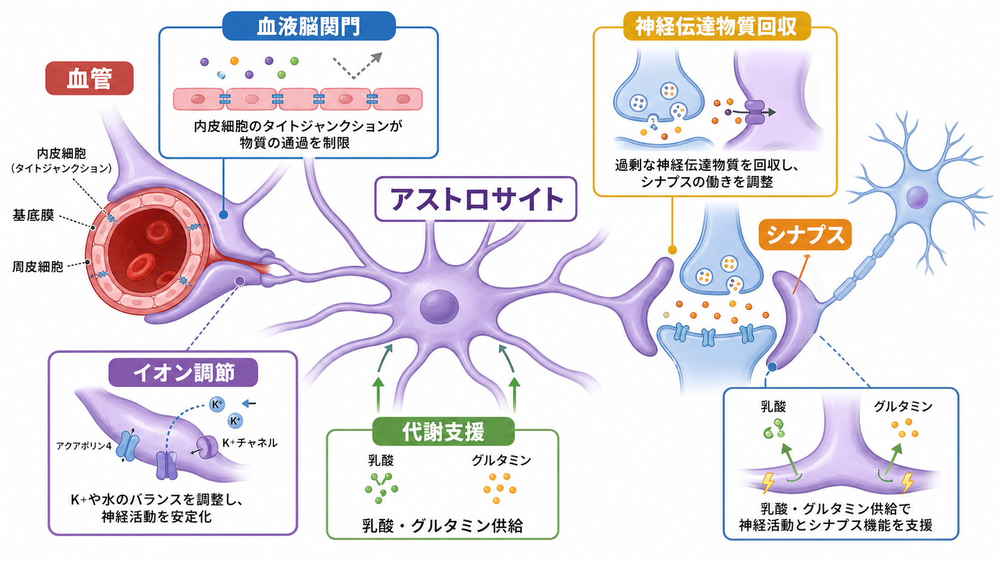
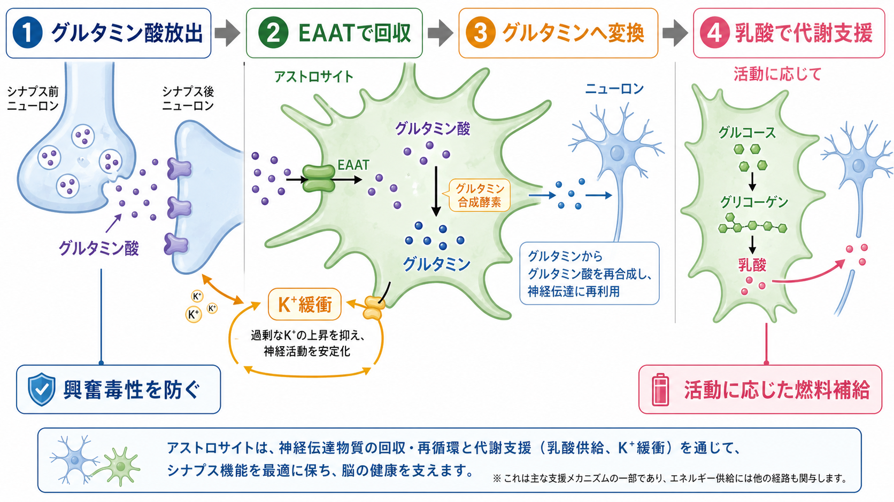

---
title: "アストロサイトはシナプスと代謝をどう支えているのか"
description: "アストロサイトが血液脳関門、イオン調節、神経伝達物質回収、代謝支援を通じて、ニューロンとシナプスの働きをどのように支えているかを整理する。"
aliases:
  - "アストロサイト"
  - "星状膠細胞"
  - "アストロサイトの機能"
tags:
  - neuroscience
  - basic-neuroscience
  - glia
  - synapse
  - metabolism
  - obsidian
created: "2026-04-27"
updated: "2026-04-27"
draft: true
publish: false
status: draft
enableToc: true
---

# アストロサイトはシナプスと代謝をどう支えているのか

## 要点

- アストロサイトは、単なる「すき間を埋める細胞」ではなく、シナプス周囲、血管周囲、細胞外液を結ぶ支持細胞である。
- シナプスでは、グルタミン酸などの神経伝達物質を回収し、過剰な興奮や興奮毒性を抑える方向に働く [1][5]。
- 活動で増えた細胞外 K+ を緩衝し、水移動とも連動して、ニューロンが発火しやすくなりすぎない環境を保つ [6]。
- 血管側では終足が毛細血管を覆い、血液脳関門そのものを作る内皮細胞・周皮細胞とともに神経血管ユニットを構成する [3][4]。
- 代謝面では、グルタミン酸回収、Na+/K+-ATPase、解糖、乳酸産生が結びつき、活動したニューロンへの燃料補給モデルとして理解される [7][8]。

## この記事で答える問い

この記事では、[[ニューロンとは何か]]、[[樹状突起はどのように情報を受け取るのか]]、[[軸索はどのように情報を遠くへ伝えるのか]]で扱うニューロン中心の説明に、グリア細胞の視点を加える。中心となる問いは、「アストロサイトは、シナプス活動が続いても脳内環境が破綻しないように、何を回収し、何を渡し、何を調節しているのか」である。

## まず結論

アストロサイトは、ニューロンの代わりに情報を伝える細胞というより、ニューロンが情報を伝え続けられる条件を整える細胞である。シナプス近くの突起は、神経伝達物質とイオン濃度を調整する。血管近くの終足は、内皮細胞・周皮細胞と連携して、物質移動、血流、代謝基質の利用を支える。これらは別々の仕事ではなく、「活動したシナプスの周囲で、化学環境とエネルギー供給を同時に整える」という一つの役割としてつながっている [1][3][7]。

ただし、アストロサイトが「血液脳関門を単独で作る」と言うのは不正確である。物理的な主要バリアは毛細血管内皮細胞の密着結合や輸送特性であり、アストロサイトは終足や分泌因子を通じてその成熟・維持・機能調節に関わる、と捉える方が正確である [3][4]。

## 背景

古典的な神経科学では、脳の働きはニューロンの発火、[[興奮性ニューロンと抑制性ニューロンは何が違うのか|興奮と抑制]]、シナプス伝達として説明されることが多い。これは重要な入口だが、ニューロンだけではシナプス活動を長時間安定して続けられない。

興奮性シナプスでグルタミン酸が放出されると、受容体を介してシナプス後細胞が脱分極する。同時に、シナプス間隙にはグルタミン酸が残り、活動電位に伴って細胞外 K+ も増える。これらが十分に処理されなければ、信号は鋭く終わらず、ニューロンは過剰に興奮しやすくなる [5][6]。

そこで重要になるのがアストロサイトである。アストロサイトは、細い突起で多数のシナプスに接し、別の突起で血管を覆う。したがって、局所のシナプス活動を、細胞外環境、血流、エネルギー代謝へ結びつける位置にいる [1][2][4]。

## 基本概念

### アストロサイト

アストロサイトは中枢神経系の主要なグリア細胞で、星状の形態、シナプス周囲突起、血管終足、細胞間ギャップ結合などを特徴とする。灰白質のアストロサイトは多数の細い突起で局所領域を覆い、血管とシナプスを同時に扱える配置をとる [1][2]。

### 三者間シナプス

三者間シナプスとは、シナプス前終末、シナプス後部、アストロサイト突起を一つの機能単位として見る考え方である。アストロサイトは、神経伝達物質を受け取り、Ca2+ シグナルや輸送体の働きを通じて、シナプスの強さ、持続時間、周囲への広がりに影響する [1][2]。

### 神経血管ユニット

神経血管ユニットとは、血管内皮細胞、周皮細胞、血管平滑筋、基底膜、アストロサイト終足、ニューロンなどをまとめて捉える概念である。血液脳関門は主に内皮細胞の特性で成立するが、アストロサイト終足は血管表面を覆い、水・K+・代謝基質・血流調節に関わる [3][4]。

## 仕組み

### 1. 血液脳関門と血管周囲環境を支える

血液脳関門は、血液中の物質が脳実質へ無制限に入るのを防ぎ、イオン、栄養、老廃物、免疫細胞の移動を厳密に制御する仕組みである。中心にあるのは、毛細血管内皮細胞の密着結合、低いトランスサイトーシス、選択的輸送体などである [3]。

アストロサイトはこのバリアの「壁そのもの」ではないが、終足で血管を覆い、内皮細胞や周皮細胞と相互作用する。終足には AQP4 や Kir4.1 などが集まり、水・K+・代謝物の局所制御に関わるため、血管側の環境とシナプス側の環境をつなぐ足場になる [4][6]。

### 2. K+ と水を調節し、過剰興奮を防ぐ

ニューロンが活動電位を発生させると、K+ が細胞外へ出る。通常の活動では小さな変化でも、多数のニューロンが同期して活動すれば、細胞外 K+ 濃度の上昇は発火閾値や膜電位に影響する。アストロサイトは Kir4.1 チャネル、ギャップ結合ネットワーク、水チャネル AQP4 などを通じて、余分な K+ を局所から逃がす [6]。

この K+ 緩衝は、単なるイオン掃除ではない。K+ が高いままだとニューロンは発火しやすくなり、信号と雑音の区別が崩れやすい。アストロサイトは、シナプスが働いた後に細胞外液を元の条件へ戻すことで、次の信号が読み取れる状態を保っている。

### 3. 神経伝達物質を回収し、信号を終わらせる

興奮性シナプスでは、グルタミン酸が主要な神経伝達物質として働く。グルタミン酸は受容体を活性化した後、速やかに除去されなければならない。細胞外グルタミン酸の主要な低濃度維持機構は、EAAT 系のグルタミン酸輸送体であり、特にグリア側の輸送が重要である [5]。

アストロサイトに取り込まれたグルタミン酸は、グルタミン合成酵素によってグルタミンへ変換され、ニューロンへ戻される。ニューロンはそれを再びグルタミン酸合成に使う。このグルタミン酸-グルタミン循環は、興奮性伝達を続けるための材料循環であり、同時に過剰なグルタミン酸による興奮毒性を避ける仕組みでもある [5][7]。

### 4. 活動したシナプスへ代謝支援を行う

グルタミン酸回収は、代謝支援とも直結している。グルタミン酸輸送では Na+ が共輸送されるため、アストロサイト内の Na+ が増え、Na+/K+-ATPase が働く。そのエネルギー需要に応じて、アストロサイトのグルコース利用と解糖が高まり、乳酸産生が増えるというモデルが提案された [7]。

この考えはアストロサイト-ニューロン乳酸シャトル仮説として知られる。活動したシナプスの周囲で、アストロサイトがグルコースやグリコーゲンを使って乳酸を作り、ニューロンがそれを酸化基質として使う、という見方である [8]。ただし、脳のエネルギー代謝は一方向の単純な配達モデルではなく、条件、領域、活動状態によってニューロン自身のグルコース利用も重要である。したがって、乳酸シャトルは「唯一の燃料経路」ではなく、「活動依存的な代謝協調の有力な枠組み」として読むのがよい。

## 図解

1枚目は、アストロサイトが血管、血液脳関門、シナプス、イオン調節、神経伝達物質回収、代謝支援をつなぐ概念地図である。2枚目は、グルタミン酸回収、グルタミン化、乳酸供給、K+ 緩衝を一連の流れとして示している。

図を見るときは、「アストロサイトがニューロンの代わりに信号を送る」のではなく、「ニューロンが信号を正確に送れる環境を保つ」と読むと理解しやすい。

## 臨床・研究との接続

アストロサイト機能は、てんかん、虚血、神経変性疾患、外傷、炎症、精神疾患研究で注目される。たとえば、K+ 緩衝やグルタミン酸回収が破綻すると、神経過興奮や興奮毒性のリスクが上がる可能性がある [5][6]。血液脳関門や神経血管ユニットの障害は、炎症性疾患、脳血管障害、神経変性疾患の病態理解にも関わる [3][4]。

ただし、ここでの説明は教育・研究目的であり、個別の症状を「アストロサイト異常」と断定するものではない。臨床で見える症状は、ニューロン、グリア、血管、免疫、発達、薬物、生活要因などの多層的な相互作用から生じる。

## よくある誤解

### 誤解1: アストロサイトは単なる支持細胞である

「支持」は正しいが、受け身という意味ではない。アストロサイトは、シナプス形成、伝達物質回収、イオン調節、代謝、血管周囲環境、炎症応答に関わる能動的な細胞である [1][2]。

### 誤解2: アストロサイトが血液脳関門を作っている

血液脳関門の主要な物理的バリアは血管内皮細胞である。アストロサイトは終足や分泌因子を通じて、内皮細胞や周皮細胞と連携し、バリアの維持や神経血管ユニットの機能を支える [3][4]。

### 誤解3: グルタミン酸を回収するだけなら代謝とは関係ない

グルタミン酸回収は Na+ 共輸送を伴い、Na+/K+-ATPase とエネルギー需要を動かす。そのため、伝達物質回収はシナプス信号の終了であると同時に、活動依存的な代謝応答の入口にもなる [7]。

### 誤解4: 乳酸シャトルは「ニューロンはグルコースを使わない」という意味である

そうではない。ニューロンもグルコースを利用する。乳酸シャトル仮説は、アストロサイト由来乳酸が活動時の重要な基質になりうるというモデルであり、状況依存性と議論の余地を含む [8]。

## 関連ノート

- 既存ノート: [[MOC｜脳・神経科学]]
- 既存ノート: [[ニューロンとは何か]]
- 既存ノート: [[樹状突起はどのように情報を受け取るのか]]
- 既存ノート: [[軸索はどのように情報を遠くへ伝えるのか]]
- 既存ノート: [[興奮性ニューロンと抑制性ニューロンは何が違うのか]]
- 既存ノート: [[介在ニューロンは神経回路で何をしているのか]]
- 今後の作成候補: グリア細胞とは何か
- 今後の作成候補: 血液脳関門とは何か
- 今後の作成候補: グルタミン酸-グルタミン循環とは何か
- 今後の作成候補: アストロサイト-ニューロン乳酸シャトルとは何か
- MOC更新候補: `content/00_MOC/MOC｜脳・神経科学.md` に本記事を追加

## 理解チェック

1. アストロサイトが血液脳関門を「単独で作る」と言うと不正確な理由を説明できるか。
2. グルタミン酸回収が、シナプス信号の終了と代謝応答の両方に関係する理由を説明できるか。
3. K+ 緩衝が破綻すると、ニューロンの発火しやすさにどのような影響が出るかを説明できるか。
4. 乳酸シャトル仮説を、「唯一のエネルギー経路」ではなく「活動依存的な代謝協調」として説明できるか。

## 参考文献

[1] Allen, N. J., & Eroglu, C. (2017). Cell Biology of Astrocyte-Synapse Interactions. *Neuron, 96*(3), 697-708. https://doi.org/10.1016/j.neuron.2017.09.056

[2] Chung, W. S., Allen, N. J., & Eroglu, C. (2015). Astrocytes Control Synapse Formation, Function, and Elimination. *Cold Spring Harbor Perspectives in Biology, 7*(9), a020370. https://doi.org/10.1101/cshperspect.a020370

[3] Daneman, R., & Prat, A. (2015). The Blood-Brain Barrier. *Cold Spring Harbor Perspectives in Biology, 7*(1), a020412. https://doi.org/10.1101/cshperspect.a020412

[4] Abbott, N. J., Ronnback, L., & Hansson, E. (2006). Astrocyte-endothelial interactions at the blood-brain barrier. *Nature Reviews Neuroscience, 7*, 41-53. https://doi.org/10.1038/nrn1824

[5] Danbolt, N. C. (2001). Glutamate uptake. *Progress in Neurobiology, 65*(1), 1-105. https://doi.org/10.1016/S0301-0082(00)00067-8

[6] Nwaobi, S. E., Cuddapah, V. A., Patterson, K. C., Randolph, A. C., & Olsen, M. L. (2016). The role of glial-specific Kir4.1 in normal and pathological states of the CNS. *Acta Neuropathologica, 132*, 1-21. https://doi.org/10.1007/s00401-016-1553-1

[7] Pellerin, L., & Magistretti, P. J. (1994). Glutamate uptake into astrocytes stimulates aerobic glycolysis: A mechanism coupling neuronal activity to glucose utilization. *Proceedings of the National Academy of Sciences, 91*(22), 10625-10629. https://doi.org/10.1073/pnas.91.22.10625

[8] Belanger, M., Allaman, I., & Magistretti, P. J. (2011). Brain energy metabolism: Focus on astrocyte-neuron metabolic cooperation. *Cell Metabolism, 14*(6), 724-738. https://doi.org/10.1016/j.cmet.2011.08.016

## 未解決問題

- ヒト脳の各領域で、アストロサイトの異質性がシナプス制御や代謝支援にどの程度違いを生むのか。
- 乳酸シャトルの寄与を、正常活動、学習、病態、発達段階ごとにどのように定量化するのがよいか。
- 反応性アストロサイトの変化を、保護的応答と病的応答にどう切り分けるべきか。

## 更新ログ

- 2026-04-27: 初稿作成。血液脳関門、K+ 緩衝、グルタミン酸回収、代謝支援、図解、参考文献を追加。
