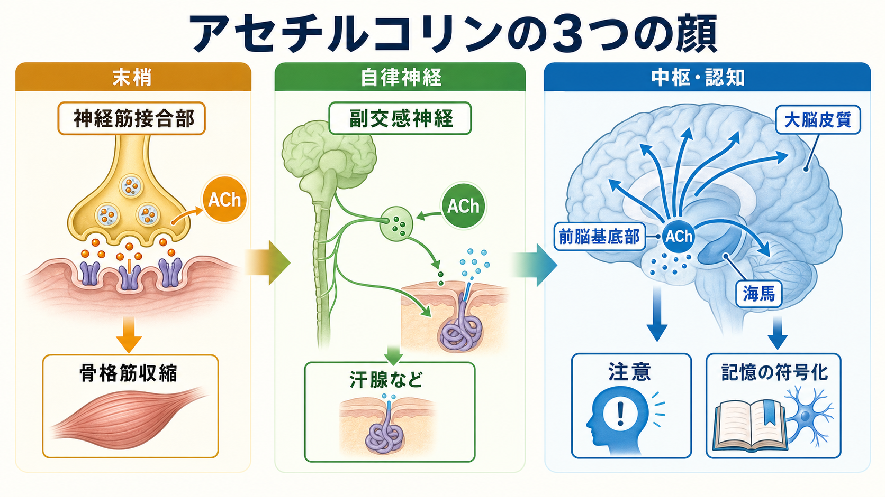
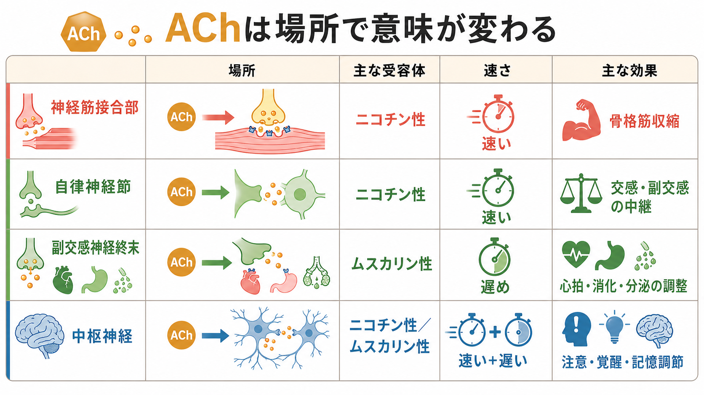
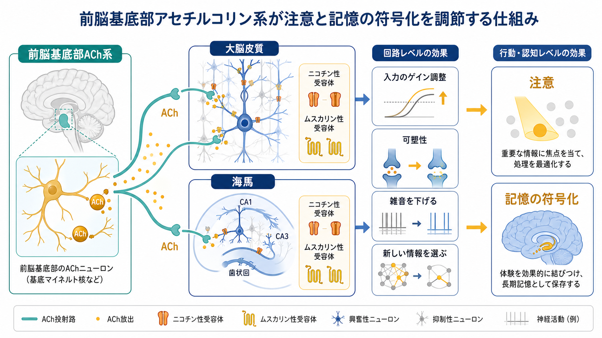

---
title: "アセチルコリンは注意や記憶にどう関わるのか"
description: "アセチルコリンを、神経筋接合部・自律神経・前脳基底部系という3つの場面から整理し、注意や記憶に関わる理由を説明する。"
aliases:
  - "アセチルコリン"
  - "ACh"
  - "コリン作動性系"
tags:
  - neuroscience
  - basic-neuroscience
  - obsidian
  - 脳・神経科学/基礎神経科学
created: "2026-04-27"
updated: "2026-04-27"
draft: true
publish: false
status: draft
enableToc: true
---

# アセチルコリンは注意や記憶にどう関わるのか

## 要点

- アセチルコリン（acetylcholine; ACh）は、神経伝達物質としてだけでなく、神経回路の状態を変える「調節信号」として働く。
- 末梢では、神経筋接合部で骨格筋収縮を起こし、自律神経では神経節や副交感神経終末などで内臓機能を調整する[1][2]。
- 中枢では、前脳基底部から大脳皮質・海馬へ投射するコリン作動性系が、注意、覚醒、入力選択、記憶の符号化に関わる[3][4]。
- 「アセチルコリンが多いほど記憶がよい」と単純化するより、どの部位で、どの受容体に、どの時間スケールで作用するかを見る必要がある[5][6]。
- アルツハイマー病や重症筋無力症などとの接続は重要だが、ここでの説明は教育・研究目的の基礎知識であり、個別の診断や治療指示ではない[7][8]。

## この記事で答える問い

アセチルコリンは「筋肉を動かす物質」としても、「副交感神経の物質」としても、「注意や記憶に関わる物質」としても説明される。これらは別々の話ではなく、同じ分子が異なる場所・受容体・回路で使われているという話である。この記事では、次の問いに答える。

1. アセチルコリンは神経筋接合部で何をしているのか。
2. 自律神経ではどのように使われるのか。
3. 前脳基底部のコリン作動性系は、なぜ注意や記憶に関わるのか。
4. 臨床や研究では、この知識がどのように使われるのか。

## まず結論

アセチルコリンの中心的な役割は、「次にどの入力へ反応するか」を体と脳の各レベルで切り替えることだと考えると理解しやすい。神経筋接合部では、[[活動電位はどのように発生するのか|活動電位]]が運動神経終末に到達するとAChが放出され、筋線維のニコチン性受容体を開いて脱分極を起こし、骨格筋収縮へつなげる[2]。自律神経では、交感神経・副交感神経の神経節でAChが中継信号として働き、副交感神経終末では心拍、消化管運動、分泌などをムスカリン性受容体を介して調整する[1]。

一方、中枢神経ではAChは単なる「オン・オフ」の伝達物質ではない。前脳基底部から大脳皮質や海馬へ広く投射し、ニューロンの興奮性、[[シナプスとは何か|シナプス]]伝達、シナプス可塑性、回路の同期状態を変える[3]。そのため、AChは「いま入ってくる感覚情報を重視する」「余計な背景活動を抑える」「新しい記憶を符号化しやすくする」といった認知機能に関わる[4][5]。

## 背景

アセチルコリンは、神経科学史の中でも古くから知られてきた神経伝達物質である。末梢神経系では、運動神経、神経筋接合部、自律神経節、副交感神経終末などで使われる。中枢神経系では、前脳基底部、脳幹の脚橋被蓋核・外側背側被蓋核などにコリン作動性ニューロンがあり、皮質、海馬、視床、基底核などへ影響を及ぼす[1][3]。

重要なのは、AChの作用が一様ではないことである。同じAChでも、ニコチン性受容体に作用すれば速いイオンチャネル型の応答を起こしやすく、ムスカリン性受容体に作用すればGタンパク質共役受容体を介した比較的遅く持続的な調整を起こしやすい[1]。この違いは、[[受容体にはどのような種類があるのか|受容体]]の種類が、信号の時間スケールと意味を決める典型例である。

## 基本概念

### 神経筋接合部

神経筋接合部は、運動ニューロンと骨格筋線維の間にある特殊な化学シナプスである。運動神経終末に活動電位が到達すると、電位依存性Ca2+チャネルが開き、Ca2+流入によってシナプス小胞が融合し、AChがシナプス間隙へ放出される[2]。AChは筋線維側のニコチン性ACh受容体に結合し、陽イオン流入によって終板電位を生じさせる。十分な脱分極が起きれば筋線維の活動電位が発生し、最終的に収縮が起こる。

この場面でのAChは、比較的わかりやすい「命令信号」である。筋を動かすかどうかが、ACh放出、受容体活性化、ACh分解の時間的精度に強く依存する。AChはアセチルコリンエステラーゼによって速やかに分解されるため、筋への刺激は短時間で終わり、次の信号に備えられる[2]。

### 自律神経

自律神経では、AChは複数の位置で使われる。交感神経・副交感神経の節前線維は原則としてAChを放出し、自律神経節のニコチン性受容体を介して節後ニューロンへ信号を渡す[1]。副交感神経の節後線維は多くの場合AChを放出し、心臓、消化管、気道、膀胱、外分泌腺などのムスカリン性受容体を介して内臓機能を調整する[1]。交感神経でも、汗腺など一部の節後線維はAChを使う。

したがって「ACh = 副交感神経」とだけ覚えると不正確になる。AChは、副交感神経終末だけでなく、自律神経節という交感・副交感の共通中継点でも重要である。

### 前脳基底部系

認知機能との関係で特に重要なのが、前脳基底部のコリン作動性ニューロンである。内側中隔核、対角帯核、マイネルト基底核などを含む前脳基底部は、海馬や大脳皮質へ広く投射する[1][4]。この系は、感覚入力、注意課題、学習課題、覚醒状態に応じて皮質と海馬の活動状態を変える。

前脳基底部ACh系は、[[ドパミンは報酬だけの物質なのか|ドパミン]]や[[セロトニンは気分だけに関わるのか|セロトニン]]のような広域調節系と同じく、単一のシナプスだけを変えるのではなく、回路全体の「処理モード」を変える。Picciottoらのレビューは、AChがニューロンの興奮性、シナプス伝達、可塑性、集団発火を変え、環境刺激への適応的な反応を強める神経修飾物質として働くと整理している[3]。

## 仕組み

### 注意: 入力を選び、背景活動を抑える

注意課題では、脳はすべての入力を同じ重みで処理しているわけではない。課題に関係する手がかり、予期しない変化、行動に必要な情報が優先される。前脳基底部ACh系は、この入力選択に関わる。皮質ACh放出は、古典的にはゆっくりした覚醒状態の調節と考えられてきたが、Sarterらは秒単位の相動的なACh放出が、手がかり検出などの特定の認知操作に関わると論じている[6]。

この働きは、皮質回路の「ゲイン調整」として理解できる。AChは一部の入力経路を強め、背景的な再帰活動や不要な入力を相対的に弱めることで、新しい刺激に対する反応を目立たせる[4][5]。結果として、注意は単なる意志の集中ではなく、神経回路が入力を選びやすい状態へ移る過程として見えてくる。

### 記憶: 新しい情報を符号化しやすくする

記憶では、AChはとくに「符号化」に関わる。Hasselmoは、ムスカリン性・ニコチン性ACh受容体が新しい記憶の符号化に関わり、AChが外部からの入力を相対的に強め、海馬・嗅内皮質・周嗅皮質などで新しいエピソード記憶の形成を助ける可能性を整理している[5]。

直感的には、AChが高い状態は「いま入ってくる情報を学ぶ」モードに近い。逆に、過去に形成された記憶を思い出すには、既存の皮質・海馬内の再帰的な活動も必要になる。そのため、AChは常に高ければよいというより、符号化、保持、検索という局面に応じて適切に調整される必要がある。

### 受容体: ニコチン性とムスカリン性

ACh受容体は大きくニコチン性受容体とムスカリン性受容体に分けられる。ニコチン性受容体はリガンド開口型イオンチャネルで、神経筋接合部や自律神経節で速い信号伝達に関わる[1][2]。ムスカリン性受容体はGタンパク質共役受容体で、心拍、分泌、平滑筋、皮質・海馬回路の興奮性調整などに関わる[1]。

中枢では両者が組み合わさって働く。ニコチン性受容体は特定の入力や介在ニューロン活動を速く変え、ムスカリン性受容体はニューロンの発火しやすさやシナプス可塑性を比較的長く変える。[[GABAは脳で何をしているのか|GABA]]性介在ニューロンや[[グルタミン酸は脳で何をしているのか|グルタミン酸]]性シナプスへの影響も含めて、AChは局所回路のバランスを変える。

## 図解

図1は、AChの働きを「神経筋接合部」「自律神経」「前脳基底部から皮質・海馬への投射」に分けた概念地図である。AChをひとつの機能に固定せず、場所によって意味が変わる信号として見ることが目的である。

図2は、前脳基底部ACh系が注意と記憶符号化を調整する仕組みを示している。大脳皮質では入力の選択や背景活動の抑制に、海馬では新しい情報の符号化や可塑性に関わる。

図3は、受容体と作用場所の比較である。神経筋接合部と自律神経節ではニコチン性受容体による速い伝達が目立つ一方、副交感神経終末や中枢ではムスカリン性受容体を含む遅めの調整が重要になる。

## 臨床・研究との接続

臨床的には、ACh系は複数の疾患や薬理作用と関係する。重症筋無力症では、神経筋接合部の後シナプス側ACh受容体や関連タンパク質への自己免疫反応により、筋力低下が生じる[1][2]。Lambert-Eaton筋無力症候群では、運動神経終末の電位依存性Ca2+チャネルに対する自己免疫により、ACh放出が低下する[1]。

認知症領域では、アルツハイマー病において前脳基底部コリン作動性系の障害が認知症状と関連すると考えられてきた[7]。コリンエステラーゼ阻害薬はACh分解を抑えてシナプス間隙のACh作用を延ばす薬剤であり、アルツハイマー病などで認知症状への対症的効果を目的に使われることがある[8]。ただし、ACh低下だけでアルツハイマー病全体を説明できるわけではなく、アミロイド、タウ、炎症、神経変性など多層の病態と合わせて考える必要がある[7]。

研究では、ACh放出の時間スケール、皮質領域ごとの差、ニコチン性・ムスカリン性受容体サブタイプ、他の神経修飾系との相互作用が重要な論点である。たとえば、注意におけるAChは単なる「覚醒レベル」ではなく、課題関連手がかりに対応した秒単位の信号としても検討されている[6]。

## よくある誤解

### 誤解1: アセチルコリンは副交感神経だけの物質である

副交感神経終末でAChが重要なのは正しい。しかし、交感神経・副交感神経の節前線維はいずれもAChを使い、交感神経でも汗腺など一部の節後線維はAChを使う[1]。さらに、運動神経と中枢神経でもAChは重要である。

### 誤解2: アセチルコリンは多いほど記憶がよい

AChは新しい情報の符号化を助ける可能性が高いが、記憶には符号化、固定化、検索という複数の段階がある。AChの効果は、脳部位、受容体、課題、時間スケールによって異なる[4][5]。したがって「増やせばよい」という単純な説明は避けるべきである。

### 誤解3: 注意は前頭葉だけの問題である

注意には前頭葉・頭頂葉ネットワークが重要だが、それを支える神経修飾系も欠かせない。前脳基底部ACh系は、皮質が課題関連入力を処理しやすい状態を作る[4][6]。注意を理解するには、局所回路と広域調節系の両方を見る必要がある。

## 関連ノート

- [[ニューロンとは何か]]
- [[シナプスとは何か]]
- [[受容体にはどのような種類があるのか]]
- [[活動電位はどのように発生するのか]]
- [[GABAは脳で何をしているのか]]
- [[グルタミン酸は脳で何をしているのか]]
- [[ドパミンは報酬だけの物質なのか]]
- [[セロトニンは気分だけに関わるのか]]

今後の作成候補: 「神経伝達物質とは何か」「シナプス可塑性とは何か」「前脳基底部とは何か」「ムスカリン性受容体とは何か」「ニコチン性受容体とは何か」「マイネルト基底核とは何か」。

MOC更新候補: `content/00_MOC/` 配下の脳・神経科学または基礎神経科学 MOC に、本記事へのリンクを追加する。

## 理解チェック

1. AChが神経筋接合部で骨格筋収縮を起こすまでの流れを、Ca2+流入、ACh放出、ニコチン性受容体、脱分極という語を使って説明できるか。
2. 自律神経でAChが使われる場所を、神経節、副交感神経終末、汗腺の例に分けて説明できるか。
3. 前脳基底部ACh系が注意と記憶の符号化に関わる理由を、「入力選択」「ゲイン調整」「可塑性」という語で説明できるか。
4. AChの効果を考えるとき、なぜ「分子名」だけでなく「受容体」「部位」「時間スケール」が重要なのか。

## 参考文献

[1] Sam, C., & Bordoni, B. (2023). *Physiology, Acetylcholine*. StatPearls. NCBI Bookshelf. https://www.ncbi.nlm.nih.gov/books/NBK557825/

[2] Khalil, B., Marwaha, K., & Bollu, P. C. (2025). *Physiology, Neuromuscular Junction*. StatPearls. NCBI Bookshelf. https://www.ncbi.nlm.nih.gov/books/NBK470413/

[3] Picciotto, M. R., Higley, M. J., & Mineur, Y. S. (2012). Acetylcholine as a neuromodulator: cholinergic signaling shapes nervous system function and behavior. *Neuron, 76*(1), 116-129. https://doi.org/10.1016/j.neuron.2012.08.036

[4] Hasselmo, M. E., & Sarter, M. (2011). Modes and models of forebrain cholinergic neuromodulation of cognition. *Neuropsychopharmacology, 36*(1), 52-73. https://doi.org/10.1038/npp.2010.104

[5] Hasselmo, M. E. (2006). The role of acetylcholine in learning and memory. *Current Opinion in Neurobiology, 16*(6), 710-715. https://doi.org/10.1016/j.conb.2006.09.002

[6] Sarter, M., Parikh, V., & Howe, W. M. (2009). Phasic acetylcholine release and the volume transmission hypothesis: time to move on. *Nature Reviews Neuroscience, 10*, 383-390. https://doi.org/10.1038/nrn2635

[7] Hampel, H., Mesulam, M. M., Cuello, A. C., Farlow, M. R., Giacobini, E., Grossberg, G. T., Khachaturian, A. S., Vergallo, A., Cavedo, E., Snyder, P. J., & Khachaturian, Z. S. (2018). The cholinergic system in the pathophysiology and treatment of Alzheimer's disease. *Brain, 141*(7), 1917-1933. https://doi.org/10.1093/brain/awy132

[8] Singh, R., & Patel, P. (2026). *Cholinesterase Inhibitors*. StatPearls. NCBI Bookshelf. https://www.ncbi.nlm.nih.gov/books/NBK544336/

## 未解決問題

- 注意課題中のACh放出が、皮質領域ごとにどの程度異なるのか。
- AChが記憶の符号化と検索をどのように切り替えるのか。
- ニコチン性・ムスカリン性受容体サブタイプを分けた介入が、認知機能へどの程度選択的に作用しうるのか。
- アルツハイマー病におけるコリン作動性障害が、アミロイド、タウ、炎症、血管要因とどの順序・因果関係で結びつくのか。
