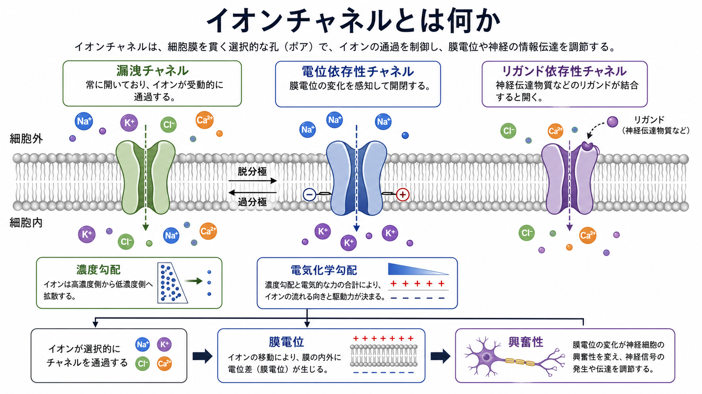
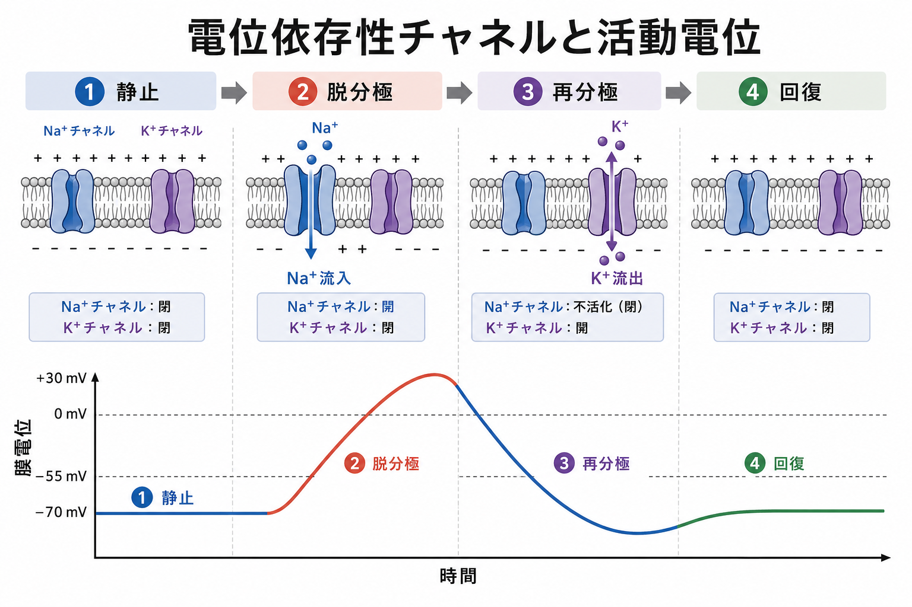
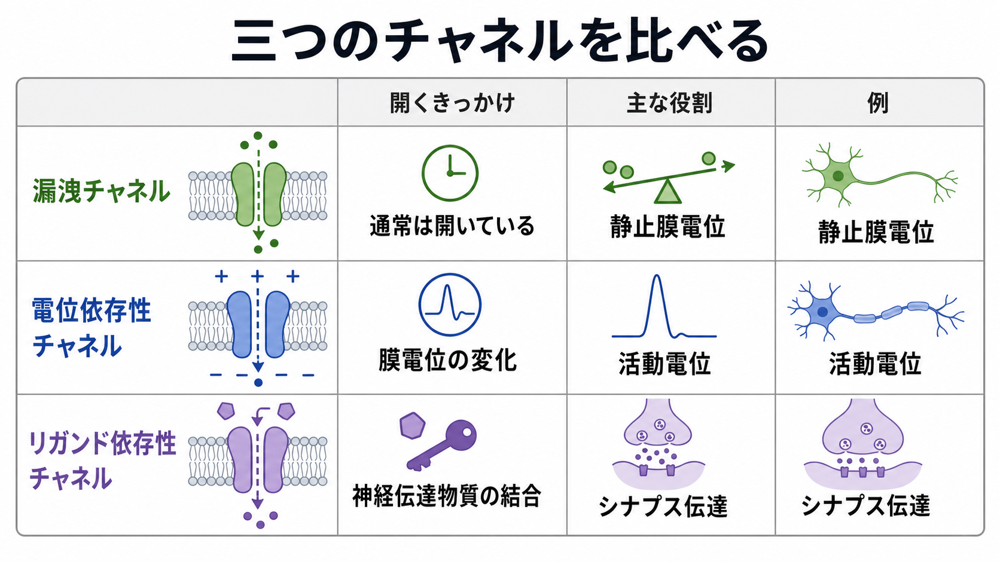

---
title: "イオンチャネルとは何か"
description: "漏洩チャネル・電位依存性チャネル・リガンド依存性チャネルの基本を、膜電位、活動電位、シナプス伝達との関係から整理する。"
aliases:
  - "イオンチャネル"
  - "漏洩チャネル"
  - "電位依存性チャネル"
  - "リガンド依存性チャネル"
tags:
  - neuroscience
  - basic-neuroscience
  - obsidian
created: "2026-04-27"
updated: "2026-04-27"
draft: true
publish: false
status: draft
enableToc: true
---

# イオンチャネルとは何か

## 要点

- イオンチャネルは、細胞膜を貫くタンパク質の「選択的な孔」であり、Na+、K+、Ca2+、Cl- などの通過を制御する。
- ニューロンの膜電位、活動電位、シナプス伝達は、イオンチャネルの開閉とイオンの電気化学勾配に依存している[1][2]。
- 基本は、常に開きやすい漏洩チャネル、膜電位で開閉する電位依存性チャネル、神経伝達物質などのリガンドで開閉するリガンド依存性チャネルに分けると理解しやすい[3][6]。
- チャネルは単なる「穴」ではなく、選択性、ゲート、時間特性、薬物感受性、疾患関連性をもつ分子装置である[4][7]。

## この記事で答える問い

この記事では、[[ニューロンとは何か]]、[[軸索はどのように情報を遠くへ伝えるのか]]、[[軸索小丘はなぜ発火の起点になるのか]]を読むための基礎として、次の問いに答える。

1. イオンチャネルは、細胞膜で何をしているのか。
2. 漏洩チャネル、電位依存性チャネル、リガンド依存性チャネルは何が違うのか。
3. それらは膜電位、活動電位、シナプス伝達とどう結びつくのか。

## まず結論

イオンチャネルは、細胞膜の内外にあるイオン濃度差と電位差を、神経信号へ変換する分子である。チャネルが開くと、イオンは濃度勾配と電気的な力を合わせた電気化学勾配に従って移動する。その結果、膜の内外の電荷分布が変わり、膜電位が変化する[1]。

漏洩チャネルは静止膜電位の土台を作る。電位依存性チャネルは膜電位の変化を検出し、活動電位の立ち上がりや再分極を作る。リガンド依存性チャネルは神経伝達物質などの化学信号を膜電位変化へ変換し、シナプス入力を作る[3][6]。つまり、ニューロンの電気的なふるまいは、どのチャネルが、どこに、どれくらいあり、どの条件で開くかによって決まる。

## 背景

細胞膜は脂質二重層でできており、Na+ や K+ のような電荷をもつイオンは、そのままでは膜を自由に通り抜けにくい。そこで細胞は、イオンポンプ、輸送体、イオンチャネルを使って、細胞内外のイオン環境を保っている。

イオンチャネルは、その中でも「開いている間だけ、特定のイオンを速く通す」仕組みである。チャネルを通る流れは、ATPを直接使って押し出すポンプとは違い、既に作られている濃度差と電位差に従う。したがって、チャネルはエネルギーを作る装置ではなく、既存の勾配を使って膜電位を変える装置だと考えるとよい[1]。

Hodgkin と Huxley は、イカ巨大軸索の電流を測定し、活動電位が Na+ と K+ の膜コンダクタンスの時間変化で説明できることを示した[2]。この仕事は、活動電位を「膜の中にあるチャネルの開閉として定量的に説明する」神経科学の基礎になった。

## 基本概念

### 選択性

チャネルは、すべてのイオンを同じように通すわけではない。Na+ チャネル、K+ チャネル、Ca2+ チャネル、Cl- チャネルのように、特定のイオンを通しやすいものがある。選択性は、孔の大きさ、電荷、アミノ酸配置、水和したイオンとの相互作用によって決まる[4]。

### ゲート

多くのチャネルには、開閉を決める「ゲート」がある。電位依存性チャネルでは膜電位の変化がゲートを動かし、リガンド依存性チャネルでは神経伝達物質などの結合がゲートを動かす。漏洩チャネルは完全に固定された穴ではないが、典型的には静止状態でも開いている確率が高く、背景電流を作る[5]。

### 電気化学勾配

イオンの流れる向きは、濃度勾配だけでは決まらない。たとえば K+ は細胞内に多いため外へ出やすいが、細胞内が負になると、正電荷の K+ は内側へ引き戻される。この濃度差と電気的な力を合わせたものが電気化学勾配である[1]。

## 仕組み

### 1. 漏洩チャネルは静止膜電位の土台を作る

漏洩チャネルは、静止時にも比較的開いているチャネルである。特に K+ に対する背景透過性は、静止膜電位を K+ の平衡電位に近づける方向に働く[3][5]。これは、ニューロンが「いつでも発火できるが、普段は発火しすぎない」状態を保つための土台になる。

ただし、静止膜電位は K+ 漏洩チャネルだけで決まるわけではない。Na+、Cl-、Ca2+ の透過性、Na+/K+ ポンプ、細胞種ごとのチャネル発現、細胞外イオン濃度も関わる。漏洩チャネルは、発火の主役というより、発火しやすさの基準線を作る部品である。

### 2. 電位依存性チャネルは活動電位を作る

電位依存性チャネルは、膜電位の変化を感知して開閉する。代表例は電位依存性 Na+ チャネルと K+ チャネルである。脱分極が進むと Na+ チャネルが開き、Na+ 流入がさらに脱分極を強める。この正のフィードバックが活動電位の急峻な立ち上がりを作る[2][4]。

その後、Na+ チャネルは不活性化し、K+ チャネルの開口によって K+ が流出する。これにより膜電位は再分極し、場合によっては一時的に過分極する。[[軸索小丘はなぜ発火の起点になるのか]]で扱うように、この仕組みは軸索起始部や軸索上のチャネル分布と結びついて、活動電位の発生と伝導を支える。

### 3. リガンド依存性チャネルは化学信号を電気信号へ変える

リガンド依存性チャネルは、神経伝達物質や細胞内シグナル分子が結合することで開閉するチャネルである。神経系で重要なのは、シナプスで放出された神経伝達物質に反応する受容体チャネルである[6]。

たとえば、グルタミン酸受容体の一部は陽イオンを通し、脱分極を起こしやすい。GABA_A 受容体やグリシン受容体は主に Cl- 透過性をもち、細胞の状態によって抑制性の影響を与える。したがって、リガンド依存性チャネルは、[[樹状突起はどのように情報を受け取るのか]]で扱うシナプス入力の入口であり、[[興奮性ニューロンと抑制性ニューロンは何が違うのか]]の理解にも直結する。

## 図解

下の比較図では、三つのチャネルを「開くきっかけ」と「主な役割」で整理している。

| 種類 | 開くきっかけ | 主な役割 | 例 |
|---|---|---|---|
| 漏洩チャネル | 静止時にも開いている確率が高い | 静止膜電位、入力抵抗、発火しやすさの基準線 | K2P チャネルなど |
| 電位依存性チャネル | 膜電位の変化 | 活動電位、再分極、発火頻度調整、伝達物質放出 | Na+、K+、Ca2+ チャネル |
| リガンド依存性チャネル | 神経伝達物質や細胞内リガンドの結合 | シナプス伝達、感覚変換、細胞内シグナルの電気的変換 | AMPA受容体、GABA_A受容体、ニコチン性ACh受容体 |

## 臨床・研究との接続

イオンチャネルの異常は、神経の興奮性を変える。チャネル遺伝子の変異やチャネル機能の変化は、てんかん、片頭痛、慢性疼痛、不整脈、筋疾患などのチャネル病と関係する[7]。ただし、あるチャネル変異があるからといって、個人の症状や治療方針が単純に決まるわけではない。実際の臨床では、遺伝子、細胞種、発達段階、回路、薬物反応を合わせて評価する必要がある。

研究面では、パッチクランプ法、電位固定法、カルシウムイメージング、光遺伝学、構造解析、計算モデルが、チャネル機能の理解に使われる。イオンチャネルは、分子構造から単一細胞の発火、神経回路、行動、疾患までをつなぐ重要な橋渡し概念である。

## よくある誤解

### 誤解1: イオンチャネルはただの穴である

チャネルは孔を持つが、単なる穴ではない。どのイオンを通すか、どの条件で開くか、どれくらい速く開閉するか、開いた後に不活性化するかが細かく制御されている[4]。

### 誤解2: 静止膜電位は Na+/K+ ポンプだけで作られる

Na+/K+ ポンプは濃度勾配を維持するうえで重要だが、瞬間的な静止膜電位は主に膜のイオン透過性によって決まる。K+ 漏洩チャネルを含む背景透過性は、この点で中心的である[1][5]。

### 誤解3: 電位依存性チャネルは活動電位だけに関係する

電位依存性 Na+ チャネルは活動電位の立ち上がりに重要だが、電位依存性 Ca2+ チャネルは神経伝達物質放出や細胞内シグナルにも関わる。電位依存性 K+ チャネルは再分極だけでなく、発火頻度や発火パターンの調整にも関わる[3]。

### 誤解4: リガンド依存性チャネルはすべて興奮性である

リガンド依存性チャネルには、脱分極を起こしやすいものも、抑制性に働きやすいものもある。どのイオンを通すか、平衡電位がどこにあるか、細胞内 Cl- 濃度がどう保たれているかによって効果は変わる[6]。

## 関連ノート

- [[ニューロンとは何か]]
- [[樹状突起はどのように情報を受け取るのか]]
- [[軸索はどのように情報を遠くへ伝えるのか]]
- [[軸索小丘はなぜ発火の起点になるのか]]
- [[興奮性ニューロンと抑制性ニューロンは何が違うのか]]

今後の作成候補:

- 活動電位はどのように発生するのか
- 静止膜電位とは何か
- シナプスとは何か
- Na+/K+ポンプとは何か
- チャネル病とは何か

MOC更新候補:

- `content/00_MOC/MOC｜脳・神経科学.md` の「ニューロンとシナプス」周辺に追加する。

## 理解チェック

1. イオンチャネルとイオンポンプの違いを、「エネルギー」と「勾配」の言葉で説明できるか。
2. 漏洩チャネルが静止膜電位に関わる理由を説明できるか。
3. 電位依存性 Na+ チャネルと K+ チャネルは、活動電位のどの段階で主に働くか。
4. リガンド依存性チャネルが、化学信号を電気信号へ変えるとはどういう意味か。
5. 同じリガンド依存性チャネルでも、興奮性または抑制性の効果が変わりうる理由を説明できるか。

## 参考文献

[1] Alberts B, Johnson A, Lewis J, et al. (2002). Ion Channels and the Electrical Properties of Membranes. *Molecular Biology of the Cell. 4th edition*. NCBI Bookshelf. https://www.ncbi.nlm.nih.gov/books/NBK26910/

[2] Hodgkin AL, Huxley AF. (1952). A quantitative description of membrane current and its application to conduction and excitation in nerve. *The Journal of Physiology*, 117(4), 500-544. https://doi.org/10.1113/jphysiol.1952.sp004764

[3] Purves D, Augustine GJ, Fitzpatrick D, et al., editors. (2001). Voltage-Gated Ion Channels. *Neuroscience. 2nd edition*. NCBI Bookshelf. https://www.ncbi.nlm.nih.gov/books/NBK10883/

[4] Catterall WA. (2012). Voltage-gated sodium channels at 60: structure, function and pathophysiology. *The Journal of Physiology*, 590(11), 2577-2589. https://doi.org/10.1113/jphysiol.2011.224204

[5] Kindler CH, Yost CS. (2005). Two-pore domain potassium channels: new sites of local anesthetic action and toxicity. *Regional Anesthesia and Pain Medicine*, 30(3), 260-274. https://doi.org/10.1016/j.rapm.2004.12.001

[6] Purves D, Augustine GJ, Fitzpatrick D, et al., editors. (2001). Ligand-Gated Ion Channels. *Neuroscience. 2nd edition*. NCBI Bookshelf. https://www.ncbi.nlm.nih.gov/books/NBK11150/

[7] Ashcroft FM. (2006). From molecule to malady. *Nature*, 440, 440-447. https://doi.org/10.1038/nature04707

## 未解決問題

- ニューロン型ごとの漏洩チャネル構成は、静止膜電位だけでなく入力統合や発火パターンをどの程度規定しているのか。
- チャネルの分布、サブタイプ、翻訳後修飾、細胞内局在を、回路レベルの機能へどう接続するのがよいか。
- チャネル病の治療では、同じ遺伝子変異でも細胞種ごとに異なる影響をどう扱うべきか。
