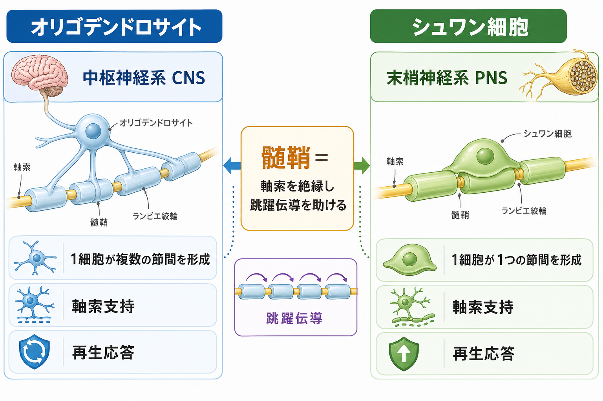
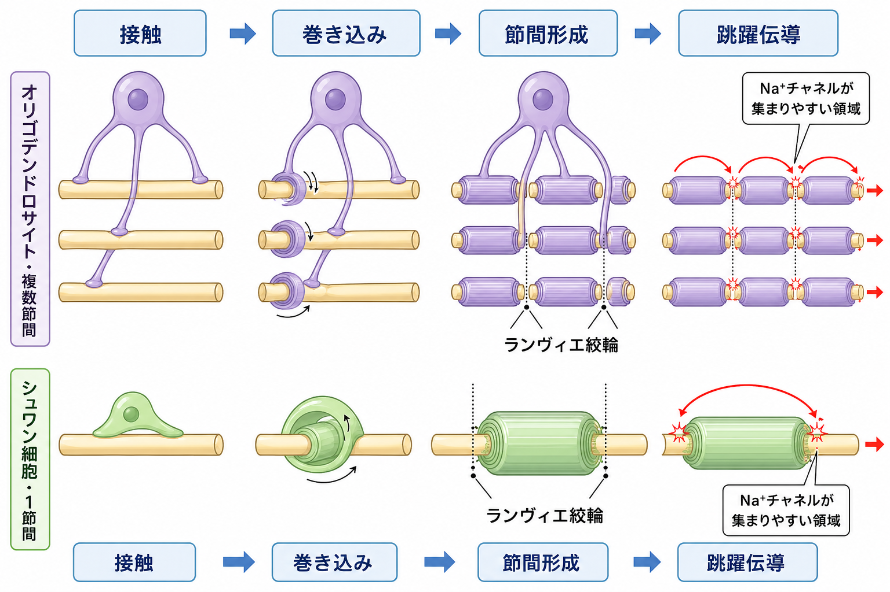
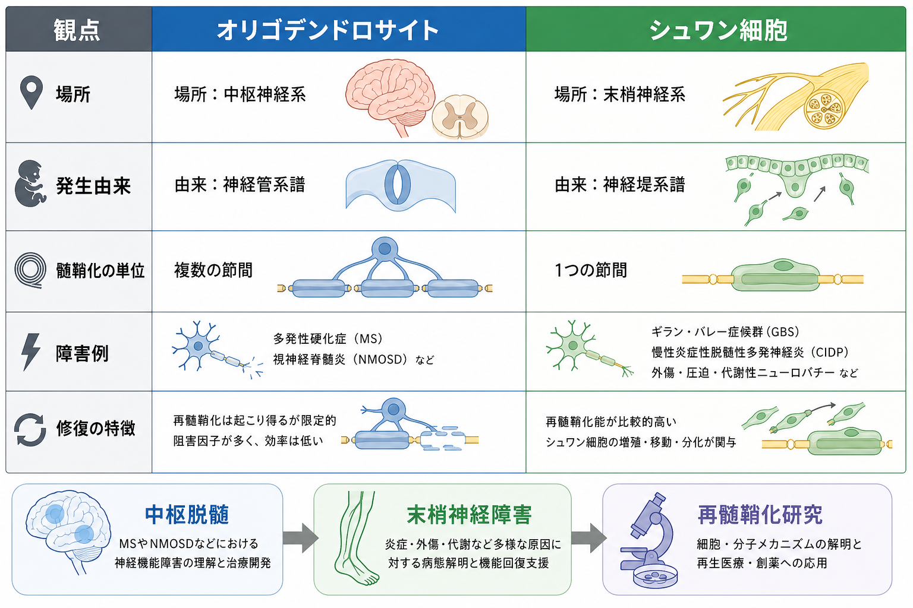

---
title: "オリゴデンドロサイトとシュワン細胞は何が違うのか"
description: "中枢神経系と末梢神経系で髄鞘を作る細胞であるオリゴデンドロサイトとシュワン細胞の違いを、場所・発生由来・髄鞘化の単位・修復応答・疾患との接続から整理する。"
aliases:
  - "オリゴデンドロサイト"
  - "シュワン細胞"
  - "髄鞘形成細胞"
tags:
  - neuroscience
  - basic-neuroscience
  - obsidian
  - glia
  - myelin
created: "2026-04-27"
updated: "2026-04-27"
draft: true
publish: false
status: draft
enableToc: true
---

# オリゴデンドロサイトとシュワン細胞は何が違うのか

## 要点

- オリゴデンドロサイトは中枢神経系、シュワン細胞は末梢神経系で髄鞘を形成するグリア細胞である[1][2]。
- 典型的には、1個のオリゴデンドロサイトは複数の軸索節間を髄鞘化できるのに対し、1個の髄鞘形成シュワン細胞は1本の軸索の1節間を髄鞘化する[2][3]。
- 両者は髄鞘によって伝導速度と効率を高めるだけでなく、軸索の長期的な維持、代謝支援、軸索・グリア相互作用にも関わる[1][4]。
- 末梢神経ではシュワン細胞の可塑性と修復応答が比較的強く、損傷後の軸索再生支援に重要である。一方、中枢神経の再髄鞘化や軸索再生は、環境要因を含む複数の制約を受ける[5][6]。
- 臨床的には、中枢脱髄疾患と末梢神経障害を混同しないことが重要である。ただし、個別の症状や疾患判断は専門的評価を要し、この記事は教育・研究目的の整理に限る[7][8]。

## この記事で答える問い

この記事では、[[グリア細胞は単なる支持細胞なのか]]という問いの延長として、次の問いに答える。

1. オリゴデンドロサイトとシュワン細胞は、それぞれどこで働くのか。
2. 両者は同じ「髄鞘を作る細胞」と見てよいのか、それとも本質的な違いがあるのか。
3. その違いは、神経伝導、損傷後の修復、疾患理解にどう関係するのか。

## まず結論

一番短く言えば、オリゴデンドロサイトは「中枢神経系で、複数の軸索節間をまとめて髄鞘化しやすい細胞」、シュワン細胞は「末梢神経系で、1個の細胞が1つの節間を担当し、損傷後の修復応答にも強く関わる細胞」である[2][5]。

どちらも髄鞘を作るため、[[軸索はどのように情報を遠くへ伝えるのか]]を理解するうえでは同じカテゴリに入る。しかし、働く場所、発生由来、軸索との付き合い方、細胞外環境、損傷後の振る舞いが異なる。そのため「中枢のシュワン細胞」「末梢のオリゴデンドロサイト」と単純に置き換えると、発生・病態・再生研究の理解を誤りやすい。

## 背景

[[ニューロンとは何か]]を考えるとき、軸索は遠くへ信号を送る構造として重要である。だが、長い軸索を速く、安定して、少ないエネルギーで使うには、軸索膜をただ興奮させるだけでは不十分である。軸索の周囲には髄鞘という脂質に富む膜構造が巻きつき、膜容量を下げ、電流の漏れを減らし、ランヴィエ絞輪で活動電位を再生させる配置を作る[1][4]。

この髄鞘を作る細胞が、中枢神経系ではオリゴデンドロサイト、末梢神経系ではシュワン細胞である。両者は同じ「髄鞘形成細胞」ではあるが、進化・発生・組織構造の中で異なる役割分担を持つ。

## 基本概念

### 髄鞘

髄鞘は、軸索の周囲に何重にも巻かれたグリア細胞由来の膜である。主な機能は絶縁であり、有髄軸索では活動電位が主にランヴィエ絞輪で再生される。これにより、信号は節から節へ「跳ぶ」ように伝わり、無髄軸索より速く効率的に伝わりやすくなる[1][4]。

ただし、髄鞘は単なるビニール被覆ではない。オリゴデンドロサイトやシュワン細胞は、軸索との接着、分子配置、代謝支援、損傷応答を通じて、軸索の長期的な健康にも関わる[1][6]。

### オリゴデンドロサイト

オリゴデンドロサイトは中枢神経系、つまり脳・脊髄・視神経などで髄鞘を形成するグリア細胞である。オリゴデンドロサイト前駆細胞から分化し、細胞体から複数の突起を伸ばして、複数の軸索または同一軸索上の複数節間を髄鞘化できる[2][6]。

中枢神経の白質では、オリゴデンドロサイト、アストロサイト、ミクログリア、ニューロン、血管系が密に相互作用している。近年のレビューでは、髄鞘は伝導速度だけでなく、代謝支援、イオン・水恒常性、活動依存的な適応にも関わると整理されている[6]。

### シュワン細胞

シュワン細胞は末梢神経系で働くグリア細胞である。発生的には神経堤細胞に由来し、成熟後には髄鞘形成シュワン細胞、非髄鞘形成シュワン細胞、神経筋接合部周辺のシュワン細胞など、多様な状態をとる[2][5]。

髄鞘形成シュワン細胞は、通常、1個の細胞が1本の軸索の1つの節間を担当する。したがって、長い末梢神経の軸索を髄鞘化するには、多数のシュワン細胞が連なって節間を作る必要がある[3]。

## 仕組み

### 1. 場所の違い

最も基本的な違いは場所である。オリゴデンドロサイトは中枢神経系の髄鞘形成細胞であり、シュワン細胞は末梢神経系の髄鞘形成細胞である[1][3]。

この違いは、単なる住所の違いではない。中枢神経では血液脳関門、アストロサイト、ミクログリア、オリゴデンドロサイト前駆細胞などが関わる環境の中で髄鞘が維持される。末梢神経では、基底膜、結合組織、マクロファージ、シュワン細胞の修復表現型などが、損傷後の応答に強く関わる[5][6]。

### 2. 髄鞘化の単位の違い

典型的な模式図では、オリゴデンドロサイトは「多腕型」、シュワン細胞は「一対一型」として描ける。オリゴデンドロサイトは複数の突起を伸ばし、複数の節間を髄鞘化できる。一方、髄鞘形成シュワン細胞は1個の細胞が1つの節間を作り、隣の節間は別のシュワン細胞が担当する[2][3]。

この違いは、損傷時の脆弱性の理解にも関わる。1個のオリゴデンドロサイトが複数の節間を支えている場合、その細胞の障害は複数の軸索区画へ波及しうる。一方、末梢神経では多数のシュワン細胞が連続して軸索を支えるため、局所損傷後にそれぞれの細胞が脱分化・増殖・遊走・再髄鞘化に関わる余地が大きい[5]。

### 3. 発生由来の違い

オリゴデンドロサイトは中枢神経系内のオリゴデンドロサイト前駆細胞に由来する。脊髄では、発生時期や領域に応じて複数の波として前駆細胞が生じ、移動し、分化して髄鞘形成細胞になる[2]。

シュワン細胞は神経堤細胞に由来する。神経堤細胞からシュワン細胞前駆細胞、未成熟シュワン細胞を経て、髄鞘形成または非髄鞘形成の成熟状態へ進む[2][5]。この発生由来の違いは、細胞マーカー、分化制御、損傷後の可塑性の違いにもつながる。

### 4. ランヴィエ絞輪の作り方と軸索ドメイン

有髄軸索では、髄鞘に覆われた節間、髄鞘の端にある傍絞輪部、電位依存性 Na+ チャネルが集まるランヴィエ絞輪など、軸索膜が領域ごとに分化している。これらの領域配置は、活動電位を速く効率的に伝えるために必要である[4]。

中枢神経と末梢神経のどちらでも、髄鞘形成細胞は軸索の分子配置を組織化する。しかし、末梢神経ではシュワン細胞の微絨毛や基底膜成分が節部形成に関わり、中枢神経ではオリゴデンドロサイト、アストロサイト、細胞外マトリックスなどが異なる組み合わせで関わる[4]。

### 5. 損傷後の修復応答

末梢神経が損傷されると、シュワン細胞は成熟した髄鞘形成状態から修復を支える状態へ大きく変化できる。修復シュワン細胞は、髄鞘残骸の処理、マクロファージ動員、神経栄養因子の発現、再生軸索を導く構造形成に関わる[5]。

中枢神経でも再髄鞘化は起こりうるが、効率は病変環境や年齢、炎症、前駆細胞の動員・分化、軸索側の状態に左右される。中枢神経の髄鞘障害では、オリゴデンドロサイトだけでなく、ミクログリア、アストロサイト、免疫細胞、軸索変性を含めた組織全体として考える必要がある[6][7]。

## 図解

| 観点 | オリゴデンドロサイト | シュワン細胞 |
|---|---|---|
| 主な場所 | 中枢神経系 | 末梢神経系 |
| 発生由来 | 中枢神経系内の前駆細胞系譜 | 神経堤細胞系譜 |
| 髄鞘化の単位 | 1細胞が複数節間を形成しうる | 1細胞が1つの節間を形成 |
| 周辺環境 | アストロサイト、ミクログリア、血管系などと密接 | 基底膜、結合組織、マクロファージなどと密接 |
| 損傷後応答 | 再髄鞘化は起こりうるが制約が多い | 修復表現型への転換が軸索再生支援に重要 |
| 疾患理解 | 多発性硬化症などの中枢脱髄疾患と関連 | ギラン・バレー症候群やCIDPなど末梢神経障害の理解と関連 |

## 臨床・研究との接続

中枢神経の脱髄疾患では、髄鞘、オリゴデンドロサイト、軸索、免疫反応が絡み合う。たとえば多発性硬化症では、免疫系が中枢神経系の髄鞘を攻撃し、髄鞘だけでなく軸索や灰白質にも障害が及びうると説明されている[7]。このため、「髄鞘が壊れる病気」とだけ理解すると、軸索変性や神経回路機能の変化を見落としやすい。

末梢神経では、シュワン細胞の髄鞘形成と修復応答が重要である。ギラン・バレー症候群の一部の病型では末梢神経の髄鞘や軸索が免疫介在性に障害され、信号伝達が乱れる[8]。ただし、末梢神経障害には脱髄型だけでなく軸索型、代謝性、圧迫性、中毒性など多様な機序があるため、「シュワン細胞の病気」と一括りにはできない。

研究面では、両者の違いは再生医療や再髄鞘化研究に直結する。シュワン細胞の修復表現型をどのように誘導・維持するか、中枢神経でオリゴデンドロサイト前駆細胞をどう分化させるか、軸索側の活動や代謝状態が髄鞘形成にどう影響するかは、現在も重要な研究課題である[1][5][6]。

## よくある誤解

### 誤解1: オリゴデンドロサイトとシュワン細胞は名前が違うだけで同じ細胞である

両者はどちらも髄鞘形成細胞だが、働く場所、発生由来、髄鞘化の単位、損傷後応答が異なる。特に「1細胞が複数節間を作るか、1節間を担当するか」は、両者を見分ける基本である[2][3]。

### 誤解2: 髄鞘の役割は信号を速くすることだけである

髄鞘は跳躍伝導を支えるが、それだけではない。髄鞘形成細胞は、軸索の代謝支援、イオン環境の調整、軸索ドメインの維持、長期的な軸索保護にも関わる[1][6]。

### 誤解3: 末梢神経は必ず完全に再生する

末梢神経は中枢神経より再生しやすい条件を持つが、完全な機能回復が常に起こるわけではない。損傷の距離、標的までの時間、炎症、瘢痕、軸索の種類、年齢、基礎疾患などが結果を左右する[5]。

### 誤解4: 中枢脱髄と末梢脱髄は同じ治療発想でよい

中枢神経と末梢神経では、髄鞘形成細胞も組織環境も異なる。疾患の診断・治療は専門的評価に基づく必要があり、基礎概念の類似だけで臨床判断を一般化してはいけない[7][8]。

## 関連ノート

- [[ニューロンとは何か]]
- [[軸索はどのように情報を遠くへ伝えるのか]]
- [[グリア細胞は単なる支持細胞なのか]]

関連ノート候補:

- 髄鞘とは何か
- ランヴィエ絞輪では何が起きているのか
- 多発性硬化症はどのように髄鞘を障害するのか
- 末梢神経はなぜ再生しやすいのか
- オリゴデンドロサイト前駆細胞とは何か
- シュワン細胞の修復表現型とは何か

MOC更新候補:

- バッチ統合時に、基礎神経科学またはグリア細胞関連のMOCへ本記事を追加する。

## 理解チェック

1. オリゴデンドロサイトとシュワン細胞の最も基本的な場所の違いを説明できるか。
2. 「1個の細胞が複数節間を作る」と「1個の細胞が1節間を作る」の違いを、軸索の図として説明できるか。
3. 髄鞘が活動電位の伝導を速くする理由を、ランヴィエ絞輪と関連づけて説明できるか。
4. 末梢神経損傷後にシュワン細胞の可塑性が重要になる理由を説明できるか。
5. 中枢脱髄疾患と末梢神経障害を単純に同一視してはいけない理由を説明できるか。

## 参考文献

[1] Nave KA, Werner HB. Myelination of the nervous system: mechanisms and functions. *Annual Review of Cell and Developmental Biology.* 2014;30:503-533. https://doi.org/10.1146/annurev-cellbio-100913-013101

[2] Hughes EG, Appel B. Development of myelinating glia: an overview. *Glia.* 2022;70(4):595-607. https://doi.org/10.1002/glia.24110

[3] Fallon M, Tadi P. Histology, Schwann Cells. *StatPearls.* NCBI Bookshelf, updated 2023. https://www.ncbi.nlm.nih.gov/books/NBK544316/

[4] Rasband MN, Peles E. Mechanisms of node of Ranvier assembly. *Nature Reviews Neuroscience.* 2021;22:7-20. https://doi.org/10.1038/s41583-020-00406-8

[5] Jessen KR, Mirsky R, Lloyd AC. Schwann cells: development and role in nerve repair. *Cold Spring Harbor Perspectives in Biology.* 2015;7(7):a020487. https://doi.org/10.1101/cshperspect.a020487

[6] Stadelmann C, Timmler S, Barrantes-Freer A, Simons M. Myelin in the central nervous system: structure, function, and pathology. *Physiological Reviews.* 2019;99(3):1381-1431. https://doi.org/10.1152/physrev.00031.2018

[7] National Institute of Neurological Disorders and Stroke. Multiple Sclerosis. https://www.ninds.nih.gov/health-information/disorders/multiple-sclerosis-ms

[8] National Institute of Neurological Disorders and Stroke. Guillain-Barré Syndrome. https://www.ninds.nih.gov/health-information/disorders/guillain-barre-syndrome

## 未解決問題

- 活動依存的な髄鞘形成は、学習や可塑性にどの程度因果的に寄与するのか。
- 中枢神経で再髄鞘化が失敗する主要なボトルネックは、疾患や年齢によってどのように変わるのか。
- シュワン細胞の修復表現型を高める介入は、過剰な炎症や疼痛を増やさずに機能回復を支援できるのか。
- 中枢神経内でシュワン細胞様の再髄鞘化が起こる条件は、治療標的としてどこまで利用できるのか。
