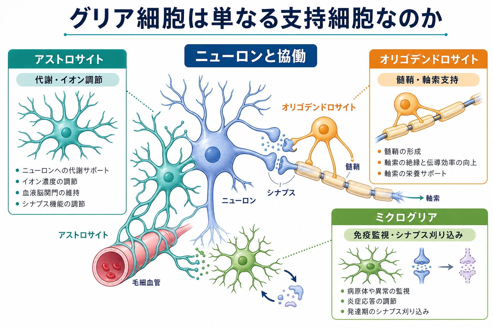
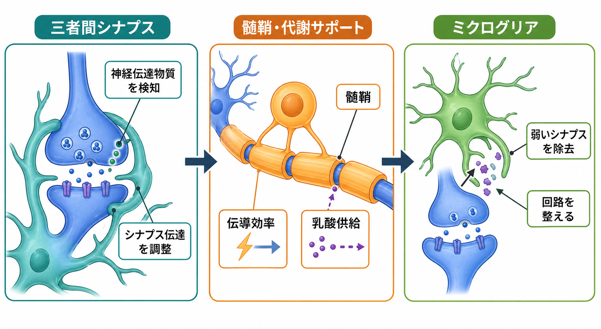

---
title: "グリア細胞は単なる支持細胞なのか"
description: "アストロサイト、オリゴデンドロサイト、ミクログリアを中心に、グリア細胞が神経回路の形成・維持・可塑性・疾患にどう関わるかを整理する。"
aliases:
  - "グリア細胞"
  - "神経膠細胞"
  - "アストロサイト"
  - "オリゴデンドロサイト"
  - "ミクログリア"
tags:
  - neuroscience
  - basic-neuroscience
  - obsidian
  - 脳・神経科学/基礎神経科学
created: "2026-04-27"
updated: "2026-04-27"
draft: true
publish: false
status: draft
enableToc: true
---

# グリア細胞は単なる支持細胞なのか

## 要点

- グリア細胞は「ニューロンを物理的に支えるだけの細胞」ではなく、[[シナプス]]、[[軸索はどのように情報を遠くへ伝えるのか|軸索]]、血管、免疫環境をまたいで神経回路の働きを調整する細胞群である[1][2]。
- アストロサイトは、イオン濃度・神経伝達物質・代謝・血流を調整し、シナプス伝達と神経血管カップリングに関わる[3]。
- オリゴデンドロサイトは髄鞘を作って伝導効率を高めるだけでなく、軸索に乳酸などの代謝支援を行い、軸索の長期的な健康にも関与する[4][5]。
- ミクログリアは中枢神経系の常在免疫細胞であり、損傷・感染への応答だけでなく、発達期の不要なシナプス除去や疾患関連状態にも関わる[6][7]。
- したがって「ニューロンが主役、グリアは脇役」という見方よりも、「ニューロンとグリアが協働して回路を作動・維持・再編する」という見方の方が正確である。

## この記事で答える問い

この記事では、次の問いに答える。

1. グリア細胞にはどのような種類があり、何が違うのか。
2. アストロサイト、オリゴデンドロサイト、ミクログリアは、神経回路の働きにどう関与するのか。
3. 「支持細胞」という古い呼び方は、どこまで正しく、どこから誤解を招くのか。
4. グリア研究は、発達、学習、神経変性疾患、精神疾患の理解とどう接続するのか。

## まず結論

グリア細胞は「支持細胞」ではあるが、「単なる支持細胞」ではない。支持という語を、足場・栄養・絶縁だけに限定すると、現代の神経科学で見えてきた機能の大部分を取り逃がす。

アストロサイトはシナプス周囲と血管周囲の両方に突起を伸ばし、神経伝達物質の回収、K+ の緩衝、エネルギー代謝、血流調整を通じて、ニューロンの活動環境を動的に整える[3]。オリゴデンドロサイトは中枢神経系で髄鞘を形成し、跳躍伝導を助けるだけでなく、軸索へ代謝的な支援を行う[4][5]。ミクログリアは中枢神経系内の免疫監視細胞であり、発達期のシナプス除去や疾患時の炎症応答に関わる[6][7]。

つまり、グリア細胞は「ニューロンの背景」ではなく、神経回路の作動条件そのものを作る細胞群である。

## 背景

「グリア」は膠、つまり接着剤のようなものという歴史的イメージを背負ってきた。しかし近年の研究は、グリア細胞が発達、可塑性、代謝、血流、免疫、疾患に広く関与することを示している[1][2]。特に、ニューロンだけを調べても説明できない現象、たとえばシナプス形成、髄鞘の可塑性、軸索変性、神経炎症などでは、グリアを含む細胞間相互作用を見る必要がある。

この見方は、[[軸索小丘はなぜ発火の起点になるのか|活動電位の起点]]や軸索伝導を考えるときにも重要である。活動電位はニューロンの膜興奮性に依存するが、その伝導効率、代謝維持、髄鞘環境はグリアの働きと切り離せない。

## 基本概念

### アストロサイト

アストロサイトは星状の突起を持つグリア細胞で、シナプス周囲、血管周囲、細胞外空間に広く接している。主な機能は、神経伝達物質の取り込み、K+ 緩衝、代謝支援、血液脳関門や神経血管カップリングへの関与である[3]。

重要なのは、アストロサイトが「余った物質を掃除するだけ」ではない点である。シナプス近傍で神経伝達物質を検知し、カルシウムシグナルや代謝経路を通じて、局所の神経活動を調整しうる。これを説明する概念として「三者間シナプス」がある。これは、シナプス前ニューロン、シナプス後ニューロン、アストロサイトを一体の機能単位として見る考え方である[3]。

### オリゴデンドロサイト

オリゴデンドロサイトは中枢神経系で髄鞘を形成する。髄鞘は軸索を絶縁し、ランビエ絞輪で活動電位を再生させることで、伝導速度とエネルギー効率を高める。これは[[軸索はどのように情報を遠くへ伝えるのか]]の理解に直結する。

ただし、オリゴデンドロサイトの役割は「絶縁材」に留まらない。軸索は長く、細胞体から離れた末端までエネルギーを維持する必要がある。オリゴデンドロサイトは MCT1 などを介して乳酸供給に関与し、軸索の機能と生存を支えることが示されている[4]。また、髄鞘は固定構造ではなく、経験や学習に応じて変化しうる可塑的な構造としても注目されている[5]。

### ミクログリア

ミクログリアは中枢神経系に常在する免疫系由来の細胞である。健康な脳では突起を動かしながら局所環境を監視し、損傷、感染、細胞死、異常タンパク質、シナプス変化などに応答する[6]。

ミクログリアは発達期の回路形成にも関わる。補体系の C1q や C3 が不要なシナプスの標識に関わり、シナプス除去に寄与することが示された[7]。この仕組みは正常発達には有用だが、疾患や老化の文脈では、過剰または不適切な再活性化が神経変性と関連する可能性がある。

## 仕組み

### 1. シナプス環境を整える

シナプス伝達は、神経伝達物質が放出され、受容体に結合すれば終わりという単純な過程ではない。放出された伝達物質は速やかに回収・分解・再利用される必要があり、細胞外 K+ も活動に応じて変動する。アストロサイトはこれらを調整し、シナプスの興奮性が過剰にも過小にも傾きすぎないようにする[3]。

ここでいう調整は、必ずしも「ニューロンを強くする」ことではない。活動の文脈によって、興奮性を抑えることも、伝達の効率を保つこともある。グリアは信号そのものではなく、信号が意味を持つための局所環境を調整している。

### 2. 軸索伝導と代謝を支える

髄鞘は、軸索膜の電気的性質を変えることで、活動電位の跳躍伝導を可能にする。これにより、神経信号は速く、比較的少ないエネルギーで遠方へ伝わる。さらに、オリゴデンドロサイトは髄鞘形成とは独立した代謝支援も行い、乳酸供給などを通じて軸索の長期的な維持に関わる[4]。

この点は、神経変性疾患の理解にも重要である。軸索が変性するとき、原因はニューロン内部だけにあるとは限らない。軸索を取り巻くグリアの代謝支援や髄鞘維持が破綻すれば、遠位軸索から機能低下が起こる可能性がある。

### 3. 不要な接続を除き、回路を作り替える

発達期の脳では、過剰に作られたシナプスの一部が除去され、より適切な回路へ洗練される。この過程で、補体系がシナプスを標識し、ミクログリアがそれを除去する経路が報告されている[7]。

ただし「ミクログリアはシナプスを壊す細胞」と単純化するのは危険である。ミクログリアは文脈依存的に、監視、除去、修復、炎症調整、髄鞘再生支援など多様な状態を取る[6][8]。重要なのは、ミクログリアの状態を固定的な善悪で見ず、発達段階、脳領域、疾患状態、時間経過の中で捉えることである。

## 図解

上の2枚の図は、グリア細胞を三つの層で見るための補助図である。

- 細胞タイプの層: アストロサイト、オリゴデンドロサイト、ミクログリアは形も由来も主機能も異なる。
- 機能の層: 代謝・イオン調節、髄鞘・軸索支持、免疫監視・シナプス刈り込みが代表的な機能である。
- 回路の層: これらの機能は別々に働くのではなく、シナプス、軸索、血管、免疫環境を通じて神経回路全体の安定性と可塑性を調整する。

## 臨床・研究との接続

グリア研究は、神経変性疾患、多発性硬化症、脳損傷、てんかん、発達障害、精神疾患の理解と接続する。ただし、ここで述べる内容は教育・研究目的の基礎知識であり、個別の診断や治療方針を示すものではない。

オリゴデンドロサイトと髄鞘は、多発性硬化症のような脱髄疾患だけでなく、軸索代謝や神経変性の文脈でも重要である[4][5]。ミクログリアはアルツハイマー病などの神経変性疾患で、恒常性状態から疾患関連状態へ変化することが議論されている[6][8]。アストロサイトも、神経伝達物質の取り込み、代謝、血流調節の破綻を通じて、興奮毒性や神経血管機能の異常に関わりうる[3]。

研究上の大きな課題は、グリア細胞の機能が非常に文脈依存的であることだ。同じ「活性化」という言葉でも、損傷直後の防御反応、慢性炎症、発達期の回路形成、老化脳の変化では意味が異なる。したがって、グリアを理解するには、細胞タイプだけでなく、時期、脳領域、疾患段階、近接するニューロンや血管との関係を合わせて見る必要がある。

## よくある誤解

### 誤解1: グリア細胞はニューロンの隙間を埋めているだけである

グリア細胞は空間的な支持も行うが、それだけではない。シナプス形成、神経伝達、血流、代謝、髄鞘形成、免疫応答、疾患進行に関わる[1][2]。

### 誤解2: 髄鞘は一度できたら変わらない絶縁材である

髄鞘は伝導効率を高める構造だが、近年は経験や学習に応じて変化しうる可塑的構造として研究されている[5]。したがって、髄鞘は単なる被覆材ではなく、神経回路のタイミングと効率を調整する要素でもある。

### 誤解3: ミクログリアは炎症を起こす悪い細胞である

ミクログリアは損傷時に炎症応答へ関わるが、健康な脳でも恒常性維持や発達期の回路形成に関与する[6][7]。問題はミクログリアの存在そのものではなく、どの状態が、どの時期に、どの程度続くかである。

### 誤解4: グリアを調べるのはニューロン研究の補足である

グリアは補足ではなく、神経回路を理解するための構成要素である。ニューロンの発火、シナプス可塑性、軸索維持、疾患脆弱性は、グリアとの相互作用を含めて初めて説明しやすくなる。

## 関連ノート

- [[軸索はどのように情報を遠くへ伝えるのか]]
- [[軸索小丘はなぜ発火の起点になるのか]]
- 関連ノート候補: シナプス、活動電位、髄鞘、ランビエ絞輪、神経血管カップリング、神経炎症、補体系、神経変性疾患
- MOC更新候補: `content/00_MOC/` 内の脳・神経科学系 MOC に本記事へのリンクを追加

## 理解チェック

1. アストロサイトがシナプス周囲と血管周囲の両方に接していることは、どのような機能につながるか。
2. オリゴデンドロサイトの役割を「髄鞘形成」だけで説明すると、何を見落とすか。
3. ミクログリアによるシナプス刈り込みは、正常発達と疾患の文脈でどのように意味が変わるか。
4. 「支持細胞」という言葉を残すなら、どのように言い換えると誤解が少ないか。

## 参考文献

[1] Allen, N. J., & Barres, B. A. (2009). Glia — more than just brain glue. *Nature*, 457, 675-677. https://doi.org/10.1038/457675a

[2] Barres, B. A. (2008). The mystery and magic of glia: a perspective on their roles in health and disease. *Neuron*, 60(3), 430-440. https://doi.org/10.1016/j.neuron.2008.10.013

[3] Haydon, P. G., & Carmignoto, G. (2006). Astrocyte control of synaptic transmission and neurovascular coupling. *Physiological Reviews*, 86(3), 1009-1031. https://doi.org/10.1152/physrev.00049.2005

[4] Lee, Y., Morrison, B. M., Li, Y., et al. (2012). Oligodendroglia metabolically support axons and contribute to neurodegeneration. *Nature*, 487, 443-448. https://doi.org/10.1038/nature11314

[5] Xin, W., & Chan, J. R. (2020). Myelin plasticity: sculpting circuits in learning and memory. *Nature Reviews Neuroscience*, 21, 682-694. https://doi.org/10.1038/s41583-020-00379-8

[6] Kettenmann, H., Hanisch, U.-K., Noda, M., & Verkhratsky, A. (2011). Physiology of microglia. *Physiological Reviews*, 91(2), 461-553. https://doi.org/10.1152/physrev.00011.2010

[7] Stevens, B., Allen, N. J., Vazquez, L. E., et al. (2007). The classical complement cascade mediates CNS synapse elimination. *Cell*, 131(6), 1164-1178. https://doi.org/10.1016/j.cell.2007.10.036

[8] Butovsky, O., & Weiner, H. L. (2018). Microglial signatures and their role in health and disease. *Nature Reviews Neuroscience*, 19, 622-635. https://doi.org/10.1038/s41583-018-0057-5

## 未解決問題

- アストロサイトのカルシウムシグナルや gliotransmission が、ヒトの認知機能にどの程度直接寄与するのか。
- 髄鞘可塑性が、学習や精神疾患の症状形成にどの程度因果的に関わるのか。
- ミクログリアの疾患関連状態を、保護的反応と有害な慢性炎症にどう切り分けるか。
- ニューロン、グリア、血管、免疫系を統合した神経回路モデルをどのように構築するか。
