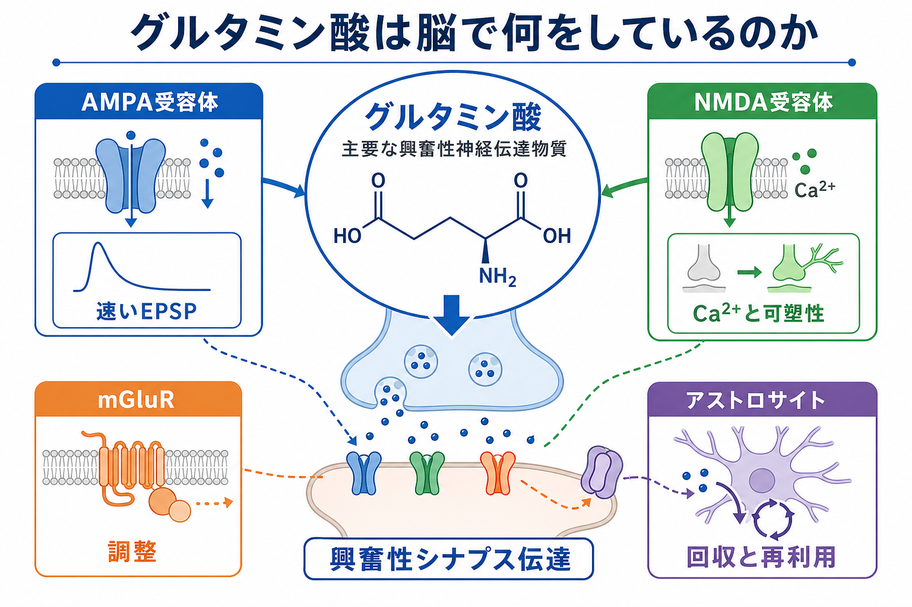
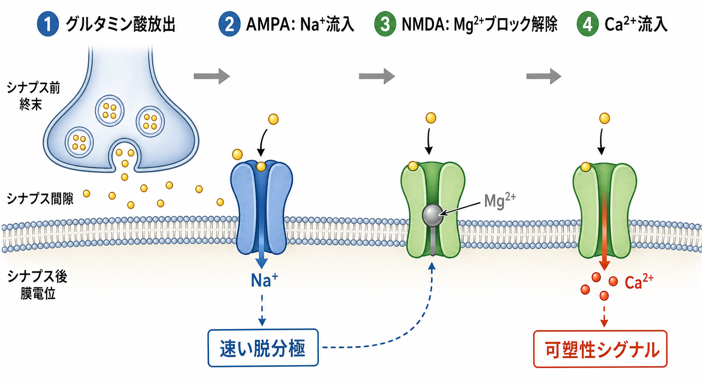

---
title: "グルタミン酸は脳で何をしているのか"
description: "主要な興奮性神経伝達物質としてのグルタミン酸の役割を、AMPA受容体、NMDA受容体、mGluR、アストロサイトによる回収、可塑性と興奮毒性の観点から整理する。"
aliases:
  - "グルタミン酸"
  - "glutamate"
  - "AMPA受容体"
  - "NMDA受容体"
tags:
  - neuroscience
  - basic-neuroscience
  - synapse
  - neurotransmitter
  - obsidian
created: "2026-04-27"
updated: "2026-04-27"
draft: true
publish: false
status: draft
enableToc: true
---

# グルタミン酸は脳で何をしているのか

## 要点

- グルタミン酸は、哺乳類の中枢神経系で最も重要な興奮性神経伝達物質の一つであり、多くの[[シナプスとは何か|シナプス]]で次のニューロンを発火しやすい方向へ動かす。[1][2]
- AMPA受容体は、グルタミン酸入力を速い陽イオン電流に変換し、典型的には速い興奮性シナプス後電位、すなわちEPSPを作る。[2][3]
- NMDA受容体は、グルタミン酸結合だけでなく膜の脱分極によるMg2+ブロック解除を必要とし、Ca2+流入を通じてシナプス可塑性と深く関わる。[2][3][4]
- mGluRはイオンを直接通す受容体ではなく、Gタンパク質を介してシナプス伝達や神経細胞の興奮性をゆっくり調整する。[2][5]
- グルタミン酸は「多いほどよい」物質ではない。細胞外濃度はアストロサイトなどの輸送体で厳密に制御され、過剰な活性化は興奮毒性につながりうる。[6][7]

## この記事で答える問い

この記事では、基礎神経科学の入り口として次の問いに答える。

1. グルタミン酸は、脳内でなぜ「興奮性」の伝達物質と呼ばれるのか。
2. AMPA受容体とNMDA受容体は何が違うのか。
3. グルタミン酸は、学習・記憶・疾患研究とどのように接続するのか。
4. 「グルタミン酸は危険」「グルタミン酸は頭をよくする」といった単純化を、どこまで慎重に扱うべきか。

## まず結論

グルタミン酸は、脳内の多くの回路で「入力が来た」という情報を、シナプス後細胞の電気的変化へ変換する中心的な分子である。[[活動電位はどのように発生するのか|活動電位]]が軸索終末に到達すると、シナプス小胞からグルタミン酸が放出される。放出されたグルタミン酸はシナプス後膜のAMPA受容体やNMDA受容体に結合し、陽イオンの流れを作る。その結果、シナプス後細胞は脱分極し、発火しやすくなる。[2][3]

ただし、グルタミン酸の働きは「興奮させる」だけではない。AMPA受容体は速い信号伝達を担い、NMDA受容体はグルタミン酸入力と膜電位の状態を同時に読むことで、Ca2+シグナルと可塑性に関与する。さらにmGluRは、Gタンパク質経由で興奮性を増減させたり、シナプス前終末の放出確率を調整したりする。[2][5]

つまりグルタミン酸は、脳の「アクセル」というより、速い入力、入力の一致検出、長期的な調整、回収と再利用までを含むシナプス情報処理の基盤である。

## 背景

脳の情報処理は、[[ニューロンとは何か|ニューロン]]が単独で信号を出すだけでは成立しない。あるニューロンの出力が、次のニューロンの[[樹状突起はどのように情報を受け取るのか|樹状突起]]や細胞体に届き、そこで多数の入力が統合される必要がある。この「細胞間の信号変換」の主要な場が化学シナプスである。

グルタミン酸は、その化学シナプスのうち興奮性シナプスで特に重要な伝達物質である。古典的な整理では、GABAが主要な抑制性伝達物質であるのに対し、グルタミン酸は主要な興奮性伝達物質として扱われる。[1] ただし、[[興奮性ニューロンと抑制性ニューロンは何が違うのか|興奮性と抑制性]]は、伝達物質名だけで機械的に決まるわけではない。どの受容体があるか、どのイオンが流れるか、細胞の膜電位がどこにあるか、回路のどの位置に入力するかによって、最終的な効果は変わる。

それでも、成熟した中枢神経系の多くのシナプスでは、グルタミン酸入力はAMPA受容体などを介して脱分極を起こし、シナプス後細胞を発火しやすくする。このため、グルタミン酸は基礎神経科学、学習・記憶研究、てんかん・虚血・神経変性研究、精神疾患研究をつなぐ重要な入口になる。[1][7][8]

## 基本概念

### グルタミン酸

グルタミン酸はアミノ酸の一種であり、脳内では代謝にも神経伝達にも関わる。神経伝達物質として働く場合、シナプス小胞に詰め込まれ、活動電位に伴うCa2+流入をきっかけにシナプス間隙へ放出される。放出後は受容体に結合し、シナプス後細胞やシナプス前終末の状態を変える。[1][2]

### イオンotropic受容体とmGluR

グルタミン酸受容体は、大きく二つに分けられる。

| 種類 | 主な例 | 何をするか | 時間スケール |
|---|---|---|---|
| イオンotropicグルタミン酸受容体 | AMPA、NMDA、カイニン酸受容体 | グルタミン酸結合でチャネルが開き、陽イオン電流を作る | 速い |
| 代謝型グルタミン酸受容体 | mGluR | Gタンパク質やセカンドメッセンジャーを介して細胞状態を調整する | 遅い、調整的 |

AMPA受容体とNMDA受容体は、[[イオンチャネルとは何か|イオンチャネル]]型受容体である。グルタミン酸が結合するとチャネルの開閉状態が変わり、Na+、K+、Ca2+などの流れが変化する。[2][3] 一方、mGluRはチャネルそのものではなく、細胞内シグナルを介して別のチャネルや放出機構を調節する。[5]

### EPSP

EPSPは「興奮性シナプス後電位」のことである。グルタミン酸がAMPA受容体を活性化すると、典型的にはNa+を中心とする陽イオン流入が生じ、シナプス後膜が脱分極する。この脱分極は、単独では活動電位に届かないことも多い。しかし、多数の入力が時間的・空間的に加算されると、軸索小丘付近で発火閾値を超える可能性が高まる。[2]

## 仕組み

### 1. 放出される

グルタミン酸作動性ニューロンの軸索終末には、グルタミン酸を含むシナプス小胞がある。活動電位が終末に到達すると、電位依存性Ca2+チャネルが開き、Ca2+流入が小胞融合を促す。これにより、グルタミン酸がシナプス間隙へ放出される。[2]

この段階は[[化学シナプスと電気シナプスは何が違うのか|化学シナプス]]の基本形そのものであり、電気信号が化学信号へ変換される場面である。

### 2. AMPA受容体が速い脱分極を作る

AMPA受容体は、多くの興奮性シナプスで速いシナプス後応答を担う。グルタミン酸がAMPA受容体に結合するとチャネルが開き、主にNa+流入とK+流出を伴う陽イオン電流が生じる。その反転電位は0 mV付近であるため、通常の静止膜電位では脱分極方向の電流になる。[2][3]

この速さが重要である。AMPA受容体を介する応答は、入力のタイミングをミリ秒単位で反映し、回路内で「どの入力がいつ来たか」を電気的に表現する。したがって、グルタミン酸作動性シナプスの即時的な興奮性は、まずAMPA受容体を通じて理解すると見通しがよい。

### 3. NMDA受容体は条件つきで開く

NMDA受容体もグルタミン酸受容体だが、AMPA受容体より条件が多い。NMDA受容体のチャネルは、静止膜電位付近ではMg2+によって塞がれやすい。グルタミン酸が結合していても、シナプス後膜が十分に脱分極していなければ、電流は流れにくい。[2][3]

AMPA受容体などによってシナプス後膜が脱分極すると、Mg2+ブロックが外れ、NMDA受容体を通る電流が増える。このときNMDA受容体はNa+やK+だけでなくCa2+も通す。Ca2+は単なる電荷の担い手ではなく、細胞内シグナルの引き金として働く。[2][4]

この性質のため、NMDA受容体はしばしば「一致検出器」として説明される。つまり、グルタミン酸入力があることと、シナプス後細胞がすでに脱分極していることが同時に満たされたときに強く働く。これは、ヘッブ型学習や長期増強を理解するうえで重要な考え方である。[4]

### 4. mGluRは速い電流ではなく調整を担う

mGluRは、グルタミン酸を受け取ってGタンパク質共役型受容体として働く。イオンチャネルを直接開くのではなく、細胞内シグナルを通じてイオンチャネル、神経伝達物質放出、シナプス可塑性、神経細胞の興奮性を調整する。[5]

このため、mGluRの働きは「速いEPSPを作る」というより、「回路の感度や状態を変える」と考えるとよい。たとえば、シナプス前にあるmGluRはグルタミン酸放出を調整し、シナプス後にあるmGluRは膜興奮性や可塑性関連シグナルに影響することがある。[5]

### 5. 回収される

グルタミン酸信号は、出しっぱなしでは困る。シナプス間隙や細胞外空間にグルタミン酸が長く残ると、受容体が過剰に活性化され、情報の時間分解能が落ちるだけでなく、神経細胞に負荷をかける可能性がある。[6][7]

そのため、グルタミン酸は興奮性アミノ酸輸送体によってすばやく回収される。特に[[アストロサイトはシナプスと代謝をどう支えているのか|アストロサイト]]は、細胞外グルタミン酸濃度の制御と代謝的な再利用に関わる。アストロサイトに取り込まれたグルタミン酸はグルタミンへ変換され、ニューロンへ戻され、再びグルタミン酸合成に使われる。この循環は、グルタミン酸-グルタミンサイクルとして理解される。[6]

## 図解

図1は、グルタミン酸を「単一の興奮物質」ではなく、AMPA受容体、NMDA受容体、mGluR、アストロサイトによる回収を含むシステムとして見た概念地図である。

図2は、AMPA受容体とNMDA受容体の違いを、時間順に整理したものである。AMPA受容体の速い脱分極がNMDA受容体のMg2+ブロック解除を助け、NMDA受容体からのCa2+流入が可塑性シグナルにつながる。

図3は、AMPA、NMDA、mGluR、回収系を比較したものである。AMPAは速いEPSP、NMDAは条件つきのCa2+流入と可塑性、mGluRは遅い調整、アストロサイトは過剰な細胞外グルタミン酸を抑える役割として整理できる。

## 臨床・研究との接続

### 学習・記憶

長期増強、すなわちLTPは、シナプスが経験に応じて強くなる現象の代表例である。海馬LTPの古典的なモデルでは、NMDA受容体を介するCa2+流入が、シナプス強度を長期的に変える細胞内シグナルの入口になる。[4]

ただし、これは「NMDA受容体だけが記憶を作る」という意味ではない。実際の学習・記憶は、AMPA受容体の挿入やリン酸化、シナプス構造の変化、抑制性回路、神経修飾物質、睡眠、行動文脈などの複数要因によって支えられる。NMDA受容体は、その中で「入力の同時性を細胞内シグナルへ変換する重要な入口」と位置づけるのが妥当である。[3][4]

### 興奮毒性

グルタミン酸は生理的には必須だが、過剰な受容体活性化は神経細胞障害に関わりうる。虚血、外傷、てんかん重積などでは、エネルギー障害やイオン恒常性の破綻により細胞外グルタミン酸が増え、NMDA受容体やAMPA受容体などを介するCa2+負荷が細胞障害に関与する可能性がある。[1][7]

ここで重要なのは、臨床的な説明を単純化しすぎないことである。ある疾患を「グルタミン酸が多いから」とだけ説明するのは不十分である。どの脳領域で、どの細胞型で、どの受容体サブタイプが、どの時間スケールで変化しているかを区別する必要がある。

### 精神疾患・神経疾患研究

グルタミン酸系は、統合失調症、うつ病、依存症、神経変性疾患、疼痛、てんかんなどの研究で広く扱われている。[1][5][7] ただし、これは「グルタミン酸を増やす/減らす」だけで治療を説明できるという意味ではない。AMPA、NMDA、mGluR、輸送体、回路発達、E/Iバランスなどのレベルを分けて考える必要がある。

このノートの範囲では、個別の診断や治療指示は扱わない。ここでの目的は、医療判断ではなく、研究・教育目的の基礎概念整理である。

## よくある誤解

### 誤解1: グルタミン酸は脳の「アクセル」で、GABAは「ブレーキ」である

入口としては便利な比喩だが、正確には不十分である。グルタミン酸は多くの場面で脱分極を起こすが、最終的な出力は受容体、イオン勾配、細胞の状態、入力部位、回路構造に依存する。GABAについても同様に、成熟脳では典型的に抑制性だが、発達段階や条件によって効果は変わる。

### 誤解2: AMPA受容体は単純、NMDA受容体は高級である

AMPA受容体は速い伝達を担うため単純に見えやすいが、サブユニット構成、GluA2の有無、リン酸化、シナプスへの挿入・除去などによって大きく性質が変わる。[3] NMDA受容体も重要だが、AMPA受容体なしに多くの興奮性伝達は成立しない。

### 誤解3: グルタミン酸は危険な物質である

グルタミン酸は脳に不可欠な伝達物質である。危険なのは、細胞外濃度や受容体活性化が制御を外れた状態である。生理的なシナプス伝達、食事中のグルタミン酸、病的な興奮毒性を同じ話として扱うべきではない。[1][7]

### 誤解4: NMDA受容体は常に開いてCa2+を入れている

NMDA受容体は、グルタミン酸結合、共作動因子、膜電位、Mg2+ブロックなどに依存する。したがって、単にグルタミン酸があるだけでは十分ではない。これが、NMDA受容体を「入力の一致検出器」として考える理由である。[2][4]

## 関連ノート

- [[シナプスとは何か]]
- [[化学シナプスと電気シナプスは何が違うのか]]
- [[イオンチャネルとは何か]]
- [[興奮性ニューロンと抑制性ニューロンは何が違うのか]]
- [[アストロサイトはシナプスと代謝をどう支えているのか]]
- [[樹状突起はどのように情報を受け取るのか]]
- [[活動電位はどのように発生するのか]]

関連ノート候補:

- GABAは脳で何をしているのか
- EPSPとIPSPはどのように発火を調整するのか
- NMDA受容体はなぜ可塑性に重要なのか
- 長期増強（LTP）とは何か
- グルタミン酸-グルタミンサイクルとは何か
- 興奮毒性とは何か

MOC更新候補:

- `content/00_MOC/` 内の脳・神経科学または基礎神経科学 MOC に、本記事へのリンクを追加する。
- 並列生成ジョブとの衝突を避けるため、このタスクではMOC本体は更新しない。

## 理解チェック

1. グルタミン酸が「興奮性」と呼ばれるのは、典型的にどのような膜電位変化を作るからか。
2. AMPA受容体とNMDA受容体の違いを、「速さ」「Mg2+ブロック」「Ca2+流入」の3点から説明できるか。
3. NMDA受容体が「一致検出器」と呼ばれる理由を説明できるか。
4. mGluRは、AMPA受容体やNMDA受容体と何が違うか。
5. アストロサイトによるグルタミン酸回収が重要な理由を、情報処理と細胞保護の両面から説明できるか。

## 参考文献

[1] Meldrum, B. S. (2000). Glutamate as a neurotransmitter in the brain: review of physiology and pathology. *The Journal of Nutrition, 130*(4S Suppl), 1007S-1015S. https://doi.org/10.1093/jn/130.4.1007S

[2] Purves, D., Augustine, G. J., Fitzpatrick, D., et al., editors. (2001). Glutamate Receptors. In *Neuroscience* (2nd ed.). Sinauer Associates. NCBI Bookshelf. https://www.ncbi.nlm.nih.gov/books/NBK10802/

[3] Traynelis, S. F., Wollmuth, L. P., McBain, C. J., et al. (2010). Glutamate receptor ion channels: structure, regulation, and function. *Pharmacological Reviews, 62*(3), 405-496. https://doi.org/10.1124/pr.109.002451

[4] Bliss, T. V. P., & Collingridge, G. L. (1993). A synaptic model of memory: long-term potentiation in the hippocampus. *Nature, 361*, 31-39. https://doi.org/10.1038/361031a0

[5] Niswender, C. M., & Conn, P. J. (2010). Metabotropic glutamate receptors: physiology, pharmacology, and disease. *Annual Review of Pharmacology and Toxicology, 50*, 295-322. https://doi.org/10.1146/annurev.pharmtox.011008.145533

[6] Danbolt, N. C. (2001). Glutamate uptake. *Progress in Neurobiology, 65*(1), 1-105. https://doi.org/10.1016/S0301-0082(00)00067-8

[7] Lau, A., & Tymianski, M. (2010). Glutamate receptors, neurotoxicity and neurodegeneration. *Pflugers Archiv - European Journal of Physiology, 460*, 525-542. https://doi.org/10.1007/s00424-010-0809-1

[8] Institute of Medicine (US) Forum on Neuroscience and Nervous System Disorders. (2011). Overview of the Glutamatergic System. In *Glutamate-Related Biomarkers in Drug Development for Disorders of the Nervous System: Workshop Summary*. National Academies Press. https://www.ncbi.nlm.nih.gov/books/NBK62187/

## 未解決問題

- ヒトの特定の認知機能や精神症状を、どの粒度のグルタミン酸機能変化として記述するのが適切か。
- NMDA受容体、AMPA受容体、mGluR、輸送体の変化を、細胞型・脳領域・発達段階ごとにどう統合して理解するか。
- 「興奮毒性」と「生理的な可塑性」を、連続した現象としてどこまで同じ枠組みで扱えるか。

## 更新ログ

- 2026-04-27: 初稿作成。グルタミン酸の興奮性伝達、AMPA/NMDA受容体、mGluR、回収系、可塑性、興奮毒性、図解、参考文献を整理。
