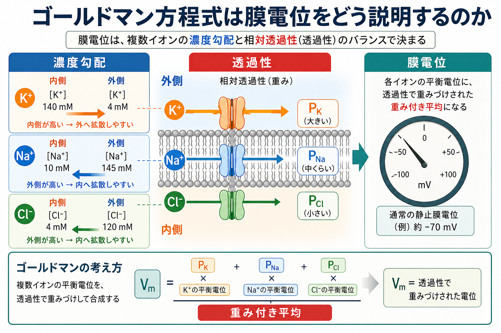
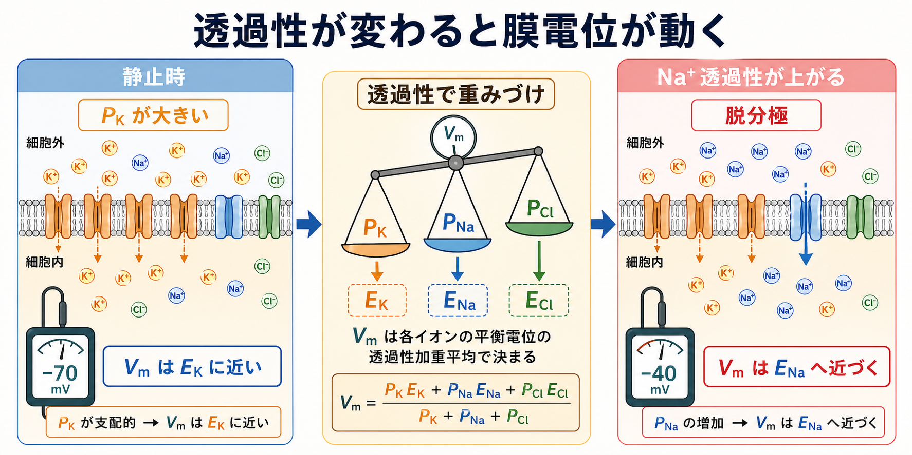
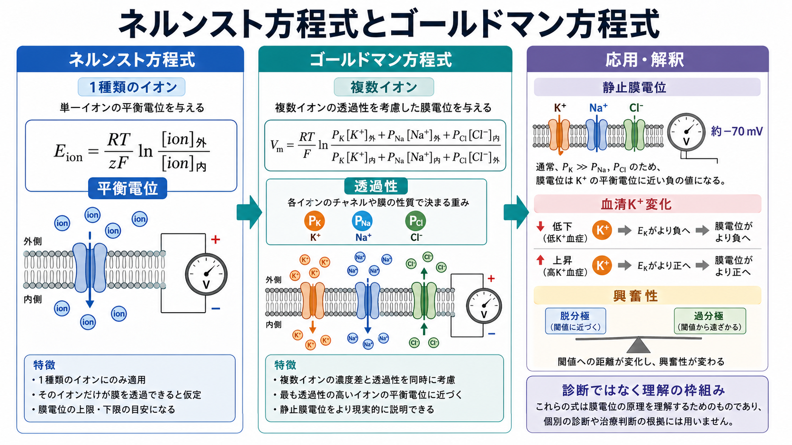

---
title: "ゴールドマン方程式は膜電位をどう説明するのか"
description: "複数イオンの濃度勾配と膜透過性から、静止膜電位や興奮性の変化をどう理解するかを説明する。"
aliases:
  - "ゴールドマン方程式"
  - "Goldman-Hodgkin-Katz方程式"
  - "GHK方程式"
tags:
  - neuroscience
  - basic-neuroscience
  - obsidian
  - 脳・神経科学/基礎神経科学
created: "2026-04-27"
updated: "2026-04-27"
draft: true
publish: false
status: draft
enableToc: true
---

# ゴールドマン方程式は膜電位をどう説明するのか

## 要点

- ゴールドマン方程式、より正確には Goldman-Hodgkin-Katz equation は、膜電位を「複数イオンの濃度勾配」と「膜がそれぞれのイオンをどれくらい通しやすいか」の組み合わせとして表す式である[1][2]。
- [[ニューロンとは何か|ニューロン]]の静止膜電位は、K+ だけで決まるわけではない。静止時には K+ 透過性が大きいため K+ の平衡電位に近いが、Na+ や Cl- も少し寄与する[3][4]。
- ネルンスト方程式が「1種類のイオンだけが膜を通るときの平衡電位」を扱うのに対し、ゴールドマン方程式は「複数イオンが同時に通る膜」の電位を扱う[3]。
- 膜電位は固定値ではなく、チャネルの開閉、イオン濃度、漏洩K+チャネル、ポンプ・輸送体の働きによって変わる[4][6][7]。
- 臨床・研究への接続としては、血清K+の変化、神経細胞の興奮性、[[軸索小丘はなぜ発火の起点になるのか|発火しやすさ]]を理解する枠組みになる。ただし、この式だけで個別の診断や治療判断はできない。

## この記事で答える問い

この記事では、次の問いに答える。

1. 膜電位はなぜ「K+ の濃度差だけ」では説明しきれないのか。
2. ゴールドマン方程式は、Na+、K+、Cl- の寄与をどのようにまとめるのか。
3. 透過性が変わると、膜電位はなぜ別の値へ動くのか。
4. 静止膜電位、活動電位、血清K+変化をどうつなげて理解できるのか。

## まず結論

ゴールドマン方程式は、膜電位を「各イオンの平衡電位の単純平均」としてではなく、「膜を通りやすいイオンほど強く効く重み付きの結果」として説明する。静止時の神経細胞では、K+ を通す漏洩チャネルが相対的に多く開いているため、膜電位は K+ の平衡電位に近い負の値になる。しかし Na+ や Cl- の透過性がゼロではないため、実際の静止膜電位は K+ の平衡電位そのものではなく、少しずれた値になる[3][4]。

この見方を持つと、活動電位の初期相も理解しやすい。Na+ 透過性が一時的に大きくなると、膜電位は Na+ の平衡電位へ近づく方向、つまり脱分極方向へ動く。反対に K+ 透過性が大きくなると、膜電位は K+ の平衡電位へ近づき、再分極・過分極方向へ動く[3]。したがってゴールドマン方程式は、静止膜電位の式であるだけでなく、「透過性が変わると膜電位の目標値が変わる」という神経興奮性の直感を与える。

## 背景

膜電位とは、細胞内を細胞外に対して測った電位差である。多くのニューロンでは、静止時の細胞内は外側より負であり、典型的には約 -60 から -80 mV 程度の範囲で説明される[4]。この負の電位は、細胞膜がすべてのイオンを同じように通すのではなく、イオンごとに透過性が違うために生じる。

歴史的には、Goldman が一定電場の仮定のもとで、イオンの拡散と電気的駆動力を組み合わせた膜電位の式を導いた[1]。その後、Hodgkin と Katz はイカ巨大軸索を用いて、外液Na+やK+の変化が膜電位・活動電位に及ぼす影響を調べ、神経膜の電位がイオン濃度と透過性の組み合わせで説明できることを示した[2][3]。

## 基本概念

### ネルンスト方程式

ネルンスト方程式は、ある1種類のイオンだけが膜を通れると仮定したとき、そのイオンが「濃度勾配で動こうとする力」と「電気的な力」が釣り合う電位を求める式である[4]。たとえば K+ だけに注目するなら、K+ が外へ拡散しようとする力と、細胞内が負になることで K+ を内側へ引き戻す力が釣り合う点が K+ の平衡電位である。

ただし実際の神経細胞膜では、K+ だけでなく Na+ や Cl- も程度の差はあれ膜を通る。したがって、1種類のイオンだけを扱うネルンスト方程式では、現実の静止膜電位を完全には説明できない。

### ゴールドマン方程式

神経細胞でよく使われる形では、ゴールドマン方程式は次のように書ける。

$$
V_m =
\frac{RT}{F}
\ln
\frac{
P_K[K^+]_{\mathrm{out}} + P_{Na}[Na^+]_{\mathrm{out}} + P_{Cl}[Cl^-]_{\mathrm{in}}
}{
P_K[K^+]_{\mathrm{in}} + P_{Na}[Na^+]_{\mathrm{in}} + P_{Cl}[Cl^-]_{\mathrm{out}}
}
$$

ここで $V_m$ は膜電位、$P_K$、$P_{Na}$、$P_{Cl}$ はそれぞれ K+、Na+、Cl- に対する膜透過性である。Cl- は陰イオンなので、式の内外の位置が陽イオンとは逆になる[3]。この形から分かる重要点は、濃度だけでなく透過性 $P$ が各イオンの寄与を重みづけしていることである。

## 仕組み

### 1. 静止時は K+ 透過性が支配的になる

静止状態の神経細胞では、K+ を通す漏洩チャネルが相対的に重要である。細胞内にはK+が多く、細胞外にはK+が少ないため、K+ は外へ出ようとする。一方、K+が外へ出ると細胞内は負になり、電気的にはK+を内側へ引き戻す力が強まる。この2つが釣り合う点が K+ の平衡電位である[3][4]。

しかし静止膜は K+ だけを通す完全選択膜ではない。Na+ などにも小さな透過性があるため、実際の膜電位は K+ の平衡電位よりやや正側へずれる[3][4]。これが「静止膜電位は K+ に強く支配されるが、K+ だけではない」という意味である。

### 2. 透過性は「どの平衡電位へ近づくか」を決める

ゴールドマン方程式の直感は、膜電位が各イオンの平衡電位へ引っ張られるが、その引っ張りの強さは透過性で決まる、というものである。$P_K$ が大きければ、膜電位は $E_K$ に近づく。$P_{Na}$ が大きくなれば、膜電位は $E_{Na}$ に近づく。$P_{Cl}$ が大きい条件では、Cl- の平衡電位も膜電位を強く制約する[3]。

この考え方は、[[軸索はどのように情報を遠くへ伝えるのか|軸索]]を伝わる電気信号の理解にもつながる。活動電位では、電位依存性Na+チャネルの開口によって Na+ 透過性が急に上がり、膜電位が脱分極方向へ動く。その後、Na+透過性の低下とK+透過性の増大によって、膜電位は再び負の方向へ戻る[3]。

### 3. イオンポンプは濃度勾配を維持する

ゴールドマン方程式は、ある時点のイオン濃度と透過性から膜電位を予測する式であり、濃度勾配を作る過程そのものをすべて説明する式ではない。Na+/K+ ATPase などの輸送機構は、Na+を細胞外に多く、K+を細胞内に多く保つことで、膜電位を生み出す前提となる濃度勾配を長期的に維持している[4][6]。

したがって、短時間の膜電位変化を見るときには透過性の変化が前面に出る。長時間の安定性を見るときには、ポンプや輸送体が濃度勾配を保つ働きも重要になる。

## 図解

ネルンスト方程式とゴールドマン方程式の違いは、次のようにまとめられる。

| 観点 | ネルンスト方程式 | ゴールドマン方程式 |
|---|---|---|
| 扱う対象 | 1種類のイオン | 複数の透過性イオン |
| 求めるもの | そのイオンの平衡電位 | 複数イオンを考慮した膜電位 |
| 重要な量 | 濃度比、電荷、温度 | 濃度比、温度、各イオンの透過性 |
| 直感 | そのイオンだけならどこで釣り合うか | どのイオンの影響がどれだけ強いか |
| 神経科学での使い所 | K+、Na+、Cl- の個別理解 | 静止膜電位や透過性変化の理解 |

## 臨床・研究との接続

血清K+濃度が変わると、K+ の濃度勾配が変わり、K+ の平衡電位も変わる。そのため、静止膜電位や興奮性に影響しうる。一般に、細胞外K+が上がると K+ の外向き駆動力が小さくなり、膜電位は脱分極方向へ動きやすい。一方、細胞外K+が下がると膜電位はより負の方向へ動きやすくなる[3][4]。

ただし、実際の臨床症状は心筋、神経、腎機能、酸塩基平衡、薬剤、疾患背景など多くの要因に左右される。ここでの説明は教育・研究目的の生理学的枠組みであり、個別の診断や治療指示ではない。

研究面では、漏洩K+チャネル、とくに二孔ドメインK+チャネルは静止膜電位を安定させ、脱分極に対抗する重要な分子基盤として研究されている[7]。つまり、ゴールドマン方程式の $P_K$ は抽象的な係数に見えるが、実際にはどのチャネルがどの状態で開いているかという分子・細胞レベルの現象と対応している。

## よくある誤解

### 誤解1: 静止膜電位はK+だけで決まる

K+ の寄与は非常に大きいが、Na+ や Cl- の透過性がゼロではないため、静止膜電位は K+ 平衡電位そのものではない。ゴールドマン方程式は、この「主役はK+だが、他のイオンも少し効く」という状況を表す[3][4]。

### 誤解2: ゴールドマン方程式は活動電位を完全に説明する

ゴールドマン方程式は、透過性と濃度から膜電位を理解する強力な式である。しかし、活動電位の時間経過、チャネルの開閉速度、不活性化、空間伝導を完全に扱うには、Hodgkin-Huxley型の動的モデルなどが必要になる[2][3]。

### 誤解3: 透過性は濃度と同じ意味である

濃度は「どれだけあるか」、透過性は「どれだけ通れるか」である。たとえば細胞外Na+が多くても、静止時にNa+チャネルがほとんど閉じていれば、Na+の寄与は限定的である。逆にチャネルが開けば、同じ濃度勾配でも膜電位への影響は急に大きくなる。

### 誤解4: Na+/K+ポンプが直接、瞬間的な膜電位を全部作る

Na+/K+ポンプは濃度勾配の維持に不可欠だが、瞬間的な膜電位の主要な決定因子は、その時点で開いているチャネルを通るイオンの透過性である[4][6]。ポンプは「場を整える」、チャネル透過性は「その瞬間の電位を決める」と分けて考えると理解しやすい。

## 関連ノート

- [[ニューロンとは何か]]
- [[軸索はどのように情報を遠くへ伝えるのか]]
- [[軸索小丘はなぜ発火の起点になるのか]]
- [[MOC｜脳・神経科学]]

今後の作成候補:

- ネルンスト方程式は平衡電位をどう説明するのか
- 静止膜電位はどのように生じるのか
- 漏洩Kチャネルは神経細胞の興奮性をどう調整するのか
- Hodgkin-Huxleyモデルは活動電位をどう説明するのか

MOC更新候補:

- バッチ統合時に `content/00_MOC/MOC｜脳・神経科学.md` の基礎神経科学項目へ本記事を追加する。

## 理解チェック

1. ネルンスト方程式とゴールドマン方程式の違いを、「1種類のイオン」と「複数イオン」という言葉を使って説明できるか。
2. 静止膜電位が K+ 平衡電位に近い理由を、K+ 透過性とK+濃度勾配から説明できるか。
3. Na+ 透過性が上がると膜電位が脱分極する理由を、$E_{Na}$ へ近づくという表現で説明できるか。
4. ゴールドマン方程式が説明することと、Na+/K+ポンプが担うことを区別できるか。

## 参考文献

[1] Goldman, D. E. (1943). Potential, impedance, and rectification in membranes. *Journal of General Physiology*, 27(1), 37-60. https://doi.org/10.1085/jgp.27.1.37

[2] Hodgkin, A. L., & Katz, B. (1949). The effect of sodium ions on the electrical activity of the giant axon of the squid. *The Journal of Physiology*, 108(1), 37-77. https://doi.org/10.1113/jphysiol.1949.sp004310

[3] Purves, D., Augustine, G. J., Fitzpatrick, D., et al. (2001). Electrochemical equilibrium in an environment with more than one permeant ion. In *Neuroscience* (2nd ed.). NCBI Bookshelf. https://www.ncbi.nlm.nih.gov/books/NBK11111/

[4] Chrysafides, S. M., Bordes, S. J., & Sharma, S. (2023). *Physiology, Resting Potential*. StatPearls, NCBI Bookshelf. https://www.ncbi.nlm.nih.gov/books/NBK538338/

[5] Purves, D., Augustine, G. J., Fitzpatrick, D., et al. (2001). The ionic basis of the resting membrane potential. In *Neuroscience* (2nd ed.). NCBI Bookshelf. https://www.ncbi.nlm.nih.gov/books/NBK10931/

[6] Wright, S. H. (2004). Generation of resting membrane potential. *Advances in Physiology Education*, 28(4), 139-142. https://doi.org/10.1152/advan.00029.2004

[7] Enyedi, P., & Czirjak, G. (2010). Molecular background of leak K+ currents: two-pore domain potassium channels. *Physiological Reviews*, 90(2), 559-605. https://doi.org/10.1152/physrev.00029.2009

## 未解決問題

- 静止膜電位の説明で、どの程度までゴールドマン方程式を使い、どこからHodgkin-Huxley型の時間発展モデルへ移るのが学習上もっとも分かりやすいか。
- K2Pチャネルなどの分子多様性を、初学者向けの膜電位説明にどこまで入れるべきか。
- 血清K+変化と神経・心筋興奮性の関係を、臨床判断に踏み込みすぎず教育的に説明する最適な粒度はどこか。
