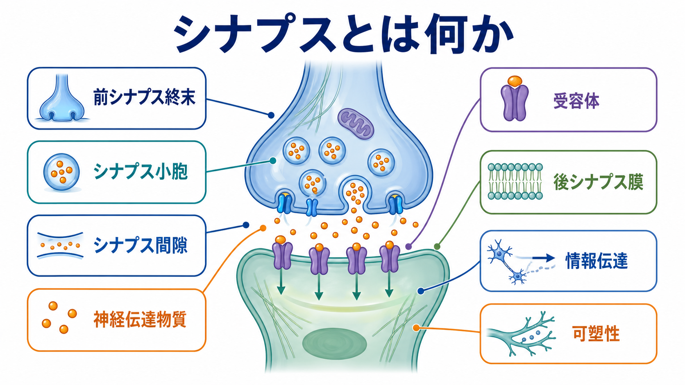
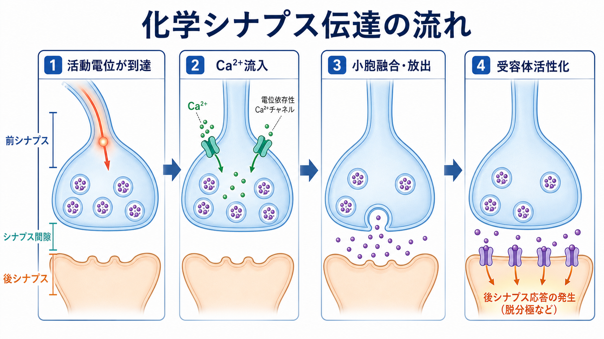
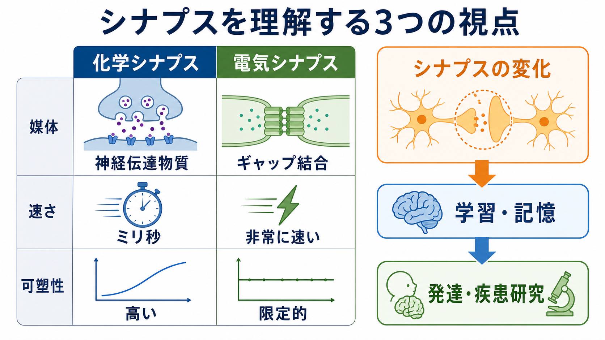

---
title: "シナプスとは何か"
description: "神経細胞間情報伝達の場としてのシナプスの構造、化学シナプス伝達、電気シナプスとの違い、可塑性と臨床・研究上の意義を整理する。"
aliases:
  - "シナプス"
  - "神経伝達"
  - "synapse"
tags:
  - neuroscience
  - basic-neuroscience
  - obsidian
  - 脳・神経科学/基礎神経科学
created: "2026-04-27"
updated: "2026-04-27"
draft: true
publish: false
status: draft
enableToc: true
---

# シナプスとは何か

## 要点

- シナプスは、[[ニューロンとは何か|ニューロン]]が別のニューロン、筋、腺などへ情報を渡す特殊な接合部である。
- 代表的な化学シナプスでは、前シナプス終末の活動電位が Ca2+ 流入を起こし、シナプス小胞から神経伝達物質が放出され、後シナプス膜の受容体を活性化する[1][2]。
- 化学シナプスは、前シナプス終末、シナプス間隙、後シナプス膜という非対称な構造をもち、前シナプス側のアクティブゾーンと後シナプス側の後シナプス肥厚部が機能の中心になる[3][4]。
- 電気シナプスはギャップ結合を介して電流を直接通すため非常に速いが、化学シナプスほど多様な信号変換や可塑性を担いにくい[1][2]。
- シナプスは固定された配線ではなく、活動・経験・発達・病態に応じて強さや形を変える。これが学習、記憶、発達、神経疾患研究をつなぐ重要な入口になる[7][8]。

## この記事で答える問い

この記事では、基礎神経科学の入口として次の問いに答える。

1. シナプスは、細胞同士が単に接触している場所と何が違うのか。
2. 化学シナプスでは、電気信号がどのように化学信号へ変換されるのか。
3. 前シナプス終末、シナプス間隙、後シナプス膜はそれぞれ何をしているのか。
4. 化学シナプスと電気シナプスはどう違うのか。
5. シナプスを理解すると、学習・記憶・疾患研究がどのように見えやすくなるのか。

## まず結論

シナプスとは、神経細胞間の情報伝達を「単なる電線の接続」ではなく、「放出・受容・変換・調整が起こる小さな情報処理装置」として実現する場である。[[軸索はどのように情報を遠くへ伝えるのか|軸索]]を伝わってきた[[活動電位はなぜ一方向に伝わるのか|活動電位]]は、化学シナプスの前シナプス終末で Ca2+ 流入を引き起こし、神経伝達物質の放出へ変換される。その伝達物質がシナプス間隙を拡散し、後シナプス膜の受容体に結合することで、次の細胞の膜電位、細胞内シグナル、発火しやすさが変わる[1][2]。

重要なのは、シナプスが「信号を渡すだけのすき間」ではないことである。前シナプス側では小胞の配置、Ca2+ チャネル、SNARE 複合体、アクティブゾーンが放出のタイミングと確率を決める[4][5]。後シナプス側では受容体、足場タンパク質、シグナル分子、細胞骨格が、入力を電気的・化学的な応答へ変換する[3][6]。この両側の仕組みが変化するため、シナプスは学習・記憶の候補機構である可塑性の主要な単位にもなる[7][8]。

## 背景

神経系では、1個のニューロンが単独で意味を作るのではなく、多数のニューロンが回路を作り、信号を交換する。[[樹状突起はどのように情報を受け取るのか|樹状突起]]や細胞体は入力を受け取り、軸索は出力を遠くへ運び、軸索終末はシナプスを介して次の細胞へ影響を与える。この「入力、統合、出力、次の細胞への伝達」という流れの最後の接点がシナプスである。

19世紀末から20世紀初頭にかけて、神経系は連続した網ではなく、個別の細胞が接点を介して通信するという見方が強まった。電子顕微鏡の発展により、前シナプス膜と後シナプス膜の間に狭いシナプス間隙があり、前シナプス側に小胞、後シナプス側に受容体を含む特殊構造があることが可視化された[3]。つまりシナプスは、細胞が触れ合う場所というより、微細構造と分子機械が密集した通信装置である。

## 基本概念

### 化学シナプス

化学シナプスは、神経伝達物質を介して情報を渡すシナプスである。典型的には、前シナプス終末の小胞に神経伝達物質が蓄えられ、活動電位による脱分極で電位依存性 Ca2+ チャネルが開き、Ca2+ 流入が小胞融合を引き起こす。放出された神経伝達物質はシナプス間隙を拡散し、後シナプス膜の受容体に結合して応答を生む[1][2]。

化学シナプスの強みは、情報を多様に変換できる点にある。伝達物質がグルタミン酸なら多くの場合は興奮性、GABA やグリシンなら多くの場合は抑制性に働く。ただし、最終的な作用は伝達物質だけでなく、受容体の種類、イオン勾配、シナプスの位置、細胞の状態によって決まる。したがって、[[興奮性ニューロンと抑制性ニューロンは何が違うのか|興奮性・抑制性]]は単純なラベルではなく、シナプス機構と回路文脈の組み合わせとして理解する必要がある。

### 電気シナプス

電気シナプスは、ギャップ結合を介して細胞間を直接電流が流れるシナプスである。化学シナプスよりシナプス遅延が短く、複数細胞の活動を同期させやすい。一方で、神経伝達物質の種類や受容体構成を介した多段階の調整は化学シナプスほど豊富ではない[1][2]。

電気シナプスは「原始的で単純」というより、速い同期やリズム形成に向いた別種の接続様式と考える方がよい。化学シナプスと電気シナプスは、どちらか一方が優れているという関係ではなく、回路の目的に応じて使い分けられる。

### 前シナプス・間隙・後シナプス

化学シナプスは、少なくとも次の3要素で考えると理解しやすい。

| 部位 | 主な役割 | 注目する分子・構造 |
|---|---|---|
| 前シナプス終末 | 伝達物質を蓄え、活動に応じて放出する | シナプス小胞、アクティブゾーン、Ca2+ チャネル、SNARE 複合体 |
| シナプス間隙 | 伝達物質が拡散する狭い空間 | 細胞接着分子、細胞外マトリックス、伝達物質分解酵素 |
| 後シナプス膜 | 伝達物質を受け取り、電気的・化学的応答へ変換する | 受容体、後シナプス肥厚部、足場タンパク質、細胞骨格 |

興奮性シナプスでは、後シナプス側の樹状突起スパインに後シナプス肥厚部が発達していることが多い。後シナプス肥厚部は、グルタミン酸受容体、足場タンパク質、シグナル分子が集まる動的な分子複合体であり、受け取った入力を局所的に処理する基盤になる[3][6]。

## 仕組み

### 1. 活動電位が前シナプス終末へ到達する

軸索を伝わる活動電位は、前シナプス終末の膜を脱分極させる。この段階までは主に電気的な信号である。活動電位の発生・伝導には電位依存性 Na+ チャネルや K+ チャネルが関わり、[[イオンチャネルとは何か|イオンチャネル]]の開閉が膜電位の時間変化を作る。

### 2. Ca2+ が流入する

前シナプス終末が脱分極すると、電位依存性 Ca2+ チャネルが開く。細胞外の Ca2+ 濃度は細胞内より高いため、Ca2+ は終末内へ流入する。Ca2+ は単なる電荷の担い手ではなく、小胞放出を開始する引き金として働く[2][5]。

### 3. シナプス小胞が融合し、伝達物質を放出する

Ca2+ がセンサータンパク質に結合すると、小胞膜と前シナプス膜の融合が促進される。この融合には SNARE タンパク質、SM タンパク質、synaptotagmin、complexin などが関わり、ミリ秒以下の精密なタイミングで神経伝達物質の放出を可能にする[5]。アクティブゾーンは、小胞、Ca2+ チャネル、放出関連タンパク質を近接配置し、活動電位と放出を強く結びつける構造である[4]。

### 4. 受容体が活性化し、後シナプス応答が生じる

放出された伝達物質はシナプス間隙を拡散し、後シナプス膜の受容体へ結合する。受容体には、大きく分けてリガンド開口性イオンチャネル型受容体と代謝型受容体がある。前者はイオン流を直接変え、速いシナプス後電位を生む。後者は G タンパク質やセカンドメッセンジャーを介して、より遅く持続的な調整を行う[1]。

この後シナプス応答が興奮性なら膜電位は発火しやすい方向へ、抑制性なら発火しにくい方向へ動きやすい。ただし、細胞は1つのシナプス入力だけで動くわけではない。多数の入力が時間的・空間的に加算され、[[軸索小丘はなぜ発火の起点になるのか|軸索小丘]]や軸索初節付近で活動電位を出すかどうかが決まる。

### 5. 信号が終わる

シナプス伝達は、始まるだけでなく終わる必要がある。神経伝達物質は、再取り込み、酵素分解、拡散などによってシナプス間隙から減少する[1]。たとえばアセチルコリンは酵素分解され、グルタミン酸や GABA は神経細胞やグリア細胞による取り込みを受ける。[[アストロサイトはシナプスと代謝をどう支えているのか|アストロサイト]]は、伝達物質の除去や代謝支援を通じてシナプス環境の安定化に関わる。

## 図解

図1は、前シナプス終末、シナプス小胞、シナプス間隙、受容体、後シナプス膜を1枚にまとめた概念地図である。シナプスを理解するときは、「前から後へ物質が流れる」という一方向の見方だけでなく、「前シナプス側の放出機構」と「後シナプス側の受容・変換機構」が向かい合っていると見るとよい。

図2は、化学シナプス伝達を4段階に分けた図である。活動電位、Ca2+ 流入、小胞融合、受容体活性化という順序は基本形だが、実際のシナプスでは放出確率、小胞プール、受容体数、伝達物質除去の速さなどが変わり、同じ入力でも応答が変化する。

図3は、化学シナプス、電気シナプス、可塑性を比較した図である。化学シナプスは多様な信号変換と可塑性に向き、電気シナプスは高速な同期に向く。可塑性は、伝達効率の変化だけでなく、スパインや軸索ボタンの形成・消失などの構造変化としても現れる[7]。

## 臨床・研究との接続

シナプスは、神経科学の多くの領域をつなぐ共通語である。

第一に、学習・記憶研究では、経験によってシナプス強度や構造が変わることが重要な候補機構になる。長期増強や長期抑圧は、後シナプス受容体の数・性質、前シナプス放出確率、スパイン形態などの変化と関連する。成人脳でもスパインや軸索ボタンの一部は動的であり、経験に応じた回路再編成に関与しうる[7][8]。

第二に、発達研究では、どの細胞同士がどの時期にシナプスを作り、どの接続が維持され、どの接続が除去されるかが重要になる。シナプス形成は、単に軸索が近くへ伸びるだけではなく、細胞接着分子、前後シナプスの分子配置、活動依存的な選別が関わる過程である[8]。

第三に、疾患研究では、シナプスの異常が症状や脆弱性の一部を説明する。神経筋接合部では、重症筋無力症、Lambert-Eaton 筋無力症候群、ボツリヌス毒素、破傷風毒素などが、受容体、Ca2+ チャネル、小胞融合、抑制性伝達物質放出といったシナプス伝達の特定段階に関わる例として説明される[1]。ただし、個別の症状や治療判断は専門家による診療の対象であり、ここでの説明は教育・研究目的の基礎知識である。

## よくある誤解

### 誤解1: シナプスはニューロン同士が物理的につながった配線である

化学シナプスでは、前シナプス膜と後シナプス膜の間にシナプス間隙がある。したがって、電線のように連続して電流が流れるのではなく、前シナプス側で電気信号が化学信号へ変換され、後シナプス側で再び電気的・化学的応答へ変換される[2][3]。

### 誤解2: 神経伝達物質だけ見れば興奮性か抑制性かが決まる

伝達物質は重要だが、作用は受容体、イオン勾配、シナプス位置、細胞の状態によって変わる。たとえば同じ GABA でも、発達段階や塩化物イオン勾配によって作用の解釈が変わることがある。シナプスの効果は、分子名だけでなく回路内の位置づけとして読む必要がある。

### 誤解3: シナプスは一度できたら固定される

シナプスは構造的にも機能的にも変化する。活動の履歴により受容体数、放出確率、スパイン形態、シナプスの維持・消失が変わることがある[6][7]。この可塑性があるからこそ、同じ回路でも経験によって働き方が変わる。

### 誤解4: グリア細胞はシナプス伝達の外側にいる

[[グリア細胞は単なる支持細胞なのか|グリア細胞]]、特にアストロサイトは、伝達物質の取り込み、イオン環境の調整、代謝支援などを通じてシナプス機能に関わる。シナプスをニューロンだけの構造として見ると、実際の脳内環境を過度に単純化してしまう。

## 関連ノート

- [[ニューロンとは何か]]
- [[樹状突起はどのように情報を受け取るのか]]
- [[軸索はどのように情報を遠くへ伝えるのか]]
- [[活動電位はなぜ一方向に伝わるのか]]
- [[イオンチャネルとは何か]]
- [[興奮性ニューロンと抑制性ニューロンは何が違うのか]]
- [[アストロサイトはシナプスと代謝をどう支えているのか]]
- [[グリア細胞は単なる支持細胞なのか]]

関連ノート候補:

- シナプス可塑性とは何か
- 長期増強（LTP）とは何か
- 神経伝達物質とは何か
- 後シナプス肥厚部とは何か
- 電気シナプスとは何か
- 神経筋接合部とは何か

MOC更新候補:

- `content/00_MOC/` 内の脳・神経科学または基礎神経科学 MOC に、本記事へのリンクを追加する。
- 並列生成ジョブとの衝突を避けるため、このタスクでは MOC 本体は更新していない。

## 理解チェック

1. 化学シナプスで、活動電位が神経伝達物質放出へ変換される主要な引き金は何か。
2. 前シナプス終末、シナプス間隙、後シナプス膜の役割をそれぞれ一文で説明できるか。
3. 化学シナプスと電気シナプスの違いを、「媒体」「速さ」「可塑性」の観点から説明できるか。
4. 後シナプス肥厚部が、単なる膜の厚みではなく分子複合体として重要な理由は何か。
5. シナプスが学習・記憶や疾患研究の入口になる理由を、可塑性という言葉を使って説明できるか。

## 参考文献

[1] Caire, M. J., Reddy, V., & Varacallo, M. A. (2023). *Physiology, Synapse*. StatPearls, NCBI Bookshelf. https://www.ncbi.nlm.nih.gov/books/NBK526047/

[2] Purves, D., Augustine, G. J., Fitzpatrick, D., et al. (2001). *Neuroscience* (2nd ed.), Chapter 5: Synaptic Transmission. NCBI Bookshelf. https://www.ncbi.nlm.nih.gov/books/NBK11001/

[3] Harris, K. M., & Weinberg, R. J. (2012). Ultrastructure of synapses in the mammalian brain. *Cold Spring Harbor Perspectives in Biology, 4*(5), a005587. https://doi.org/10.1101/cshperspect.a005587

[4] Südhof, T. C. (2012). The presynaptic active zone. *Neuron, 75*(1), 11-25. https://doi.org/10.1016/j.neuron.2012.06.012

[5] Südhof, T. C. (2013). Neurotransmitter release: the last millisecond in the life of a synaptic vesicle. *Neuron, 80*(3), 675-690. https://doi.org/10.1016/j.neuron.2013.10.022

[6] Sheng, M., & Hoogenraad, C. C. (2007). The postsynaptic architecture of excitatory synapses: a more quantitative view. *Annual Review of Biochemistry, 76*, 823-847. https://doi.org/10.1146/annurev.biochem.76.060805.160029

[7] Holtmaat, A., & Svoboda, K. (2009). Experience-dependent structural synaptic plasticity in the mammalian brain. *Nature Reviews Neuroscience, 10*, 647-658. https://doi.org/10.1038/nrn2699

[8] Südhof, T. C. (2018). Towards an understanding of synapse formation. *Neuron, 100*(2), 276-293. https://doi.org/10.1016/j.neuron.2018.09.040

## 未解決問題

- 個々のシナプスの分子構成の違いが、回路レベルの計算にどこまで因果的に効いているのか。
- 学習中に観察されるスパイン形成・消失のうち、どれが記憶の保存に必要で、どれが副次的変化なのか。
- 発達障害、精神疾患、神経変性疾患における「シナプス異常」を、細胞型・脳領域・発達段階ごとにどの粒度で説明すべきか。

## 更新ログ

- 2026-04-27: 初版作成。シナプスの構造、化学シナプス伝達、電気シナプスとの比較、可塑性、臨床・研究との接続、図解、参考文献を整理。
