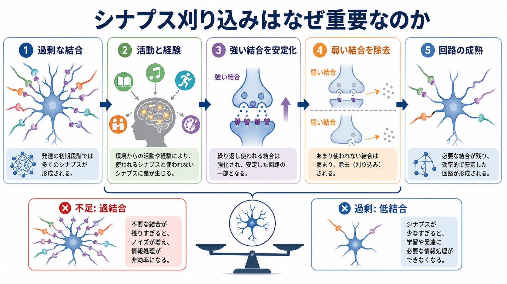
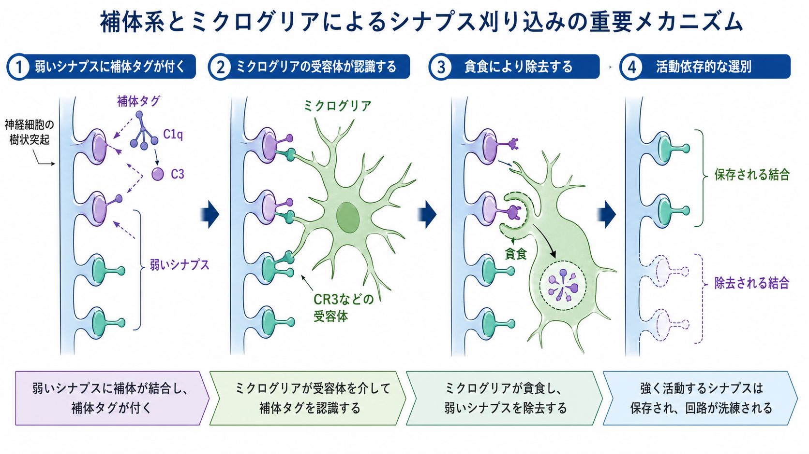
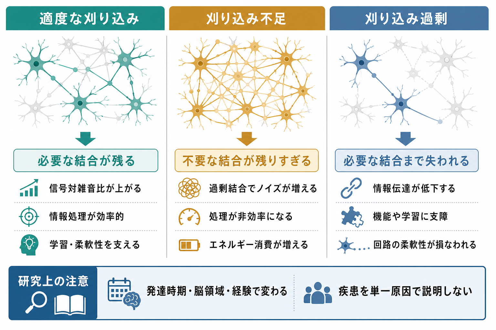

---
title: "シナプス刈り込みはなぜ重要なのか"
description: "発達期に過剰につくられたシナプスが、活動・経験・グリア細胞などの働きによって選別され、神経回路が効率よく成熟する過程を説明する。"
aliases:
  - "シナプス刈り込み"
  - "synaptic pruning"
  - "シナプス除去"
tags:
  - neuroscience
  - basic-neuroscience
  - obsidian
  - 脳・神経科学/基礎神経科学
created: "2026-04-27"
updated: "2026-04-27"
draft: true
publish: false
status: draft
enableToc: true
---

# シナプス刈り込みはなぜ重要なのか

## 要点

- シナプス刈り込みとは、発達期に過剰につくられた[[シナプスとは何か|シナプス]]の一部を除去し、よく使われる結合を相対的に残すことで、神経回路を粗い配線から精密な配線へ変えていく過程である。
- これは単なる「削減」ではなく、経験・活動・発達時期に応じて回路の信号対雑音比を上げる選別である。ヒト大脳皮質ではシナプス形成と減少の時間経過が領域ごとに異なり、前頭前野では成熟が長く続くことが示されている[1][2]。
- 分子機構としては、弱い入力に補体関連分子が関わり、[[ミクログリアは脳の免疫細胞として何をしているのか|ミクログリア]]が一部のシナプス要素を取り込む経路がよく研究されている[4][5][6]。
- 刈り込み不足も過剰な刈り込みも、神経発達・精神疾患研究で重要な仮説になる。ただし、個別の疾患を「刈り込みだけ」で説明するのは単純化しすぎである[7][8]。

## この記事で答える問い

1. なぜ発達中の脳は、最初から必要な結合だけを作らないのか。
2. シナプス刈り込みは、経験依存的な回路成熟とどう関係するのか。
3. ミクログリアや補体系は、どのように不要な結合の整理に関わるのか。
4. 刈り込みの過不足は、臨床・研究でどのように議論されているのか。

## まず結論

シナプス刈り込みが重要なのは、発達期の脳が「作ってから選ぶ」方式で回路を成熟させるからである。はじめに多めの結合を作ることで、環境や経験に応じた多様な可能性を残し、その後、活動パターンに合わない結合を弱めたり除いたりする。この過程によって、[[ニューロンとは何か|ニューロン]]同士の結合は、量の多さだけでなく、情報処理に役立つ配置へ近づく。

この意味で、シナプス刈り込みは脳の「節約」ではなく「選別」である。[[Hebb則とは何か|一緒に活動する結合が強まりやすい]]という考え方、[[長期増強LTPとは何か|長期増強]]、[[長期抑圧LTDとは何か|長期抑圧]]などのシナプス可塑性と合わせて見ると、刈り込みは発達中の回路が経験から形を変えるための大きな枠組みに位置づけられる[3]。

## 背景

発達期の神経回路は、最初から完成品として配線されるわけではない。神経細胞は軸索を伸ばし、樹状突起やスパインに多くの接点を作る。その後、活動パターン、感覚入力、発達時期、細胞間シグナルに応じて、一部の結合が安定化し、一部の結合が弱まり、消えていく。

古典的なヒト大脳皮質研究では、シナプス密度が小児期に高くなり、その後、成人水準へ下がっていくことが示された。ただし時間経過は一様ではなく、感覚野と連合野では成熟の速さが異なる[1]。さらに前頭前野の樹状突起スパイン密度は、思春期だけでなく若年成人期まで再編成が続く可能性が報告されている[2]。この長い成熟期間は、柔軟な学習と社会的・認知的発達を支える一方で、発達過程の乱れが影響しうる時間窓が長いことも意味する。

## 基本概念

### シナプス刈り込み

シナプス刈り込みとは、発達中に過剰につくられたシナプスや樹状突起スパインの一部が取り除かれ、回路の結合パターンが洗練される過程である。英語では synaptic pruning と呼ばれる。剪定という比喩が使われるが、実際には「不要な枝を人為的に切る」というより、細胞活動・分子標識・グリア細胞・局所環境が組み合わさった選別過程である。

### 経験依存的な回路成熟

経験依存的な回路成熟とは、感覚入力、運動、社会経験、学習などによって、神経回路の結合の強さや残りやすさが変わることである。よく活動する入力は安定化しやすく、活動が弱い、同期しない、役割が小さい入力は弱まりやすい。この過程は[[シナプス可塑性とは何か|シナプス可塑性]]と重なり、発達期の可塑性を理解する入口になる。

### 刈り込みは「少ないほどよい」ではない

重要なのは、シナプス数が多いほど賢い、少ないほど効率的、という単純な関係ではないことである。過剰な結合が残りすぎると信号の選択性が下がりうるが、必要な結合まで失われると情報処理の土台が損なわれうる。発達時期、脳領域、細胞種、経験の種類によって、適切な刈り込みの程度は異なる。

## 仕組み

シナプス刈り込みには複数の機構が関わる。すべてを一つの経路で説明することはできないが、代表的に研究されているのが「活動依存的な選別」と「補体系・ミクログリアによる除去」である。

### 1. 活動パターンが結合の運命に影響する

神経回路では、入力が同じ標的細胞に同時期・同じ文脈で活動するほど、結合が安定化しやすい。一方、標的の活動と結びつかない入力は、相対的に弱い結合として扱われやすい。この考え方は、発達期の選択的安定化の理論と関係し、経験が回路を形作るという見方を支える[3]。

ただし、活動が強ければ常に残るわけではない。抑制性回路、神経修飾物質、細胞接着分子、局所の炎症性シグナル、[[グリア細胞は単なる支持細胞なのか|グリア細胞]]の状態なども関わる。刈り込みは単なる使用頻度ランキングではなく、多層の発達プログラムである。

### 2. 補体系が「除去されやすさ」に関わる

補体系はもともと免疫系の仕組みとして知られるが、発達中の中枢神経系ではシナプス除去にも関わる。代表的な研究では、C1q や C3 といった補体関連分子が発達期のシナプスに局在し、これらを欠くマウスでは視床外側膝状体への網膜入力の整理が不十分になることが示された[4]。この知見は、「免疫分子が脳内で非免疫的な発達機能をもつ」という考えを強くした。

### 3. ミクログリアがシナプス要素を取り込む

ミクログリアは脳内の免疫系細胞として知られるが、発達中の健常な脳でも、シナプス要素を監視し、一部を取り込む。視覚系の研究では、ミクログリアが発達期の網膜視床入力を取り込み、その取り込みが神経活動と補体受容体 CR3/C3 経路に依存することが示された[5]。また、CX3CR1 を介したニューロンとミクログリアの相互作用も、正常な発達期のシナプス刈り込みに関わることが報告されている[6]。

この図で大事なのは、ミクログリアが無差別にシナプスを食べるわけではない点である。活動、補体、細胞間シグナル、発達時期が合わさって、「残る結合」と「取り除かれやすい結合」の確率が変わる。したがって、ミクログリアは発達中の回路を壊す存在ではなく、適切な条件では回路成熟に必要な調整役として働く。

## 図解

図1は、発達期の過剰な結合が経験と活動によって選別され、回路成熟へ向かう全体像である。発達中の脳は、多めに候補を作り、その後に活動と環境に合った結合を残す。これは、あらかじめ最終形を完全に指定するよりも、変化する環境に適応しやすい。

図2は、補体系とミクログリアが関わる代表的なメカニズムをまとめたものである。C1q、C3、CR3 などの経路は、特に発達期の視覚系で強く研究されてきた[4][5]。ただし、脳の全領域・全時期で同じ機構が同じ強さで働くと考えるべきではない。

図3は、刈り込みの程度を比較した図である。適度な刈り込みは選択性を上げるが、不足すれば過剰結合、過剰なら必要な結合の喪失につながりうる。臨床研究ではこのバランスが重要な仮説になる。

## 臨床・研究との接続

シナプス刈り込みは、神経発達症や精神疾患の研究でよく登場する。たとえば統合失調症研究では、補体成分 C4 の構造多型と C4A 発現、シナプス除去との関係が報告され、過剰な補体関連刈り込みがリスク機構の一部である可能性が議論されている[7]。これは、統合失調症を補体系だけで説明するという意味ではなく、遺伝学・発達神経科学・免疫分子が接続する一つの有力な研究軸である。

自閉スペクトラム症の研究でも、シナプス刈り込み不足や樹状突起スパイン密度の変化が議論されている。死後脳研究とモデル動物研究を組み合わせた研究では、ASD の側頭葉でスパイン密度増加と発達期のスパイン刈り込み低下が報告され、mTOR 依存的なオートファジーの関与が示された[8]。ただし、ASD は非常に多様な状態であり、この機構をすべての人に一般化することはできない。

医療・精神医学に関わる内容としては、ここでの説明は教育・研究目的である。個人の症状や診断、治療方針を、シナプス刈り込みの過不足から直接判断することはできない。

## よくある誤解

### 誤解1: シナプス刈り込みは脳が劣化すること

刈り込みは単なる喪失ではない。発達期の過剰な結合を整理し、情報処理に合った回路へ近づける成熟過程である。むしろ、不要な結合が残りすぎることも、回路の効率や選択性を下げる可能性がある。

### 誤解2: 使わないシナプスはすべて消える

「使わないものは消える」という表現は直感的だが、実際には粗い。結合の運命は活動頻度だけでなく、活動の同期、発達段階、細胞種、局所環境、補体・グリア細胞の状態などによって変わる。

### 誤解3: ミクログリアはシナプスを壊すだけの細胞

ミクログリアは病的炎症の文脈だけでなく、発達中の健康な脳でも回路形成に関わる。シナプス要素の取り込みは、条件によっては正常な回路成熟の一部である[5][6]。

### 誤解4: 統合失調症や自閉スペクトラム症は刈り込みだけで説明できる

刈り込み仮説は重要だが、単独原因ではない。遺伝、環境、発達時期、興奮性・抑制性バランス、神経修飾、免疫系、代謝など、多くの要因が関わる。刈り込みは、その中の一つの切り口として扱うのが適切である。

## 関連ノート

- [[シナプスとは何か]]
- [[シナプス可塑性とは何か]]
- [[Hebb則とは何か]]
- [[長期増強LTPとは何か]]
- [[長期抑圧LTDとは何か]]
- [[ミクログリアは脳の免疫細胞として何をしているのか]]
- [[グリア細胞は単なる支持細胞なのか]]
- [[ニューロンとは何か]]

## MOC更新候補

- `content/00_MOC/` 配下の脳・神経科学または基礎神経科学 MOC に、本記事 `[[シナプス刈り込みはなぜ重要なのか]]` を追加する候補。
- 並列記事生成との衝突を避けるため、このジョブでは MOC 本体は更新しない。

## 理解チェック

1. シナプス刈り込みが「削減」ではなく「選別」と呼べる理由は何か。
2. 発達期に過剰な結合を作ってから整理することには、どのような利点があるか。
3. 補体系とミクログリアは、シナプス刈り込みのどの段階に関わると考えられているか。
4. 刈り込み不足・刈り込み過剰を、疾患の単一原因として扱ってはいけない理由は何か。

## 限界と未解決問題

- ヒトの発達中の脳で、細胞レベルの刈り込みを長期的に直接観察することは難しい。多くの知見は死後脳研究、画像研究、動物モデル、遺伝学を組み合わせて推定されている。
- 補体・ミクログリア経路は強力なモデルだが、すべての脳領域、発達段階、シナプス型に同じように当てはまるとは限らない。
- 精神疾患との関連は重要だが、個人差が大きく、刈り込み仮説を臨床判断へ直接変換する段階にはない。
- 今後は、細胞種別・発達時期別・領域別に、どのシナプスがどの機構で保存または除去されるのかをより精密に調べる必要がある。

## 参考文献

[1] Huttenlocher, P. R., & Dabholkar, A. S. (1997). Regional differences in synaptogenesis in human cerebral cortex. *Journal of Comparative Neurology*, 387(2), 167-178. https://doi.org/10.1002/(sici)1096-9861(19971020)387:2%3C167::aid-cne1%3E3.0.co;2-z

[2] Petanjek, Z., Judas, M., Simic, G., Rasin, M. R., Uylings, H. B. M., Rakic, P., & Kostovic, I. (2011). Extraordinary neoteny of synaptic spines in the human prefrontal cortex. *Proceedings of the National Academy of Sciences*, 108(32), 13281-13286. https://doi.org/10.1073/pnas.1105108108

[3] Changeux, J.-P., & Danchin, A. (1976). Selective stabilisation of developing synapses as a mechanism for the specification of neuronal networks. *Nature*, 264, 705-712. https://doi.org/10.1038/264705a0

[4] Stevens, B., Allen, N. J., Vazquez, L. E., Howell, G. R., Christopherson, K. S., Nouri, N., Micheva, K. D., Mehalow, A. K., Huberman, A. D., Stafford, B., Sher, A., Litke, A. M., Lambris, J. D., Smith, S. J., John, S. W. M., & Barres, B. A. (2007). The classical complement cascade mediates CNS synapse elimination. *Cell*, 131(6), 1164-1178. https://doi.org/10.1016/j.cell.2007.10.036

[5] Schafer, D. P., Lehrman, E. K., Kautzman, A. G., Koyama, R., Mardinly, A. R., Yamasaki, R., Ransohoff, R. M., Greenberg, M. E., Barres, B. A., & Stevens, B. (2012). Microglia sculpt postnatal neural circuits in an activity and complement-dependent manner. *Neuron*, 74(4), 691-705. https://doi.org/10.1016/j.neuron.2012.03.026

[6] Paolicelli, R. C., Bolasco, G., Pagani, F., Maggi, L., Scianni, M., Panzanelli, P., Giustetto, M., Ferreira, T. A., Guiducci, E., Dumas, L., Ragozzino, D., & Gross, C. T. (2011). Synaptic pruning by microglia is necessary for normal brain development. *Science*, 333(6048), 1456-1458. https://doi.org/10.1126/science.1202529

[7] Sekar, A., Bialas, A. R., de Rivera, H., Davis, A., Hammond, T. R., Kamitaki, N., Tooley, K., Presumey, J., Baum, M., Van Doren, V., Genovese, G., Rose, S. A., Handsaker, R. E., Schizophrenia Working Group of the Psychiatric Genomics Consortium, Daly, M. J., Carroll, M. C., Stevens, B., & McCarroll, S. A. (2016). Schizophrenia risk from complex variation of complement component 4. *Nature*, 530, 177-183. https://doi.org/10.1038/nature16549

[8] Tang, G., Gudsnuk, K., Kuo, S.-H., Cotrina, M. L., Rosoklija, G., Sosunov, A., Sonders, M. S., Kanter, E., Castagna, C., Yamamoto, A., Yue, Z., Arancio, O., Peterson, B. S., Champagne, F., Dwork, A. J., Goldman, J., & Sulzer, D. (2014). Loss of mTOR-dependent macroautophagy causes autistic-like synaptic pruning deficits. *Neuron*, 83(5), 1131-1143. https://doi.org/10.1016/j.neuron.2014.07.040
