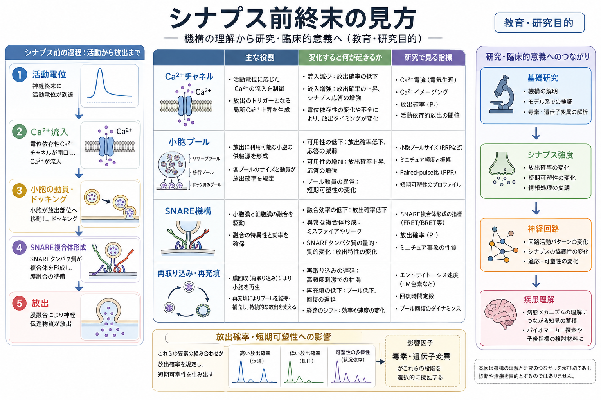
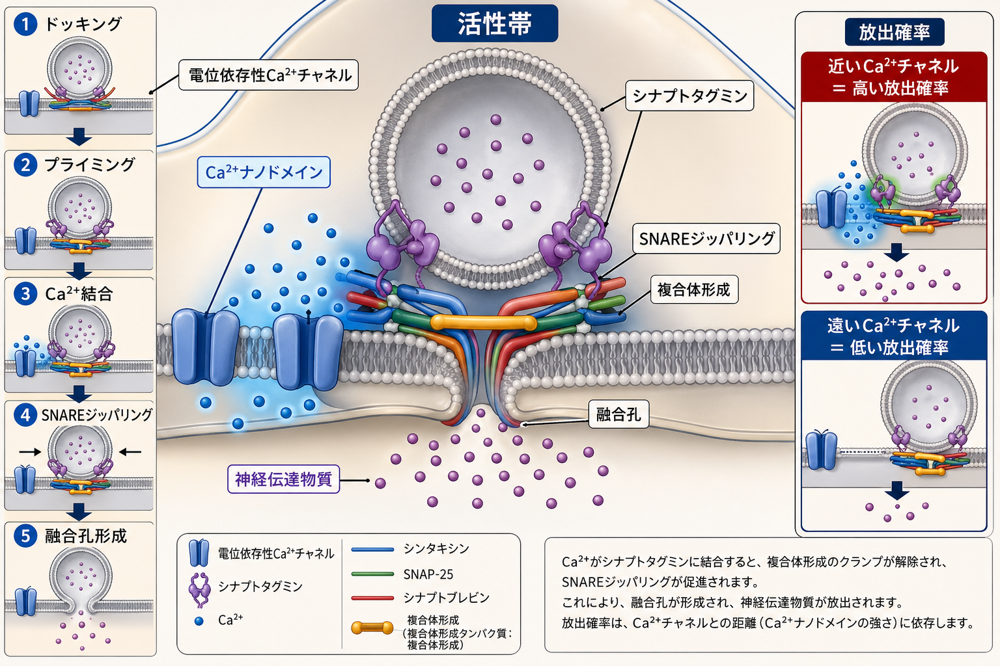
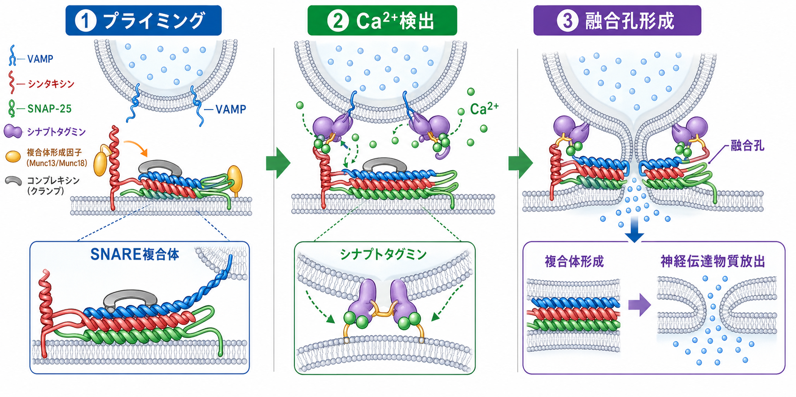

---
title: "シナプス前終末では何が起きているのか"
description: "活動電位がシナプス前終末に到達してから、Ca2+流入、シナプス小胞のドッキング・プライミング、SNARE依存的な膜融合、神経伝達物質放出に至る流れを整理する。"
aliases:
  - "シナプス前終末"
  - "神経伝達物質放出"
  - "シナプス小胞融合"
tags:
  - neuroscience
  - basic-neuroscience
  - obsidian
created: "2026-04-27"
updated: "2026-04-27"
draft: true
publish: false
status: draft
enableToc: true
---

# シナプス前終末では何が起きているのか

## 要点

- シナプス前終末は、[[軸索はどのように情報を遠くへ伝えるのか|軸索]]を伝わってきた[[活動電位はどのように発生するのか|活動電位]]を、化学的な神経伝達物質放出へ変換する場所である。
- 活動電位による脱分極で電位依存性Ca2+チャネルが開き、局所的なCa2+濃度上昇がシナプス小胞融合の直接の引き金になる[1][2]。
- すぐ放出できる小胞は、活性帯でドッキングとプライミングを受け、SNARE複合体・Munc13/Munc18・RIM・complexin・synaptotagminなどの分子機械に支えられている[2][3][4]。
- 放出は「終末内の小胞が全部出る」現象ではなく、即時放出可能プールと放出確率に制約された確率的な過程である[5]。
- ここでの説明は教育・研究目的の基礎知識であり、個別の疾患診断や治療判断を直接導くものではない。

## この記事で答える問い

この記事では、次の問いに答える。

1. 活動電位がシナプス前終末に来ると、何が最初に変わるのか。
2. Ca2+流入は、どのように小胞融合へ変換されるのか。
3. シナプス前終末の性質は、なぜシナプス強度や短期可塑性を左右するのか。

## まず結論

シナプス前終末で起きていることは、短くいえば「電気信号を、タイミングのそろった分泌イベントに変換すること」である。活動電位が終末膜を脱分極させると、活性帯に集まった電位依存性Ca2+チャネルが開く。流入したCa2+は終末全体に均一に広がる前に、チャネル近傍のナノドメインで高濃度になり、近くに待機しているシナプス小胞上のsynaptotagminに結合する[2][6]。

Ca2+を受け取ったsynaptotagminは、SNARE複合体やcomplexinと協調し、すでに準備されていた小胞膜とシナプス前膜の融合を進める。融合孔が開くと、小胞内の神経伝達物質がシナプス間隙へ放出され、受け手側の細胞に作用する[2][3][4]。

## 背景

[[ニューロンとは何か|ニューロン]]は電気的な信号だけで情報を伝えているわけではない。軸索上では活動電位が伝わるが、多くのシナプスでは細胞間の隙間を直接電流が流れるのではなく、神経伝達物質という化学信号が使われる。この変換点がシナプス前終末である。

歴史的には、神経伝達物質放出にCa2+が必要であることが、イカ巨大シナプスなどを用いた古典的研究から明らかにされた[6]。現在では、Ca2+流入だけでなく、Ca2+チャネルの配置、活性帯タンパク質、小胞プール、SNARE機構が、ミリ秒単位の精密な放出を可能にしていると理解されている[1][2]。

## 基本概念

### シナプス前終末

シナプス前終末は、軸索末端にある膨らみで、シナプス小胞、ミトコンドリア、電位依存性Ca2+チャネル、活性帯タンパク質を含む。[[軸索小丘はなぜ発火の起点になるのか|軸索小丘]]で始まった発火は軸索を進み、終末膜を脱分極させる。

### 活性帯

活性帯は、シナプス小胞が膜融合するために特化したシナプス前膜の領域である。ここにはCa2+チャネルと放出準備済み小胞が近接して配置される。RIMなどの活性帯タンパク質は、小胞のドッキング・プライミングとCa2+チャネル配置を結びつけるため、活動電位から放出までの遅れを短くする[2]。

### シナプス小胞と小胞プール

シナプス小胞は、神経伝達物質を包んだ小さな膜小器官である。ただし終末内の小胞がすべて同じように放出されるわけではない。すぐ放出できる小胞は即時放出可能プールに属し、その大きさと各小胞の放出確率がシナプス強度を決める主要因になる[5]。

### SNARE複合体とCa2+センサー

小胞膜側のsynaptobrevin/VAMP、細胞膜側のsyntaxin、SNAP-25はSNARE複合体を形成し、2枚の膜を近づける。synaptotagminは主要なCa2+センサーとして働き、Ca2+結合後にSNARE機構と協調して同期的な神経伝達物質放出を促す[3][4]。

## 仕組み

### 1. 活動電位が終末に到達する

活動電位は軸索を進み、シナプス前終末の膜電位を急速に脱分極させる。ここで重要なのは、活動電位そのものが小胞を押し出すのではなく、膜電位変化を通じて[[イオンチャネルとは何か|イオンチャネル]]を開く点である。

### 2. 電位依存性Ca2+チャネルが開く

脱分極により、活性帯に配置された電位依存性Ca2+チャネルが開く。細胞外Ca2+濃度は細胞内より高いため、Ca2+は終末内へ流入する。このCa2+流入が神経伝達物質放出の最も近い引き金である[1][2]。

### 3. Ca2+ナノドメインができる

Ca2+は終末全体でゆっくり均一化する前に、チャネルのすぐ近くで局所的に高濃度となる。これをCa2+ナノドメインまたはマイクロドメインとして考えると、なぜCa2+チャネルと小胞の距離が放出確率を左右するのか理解しやすい[6]。チャネルに近い小胞ほど、短時間に高濃度Ca2+を受け取りやすい。

### 4. ドッキングとプライミング済み小胞が反応する

小胞は活性帯に近づくだけでは十分ではない。膜に接した状態になるドッキングと、融合可能な分子状態になるプライミングを経て、即時放出可能プールに入る。Munc13、Munc18、RIMなどは、この準備状態を作る上で重要である[2][5]。

### 5. synaptotagminがCa2+を検出し、SNAREが融合を進める

Ca2+がsynaptotagminに結合すると、SNARE複合体のジッパリングが進み、complexinによるクランプ状態が解除・再配置されると考えられている。最終的に小胞膜とシナプス前膜が融合し、融合孔が開く[3][4]。

### 6. 神経伝達物質が放出され、受け手側に作用する

融合孔を通って神経伝達物質がシナプス間隙へ出る。放出された分子は受け手側の受容体に結合し、[[樹状突起はどのように情報を受け取るのか|樹状突起]]や細胞体側の電気的・化学的応答につながる。放出後の小胞膜成分は、エンドサイトーシスや再充填過程を経て再利用される[1]。

## 図解

上の図は、活動電位からCa2+流入、SNARE依存的融合までの近接した機構を示している。下の図は、同じシナプス前終末を「研究でどこを見るか」という観点から整理したものである。Ca2+チャネル、小胞プール、SNARE機構、再取り込み・再充填は、それぞれシナプス強度や短期可塑性の異なる側面を変える。

## 臨床・研究との接続

シナプス前終末は、基礎神経科学だけでなく、薬理学・毒素研究・神経疾患研究でも重要な対象である。たとえばボツリヌス毒素や破傷風毒素はSNAREタンパク質を切断し、小胞融合を阻害することで神経伝達物質放出を強く抑える[7]。この性質は、シナプス小胞融合機構を理解するための研究手段にもなってきた。

また、即時放出可能プールの大きさ、放出確率、Ca2+チャネルとの距離は、短期促通や短期抑圧といった短期可塑性に関わる[5]。これは、同じ活動電位列でも、シナプスごとに伝達の強さや疲れやすさが異なる理由の一部である。[[アストロサイトはシナプスと代謝をどう支えているのか|アストロサイト]]など周辺細胞の働きも含めると、シナプスは単なる一方向の放出装置ではなく、局所環境に支えられた動的な情報処理単位として見えてくる。

## よくある誤解

### 誤解1: 活動電位が小胞を直接破裂させる

活動電位は小胞を直接破裂させるのではない。活動電位が終末膜を脱分極させ、Ca2+チャネルを開き、Ca2+流入が分子機械を作動させる。

### 誤解2: 終末内の小胞は毎回すべて放出される

実際には、すぐ放出できる小胞は一部であり、さらに各小胞の放出は確率的である。即時放出可能プールの大きさと放出確率が、応答の大きさを左右する[5]。

### 誤解3: Ca2+は終末全体の平均濃度だけ見ればよい

同期的な速い放出では、Ca2+チャネル近傍の局所濃度が重要である。チャネルと小胞の距離が変わるだけでも、放出のタイミングや確率が変わりうる[2][6]。

### 誤解4: SNAREは単独で放出タイミングを決める

SNAREは膜融合の中核だが、Ca2+センサーであるsynaptotagmin、complexin、Munc13/Munc18、RIMなどの協調があって、ミリ秒単位の制御が成立する[2][3][4]。

## 関連ノート

- [[ニューロンとは何か]]
- [[軸索はどのように情報を遠くへ伝えるのか]]
- [[活動電位はどのように発生するのか]]
- [[イオンチャネルとは何か]]
- [[樹状突起はどのように情報を受け取るのか]]
- [[アストロサイトはシナプスと代謝をどう支えているのか]]

今後の作成候補:

- シナプスとは何か
- シナプス小胞サイクルとは何か
- 神経伝達物質放出とは何か
- シナプス後電位とは何か
- 短期シナプス可塑性とは何か

MOC更新候補:

- `content/00_MOC/` 配下の基礎神経科学系MOCに、本記事へのリンクを追加する。
- シナプス、活動電位、イオンチャネル、小胞輸送をつなぐ導線を整理する。

## 理解チェック

1. 活動電位がシナプス前終末に到達した直後、どのイオンチャネルが開くか。
2. Ca2+チャネルとシナプス小胞が近いことは、放出確率にどう影響するか。
3. ドッキングとプライミングは、単なる小胞の位置取りとどう違うか。
4. SNARE、synaptotagmin、complexinを、それぞれ一言で説明するとどうなるか。
5. 即時放出可能プールが小さいシナプスでは、高頻度刺激に対してどのような変化が起こりやすいか。

## 参考文献

[1] Südhof, T. C. (2004). The synaptic vesicle cycle. *Annual Review of Neuroscience*, 27, 509-547. https://doi.org/10.1146/annurev.neuro.26.041002.131412

[2] Südhof, T. C. (2013). Neurotransmitter release: The last millisecond in the life of a synaptic vesicle. *Neuron*, 80(3), 675-690. https://doi.org/10.1016/j.neuron.2013.10.022

[3] Rizo, J., & Xu, J. (2015). The synaptic vesicle release machinery. *Annual Review of Biophysics*, 44, 339-367. https://doi.org/10.1146/annurev-biophys-060414-034057

[4] Zhou, Q., Lai, Y., Bacaj, T., Zhao, M., Lyubimov, A. Y., Uervirojnangkoorn, M., et al. (2015). Architecture of the synaptotagmin-SNARE machinery for neuronal exocytosis. *Nature*, 525, 62-67. https://doi.org/10.1038/nature14975

[5] Kaeser, P. S., & Regehr, W. G. (2017). The readily releasable pool of synaptic vesicles. *Current Opinion in Neurobiology*, 43, 63-70. https://doi.org/10.1016/j.conb.2016.12.012

[6] Zhang, W., Jiang, H.-H., & Luo, F. (2022). Diverse organization of voltage-gated calcium channels at presynaptic active zones. *Frontiers in Synaptic Neuroscience*, 14, 1023256. https://doi.org/10.3389/fnsyn.2022.1023256

[7] Montecucco, C., & Schiavo, G. (1994). Clostridial neurotoxins: New tools for dissecting exocytosis. *Trends in Cell Biology*, 4(5), 179-185. https://doi.org/10.1016/0962-8924(94)90203-8

## 未解決問題

- 同じ「活性帯」でも、脳領域・細胞種・発達段階ごとにCa2+チャネル配置と小胞プールがどの程度異なるのか。
- 同期放出、非同期放出、自発放出を同じ分子機械の変形としてどこまで統一的に説明できるのか。
- シナプス前終末の分子配置の変化が、学習・疾患・薬物応答にどの時間スケールで反映されるのか。

