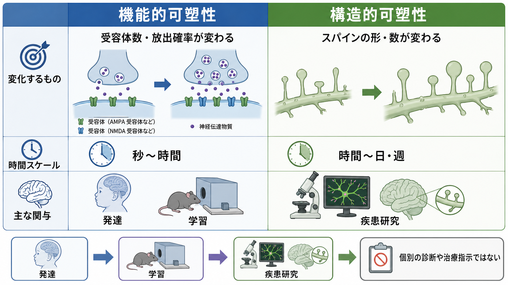
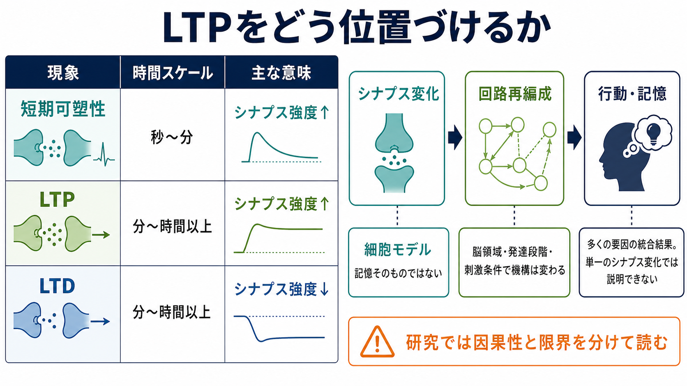

---
title: "シナプス可塑性とは何か"
description: "経験によってシナプス効率が変化する仕組みを、学習記憶の基礎として説明する。"
aliases:
  - "シナプス可塑性"
  - "synaptic plasticity"
  - "LTP"
  - "LTD"
tags:
  - neuroscience
  - basic-neuroscience
  - synapse
  - learning-memory
  - obsidian
created: "2026-04-27"
updated: "2026-04-27"
draft: true
publish: false
status: draft
enableToc: true
---

# シナプス可塑性とは何か

## 要点

- シナプス可塑性とは、活動履歴や経験に応じて[[シナプスとは何か|シナプス]]の伝達効率が変わる性質である。
- 代表例は、伝達が長く強まる長期増強（long-term potentiation; LTP）と、長く弱まる長期抑圧（long-term depression; LTD）である。
- 興奮性シナプスでは、[[グルタミン酸は脳で何をしているのか|グルタミン酸]]受容体、カルシウム流入、AMPA受容体の挿入・除去、スパイン形態変化などが重要な機構になる。
- シナプス可塑性は学習・記憶の候補メカニズムだが、「LTP = 記憶そのもの」と単純に同一視するのは不正確である。

## この記事で答える問い

この記事では、シナプス可塑性を「経験によって神経回路が変わる」ことの細胞レベルの説明として扱う。具体的には、何が変わるのか、LTPとLTDは何を意味するのか、なぜ学習記憶と関係づけられるのか、そしてどこまでを研究事実として言えるのかを整理する。

## まず結論

シナプス可塑性は、[[神経伝達物質はどのように放出されるのか|神経伝達物質の放出]]、[[受容体にはどのような種類があるのか|受容体]]の数や性質、[[シナプス後電位とは何か|シナプス後電位]]の大きさ、樹状突起スパインの形や数などが、過去の活動に応じて変化する現象である。経験が神経活動のパターンを変え、その活動パターンがシナプス伝達を変え、結果として神経回路の反応しやすさが変わる。この連鎖が、学習や記憶を細胞レベルで説明する中心的な枠組みになっている[1][2]。

ただし、脳内の可塑性は一種類ではない。短期可塑性、LTP、LTD、恒常性可塑性、構造可塑性などがあり、分子機構も脳部位・発達段階・シナプス種によって異なる[2][3]。したがって、シナプス可塑性は「経験が回路に残す変化の総称」として理解するのがよい。

## 背景

神経系は、単に信号を通す配線ではない。感覚経験、運動練習、報酬、ストレス、薬物、発達環境などは、特定の神経回路の活動パターンを変える。その変化が一時的な発火の違いで終わらず、シナプス伝達の効率や構造に残ると、同じ入力に対する次回の反応が変わる[1]。

LTPが学習記憶研究で重要視されてきたのは、海馬で観察される長期的なシナプス増強が、記憶形成に求められる性質とよく対応するからである。すなわち、入力特異性、連合性、持続性を備え、NMDA受容体を介したヘッブ型の特徴を示す[4]。1970年代の海馬歯状回での長期増強の発見は、この分野の実験的出発点になった[5]。

## 基本概念

### シナプス効率とは何か

シナプス効率とは、あるシナプス前ニューロンの活動が、シナプス後ニューロンにどれだけ影響を与えるかである。効率が上がるとは、同じ入力でより大きなシナプス後応答が出ることを意味する。効率が下がるとは、同じ入力でも応答が小さくなることを意味する。

効率の変化は、シナプス前終末での放出確率の変化、シナプス小胞の利用可能性、シナプス後膜の受容体数、受容体のリン酸化状態、スパインの電気的・形態的性質など、複数の場所で起こりうる[2][6]。

### LTPとLTD

LTPは、特定の活動パターンの後にシナプス応答が長時間増大する現象である。LTDは、その逆にシナプス応答が長時間低下する現象である。どちらも単一のメカニズムではなく、脳部位やシナプスの種類によって誘導条件・発現部位・分子機構が異なる[3]。

直感的には、LTPは「よく一緒に活動した入力を通りやすくする」方向の変化、LTDは「相対的に不要な入力や過剰な結合を弱める」方向の変化として理解できる。ただし、実際の回路では強化と弱化が組み合わさり、記憶の選択性、弁別、忘却、再編成を支えている。

## 仕組み

### NMDA受容体依存性LTPの流れ

海馬CA1などでよく研究される興奮性シナプスでは、LTPの典型的な流れは次のように説明される。まず、シナプス前終末からグルタミン酸が放出され、シナプス後膜のAMPA受容体とNMDA受容体に作用する。弱い入力ではNMDA受容体チャネルがMg2+によって塞がれやすいが、強い同時活動によってシナプス後膜が十分に脱分極すると、このブロックが外れ、Ca2+が流入する[4][7]。

流入したCa2+は、CaMKIIなどのシグナル伝達を介してAMPA受容体の機能を変えたり、シナプス後膜へAMPA受容体を増やしたりする。結果として、同じグルタミン酸放出に対するシナプス後応答が大きくなる[6]。

### LTDと弱める可塑性

LTDでは、活動パターンやCa2+シグナルの時間経過が異なり、AMPA受容体の除去や受容体機能の低下が起こることがある[3][6]。これは単なる「悪い変化」ではない。神経回路が入力を選別し、過剰な結合を整理し、環境に合わせて感度を調整するためには、弱める可塑性も必要である。

### 構造可塑性

可塑性は、受容体数の変化だけではない。[[樹状突起はどのように情報を受け取るのか|樹状突起]]スパインの大きさ、形、安定性、形成と消失も経験に応じて変化する。長期のin vivoイメージング研究は、成人脳でも一部のスパインや軸索ボタンが動的に変化し、感覚経験や学習によって新しいスパインが安定化しうることを示している[8]。

## 図解

上の3つの図は、次の読み方を想定している。

1. 1枚目は、経験、シナプス効率、LTP/LTD、構造変化、学習記憶の関係を概念地図として見る。
2. 2枚目は、NMDA受容体依存性LTPを、強い同時活動、Ca2+流入、AMPA受容体増加という順に追う。
3. 3枚目は、受容体数や放出確率が変わる機能的可塑性と、スパイン形態やシナプス数が変わる構造的可塑性を区別する。

## 臨床・研究との接続

シナプス可塑性は、発達、学習、感覚経験、依存、精神疾患、神経変性疾患、リハビリテーション研究などで広く参照される枠組みである[1][8]。たとえば、経験依存的な回路再編成を考えるとき、単に「ニューロンが発火したか」だけでなく、「どの入力が強まり、どの入力が弱まり、どの結合が安定化したか」を問う必要がある。

一方で、臨床的な文脈では慎重さが必要である。シナプス可塑性の異常が疾患に関与する可能性は研究されているが、個人の症状を「シナプス可塑性が低いから」と直接診断したり、特定の学習法や治療法の効果を単純に断定したりすることはできない。ここでの記述は教育・研究目的の説明であり、個別の診断や治療指示ではない。

## よくある誤解

### 誤解1：LTPが起これば必ず記憶ができる

LTPは記憶研究の有力なモデルだが、記憶そのものではない。記憶は多数のシナプス、細胞集団、脳領域、時間スケールにまたがる現象であり、LTPはその一部を説明する細胞機構である[4]。

### 誤解2：強くなる可塑性だけが重要である

学習には、強める変化だけでなく、弱める変化も必要である。LTDや恒常性調整がなければ、回路は過剰に興奮したり、情報を弁別しにくくなったりする。

### 誤解3：可塑性は子どもの脳だけにある

発達期の可塑性は大きいが、成人脳にも機能的・構造的可塑性は残る。成人皮質でもスパインやシナプス構造の一部は経験依存的に変化しうる[8]。

### 誤解4：シナプス可塑性は意志の力で自由に操作できる

可塑性は活動依存的に起こるが、分子機構、睡眠、注意、報酬、ストレス、発達段階、疾患状態など多くの条件に左右される。単純な自己啓発語として使うと、神経科学的な意味が薄れてしまう。

## 関連ノート

- [[シナプスとは何か]]
- [[化学シナプスと電気シナプスは何が違うのか]]
- [[シナプス前終末では何が起きているのか]]
- [[シナプス後電位とは何か]]
- [[グルタミン酸は脳で何をしているのか]]
- [[受容体にはどのような種類があるのか]]
- [[樹状突起はどのように情報を受け取るのか]]
- [[アストロサイトはシナプスと代謝をどう支えているのか]]

## 理解チェック

1. シナプス可塑性で変わる「シナプス効率」とは、何に対する何の変化か。
2. LTPとLTDは、それぞれシナプス応答をどの方向に変える現象か。
3. NMDA受容体依存性LTPで、Ca2+流入が重要になる理由は何か。
4. AMPA受容体の挿入・除去は、シナプス後応答にどのような影響を与えるか。
5. 「LTP = 記憶そのもの」と言い切れない理由は何か。

## 関連ノート候補

- 長期増強（LTP）とは何か
- 長期抑圧（LTD）とは何か
- ヘッブ学習とは何か
- NMDA受容体とは何か
- AMPA受容体とは何か
- 樹状突起スパインとは何か

## MOC更新候補

- `content/00_MOC/` 配下の脳・神経科学または基礎神経科学MOCに、本記事 `[[シナプス可塑性とは何か]]` を追加する候補。
- 並列生成ジョブとの衝突を避けるため、今回はMOCファイル本体は更新しない。

## 未解決問題

- どの種類のシナプス可塑性が、どの記憶成分に必要十分なのかは、記憶課題・脳領域・時間スケールによって異なる。
- 実験室で誘導したLTP/LTDと、自然な学習中に起こる可塑性をどこまで同一視できるかには注意が必要である。
- 可塑性の分子異常と精神・神経疾患の症状を結びつけるには、細胞、回路、行動、臨床表現型をつなぐ多層的な研究が必要である。

## 参考文献

[1] Citri, A., & Malenka, R. C. (2008). Synaptic plasticity: multiple forms, functions, and mechanisms. *Neuropsychopharmacology*, 33, 18-41. https://doi.org/10.1038/sj.npp.1301559

[2] Malenka, R. C., & Bear, M. F. (2004). LTP and LTD: An embarrassment of riches. *Neuron*, 44(1), 5-21. https://doi.org/10.1016/j.neuron.2004.09.012

[3] Huganir, R. L., & Nicoll, R. A. (2013). AMPARs and synaptic plasticity: the last 25 years. *Neuron*, 80(3), 704-717. https://doi.org/10.1016/j.neuron.2013.10.025

[4] Bliss, T. V. P., & Collingridge, G. L. (1993). A synaptic model of memory: long-term potentiation in the hippocampus. *Nature*, 361, 31-39. https://doi.org/10.1038/361031a0

[5] Bliss, T. V. P., & Gardner-Medwin, A. R. (1973). Long-lasting potentiation of synaptic transmission in the dentate area of the unanaesthetized rabbit following stimulation of the perforant path. *The Journal of Physiology*, 232(2), 357-374. https://doi.org/10.1113/jphysiol.1973.sp010274

[6] Collingridge, G. L., Kehl, S. J., & McLennan, H. (1983). Excitatory amino acids in synaptic transmission in the Schaffer collateral-commissural pathway of the rat hippocampus. *The Journal of Physiology*, 334, 33-46. https://doi.org/10.1113/jphysiol.1983.sp014478

[7] Whitlock, J. R., Heynen, A. J., Shuler, M. G., & Bear, M. F. (2006). Learning induces long-term potentiation in the hippocampus. *Science*, 313(5790), 1093-1097. https://doi.org/10.1126/science.1128134

[8] Holtmaat, A., & Svoboda, K. (2009). Experience-dependent structural synaptic plasticity in the mammalian brain. *Nature Reviews Neuroscience*, 10, 647-658. https://doi.org/10.1038/nrn2699

## 更新ログ

- 2026-04-27: 初版作成。シナプス可塑性の概念、LTP/LTD、NMDA受容体依存性LTP、構造可塑性、臨床・研究との接続を整理。
