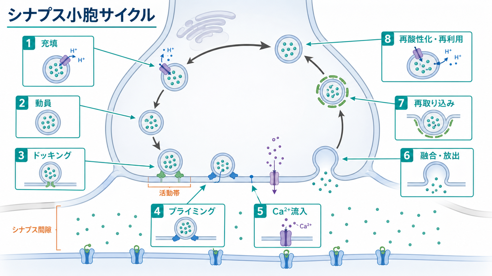
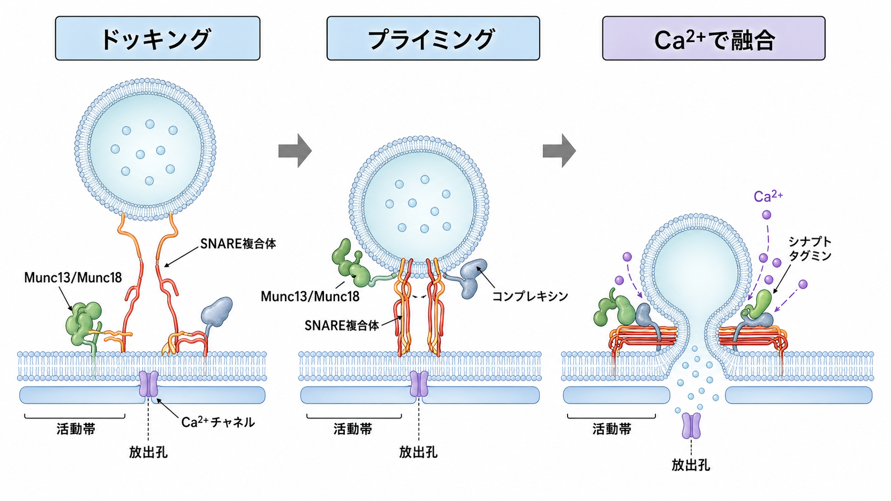
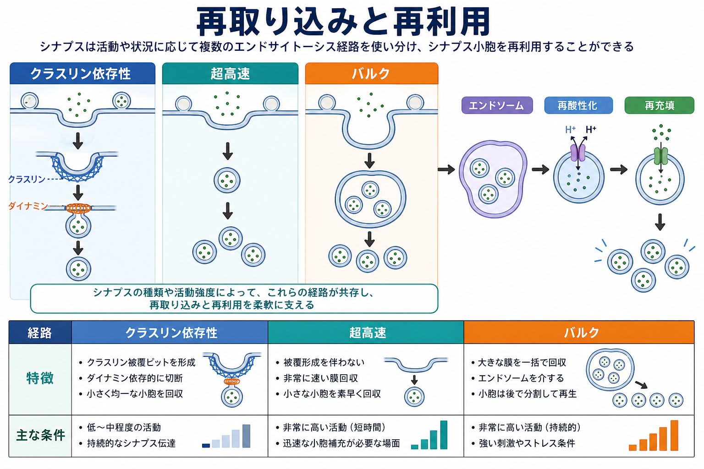

---
title: "シナプス小胞サイクルとは何か"
description: "神経伝達物質を入れたシナプス小胞が、充填、動員、ドッキング、プライミング、融合、再取り込み、再酸性化、再利用を繰り返す仕組みを整理する。"
aliases:
  - "シナプス小胞サイクル"
  - "小胞リサイクリング"
  - "シナプス小胞再利用"
tags:
  - neuroscience
  - basic-neuroscience
  - synapse
  - obsidian
created: "2026-04-27"
updated: "2026-04-27"
draft: true
publish: false
status: draft
enableToc: true
---

# シナプス小胞サイクルとは何か

## 要点

- シナプス小胞サイクルとは、前シナプス終末で神経伝達物質を入れた小胞が、放出に備え、膜融合し、膜とタンパク質を回収され、再び使える状態に戻る一連の循環である[1]。
- 中心にあるのは、活動電位で開いた電位依存性 Ca2+ チャネルから Ca2+ が流入し、ドッキング・プライミング済みの小胞が活動帯で融合する過程である[2][3]。
- 小胞は「一度放出されたら終わり」ではなく、クラスリン依存性エンドサイトーシス、超高速エンドサイトーシス、バルクエンドサイトーシスなどを通じて局所的に回収・再利用される[4][7]。
- 小胞の「数」と「準備状態」はシナプス強度、短期可塑性、疲労、発作や薬理標的の理解に直結する[5][8]。

## この記事で答える問い

この記事では、[[活動電位はどのように発生するのか]] や [[イオンチャネルとは何か]] で扱う電気信号が、どのようにして化学的なシナプス伝達へ変換されるのかを、シナプス小胞の循環から説明する。具体的には次の問いに答える。

1. 小胞はどのように神経伝達物質で満たされるのか。
2. 放出される小胞と待機している小胞は何が違うのか。
3. Ca2+ 流入は、どの段階を直接引き起こすのか。
4. 放出後の膜と小胞タンパク質はどのように回収されるのか。
5. このサイクルは疾患研究や薬理学とどうつながるのか。

## まず結論

シナプス小胞サイクルは、前シナプス終末にある小胞を「充填済みの放出単位」として維持し続ける仕組みである。小胞は、V型 H+ ATPase が作るプロトン勾配を利用して神経伝達物質を取り込み、活動帯へ動員され、SNARE 複合体や Munc13/Munc18 などの分子によって膜融合可能な状態に整えられる[1][2][6]。活動電位が到達して Ca2+ が局所的に上昇すると、シナプトタグミンを含む融合装置が作動し、伝達物質がシナプス間隙へ放出される[2][3]。

その後、小胞膜は前シナプス膜から回収される。古典的にはクラスリン依存性エンドサイトーシスが主要経路として研究されてきたが、シナプスの種類や活動強度によって、より速い膜回収やバルク回収も使われる[4][7]。つまり小胞サイクルは、単なる「袋の出し入れ」ではなく、ミリ秒から数十秒の時間スケールで、放出確率、補充速度、短期可塑性を調整する前シナプス側の制御系である[1][5]。

## 背景

化学シナプスでは、電気信号そのものが細胞間の隙間を渡るのではない。[[ニューロンとは何か]] で見るように、軸索を伝わった活動電位は前シナプス終末に到達し、そこで神経伝達物質の放出へ変換される。小胞サイクルは、この変換を毎回ほぼ同じ場所、同じ時間精度、同じ資源制約のもとで繰り返すための仕組みである[1]。

重要なのは、前シナプス終末の小胞が均一な集団ではないことである。すぐ放出できる小胞、刺激が続くと補充される小胞、より深い貯蔵プールに属する小胞などがあり、これらの分類はシナプスの種類や測定法によって呼び方が変わる[5]。したがって「小胞が何個あるか」だけではなく、「どの小胞がどの速度で活動帯に供給されるか」が、シナプス伝達の持続性を決める。

## 基本概念

### シナプス小胞

シナプス小胞は、神経伝達物質を濃縮して保持する小さな膜小胞である。小胞膜には、V型 H+ ATPase、神経伝達物質輸送体、SNARE 関連タンパク質、シナプトタグミン、SV2 など、多数のタンパク質が含まれる[1][6][8]。小胞は単なる容器ではなく、放出と回収のための分子部品を載せた再利用可能な単位として働く。

### 活動帯

活動帯は、前シナプス膜のうち小胞放出が起こりやすい特殊化領域である。ここでは Ca2+ チャネル、小胞のドッキング部位、足場タンパク質、融合装置が近接している。Ca2+ は細胞全体を均一に満たす信号というより、チャネル近傍で短時間・高濃度に生じる局所信号として小胞融合を引き起こす[2][3]。

### ドッキングとプライミング

ドッキングは、小胞が活動帯の膜に近接して配置される段階である。プライミングは、その小胞が Ca2+ 信号を受けたときにすばやく融合できるよう、SNARE 複合体などが機能的に整えられる段階である[2][3]。見た目には膜に近い小胞でも、分子レベルでプライミングされていなければ、すぐには放出されない。

## 仕組み

### 1. 充填: 小胞内へ神経伝達物質を入れる

小胞内腔は V型 H+ ATPase によって酸性化される。このプロトン電気化学勾配を利用して、VGLUT、VGAT/VIAAT、VMAT、VAChT などの小胞性輸送体が、それぞれグルタミン酸、GABA/グリシン、モノアミン、アセチルコリンなどを小胞内へ蓄積する[6]。したがって、放出される「量子」の大きさは、小胞の有無だけでなく、小胞の充填状態にも左右される。

### 2. 動員: 小胞プールから活動帯へ供給する

前シナプス終末内の小胞は、すぐ放出できるプール、リサイクリングプール、予備プールなどとして機能的に区別されることが多い[5]。刺激が弱いとすぐ放出できる小胞だけで足りるが、刺激が続くと補充が必要になる。小胞プールの考え方は、短期促通、短期抑圧、シナプス疲労を理解するうえで重要である。

### 3. ドッキングとプライミング: 融合可能な状態を作る

小胞が活動帯に近づくと、シナプトブレビン/VAMP、シンタキシン、SNAP-25 などの SNARE タンパク質が膜融合のための装置を形成する。Munc13、Munc18、コンプレキシンなどは、この装置を調整し、無秩序な融合を抑えつつ、Ca2+ が来たときにすばやく融合できる状態を作る[2][3]。

### 4. Ca2+ 依存的融合: 電気信号を化学信号へ変換する

活動電位が前シナプス終末へ到達すると、電位依存性 Ca2+ チャネルが開き、活動帯近傍の Ca2+ 濃度が急上昇する。シナプトタグミンは主要な Ca2+ センサーとして働き、準備済み小胞の膜融合を促進する[2][3]。この過程により、神経伝達物質がシナプス間隙へ放出され、後シナプス側の受容体に結合する。[[樹状突起はどのように情報を受け取るのか]] と接続して考えると、ここが前シナプス側の出力点である。

### 5. 再取り込み: 融合した膜を回収する

放出のたびに小胞膜が前シナプス膜へ加わるため、膜面積と小胞タンパク質を局所的に回収する必要がある。クラスリン依存性エンドサイトーシスは、アダプター、クラスリン、ダイナミンなどを使って小胞膜成分を回収する主要経路として整理されている[4]。一方、強い活動や特定のシナプス条件では、超高速エンドサイトーシスやバルクエンドサイトーシスも重要になる[7]。

### 6. 再酸性化と再充填: もう一度使える小胞へ戻す

回収された小胞は、膜タンパク質の組成を整え、V型 H+ ATPase によって再び酸性化され、神経伝達物質輸送体によって再充填される[1][6]。この段階が遅いと、形として小胞が戻っていても、放出可能な小胞としてはまだ不完全である。小胞サイクルを理解するときは、「膜が戻ったか」と「伝達物質が再充填されたか」を分けて考える必要がある。

## 図解

上の 3 枚の図は、同じサイクルを異なる解像度で示している。1枚目は充填から再利用までの全体地図、2枚目はドッキング・プライミング・融合の分子機構、3枚目は再取り込み経路の違いを整理したものである。図を読むときは、次の順序で見るとよい。

1. 全体の循環を、充填、準備、融合、回収、再利用に分ける。
2. 活動帯で起きるドッキングとプライミングを、単なる位置合わせではなく分子装置の準備として見る。
3. 放出後の回収経路を、ひとつの固定経路ではなく、活動強度やシナプス種に応じて使い分けられる複数経路として見る。

## 臨床・研究との接続

小胞サイクルは基礎神経科学の概念だが、臨床・薬理学とも接続している。代表例として、抗てんかん薬レベチラセタムの結合標的はシナプス小胞タンパク質 SV2A であることが示されている[8]。これは、発作制御をイオンチャネルや後シナプス受容体だけでなく、前シナプス小胞機能の調整として考える入口になる。

また、ボツリヌス毒素や破傷風毒素のように SNARE 関連過程を阻害する物質は、神経伝達物質放出を強く変える。さらに、短期シナプス可塑性、神経筋接合部の疲労、聴覚系の高速シナプス、発達期のシナプス成熟などを調べるときにも、小胞プールと回収速度の測定が中心的な指標になる[2][5]。

ただし、ここでの説明は教育・研究目的の基礎知識であり、個別の発作、神経筋症状、精神神経症状の診断や治療方針を示すものではない。臨床的な判断には、症状、検査、薬歴、併存疾患を含む専門的評価が必要である。

## よくある誤解

### 誤解1: 小胞は放出されたら消える

実際には、小胞膜と小胞タンパク質は局所的に回収され、再酸性化と再充填を経て再利用される[1][4]。小胞サイクルという名前は、この再利用性を強調している。

### 誤解2: Ca2+ が小胞を直接押し出す

Ca2+ は物理的に小胞を押し出すのではなく、シナプトタグミンや SNARE 関連装置を介して、すでに準備された小胞の膜融合確率を急激に上げる[2][3]。そのため、Ca2+ 流入だけでなく、事前のプライミング状態が重要である。

### 誤解3: エンドサイトーシス経路はひとつだけである

クラスリン依存性経路は重要だが、すべての状況をそれだけで説明できるわけではない。活動強度、温度、シナプス種、発達段階、測定法によって、超高速回収やバルク回収が目立つことがある[4][7]。

### 誤解4: 小胞数が多ければ必ず強いシナプスである

小胞数は重要だが、放出可能プールのサイズ、Ca2+ チャネルとの距離、プライミング状態、充填量、回収速度も効く[2][5][6]。シナプス強度は、単純な在庫量ではなく、サイクル全体の流量として理解する方がよい。

## 関連ノート

既存ノートへのリンク:

- [[ニューロンとは何か]]
- [[活動電位はどのように発生するのか]]
- [[イオンチャネルとは何か]]
- [[樹状突起はどのように情報を受け取るのか]]
- [[興奮性ニューロンと抑制性ニューロンは何が違うのか]]

今後の作成候補:

- シナプスとは何か
- 神経伝達物質とは何か
- SNARE複合体とは何か
- シナプトタグミンとは何か
- シナプス可塑性とは何か
- 小胞性神経伝達物質輸送体とは何か

MOC更新候補:

- `content/00_MOC/MOC｜脳・神経科学.md` の「基礎神経科学」または「シナプス・神経伝達」周辺に本記事へのリンクを追加する。

## 理解チェック

1. シナプス小胞の充填に、V型 H+ ATPase と小胞性輸送体がそれぞれどう関わるか説明できるか。
2. ドッキングとプライミングの違いを、位置と機能準備の違いとして説明できるか。
3. Ca2+ 流入が、なぜ活動帯近傍で特に重要なのか説明できるか。
4. クラスリン依存性、超高速、バルクの再取り込み経路が、どのような状況で使い分けられうるか説明できるか。
5. SV2A が抗てんかん薬研究とどう関係するか、過度に臨床一般化せず説明できるか。

## 参考文献

[1] Südhof, T. C. (2004). The synaptic vesicle cycle. *Annual Review of Neuroscience, 27*, 509-547. https://doi.org/10.1146/annurev.neuro.26.041002.131412

[2] Jahn, R., & Fasshauer, D. (2012). Molecular machines governing exocytosis of synaptic vesicles. *Nature, 490*, 201-207. https://doi.org/10.1038/nature11320

[3] Südhof, T. C., & Rizo, J. (2011). Synaptic vesicle exocytosis. *Cold Spring Harbor Perspectives in Biology, 3*(12), a005637. https://doi.org/10.1101/cshperspect.a005637

[4] Saheki, Y., & De Camilli, P. (2012). Synaptic vesicle endocytosis. *Cold Spring Harbor Perspectives in Biology, 4*(9), a005645. https://doi.org/10.1101/cshperspect.a005645

[5] Rizzoli, S. O., & Betz, W. J. (2005). Synaptic vesicle pools. *Nature Reviews Neuroscience, 6*, 57-69. https://doi.org/10.1038/nrn1583

[6] Omote, H., & Moriyama, Y. (2013). Vesicular neurotransmitter transporters: an approach for studying transporters with purified proteins. *Physiology, 28*(1), 39-50. https://doi.org/10.1152/physiol.00033.2012

[7] Watanabe, S., Rost, B. R., Camacho-Perez, M., Davis, M. W., Sohl-Kielczynski, B., Rosenmund, C., & Jorgensen, E. M. (2013). Ultrafast endocytosis at mouse hippocampal synapses. *Nature, 504*, 242-247. https://doi.org/10.1038/nature12809

[8] Lynch, B. A., Lambeng, N., Nocka, K., Kensel-Hammes, P., Bajjalieh, S. M., Matagne, A., & Fuks, B. (2004). The synaptic vesicle protein SV2A is the binding site for the antiepileptic drug levetiracetam. *Proceedings of the National Academy of Sciences, 101*(26), 9861-9866. https://doi.org/10.1073/pnas.0308208101

## 未解決問題

- シナプス種ごとに、複数の再取り込み経路がどの比率で使われるのかは、測定条件によって解釈が変わりうる。
- 小胞プールの名称と境界は、形態学、電気生理、蛍光イメージングで完全に一致するわけではない。
- SV2A など小胞タンパク質の薬理作用を、単一分子機構から回路レベルの発作制御へどう橋渡しするかは、なお研究上の課題である。
