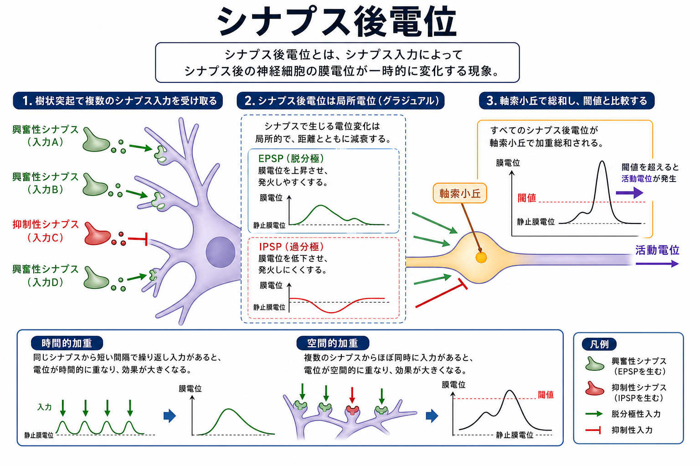
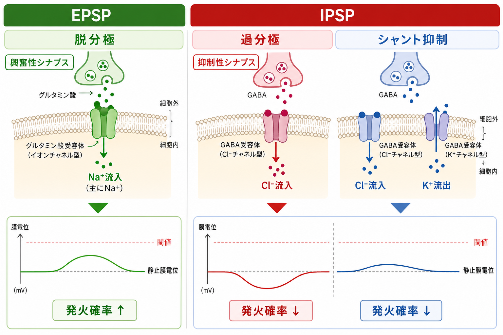

---
title: "シナプス後電位とは何か"
description: "EPSP・IPSP・局所電位の性質を、イオンチャネル、膜電位、加重、軸索小丘での閾値判定と結びつけて説明する。"
aliases:
  - "シナプス後電位"
  - "postsynaptic potential"
  - "PSP"
  - "EPSP"
  - "IPSP"
tags:
  - neuroscience
  - basic-neuroscience
  - obsidian
  - 脳・神経科学/基礎神経科学
created: "2026-04-27"
updated: "2026-04-27"
draft: true
publish: false
status: draft
enableToc: true
---

# シナプス後電位とは何か

## 要点

- シナプス後電位とは、[[シナプスとは何か|シナプス]]入力によって後シナプス細胞の膜電位が一時的に変わる局所的な電位変化である。
- EPSP は活動電位の閾値へ近づける方向の変化、IPSP は閾値へ到達しにくくする方向の変化を指す。ただし、IPSP は常に「過分極」と同義ではない。[1]
- 多くのシナプス後電位は、それ単独では[[活動電位はどのように発生するのか|活動電位]]を起こせない小さな局所電位であり、時間的加重と空間的加重によって軸索小丘・軸索初節付近で統合される。[2]
- EPSP/IPSP の効果は、神経伝達物質名だけでなく、受容体、開く[[イオンチャネルとは何か|イオンチャネル]]、イオンの平衡電位、膜電位、シナプス位置で決まる。[1][3]

## この記事で答える問い

この記事では、次の問いに答える。

1. シナプス後電位は、活動電位や静止膜電位と何が違うのか。
2. EPSP と IPSP は、膜電位をどの方向へ動かすのか。
3. なぜ 1 つの小さな局所電位が、神経細胞全体の発火を左右できるのか。
4. 「抑制性 = 必ず過分極」という説明は、どこまで正しいのか。

## まず結論

シナプス後電位は、神経細胞が多数の入力を「足し合わせて、発火するかどうかを決める」ための中間信号である。[[シナプス前終末では何が起きているのか|シナプス前終末]]から放出された神経伝達物質が後シナプス膜の受容体に結合すると、イオンチャネルの開閉が変わり、膜電位が小さく変化する。この変化が EPSP または IPSP として観察される。[1][3]

EPSP は、膜電位を活動電位の閾値へ近づける入力である。典型例では、グルタミン酸受容体を介した陽イオン流入により膜が脱分極し、発火しやすくなる。[1][3] IPSP は、膜電位を閾値に届きにくくする入力である。典型例では GABA_A 受容体やグリシン受容体を介した Cl^- 透過性、または K^+ 透過性の変化が関わる。[1][5]

重要なのは、後シナプス電位が「全か無か」ではなく、入力の強さやタイミングに応じて大きさが変わる局所電位だという点である。活動電位が発生するかどうかは、個々の EPSP/IPSP ではなく、それらが樹状突起・細胞体・軸索小丘付近でどのように加算されるかによって決まる。[2][4]

## 背景

神経細胞は、単に電線のように信号を流しているわけではない。[[樹状突起はどのように情報を受け取るのか|樹状突起]]や細胞体には、多数のシナプス入力が集まり、それぞれが膜電位を少しずつ変える。これらの小さな変化が足し合わされ、[[軸索小丘はなぜ発火の起点になるのか|軸索小丘]]や軸索初節の電位依存性 Na^+ チャネルを十分に活性化すると、活動電位が発生する。[2][6]

この意味で、シナプス後電位は「入力」と「出力」のあいだにある計算の単位である。出力としての活動電位は急峻で伝播性が高い。一方、入力側のシナプス後電位は局所的で減衰しやすいが、足し合わせができる。神経回路は、この局所的なアナログ信号を多数統合して、発火するか、沈黙するか、発火タイミングをずらすかを決めている。

## 基本概念

### 局所電位としてのシナプス後電位

シナプス後電位は、膜の一部に生じる graded potential、つまり段階的な電位変化である。刺激が大きいほど電位変化も大きくなりやすく、距離が離れるほど受動的に減衰する。[4] これは、いったん閾値を超えるとほぼ一定の大きさで伝わる活動電位と対照的である。

局所電位であることには、欠点と利点がある。欠点は、遠くへそのまま伝わりにくいことである。利点は、複数の入力を足し合わせられることである。だから神経細胞は、単一入力への単純な反射装置ではなく、多数の入力を統合する素子として働ける。

### EPSP

EPSP は excitatory postsynaptic potential、興奮性シナプス後電位の略である。EPSP は後シナプス細胞が活動電位を出す確率を高める方向の電位変化を指す。[1] 典型的には、グルタミン酸受容体の一部が陽イオンを通し、Na^+ などの流入によって膜電位が静止膜電位より正の方向へ動く。これを脱分極という。

ただし、EPSP の本質は「膜電位が何 mV 変わったか」だけではなく、「閾値へ近づけたか」である。膜電位、反転電位、閾値の相対関係が、興奮性か抑制性かを決める。[1]

### IPSP

IPSP は inhibitory postsynaptic potential、抑制性シナプス後電位の略である。IPSP は後シナプス細胞が活動電位を出す確率を下げる方向の電位変化を指す。[1]

典型的な説明では、GABA_A 受容体が Cl^- チャネルとして働き、Cl^- 流入によって膜が過分極するとされる。これは多くの状況で有用な近似である。しかし、IPSP は常に過分極とは限らない。Cl^- の平衡電位が静止膜電位より正側にある場合、GABA_A 受容体の活性化は脱分極を起こしうる。それでも、反転電位が活動電位の閾値より低ければ、膜電位を閾値未満に保つため、機能的には抑制性に働く。[1][5]

もう一つ重要なのがシャント抑制である。抑制性チャネルが開くと膜コンダクタンスが上がり、同時に入ってくる EPSP の効果が「漏れやすく」なる。目立つ過分極がなくても、興奮性入力を弱めることがある。[1]

## 仕組み

### 1. 神経伝達物質が受容体に結合する

化学シナプスでは、[[化学シナプスと電気シナプスは何が違うのか|前シナプス細胞から放出された神経伝達物質]]が後シナプス膜の受容体に結合する。速いシナプス後電位では、リガンド開口性イオンチャネル型受容体が中心になる。受容体が開くと、Na^+、K^+、Ca^2+、Cl^- などの透過性が変わり、膜電位がそのチャネルの反転電位へ近づこうとする。[1][3]

### 2. 電位変化はシナプス位置から広がりながら減衰する

シナプス後電位は、発生した場所から細胞体や軸索小丘へ向かって受動的に広がる。樹状突起の遠位部で起きた小さな EPSP は、軸索小丘へ届くまでに弱くなりやすい。逆に、細胞体や軸索初節に近い抑制性入力は、発火判定に強い影響を与えやすい。[2][6]

### 3. 時間的加重と空間的加重が起きる

時間的加重とは、同じ入力が短い間隔で繰り返され、前のシナプス後電位が消える前に次の電位変化が重なることである。空間的加重とは、複数の異なるシナプスからの入力がほぼ同時に重なることである。[2][4]

この加重は単純な足し算に近いが、完全な算術和ではない。樹状突起の形、膜抵抗、チャネル分布、抑制性入力の位置、NMDA受容体のような非線形性が加わるため、実際の神経細胞では「どこで、いつ、どの受容体が働くか」が大きな意味を持つ。

### 4. 軸索小丘・軸索初節で発火判定が行われる

多数の EPSP と IPSP の統合結果が閾値を超えると、電位依存性 Na^+ チャネルが十分に開き、活動電位が発生する。哺乳類の中枢神経細胞では、活動電位はしばしば軸索初節で開始される。これは、軸索初節に発火に関わる電位依存性チャネルが高密度に配置されるためである。[6]

## 図解

図1は、樹状突起に入る複数の興奮性・抑制性入力が、局所電位として発生し、時間的・空間的に加重され、軸索小丘付近で閾値と比較される流れをまとめたものである。

図2は、EPSP と IPSP の典型的なイオン機構を対比したものである。EPSP は主に脱分極を通じて発火確率を上げ、IPSP は過分極またはシャント抑制を通じて発火確率を下げる。ただし、本文で述べたように、IPSP の本質は「過分極すること」ではなく「閾値到達を妨げること」である。

## 臨床・研究との接続

シナプス後電位は、神経回路の興奮と抑制のバランスを理解する入口になる。たとえば GABA 作動性抑制の発達、Cl^- 勾配、グルタミン酸受容体の機能、軸索初節のチャネル配置は、発達、学習、てんかん様活動、神経発達症研究などと関係する。[5][6][7]

ただし、この記事の説明は教育・研究目的の基礎知識であり、個別の症状や診断、治療方針を判断するものではない。臨床では、細胞レベルの EPSP/IPSP だけでなく、回路、脳領域、発達段階、薬理作用、行動指標を合わせて解釈する必要がある。

## よくある誤解

### 誤解1: EPSP は必ず活動電位を起こす

EPSP は活動電位を起こしやすくするが、単独で閾値を超えるとは限らない。多くの中枢シナプスの EPSP は小さく、複数入力の加重によって初めて発火に近づく。[2]

### 誤解2: IPSP は必ず膜電位を下げる

IPSP は発火確率を下げる入力であって、必ず過分極する入力ではない。脱分極性でも、反転電位が閾値より低く、膜電位を閾値未満に保つなら抑制性に働きうる。[1][5]

### 誤解3: 興奮性・抑制性は神経伝達物質だけで決まる

神経伝達物質は重要だが、効果は受容体、イオンチャネル、イオン勾配、細胞状態、シナプス位置によって変わる。したがって「グルタミン酸だから必ず興奮」「GABAだから必ず過分極」とだけ覚えると、発達期や特定回路の理解でつまずきやすい。

### 誤解4: 局所電位は小さいので重要ではない

局所電位は小さいが、神経細胞の入力統合そのものである。発火するかどうか、発火タイミングがいつになるか、どの入力が優先されるかは、EPSP と IPSP の組み合わせで大きく変わる。

## 関連ノート

- [[シナプスとは何か]]
- [[シナプス前終末では何が起きているのか]]
- [[受容体にはどのような種類があるのか]]
- [[イオンチャネルとは何か]]
- [[静止膜電位はどのように生じるのか]]
- [[活動電位はどのように発生するのか]]
- [[活動電位はなぜ全か無かの法則に従うのか]]
- [[軸索小丘はなぜ発火の起点になるのか]]
- [[樹状突起はどのように情報を受け取るのか]]
- [[GABAは脳で何をしているのか]]

関連ノート候補:

- シナプス後受容体とは何か
- シャント抑制とは何か
- 興奮と抑制のバランスとは何か
- NMDA受容体はなぜ非線形な入力統合に関わるのか

MOC更新候補:

- `content/00_MOC/` 内の脳・神経科学または基礎神経科学MOCに本記事へのリンクを追加する。並列記事生成との衝突を避けるため、このタスクではMOC本体を更新しない。

## 理解チェック

1. シナプス後電位と活動電位の違いを、「局所性」「大きさの変化」「伝播」の3点から説明できるか。
2. EPSP が活動電位の閾値へ近づけるとは、膜電位のどのような変化を意味するか。
3. IPSP が必ず過分極とは限らない理由を、反転電位と閾値の関係から説明できるか。
4. 時間的加重と空間的加重の違いを、具体例で説明できるか。
5. 軸索小丘・軸索初節が入力統合の出口として重要な理由を説明できるか。

## 参考文献

[1] Purves, D., Augustine, G. J., Fitzpatrick, D., et al. (2001). Excitatory and Inhibitory Postsynaptic Potentials. In *Neuroscience* (2nd ed.). NCBI Bookshelf. https://www.ncbi.nlm.nih.gov/books/NBK11117/

[2] Purves, D., Augustine, G. J., Fitzpatrick, D., et al. (2001). Summation of Synaptic Potentials. In *Neuroscience* (2nd ed.). NCBI Bookshelf. https://www.ncbi.nlm.nih.gov/books/NBK11104/

[3] Purves, D., Augustine, G. J., Fitzpatrick, D., et al. (2001). Neurotransmitter Receptors and Their Effects. In *Neuroscience* (2nd ed.). NCBI Bookshelf. https://www.ncbi.nlm.nih.gov/books/NBK11099/

[4] OpenStax. (2013/2023). 12.5 Communication Between Neurons. In *Anatomy and Physiology*. https://openstax.org/books/anatomy-and-physiology/pages/12-5-communication-between-neurons

[5] Brady, M. L., Pilli, J., Lorenz-Guertin, J. M., et al. (2018). Depolarizing, inhibitory GABA type A receptor activity regulates GABAergic synapse plasticity via ERK and BDNF signaling. *Neuropharmacology, 128*, 324-339. https://doi.org/10.1016/j.neuropharm.2017.10.022

[6] Foust, A., Popovic, M., Zecevic, D., & McCormick, D. A. (2010). Action potentials initiate in the axon initial segment and propagate through axon collaterals reliably in cerebellar Purkinje neurons. *Journal of Neuroscience, 30*(20), 6891-6902. https://doi.org/10.1523/JNEUROSCI.0552-10.2010

[7] Sutor, B., & Luhmann, H. J. (1995). Development of excitatory and inhibitory postsynaptic potentials in the rat neocortex. *Perspectives on Developmental Neurobiology, 2*(4), 409-419. https://pubmed.ncbi.nlm.nih.gov/7757410/

## 未解決問題

- 樹状突起の枝ごとの非線形な入力統合を、初学者向けにどこまで単純化してよいか。
- GABAの脱分極性作用を、発達段階・細胞内Cl^-濃度・シャント抑制とどう整理して教えるのが最も誤解が少ないか。
- EPSP/IPSPの説明を、スパイクタイミング依存可塑性や予測符号化の数理モデルへ接続する場合、どの中間ノートを挟むべきか。

## 更新ログ

- 2026-04-27: 初稿作成。EPSP、IPSP、局所電位、加重、軸索小丘での発火判定、図解、参考文献を整理。
