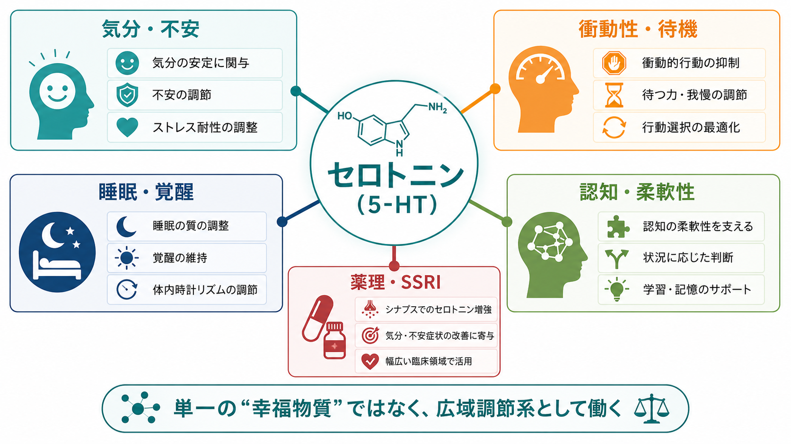

---
title: "セロトニンは気分だけに関わるのか"
description: "セロトニンを、気分だけでなく、衝動性、睡眠・覚醒、認知、薬理作用をまたぐ広域調節系として整理する。"
aliases:
  - "セロトニン"
  - "5-HT"
  - "serotonin"
tags:
  - neuroscience
  - basic-neuroscience
  - obsidian
  - neurotransmitter
  - psychopharmacology
created: "2026-04-27"
updated: "2026-04-27"
draft: true
publish: false
status: draft
enableToc: true
---

# セロトニンは気分だけに関わるのか

## 要点

- セロトニン、つまり 5-hydroxytryptamine（5-HT）は「気分をよくする物質」だけではない。脳幹の縫線核を中心とする広域投射系として、気分、不安、罰や脅威への反応、衝動性、睡眠・覚醒、認知の柔軟性、薬物作用にまたがって働く[1][2][3]。
- 作用が広い理由は、投射先が広いだけでなく、5-HT1 から 5-HT7 までの受容体ファミリー、SERT による再取り込み、回路ごとの受容体配置が異なるためである[1][4]。
- SSRI はセロトニン輸送体 SERT を阻害して細胞外セロトニン濃度を変えるが、「うつ病は単純なセロトニン不足である」と同義ではない[5][6]。
- 睡眠では、セロトニン系は覚醒促進と REM 睡眠抑制に関わる一方、条件によって睡眠傾向にも関わる。したがって「セロトニンは起きる物質」または「眠る物質」と単純化しにくい[7]。

## この記事で答える問い

この記事では、[[シナプスとは何か|シナプス]]と[[神経細胞の種類はどのように分類されるのか|調節性ニューロン]]の基礎を前提に、次の問いに答える。

1. セロトニンは、なぜ気分だけでなく多くの機能に関わるのか。
2. 衝動性、睡眠、認知との関係はどこまで言えるのか。
3. SSRI などの薬理作用は、「セロトニン不足を補う」という説明だけで理解できるのか。
4. よくある単純化を避けるには、どの粒度で考えるとよいのか。

## まず結論

セロトニンは、特定の感情を直接作る単一スイッチではなく、脳の複数の回路に「状態の重みづけ」を与える調節系として理解するとよい。たとえば、ある状況を脅威としてどれくらい重く扱うか、すぐ反応するか待つか、眠気と覚醒をどう配分するか、罰や報酬の履歴をどう学習へ反映するか、といった過程に関わる[2][3][7]。

このため、セロトニンの話をするときは「濃度が高いか低いか」だけでなく、どの脳領域で、どの受容体が、どの時間スケールで、どの薬物や経験によって変化しているのかを見る必要がある[1][4]。

## 背景

セロトニンは末梢では腸管や血小板にも多く存在するが、この記事では中枢神経系のセロトニンに焦点を置く。脳内のセロトニン作動性ニューロンは主に脳幹の縫線核群にあり、皮質、海馬、扁桃体、基底核、視床下部などへ広く投射する[4][7]。この配置は、セロトニンが細かい感覚情報を1対1で運ぶというより、複数の回路の反応性を変える「調節性」の役割を持つことを示している。

この点は、[[化学シナプスと電気シナプスは何が違うのか|化学シナプス]]の一般原理ともつながる。神経伝達物質の作用は、物質名だけで決まらない。受容体、細胞内シグナル、シナプス位置、回路状態が組み合わさって、最終的な興奮性・抑制性・調節性の効果が決まる。

## 基本概念

### 5-HT と受容体ファミリー

セロトニンは 5-HT とも呼ばれる。5-HT 受容体は大きく 5-HT1 から 5-HT7 のファミリーに分けられ、多くは G タンパク質共役型受容体である。ただし 5-HT3 受容体はリガンド開口性イオンチャネルであり、比較的速いシナプス応答を作りうる[1]。この受容体多様性が、セロトニンの作用を一枚岩ではなくしている。

| 要素 | 代表例 | 意味 |
|---|---|---|
| 投射元 | 縫線核群 | 少数の細胞群から広い脳領域へ影響を送る |
| 投射先 | 皮質、海馬、扁桃体、基底核、視床下部など | 情動、記憶、行動制御、睡眠・覚醒と接続する |
| 受容体 | 5-HT1A、5-HT2A、5-HT3、5-HT4/6/7 など | 同じ 5-HT でも作用方向と時間スケールが変わる |
| 輸送体 | SERT | 放出された 5-HT を再取り込みし、信号を終わらせる |

### 「高いほどよい」ではない

セロトニンは「多ければよい」物質ではない。ある回路では反応抑制を助ける一方、別の回路では不快刺激への反応性や柔軟性に関わる。さらに薬理学的にセロトニン系を強く変えると、睡眠、性機能、消化管症状、自律神経症状などにも影響が出うる。これは、セロトニンが気分専用ではなく全身・全脳に広く関わることの裏返しである。

## 仕組み

### 1. 縫線核から広く投射する

セロトニン作動性ニューロンは、脳幹の縫線核群から多くの前脳領域へ投射する。特に背側縫線核は皮質、扁桃体、基底核、視床下部など睡眠・情動・認知に関わる領域と接続する[7]。このため、セロトニンの変化は「一つの症状」ではなく、行動状態全体の変化として現れやすい。

### 2. 受容体サブタイプが作用を分ける

同じセロトニンでも、5-HT1A と 5-HT2A では結合後の細胞内シグナルや回路効果が異なる。Carhart-Harris と Nutt は、5-HT1A と 5-HT2A を中心に、ストレスへの受動的対処と能動的変化という二分モデルを提案している[3]。これは有力な統合理論の一つだが、セロトニン機能全体の確定理論ではなく、受容体別に考える重要性を示すモデルとして読むのがよい。

### 3. SERT が信号を終わらせ、SSRI の標的になる

放出されたセロトニンは、セロトニン輸送体 SERT による再取り込みを受ける。SSRI はこの SERT を阻害し、シナプス外を含む細胞外セロトニン利用可能性を変える薬物群である[5]。ただし、服薬後すぐに SERT は阻害されても、臨床的変化は受容体感受性、回路可塑性、学習、環境との相互作用を含む複数段階で生じると考えられる。

## 図解

図1は、セロトニンを「気分・不安」「衝動性・待機」「睡眠・覚醒」「認知・柔軟性」「薬理・SSRI」にまたがる広域調節系としてまとめた概念地図である。

図2は、縫線核からの広域投射、受容体サブタイプ、SERT による再取り込みを一つの流れとして示している。重要なのは、セロトニン作用が「放出量」だけでは決まらず、投射先、受容体、輸送体、回路状態によって分岐する点である。

## 臨床・研究との接続

### 気分・不安

セロトニン系は気分障害や不安の研究で中心的に扱われてきた。SSRI を含む抗うつ薬には臨床試験に基づく有効性のエビデンスがあるが[8]、それは「うつ病の原因はセロトニン不足である」と同じ意味ではない。2022年に公表されたアンブレラレビューは、少なくとも古典的な「低セロトニン = うつ病」という単純仮説を強く支持する一貫した証拠は乏しいと論じた[6]。一方で、その解釈や方法論については議論もある。したがって、薬の有効性、病因仮説、個人の治療判断は分けて考える必要がある。

### 衝動性・行動制御

セロトニンは罰、脅威、待機、反応抑制に関わる。Cools らのレビューでは、5-HT 低下が罰や嫌悪刺激への反応性を高め、以前は報酬をもたらしたが今は罰を伴う行動の抑制を弱める可能性が整理されている[2]。これは「セロトニンが理性を作る」という意味ではなく、状況の負の結果をどれくらい重く学習や選択に反映するかに関わるという意味である。

### 睡眠・覚醒

睡眠研究では、セロトニン系は歴史的に睡眠促進物質として考えられた時期があった。その後、電気生理・神経化学・薬理学的研究から、セロトニンは主に覚醒を促進し REM 睡眠を抑える方向に働くと整理されてきた。ただし、条件によって睡眠傾向の増加にも関わるため、「覚醒だけ」でも「睡眠だけ」でもない[7]。

### 認知・柔軟性

セロトニンは注意、意思決定、罰学習、認知的柔軟性にも関わる。特に、行動を続けるか止めるか、待つか選ぶか、不利になった選択肢を更新するか、といった制御過程に関与する[2]。この領域では、ドーパミンが報酬予測誤差と結びつけて語られやすいのに対し、セロトニンは罰、待機、嫌悪、行動抑制との関係で議論されることが多い。

## よくある誤解

### 誤解1: セロトニンは「幸せホルモン」である

セロトニンはホルモンとして語られることもあるが、脳内では主に神経調節物質として働く。しかも「幸せ」だけでなく、不安、嫌悪、睡眠、認知、消化管、自律神経にも関わる。したがって、一般向けの「幸せホルモン」という表現は、入口としては分かりやすくても、科学的説明としては粗い。

### 誤解2: うつ病はセロトニン不足だけで説明できる

SSRI が SERT を標的にすることと、うつ病が単純なセロトニン不足で起こることは別である。気分障害は、遺伝、発達、ストレス、炎症、睡眠、認知、社会環境、神経回路の可塑性などが絡む多層的な状態である。セロトニン系は重要な一部だが、全体ではない[6]。

### 誤解3: セロトニンを増やせば衝動性は必ず下がる

セロトニンと衝動性の関係は、課題、対象、受容体、脳領域に依存する。反応抑制や待機を助ける局面はあるが、セロトニンを一方向に増減させれば常に望ましい行動制御が得られるわけではない[2]。

### 誤解4: 受容体名は細かすぎて無視してよい

むしろ受容体名を無視すると、セロトニンの話はすぐ混乱する。5-HT1A、5-HT2A、5-HT3、5-HT4/6/7 では、細胞内シグナル、時間スケール、薬理学的標的が異なる[1][3]。細部をすべて暗記する必要はないが、「受容体が違えば作用も違う」という原則は重要である。

## 関連ノート

- [[シナプスとは何か]]
- [[化学シナプスと電気シナプスは何が違うのか]]
- [[神経細胞の種類はどのように分類されるのか]]
- [[興奮性ニューロンと抑制性ニューロンは何が違うのか]]
- [[イオンチャネルとは何か]]

関連ノート候補:

- 神経伝達物質とは何か
- ドーパミンとセロトニンは何が違うのか
- SSRIはどのように作用するのか
- 縫線核とは何か
- セロトニン受容体の種類

MOC更新候補:

- `content/00_MOC/MOC｜脳・神経科学.md` の「神経伝達物質と受容体」付近へ追加する。
- 精神薬理や気分障害の MOC が整備されている場合、SSRI 関連ノートと相互参照する。

## 理解チェック

1. セロトニンの作用が「気分」だけに限定されない理由を、投射先と受容体多様性の観点から説明できるか。
2. SERT と SSRI の関係を一文で説明できるか。
3. 「SSRI が効く」と「うつ病はセロトニン不足である」が同じ主張ではない理由を説明できるか。
4. 睡眠・覚醒におけるセロトニンの役割を、単純な睡眠促進/覚醒促進の二分法ではなく説明できるか。

## 参考文献

[1] Hoyer, D., Hannon, J. P., & Martin, G. R. (2002). Molecular, pharmacological and functional diversity of 5-HT receptors. *Pharmacology Biochemistry and Behavior, 71*(4), 533-554. https://doi.org/10.1016/S0091-3057(01)00746-8

[2] Cools, R., Roberts, A. C., & Robbins, T. W. (2008). Serotoninergic regulation of emotional and behavioural control processes. *Trends in Cognitive Sciences, 12*(1), 31-40. https://doi.org/10.1016/j.tics.2007.10.011

[3] Carhart-Harris, R. L., & Nutt, D. J. (2017). Serotonin and brain function: a tale of two receptors. *Journal of Psychopharmacology, 31*(9), 1091-1120. https://doi.org/10.1177/0269881117725915

[4] Varnas, K., Halldin, C., & Hall, H. (2004). Autoradiographic distribution of serotonin transporters and receptor subtypes in human brain. *Human Brain Mapping, 22*(3), 246-260. https://doi.org/10.1002/hbm.20035

[5] Murphy, D. L., Fox, M. A., Timpano, K. R., et al. (2008). How the serotonin story is being rewritten by new gene-based discoveries principally related to SLC6A4, the serotonin transporter gene, which functions to influence all cellular serotonin systems. *Neuropharmacology, 55*(6), 932-960. https://doi.org/10.1016/j.neuropharm.2008.08.034

[6] Moncrieff, J., Cooper, R. E., Stockmann, T., et al. (2023). The serotonin theory of depression: a systematic umbrella review of the evidence. *Molecular Psychiatry, 28*, 3243-3256. https://doi.org/10.1038/s41380-022-01661-0

[7] Monti, J. M. (2011). Serotonin control of sleep-wake behavior. *Sleep Medicine Reviews, 15*(4), 269-281. https://doi.org/10.1016/j.smrv.2010.11.003

[8] Cipriani, A., Furukawa, T. A., Salanti, G., et al. (2018). Comparative efficacy and acceptability of 21 antidepressant drugs for the acute treatment of adults with major depressive disorder: a systematic review and network meta-analysis. *The Lancet, 391*(10128), 1357-1366. https://doi.org/10.1016/S0140-6736(17)32802-7

## 未解決問題

- セロトニンの「機能」を、受容体別、回路別、行動課題別にどこまで統一的に説明できるのか。
- ヒトの気分・衝動性・睡眠変化を、動物実験で見える縫線核活動や受容体操作からどの程度推論できるのか。
- SSRI の治療効果、副作用、離脱症状、個人差を、SERT 阻害だけでなく回路可塑性や環境要因を含めてどうモデル化するか。

## 更新ログ

- 2026-04-27: 初稿作成。セロトニンを気分、衝動性、睡眠、認知、薬理にまたがる広域調節系として整理し、画像2点と参考文献を追加。
