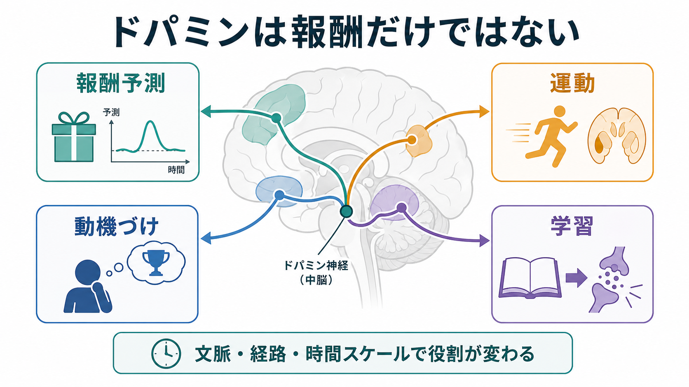
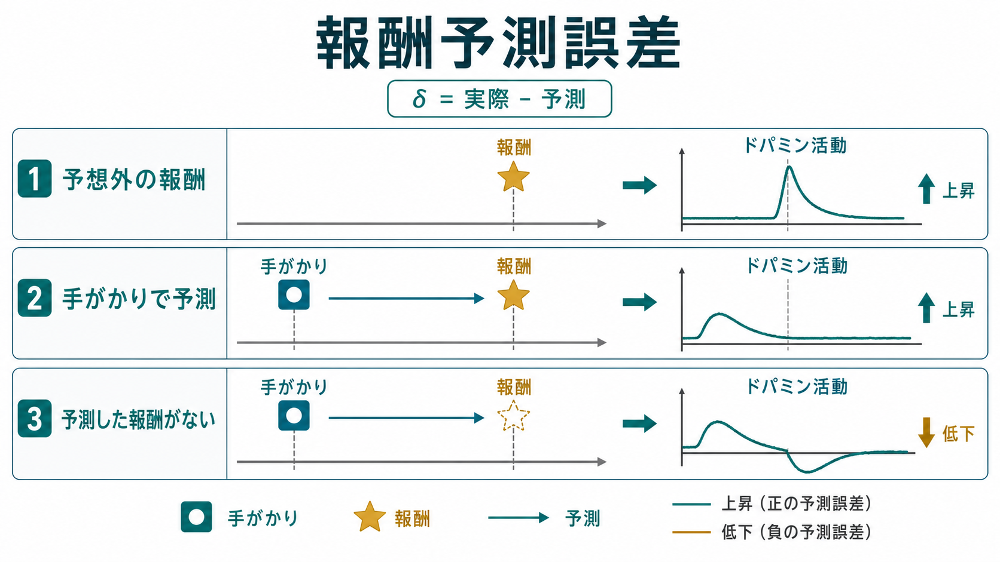

---
title: "ドパミンは報酬だけの物質なのか"
description: "報酬予測、運動、動機づけ、学習に関わるドパミンの機能を、報酬だけに還元しない形で整理する。"
aliases:
  - "ドパミン"
  - "dopamine"
  - "報酬予測誤差"
tags:
  - neuroscience
  - basic-neuroscience
  - obsidian
  - 脳・神経科学/基礎神経科学
created: "2026-04-27"
updated: "2026-04-27"
draft: true
publish: false
status: draft
enableToc: true
---

# ドパミンは報酬だけの物質なのか

## 要点

- ドパミンは「快楽物質」や「報酬物質」とだけ説明されがちだが、実際には報酬予測、行動の活性化、運動制御、学習、注意喚起、動機づけにまたがる調節信号である。
- 中脳ドパミンニューロンの一部は、予想外の報酬で活動が上がり、報酬を予測する手がかりへ応答が移り、期待した報酬がないと活動が下がる。この性質は「報酬予測誤差」と呼ばれる[1]。
- 報酬は「好きであること」、 「欲しいと感じて近づくこと」、 「予測や連合を学ぶこと」に分けて考えられる。ドパミンは特に「欲しい」と「学習」に強く関わるが、快感そのものと同一ではない[2]。
- 黒質から線条体へのドパミン系は、滑らかで目的に沿った運動に重要であり、パーキンソン病ではこの系の障害が運動症状に深く関わる[5][6]。
- したがって「ドパミン = 報酬」は入口としては便利だが、正確には「行動の価値・予測・準備・実行を、回路と時間スケールに応じて調節する神経修飾物質」と見る方がよい。

## この記事で答える問い

この記事では、[[ニューロンとは何か]]や[[シナプスとは何か]]の基礎を前提に、次の問いに答える。

1. ドパミンはなぜ「報酬」と結びつけて語られるのか。
2. それでも「快楽物質」と呼ぶだけでは何が抜け落ちるのか。
3. 報酬予測、運動、動機づけ、学習はどのようにつながるのか。
4. 臨床や研究では、ドパミンをどの程度まで一般化してよいのか。

## まず結論

ドパミンは報酬に関わるが、報酬だけの物質ではない。より正確には、脳が「今の状況で、どの行動をどれくらい起こし、どの結果から学ぶべきか」を調節する信号の一部である。報酬に対する反応、報酬を予測する手がかりへの反応、行動を始める準備、努力して目標へ向かう動機づけ、運動回路の調整が、ドパミン系の異なる経路と時間スケールに分かれて現れる。

このため、ドパミンを理解するときは「何が放出されたか」だけでなく、「どの回路で」「どの受容体を介して」「一瞬の変化なのか持続的な水準なのか」「報酬、運動、注意、努力のどの文脈なのか」を見る必要がある。

## 背景

ドパミンはカテコールアミン系の神経伝達物質であり、脳内では主に中脳の黒質緻密部や腹側被蓋野などから広い領域へ投射する。黒質から線条体へ向かう経路は運動制御と強く関係し、腹側被蓋野から側坐核や前頭前野へ向かう経路は動機づけ、価値、学習と関係しやすい。

ドパミンが報酬と強く結びつけられた大きな理由は、霊長類の中脳ドパミンニューロンが報酬予測誤差に似た活動を示すことが報告されたからである[1]。予測誤差とは、簡単に言えば「実際に起きたこと」と「予測していたこと」の差である。予想外によい結果が起きれば正の予測誤差、期待した報酬が得られなければ負の予測誤差になる。

ただし、この発見は「ドパミンが快感そのものを作る」と同義ではない。報酬には、快いと感じる成分、欲しいと感じて接近する成分、経験から予測を更新する成分がある。これらは重なるが、完全には同じではない[2]。

## 基本概念

### ドパミンニューロン

ドパミンニューロンは、ドパミンを合成・放出する[[神経細胞の種類はどのように分類されるのか|神経細胞]]である。ふつうの高速な興奮性・抑制性伝達だけでなく、回路全体の感度や学習しやすさを変える神経修飾として働くことが多い。これは、単一の[[活動電位はどのように発生するのか|活動電位]]が次の細胞を即座に発火させるというより、受容体や細胞内シグナルを介して、複数の入力の効き方を調整する働きである。

### 報酬予測誤差

報酬予測誤差は、強化学習で重要な信号である。たとえば、まだ何も予測していない時に報酬が出ると、ドパミン活動は報酬時点で上がる。学習が進み、手がかりが報酬を予測するようになると、活動上昇は報酬そのものから手がかりへ移る。逆に、予測された報酬が来ないと、報酬が来るはずだった時点で活動が下がる[1]。

### liking、wanting、learning

報酬を一語でまとめると誤解が生じやすい。Berridge らは、報酬を「liking（快の反応）」「wanting（誘因として欲すること）」「learning（予測や連合の学習）」に分けて整理している[2]。ドパミンはこのうち、とくに wanting と learning に深く関わる。つまり、ドパミンが高いから必ず快感が強い、という単純な関係ではない。

## 仕組み

### 1. 予測を更新する

ドパミンの相動的な活動は、環境から得た結果をもとに「次は何を予測すべきか」を更新する信号として理解できる。手がかり、行動、結果の関係が変わると、ドパミン応答のタイミングも変わる。これは、ドパミンが単なる報酬の量ではなく、「予測よりよかったか、悪かったか」という差分に敏感であることを意味する[1]。

### 2. 行動を起こす準備を高める

ドパミンは、報酬をただ眺めるだけでなく、行動へ向かうエネルギー配分にも関わる。側坐核ドパミンは、報酬の快感そのものよりも、努力を払って目標へ向かうかどうか、課題にどれだけ反応するかといった動機づけ過程に関わると考えられている[4]。この意味で、ドパミンは「楽しい」の物質というより、「やる価値があるものへ行動を向ける」ための調節信号である。

### 3. 運動回路を調節する

黒質緻密部から線条体へ向かうドパミン系は、基底核回路の働きを調整し、滑らかで目的に沿った運動に関わる。パーキンソン病では、黒質のドパミン産生ニューロンが失われることで、振戦、筋強剛、動作緩慢、姿勢保持の問題などの運動症状が生じる[5][6]。これは、ドパミンが報酬だけでなく運動制御にも不可欠であることを示す代表的な臨床例である。

ただし、運動におけるドパミンの役割も単純ではない。近年の研究では、ドパミンニューロン活動が行動開始前に運動の開始や活性化に関わることが示される一方で[7]、短時間のドパミン変動が進行中のすべての運動の強さを直接指定するわけではないことも議論されている[8]。ここでも重要なのは、時間スケールと回路を分けることである。

### 4. 嫌悪・注意喚起にも関わりうる

中脳ドパミン系は、報酬だけでなく、嫌悪的出来事や注意を引く出来事にも関わる。Bromberg-Martin らは、ドパミン系には価値を符号化する成分と、出来事の重要性や警告性に関わる成分がありうると整理している[3]。したがって、ドパミン応答を見たからといって、ただちに「快い報酬があった」と解釈するのは危うい。

## 図解

図1は、ドパミンの機能を「報酬予測」「運動」「動機づけ」「学習」の4領域に分けた概念地図である。報酬は中心的な入口だが、ドパミンの働きは行動を選び、始め、結果から学ぶ回路全体に広がる。

図2は、報酬予測誤差の典型的な説明である。予想外の報酬では報酬時点で活動が上がり、学習後は報酬を知らせる手がかりで活動が上がり、予測した報酬が来なければ活動低下が起きる。これは「報酬そのもの」よりも「予測の更新」に近い信号である。

## 臨床・研究との接続

パーキンソン病は、ドパミンを運動の観点から理解する重要な入口である。NINDS は、パーキンソン病の一般的な運動症状が、黒質のドパミン産生ニューロンの喪失と関係することを説明している[5]。ただし、ここから「ドパミンを増やせばすべて解決する」とは言えない。疾患には複数の神経系、細胞病理、時間経過が関わり、治療判断は専門家の診療対象である。

依存や強迫的な報酬追求を考えるときも、ドパミンを「快楽」だけに結びつけると見誤る。依存では、対象を好きかどうかと、対象を強く欲して追い求めるかが乖離しうる。これは wanting と liking の区別を使うと理解しやすい[2]。

研究上は、ドパミン信号を「報酬」「運動」「注意」「努力」のどれか一つに固定せず、課題設計、測定部位、測定時間、細胞集団、受容体、行動指標を分けて解釈する必要がある。特に、相動的なミリ秒から秒単位の変化と、持続的なドパミン水準の変化を混同しないことが重要である。

## よくある誤解

### 誤解1: ドパミンは快楽そのものである

ドパミンは快い経験と関係することがあるが、快感そのものと同一ではない。報酬には liking、wanting、learning があり、ドパミンは特に wanting と learning に強く関わる[2]。

### 誤解2: ドパミンが多いほどよい

ドパミンは多ければよいという物質ではない。回路や受容体、疾患状態、薬剤、時間スケールによって作用は変わる。運動、動機づけ、衝動性、学習のいずれでも、過不足やタイミングのずれが問題になりうる。

### 誤解3: 報酬予測誤差がドパミンのすべてである

報酬予測誤差は非常に重要な枠組みだが、ドパミン系全体を説明し尽くすわけではない。嫌悪、注意喚起、運動開始、努力、臨床症状などを考えるには、複数のドパミン経路と細胞集団を分けて見る必要がある[3][4][7][8]。

## 関連ノート

既存ノート:

- [[ニューロンとは何か]]
- [[シナプスとは何か]]
- [[神経細胞の種類はどのように分類されるのか]]
- [[活動電位はどのように発生するのか]]

関連ノート候補:

- 報酬予測誤差とは何か
- 強化学習とドパミンはどう関係するのか
- 基底核は運動と学習をどう結びつけるのか
- パーキンソン病とドパミン
- liking と wanting の違い

MOC更新候補:

- `content/00_MOC/` 内の脳・神経科学または基礎神経科学 MOC に、本記事へのリンクを追加する。
- 並列ジョブとの競合を避けるため、このタスクでは MOC 本体は更新しない。

## 理解チェック

1. ドパミンを「快楽物質」とだけ呼ぶと、どの機能が抜け落ちるか。
2. 報酬予測誤差では、予想外の報酬、学習後の手がかり、予測報酬の省略に対して、ドパミン活動はそれぞれどう変化するか。
3. wanting と liking の違いを、自分の言葉で説明できるか。
4. パーキンソン病が、ドパミンの運動機能を理解する入口になる理由は何か。
5. ドパミン信号を解釈するとき、なぜ回路と時間スケールを分ける必要があるのか。

## 参考文献

[1] Schultz, W., Dayan, P., & Montague, P. R. (1997). A neural substrate of prediction and reward. *Science, 275*(5306), 1593-1599. https://doi.org/10.1126/science.275.5306.1593

[2] Berridge, K. C., Robinson, T. E., & Aldridge, J. W. (2009). Dissecting components of reward: 'liking', 'wanting', and learning. *Current Opinion in Pharmacology, 9*(1), 65-73. https://doi.org/10.1016/j.coph.2008.12.014

[3] Bromberg-Martin, E. S., Matsumoto, M., & Hikosaka, O. (2010). Dopamine in motivational control: rewarding, aversive, and alerting. *Neuron, 68*(5), 815-834. https://doi.org/10.1016/j.neuron.2010.11.022

[4] Salamone, J. D., & Correa, M. (2012). The mysterious motivational functions of mesolimbic dopamine. *Neuron, 76*(3), 470-485. https://doi.org/10.1016/j.neuron.2012.10.021

[5] National Institute of Neurological Disorders and Stroke. (n.d.). *Parkinson's Disease*. https://www.ninds.nih.gov/health-information/disorders/parkinsons-disease

[6] Poewe, W., Seppi, K., Tanner, C. M., Halliday, G. M., Brundin, P., Volkmann, J., Schrag, A.-E., & Lang, A. E. (2017). Parkinson disease. *Nature Reviews Disease Primers, 3*, 17013. https://doi.org/10.1038/nrdp.2017.13

[7] da Silva, J. A., Tecuapetla, F., Paixao, V., & Costa, R. M. (2018). Dopamine neuron activity before action initiation gates and invigorates future movements. *Nature, 554*, 244-248. https://doi.org/10.1038/nature25457

[8] Cai, X., Liu, C., Tsutsui-Kimura, I., Lee, J.-H., Guo, C., Banerjee, A., Lee, J., Amo, R., Xie, Y., Patriarchi, T., et al. (2024). Dopamine dynamics are dispensable for movement but promote reward responses. *Nature, 634*, 728-736. https://doi.org/10.1038/s41586-024-08038-z

## 未解決問題

- ドパミン細胞集団の多様性を、報酬・嫌悪・注意・運動の機能分類とどの程度一対一に対応させられるのか。
- 相動的なドパミン変化と持続的なドパミン水準は、自然な行動中にどのように協調するのか。
- ヒトの主観的な動機づけや依存症状を、動物実験の dopamine signal からどこまで説明できるのか。

## 更新ログ

- 2026-04-27: 初稿作成。報酬予測、動機づけ、運動、学習を中心に整理し、画像2枚と主要参考文献を追加。
