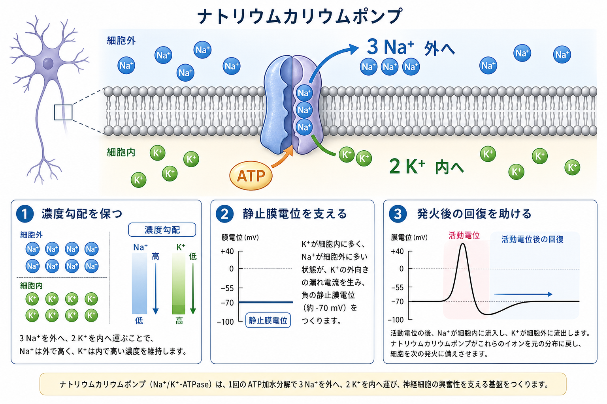
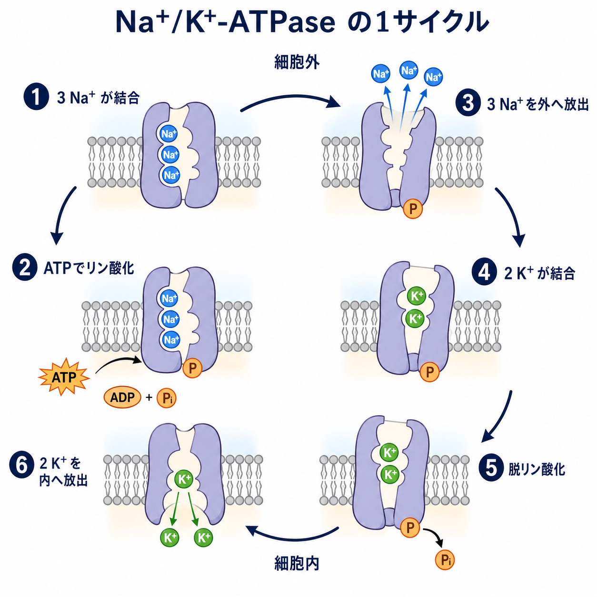
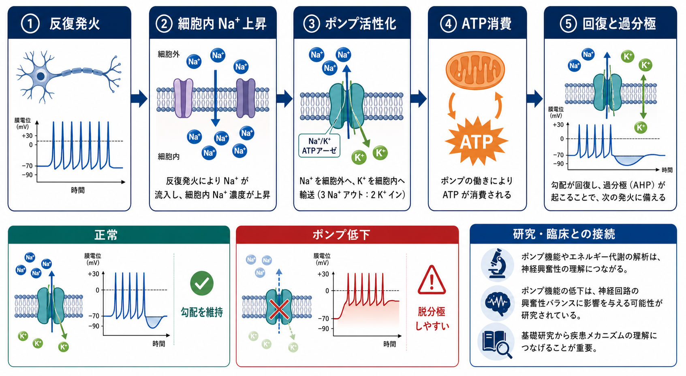

---
title: "ナトリウムカリウムポンプは神経活動にどう関わるのか"
description: "Na+/K+-ATPase がイオン濃度勾配、静止膜電位、活動電位後の回復、神経細胞のエネルギー消費にどう関わるかを整理する。"
aliases:
  - "ナトリウムカリウムポンプ"
  - "Na+/K+-ATPase"
  - "Na,K-ATPase"
tags:
  - neuroscience
  - basic-neuroscience
  - obsidian
created: "2026-04-27"
updated: "2026-04-27"
draft: true
publish: false
status: draft
enableToc: true
---

# ナトリウムカリウムポンプは神経活動にどう関わるのか

## 要点

- ナトリウムカリウムポンプ（Na+/K+-ATPase）は、ATPを使って通常 3個の Na+ を細胞外へ、2個の K+ を細胞内へ運ぶ一次能動輸送体である[1]。
- この働きは、Na+ が細胞外に多く、K+ が細胞内に多いという濃度勾配を維持し、神経細胞が電気信号を出せる前提条件を作る[2]。
- 静止膜電位そのものは主にイオン透過性、特にK+漏洩コンダクタンスによって決まるが、そのK+勾配を長期的に保つ仕事はポンプが担う[2]。
- 1回の活動電位を直接立ち上げるのは電位依存性Na+チャネルであり、再分極にはK+チャネルが大きく関わる。ポンプは発火のたびに即座に電位波形を作る主役ではなく、発火後・反復発火後に崩れたイオン分布を戻す基盤である[3][4]。
- 反復発火で細胞内Na+が増えるとポンプ電流が増え、長く続く過分極や興奮性低下として観察されることがある[4][7]。

## この記事で答える問い

「神経細胞はNa+とK+の濃度差を利用して電気信号を出す」と説明されることが多い。では、その濃度差を保つナトリウムカリウムポンプは、[[ニューロンとは何か|ニューロン]]の静止膜電位、活動電位、反復発火後の回復にどのように関わるのだろうか。

## まず結論

ナトリウムカリウムポンプは、神経活動の「瞬間的なスイッチ」ではなく、「電気信号を続けるための補給・清掃システム」に近い。電位依存性チャネルが開閉して活動電位を作るには、Na+ と K+ の濃度勾配が必要である。ポンプはこの勾配をATP消費によって保ち、発火で流入したNa+と流出したK+を時間をかけて戻す。

ただし、ポンプは完全に背景的な装置ではない。3 Na+を外へ、2 K+を内へ運ぶため、1サイクルあたり正電荷1個ぶんが外向きに移動する。したがってポンプは電位をやや過分極方向へ動かす「起電性」の輸送体でもあり、特に反復発火後にはポンプ電流が神経細胞の興奮性を一時的に下げることがある[4][7]。

## 背景

神経細胞の膜は、脂質二重層に多数のチャネル、受容体、輸送体が埋め込まれた構造である。静止状態でも膜内外には電位差があり、典型的な神経細胞では細胞内が外側より負に保たれる。この静止膜電位は、Na+、K+、Cl-などの濃度差と、膜がそれぞれのイオンをどれだけ通しやすいかの組み合わせで決まる[2]。

活動電位では、まず電位依存性Na+チャネルが開いてNa+が流入し、膜電位が急速に脱分極する。続いてNa+チャネルの不活性化とK+チャネルの開口により、K+が流出して再分極・過分極が起こる[3]。ここで重要なのは、1回の活動電位で動くイオン量は全体の濃度プールから見れば小さいが、反復発火ではNa+流入とK+流出が蓄積しうるという点である。

## 基本概念

### 一次能動輸送

ナトリウムカリウムポンプはATP加水分解のエネルギーを使って、Na+とK+をそれぞれの濃度勾配に逆らって運ぶ。これは、イオンが自然に流れるチャネルとは異なる。チャネルは開けば濃度差と電気的勾配に従ってイオンを通すが、ポンプはATPを消費して濃度差そのものを作り直す[1]。

### 起電性

1サイクルで3 Na+を外へ、2 K+を内へ運ぶため、正電荷の移動は差し引きで外向きになる。この非対称な輸送により、ポンプは膜電位をわずかに過分極方向へ寄せる。もっとも、多くの状況で静止膜電位の主な決定因子はK+透過性であり、ポンプの直接的な電位寄与は限定的である[4][5]。

### イオン勾配という「前提」

Na+が細胞外に多く、K+が細胞内に多い状態があるからこそ、Na+チャネルが開けばNa+は内向きに流れ、K+チャネルが開けばK+は外向きに流れやすい。つまりポンプは活動電位の波形を毎回直接描くというより、波形を描ける化学的な高低差を維持する[2][3]。

## 仕組み

Na+/K+-ATPaseの古典的な説明では、細胞内側で3個のNa+が結合し、ATPによるリン酸化でタンパク質の構造が変わり、Na+が細胞外へ放出される。次に細胞外側で2個のK+が結合し、脱リン酸化によって構造が戻り、K+が細胞内へ放出される[5]。

この1サイクルは単純な「入れ替え」ではない。ATPの化学エネルギーを、膜をまたぐNa+とK+の電気化学的勾配へ変換している。神経細胞が発火するとNa+が細胞内へ入り、K+が細胞外へ出るため、ポンプはこの変化を反対向きに戻す。Basic Neurochemistryでは、活動電位時のイオン流束は静止時より大きく、一定頻度で伝導を維持するにはポンプ速度を上げる必要があると説明されている[5]。

## 図解

| 場面 | 主な現象 | ポンプの役割 |
|---|---|---|
| 静止状態 | K+透過性が高く、膜電位はK+平衡電位に近づきやすい | Na+外高・K+内高の濃度勾配を維持する |
| 単発の活動電位 | Na+流入、K+流出、再分極が起こる | 直後の波形形成の主役ではなく、長期的にイオン分布を戻す |
| 反復発火 | 細胞内Na+が蓄積し、細胞外K+も変化しうる | ポンプ活性が上がり、回復と過分極性電流に寄与する |
| エネルギー代謝 | ATP需要が増える | 脳のエネルギー消費の大きな割合がNa+輸送に関わる[5][6] |

## 臨床・研究との接続

神経活動はエネルギー代謝と切り離せない。脳灰白質の信号処理に必要なエネルギー収支を見積もった研究では、活動電位後のNa+排出やシナプス後電流後の回復など、イオン勾配の復元が大きなコストを占めるとされる[6]。したがって、ポンプは単なる分子ポンプではなく、神経活動とATP供給、グリア細胞による代謝支援を結ぶ接点でもある。[[アストロサイトはシナプスと代謝をどう支えているのか|アストロサイト]]が乳酸シャトルやK+緩衝、神経伝達物質取り込みに関わるという話ともつながる。

実験的には、ポンプ阻害薬であるouabainやstrophanthidinを用いると、反復刺激後の長い過分極が弱まることが報告されている。ラット視神経の研究では、反復刺激後の過分極がNa+/K+-ATPase阻害で遮断され、ポンプが軸索興奮性の調節に関わることが示された[7]。また、神経細胞にはNa+/K+-ATPaseの複数のαサブユニットアイソフォームが発現し、特にα3アイソフォームは神経活動に伴うNa+上昇への応答性という観点から研究されている[8]。

医療・精神医学的な文脈では、Na+/K+-ATPaseの異常やイオン恒常性の破綻が、発作、虚血、神経変性、気分障害などと関連づけて研究されることがある。ただし、この記事は教育・研究目的の基礎解説であり、個別の症状や治療判断を説明するものではない。

## よくある誤解

### 誤解1: ポンプが活動電位を直接発生させる

活動電位の急峻な立ち上がりを作るのは、主に電位依存性Na+チャネルの開口である。ポンプはミリ秒単位のスパイク波形を直接作る主役ではなく、Na+とK+の勾配を維持し、発火後の分布回復を支える[3][4]。

### 誤解2: 静止膜電位はポンプだけで決まる

ポンプがNa+とK+の濃度勾配を作ることは不可欠だが、静止膜電位の瞬間的な値は膜の透過性、特にK+漏洩チャネルを通じたK+透過性に大きく依存する[2]。ポンプは土台、チャネルはその土台の上で電位を決める可変ゲート、と考えると混乱しにくい。

### 誤解3: 発火のたびに大量のNa+とK+が入れ替わる

1回の活動電位で膜を通過するイオン量は、細胞全体の濃度を即座に大きく変えるほどではない。ただし、細い軸索、強い反復発火、代謝負荷が大きい状況では、局所的なNa+蓄積やポンプ活性化が興奮性に影響しやすくなる[4][7]。

### 誤解4: ポンプは神経細胞だけの装置である

Na+/K+-ATPaseは多くの細胞に存在する。神経系では[[軸索はどのように情報を遠くへ伝えるのか|軸索]]、シナプス、細胞体、樹状突起、グリア細胞など、イオン流束が重要な場所に関わる。神経細胞だけでなくグリア細胞のNa+勾配も、神経伝達物質取り込みやK+恒常性と結びつく[1][5]。

## 関連ノート

- [[ニューロンとは何か]]
- [[軸索はどのように情報を遠くへ伝えるのか]]
- [[軸索小丘はなぜ発火の起点になるのか]]
- [[アストロサイトはシナプスと代謝をどう支えているのか]]

今後の作成候補:

- 活動電位はどのように発生するのか
- 静止膜電位はどのように生じるのか
- イオンチャネルとは何か
- ネルンスト電位とは何か
- ゴールドマン方程式は膜電位をどう説明するのか

MOC更新候補:

- `content/00_MOC/MOC｜脳・神経科学.md` に本記事へのリンクを追加する候補。ただし並列ジョブとの衝突を避けるため、このタスクではMOCを更新しない。

## 理解チェック

1. Na+/K+-ATPaseが1回のATP加水分解で運ぶNa+とK+の数はそれぞれいくつか。
2. 静止膜電位を説明するとき、ポンプの役割とK+漏洩チャネルの役割はどう違うか。
3. 反復発火後にポンプ活性が上がると、なぜ過分極や興奮性低下として観察されうるのか。
4. 神経活動のエネルギー消費を考えるとき、Na+勾配の回復が重要になる理由は何か。

## 参考文献

[1] Pirahanchi, Y., Jessu, R., & Aeddula, N. R. (2023). *Physiology, Sodium Potassium Pump*. StatPearls. NCBI Bookshelf. https://www.ncbi.nlm.nih.gov/sites/books/NBK537088/

[2] Chrysafides, S. M., Bordes, S. J., & Sharma, S. (2023). *Physiology, Resting Potential*. StatPearls. NCBI Bookshelf. https://www.ncbi.nlm.nih.gov/sites/books/NBK538338/

[3] Grider, M. H., Jessu, R., & Kabir, R. (2023). *Physiology, Action Potential*. StatPearls. NCBI Bookshelf. https://www.ncbi.nlm.nih.gov/sites/books/NBK538143/

[4] Purves, D., Augustine, G. J., Fitzpatrick, D., et al. (2001). *Functional Properties of the Na+/K+ Pump*. In *Neuroscience* (2nd ed.). Sinauer Associates. NCBI Bookshelf. https://www.ncbi.nlm.nih.gov/books/NBK10857/

[5] Siegel, G. J., Agranoff, B. W., Albers, R. W., et al. (Eds.). (1999). *The ATP-Dependent Na+,K+ Pump*. In *Basic Neurochemistry: Molecular, Cellular and Medical Aspects* (6th ed.). Lippincott-Raven. NCBI Bookshelf. https://www.ncbi.nlm.nih.gov/books/NBK28174/

[6] Attwell, D., & Laughlin, S. B. (2001). An energy budget for signaling in the grey matter of the brain. *Journal of Cerebral Blood Flow & Metabolism*, 21(10), 1133-1145. https://doi.org/10.1097/00004647-200110000-00001

[7] Gordon, T. R., Kocsis, J. D., & Waxman, S. G. (1990). Electrogenic pump (Na+/K(+)-ATPase) activity in rat optic nerve. *Neuroscience*, 37(3), 829-837. https://doi.org/10.1016/0306-4522(90)90112-h

[8] Dobretsov, M., & Stimers, J. R. (2005). Neuronal function and alpha3 isoform of the Na/K-ATPase. *Frontiers in Bioscience*, 10, 2373-2396. https://doi.org/10.2741/1704

## 未解決問題

- 神経細胞種ごとのNa+/K+-ATPaseアイソフォーム発現差が、発火様式や疲労耐性にどの程度寄与するのか。
- 軸索、樹状突起、シナプス終末などの局所で、ポンプ活性と代謝供給がどの時間スケールで結びつくのか。
- 疾患モデルで観察されるポンプ機能低下が、原因、代償、二次的結果のどれに近いのかをどう切り分けるか。

## 更新ログ

- 2026-04-27: 初稿作成。Na+/K+-ATPaseの基本機構、静止膜電位・活動電位後回復・反復発火後過分極との関係、画像3点を追加。
