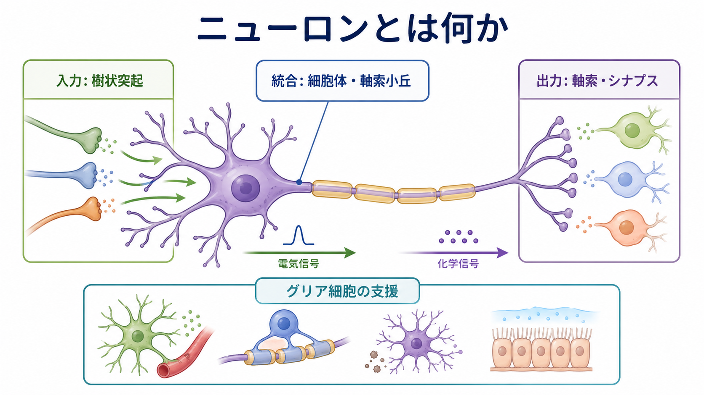
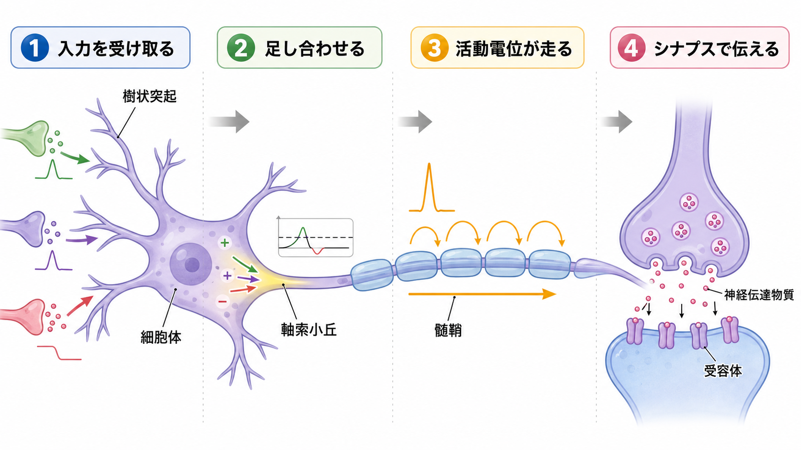
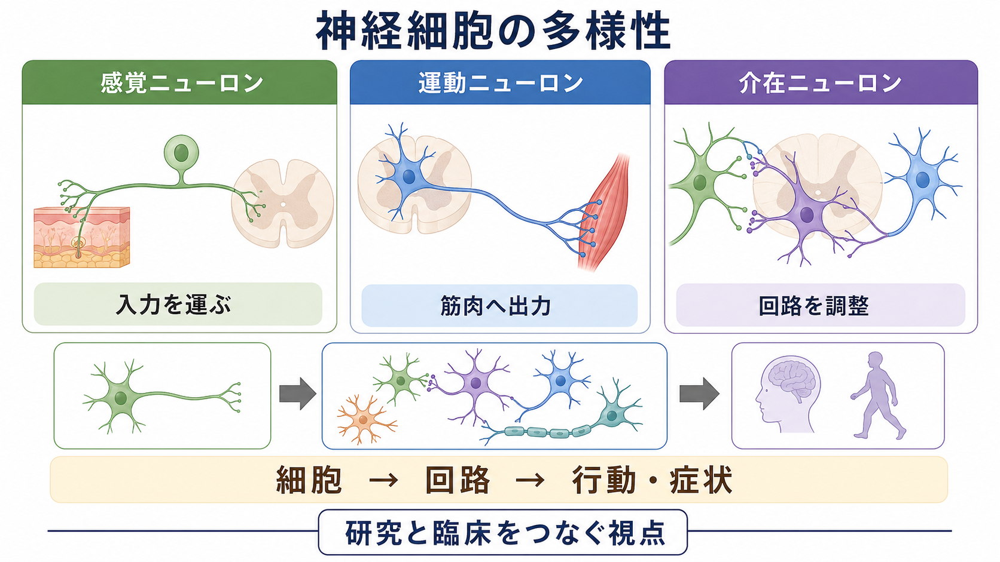

---
title: "ニューロンとは何か"
description: "神経細胞の基本構造と、入力を受け取り、統合し、出力する情報処理単位としての役割を初学者向けに整理する。"
aliases:
  - "神経細胞"
  - "ニューロン"
tags:
  - neuroscience
  - basic-neuroscience
  - obsidian
created: "2026-04-27"
updated: "2026-04-27"
draft: true
publish: true
status: draft
enableToc: true
---

# ニューロンとは何か

## 要点

- ニューロンは、電気的に興奮し、他の細胞へ信号を送ることに特化した細胞である。
- 基本構造は、入力を受ける樹状突起、細胞の代謝と統合に関わる細胞体、遠くへ出力を運ぶ軸索、次の細胞へ伝えるシナプス前終末からなる。
- ニューロンの働きは「入力を受け取る」「足し合わせる」「活動電位として送る」「シナプスで次の細胞に伝える」という流れで理解できる。
- 脳の働きはニューロンだけでなく、グリア細胞、血管、細胞外環境、神経回路全体との相互作用で成り立つ。

## この記事で答える問い

この記事では、初学者が神経科学を読むときに最初につまずきやすい次の問いに答える。

1. ニューロンは普通の細胞と何が違うのか。
2. 樹状突起、細胞体、軸索、シナプスはそれぞれ何をしているのか。
3. 「ニューロンは情報処理単位である」とは、具体的にどういう意味か。
4. ニューロンを理解すると、研究や臨床のどんな話題につながるのか。

## まず結論

ニューロンとは、神経系の中で情報を受け取り、変換し、別の細胞へ伝えることに特化した細胞である。典型的なニューロンでは、樹状突起が多数の入力を受け、細胞体と軸索小丘付近でそれらの影響が統合され、一定の条件を満たすと活動電位が軸索を伝わり、シナプスで次のニューロンや筋細胞などに信号が渡される[1][2]。

ただし、「1個のニューロンが1個の意味を表す」と考えるのは単純化しすぎである。実際の脳では、多数のニューロンが回路を作り、興奮性・抑制性の入力、可塑性、発達、グリア細胞の支援、身体や環境との相互作用を通じて機能している[5][7]。

## 背景

神経科学では、ニューロンは長く「神経系の基本単位」として扱われてきた。これは、神経系が連続した網ではなく、多数の細胞が接点を介して信号をやり取りするという見方に基づく。現代の教科書的理解では、ニューロンは形態、分子、電気生理、シナプス接続、発火パターン、投射先などによって多様に分類される[1][7]。

人間の脳にはおよそ860億個のニューロンがあると推定されている。ただし、この数そのものより重要なのは、ニューロンがどの脳領域にどの密度で存在し、どのような回路を作るかである[6]。つまり、脳を理解するには「細胞の数」だけでなく、「接続の仕方」と「信号の変換規則」を見る必要がある。

## 基本概念

### ニューロンの主要部分

典型的なニューロンは、次の部分からなる。

| 部位 | 主な役割 | 初学者向けの見方 |
|---|---|---|
| 樹状突起 | 他の細胞から入力を受け取る | 多数の受信アンテナ |
| 細胞体 | 核や細胞小器官を含み、代謝と統合に関わる | 細胞の本体・処理拠点 |
| 軸索小丘 | 発火が始まりやすい領域 | 出力するかどうかの境界 |
| 軸索 | 活動電位を遠くへ伝える | 長距離の信号ケーブル |
| シナプス前終末 | 神経伝達物質を放出する | 次の細胞への出力端子 |

この構造は、「入力」「統合」「出力」という方向性を持つ。OpenStax の解説でも、情報は一般に樹状突起から細胞体を経て軸索へ流れるという極性として整理される[2]。

### 電気信号と化学信号

ニューロンの信号は、細胞内では主に膜電位の変化として扱われ、軸索上では活動電位として伝わる。活動電位は、ナトリウムイオンやカリウムイオンなどの移動と、電位依存性イオンチャネルの開閉によって生じる[3]。この電気信号がシナプス前終末に到達すると、多くの場合、神経伝達物質の放出という化学信号へ変換される[5]。

この「電気から化学へ、また電気へ」という変換が、ニューロン同士の柔軟な通信を可能にしている。

## 仕組み

### 1. 入力を受け取る

樹状突起や細胞体には、他のニューロンからのシナプス入力が入る。入力には、発火を起こしやすくする興奮性入力と、発火を起こしにくくする抑制性入力がある。個々の入力は小さくても、時間的・空間的に足し合わされることで、ニューロン全体の発火しやすさを変える。

### 2. 足し合わせる

ニューロンは単に信号を中継しているだけではない。多数の入力を足し合わせ、どの入力を強く反映するかを変え、発火の有無やタイミングとして出力する。この意味で、ニューロンは「情報処理単位」と呼べる。

### 3. 活動電位が走る

膜電位が閾値に達すると、活動電位が発生する。Hodgkin と Huxley は、イカ巨大軸索を用いて、ナトリウム電流、カリウム電流、漏れ電流の時間変化から活動電位を定量的に説明した[4]。この研究は、ニューロンの電気的興奮性を数理モデルとして扱う基礎になった。

髄鞘を持つ軸索では、活動電位はランヴィエ絞輪付近で再生されながら伝わるため、信号は効率よく遠くへ届く[2][3]。

### 4. シナプスで次へ伝える

活動電位がシナプス前終末に到達すると、神経伝達物質が放出され、シナプス間隙を拡散して受容体に結合する。これにより、次の細胞の膜電位や細胞内シグナルが変化する[5]。シナプスは単なる接点ではなく、信号の強さ、タイミング、可塑性を調整する場である。

## 図解

上の2枚の図は、ニューロンを「形」から理解する図と、「信号の流れ」から理解する図である。次の図は、ニューロンが一種類ではないことを示している。

感覚ニューロンは身体や環境からの入力を運び、運動ニューロンは筋肉への出力に関わり、介在ニューロンは局所回路の調整に関わる。さらに、同じ「介在ニューロン」でも、抑制性か興奮性か、どの神経伝達物質を使うか、どの層や領域に投射するかによって性質は大きく異なる[1][7]。

## 臨床・研究との接続

ニューロンの基本を理解すると、次のような話題がつながって見える。

- 脱髄疾患では、髄鞘の障害により軸索伝導が遅くなったり途切れたりする。
- てんかん研究では、ニューロン集団の過剰な同期発火や興奮性・抑制性バランスが問題になる。
- 神経変性疾患では、特定のニューロン集団の脆弱性、軸索輸送、タンパク質恒常性、炎症などが検討される。
- 計算論的神経科学では、ニューロンの発火、シナプス重み、可塑性を数理モデルとして扱う。

ここで重要なのは、基礎神経科学の知識を個別の診断や治療指示に直結させないことである。臨床症状は細胞だけでなく、回路、脳領域、発達、身体状態、環境、治療歴など多層の要因から生じる。

## よくある誤解

### 誤解1: ニューロンは電線のようにただ信号を流す

軸索は電線にたとえられることがあるが、実際には膜電位、イオンチャネル、代謝、シナプス可塑性、細胞内輸送などを持つ生きた細胞である。入力の足し合わせ方やシナプスの変化によって、同じ入力でも出力は変わりうる。

### 誤解2: 脳の働きはニューロンだけで説明できる

ニューロンは中心的な構成要素だが、グリア細胞は髄鞘形成、代謝支援、シナプス環境の調整、免疫応答などに関わる。ニューロン単独では、脳の安定した機能は成り立たない[2][7]。

### 誤解3: ニューロンの種類は感覚・運動・介在の3つだけ

この分類は初学者には便利だが、実際の分類はもっと細かい。形態、投射先、神経伝達物質、遺伝子発現、発火パターン、発達起源など、多数の軸で分類される[1][7]。

## 関連ノート

既存の入口ノートとして [[MOC｜脳・神経科学]] に接続する。以下は理解が進みやすい関連ノート、または今後作成候補にしたいノートである。

- [[樹状突起はどのように情報を受け取るのか]]
- [[軸索はどのように情報を遠くへ伝えるのか]]
- [[軸索小丘はなぜ発火の起点になるのか]]
- シナプスとは何か
- 活動電位はどのように発生するのか
- 髄鞘はなぜ神経伝導を速くするのか
- グリア細胞は単なる支持細胞なのか
- ニューロンは複数の入力をどのように統合するのか

## 理解チェック

1. 樹状突起、細胞体、軸索、シナプス前終末の役割を一文ずつ説明できるか。
2. 活動電位が「全か無か」の信号として扱われる理由を、閾値とイオンチャネルの言葉で説明できるか。
3. ニューロンを「情報処理単位」と呼ぶとき、どの段階で情報が変換されているかを挙げられるか。
4. ニューロンだけでなくグリア細胞や回路を見る必要がある理由を説明できるか。

## 参考文献

[1] Ludwig, P. E., Reddy, V., & Varacallo, M. (2023). *Neuroanatomy, Neurons*. StatPearls, NCBI Bookshelf. https://www.ncbi.nlm.nih.gov/sites/books/NBK441977/

[2] OpenStax. (2013). *Anatomy and Physiology: 12.2 Nervous Tissue*. https://openstax.org/books/anatomy-and-physiology/pages/12-2-nervous-tissue

[3] Chen, I., & Lui, F. (2023). *Neuroanatomy, Neuron Action Potential*. StatPearls, NCBI Bookshelf. https://www.ncbi.nlm.nih.gov/sites/books/NBK546639/

[4] Hodgkin, A. L., & Huxley, A. F. (1952). A quantitative description of membrane current and its application to conduction and excitation in nerve. *The Journal of Physiology, 117*(4), 500-544. https://doi.org/10.1113/jphysiol.1952.sp004764

[5] Caire, M. J., Reddy, V., & Varacallo, M. (2023). *Physiology, Synapse*. StatPearls, NCBI Bookshelf. https://www.ncbi.nlm.nih.gov/sites/books/NBK526047/

[6] Herculano-Houzel, S. (2009). The human brain in numbers: a linearly scaled-up primate brain. *Frontiers in Human Neuroscience, 3*, 31. https://doi.org/10.3389/neuro.09.031.2009

[7] Purves, D., Augustine, G. J., Fitzpatrick, D., et al. (2001). *Neuroscience* (2nd ed.). Sinauer Associates; NCBI Bookshelf. https://www.ncbi.nlm.nih.gov/books/NBK10799/

## 未解決問題

- ニューロンの種類を、形態・遺伝子発現・発火パターン・接続性のどの基準で統合的に分類するのが最も有用か。
- 単一ニューロンの計算と、ニューロン集団・脳領域・行動レベルの説明をどう接続するか。
- グリア細胞、血管、免疫系、代謝状態を含めた神経回路モデルを、どの粒度で教育・研究に取り入れるべきか。
