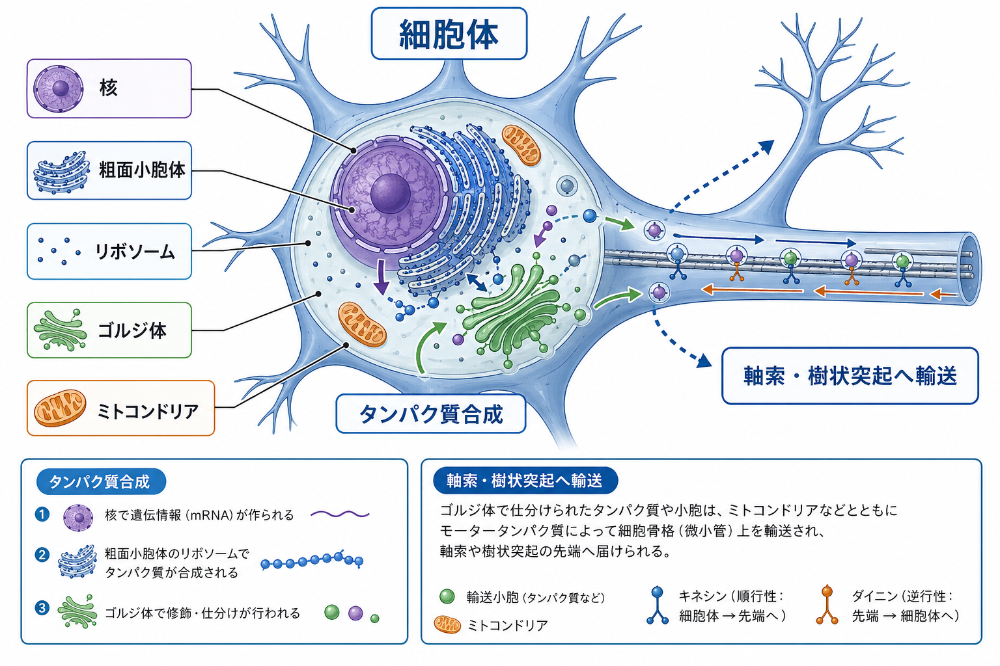
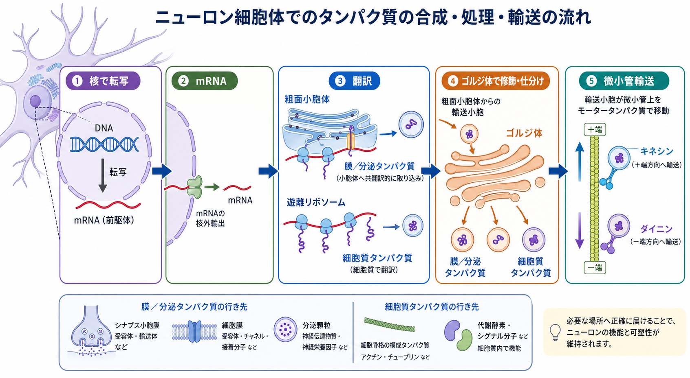
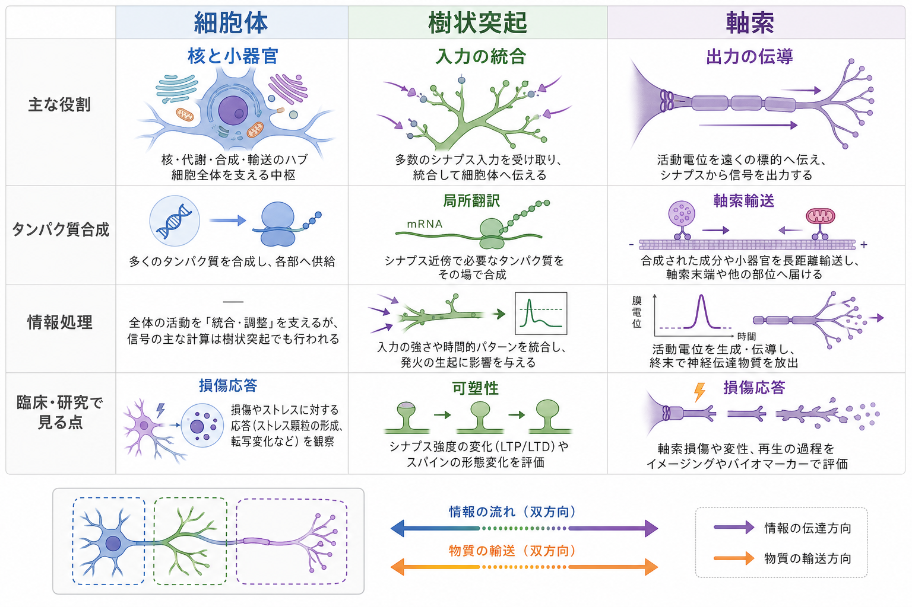

---
title: "ニューロンの細胞体は何をしているのか"
description: "核・細胞小器官・タンパク質合成の観点から、ニューロン細胞体の役割を説明する。"
aliases:
  - "神経細胞の細胞体"
  - "ニューロンのソーマ"
  - "神経細胞体"
tags:
  - neuroscience
  - basic-neuroscience
  - cell-biology
  - obsidian
created: "2026-04-27"
updated: "2026-04-27"
draft: true
publish: false
status: draft
enableToc: true
---

# ニューロンの細胞体は何をしているのか

## 要点

- 細胞体、またはソーマは、ニューロンの核と多くの細胞小器官を含む中心部である。
- 核では遺伝子発現の制御とmRNAの産生が行われ、粗面小胞体・リボソーム・ゴルジ体ではタンパク質の合成、修飾、仕分けが進む。
- 軸索や樹状突起は情報の入力・出力に特化するが、細胞体は代謝、合成、輸送、損傷応答を支えるハブとして働く。
- ただし、タンパク質合成は細胞体だけで完結しない。樹状突起や軸索にも局所翻訳があり、シナプス可塑性や軸索応答に関わる。

## この記事で答える問い

ニューロンの教科書的な図では、細胞体は丸い本体として描かれ、そこから樹状突起と軸索が伸びる。では、その丸い部分は単なる「中身の詰まった場所」なのか。それとも、ニューロンの機能に不可欠な仕事をしているのか。

この記事では、細胞体を「核を置く場所」だけではなく、タンパク質を作り、細胞小器官を働かせ、遠く離れた突起へ物質を送る基盤として見る。

## まず結論

ニューロンの細胞体は、細胞の生命維持と長距離構造の維持を担う「合成・代謝・輸送の拠点」である。核は遺伝子発現を調整し、核小体はリボソーム形成に関わる。粗面小胞体とリボソームは多くのタンパク質を作り、ゴルジ体はそれらを修飾・仕分けし、ミトコンドリアはエネルギー需要を支える。Basic Neurochemistryは、ニューロン細胞体が大きな核、核小体、ニッスル小体、ゴルジ体、ミトコンドリアなどに富むことを記載している[1]。

一方で、細胞体を「ニューロンの司令塔」とだけ呼ぶと誤解が残る。樹状突起や軸索は受動的なケーブルではなく、局所的なシグナル処理や局所翻訳を行う。細胞体は全体を支える中心的ハブだが、ニューロンの働きは細胞体・樹状突起・軸索・シナプスの分散した相互作用として成り立つ[5]。

## 背景

一般的なニューロンは、細胞体、樹状突起、軸索から構成される。樹状突起は多くの入力を受け、軸索は活動電位を遠くへ伝える。これに対して細胞体は、核を含む細胞本体として、細胞全体の物質生産と維持を担う。細胞体の表面積はニューロン全体から見ると小さくても、核と主要な小器官が集中しているため、機能的には大きな意味を持つ[1]。

ニューロンが難しいのは、形が極端に長いことである。ヒトの一部の軸索は非常に長く、細胞体から遠く離れた軸索終末やシナプスを維持しなければならない。そのため、細胞体で作ったタンパク質、小胞、ミトコンドリアなどを微小管に沿って運ぶ輸送システムが重要になる[3][4]。

## 基本概念

### 細胞体

細胞体は、ニューロンの核と細胞質を含む本体部分である。英語では soma または cell body と呼ばれ、組織学では perikaryon という語も使われる。細胞体は「情報をすべて計算する場所」というより、遺伝子発現、タンパク質合成、代謝、細胞内輸送の出発点として理解するとよい。

### 核と核小体

核にはDNAがあり、どの遺伝子をどの程度読むかを調整する。転写によってmRNAが作られ、核膜孔を通って細胞質へ出る。ニューロンの核はしばしば大きく、核小体が目立つ。核小体はリボソームRNAの産生とリボソーム構成要素の形成に関わるため、タンパク質合成能力と結びついている[1]。

### ニッスル小体、粗面小胞体、リボソーム

ニッスル小体は、光学顕微鏡で塩基性色素に染まりやすいニューロン細胞体内の構造として知られる。電子顕微鏡レベルでは、粗面小胞体と遊離ポリリボソームの集まりとして理解される[1]。粗面小胞体は表面にリボソームを持ち、膜タンパク質や分泌タンパク質などの合成に関わる[2]。

### ゴルジ体、ミトコンドリア、リソソーム

ゴルジ体は、タンパク質や脂質を修飾し、輸送先に応じて仕分ける。ニューロンでは核の周囲や樹状突起側に広がることがあるが、典型的には軸索内には乏しいとされる[1]。ミトコンドリアは酸化的リン酸化によってATP産生を支え、軸索やシナプスにも運ばれる。リソソームやオートファジー系は、古くなったタンパク質や小器官の分解に関わり、長寿命の細胞であるニューロンの品質管理に重要である[1][7]。

## 仕組み

### 1. 核で「何を作るか」が調整される

細胞体の核では、発達段階、活動状態、ストレス、損傷などに応じて遺伝子発現が変わる。たとえば、シナプス活動や損傷応答は、核内の転写プログラムを変え、受容体、チャネル、細胞骨格、代謝酵素、ストレス応答タンパク質などの産生に影響する。

ここで重要なのは、核が「命令を出す」だけではなく、細胞の状態を反映して発現を変える点である。細胞体は、樹状突起や軸索から戻ってくるシグナルを受け、必要な分子を作る方向へ遺伝子発現を調整する。

### 2. タンパク質が合成され、加工される

mRNAが細胞質へ出ると、リボソームで翻訳される。細胞質で働くタンパク質は遊離リボソームで合成されることが多く、膜タンパク質や分泌経路に入るタンパク質は粗面小胞体で合成される。粗面小胞体は、膜結合リボソームによってタンパク質合成に関わる構造である[2]。

合成されたタンパク質の一部はゴルジ体へ送られ、糖鎖付加などの修飾や輸送先ごとの仕分けを受ける。神経伝達物質受容体、イオンチャネル、接着分子、分泌タンパク質、シナプス小胞関連タンパク質などは、ニューロンの機能を維持するために適切な場所へ届けられる必要がある。

### 3. 微小管に沿って遠くへ運ばれる

ニューロンでは、合成された分子を細胞体の近くで使うだけでは足りない。軸索終末や樹状突起の先端にも、膜成分、小胞、ミトコンドリア、分解系の小器官、mRNA粒子などを届ける必要がある。微小管はこの輸送の主要な足場であり、キネシンは多くの場合、細胞体から末端側への順行性輸送に、ダイニンは末端側から細胞体側への逆行性輸送に関わる[3][4]。

近年のレビューでは、軸索輸送は単なるベルトコンベアではなく、荷物の種類、軸索内の位置、アダプター分子、モーターの活性化状態によって細かく制御される過程として整理されている[6]。つまり、細胞体は材料の出発点であると同時に、軸索や樹状突起から戻る情報を受け取る終点でもある。

### 4. 局所翻訳が細胞体中心モデルを補う

古典的には、ニューロンのタンパク質は細胞体で作られ、軸索や樹状突起へ運ばれると考えられてきた。しかし現在では、樹状突起や軸索にもmRNAと翻訳装置が存在し、局所的にタンパク質が作られることがわかっている。HoltとSchumanのレビューは、mRNA局在と局所翻訳が記憶、シナプス形成、軸索誘導、生存、恒常性維持などに関わると整理している[5]。

したがって、細胞体は重要だが、すべてのタンパク質合成を独占する場所ではない。細胞体で大きな準備をし、遠くの突起では必要に応じて現地生産も行う、という分業がある。

## 図解

上の図は、細胞体、樹状突起、軸索の役割を比較したものである。細胞体は核と小器官を中心にした合成・代謝・輸送のハブ、樹状突起は入力の統合と可塑性、軸索は出力の伝導と長距離輸送に重点がある。ただし、これらは固定的な分担ではない。樹状突起や軸索にも局所翻訳、ミトコンドリア動態、分解系、シグナル伝達があり、ニューロン全体は分散した細胞内ネットワークとして働く。

## 臨床・研究との接続

細胞体の働きは、神経疾患を理解するうえでも重要である。たとえば、タンパク質の折りたたみ不全、ERストレス、リソソーム・オートファジー系の障害、軸索輸送の障害は、神経変性や軸索障害の研究で繰り返し扱われるテーマである[6][7]。

ただし、これらは個別の診断や治療方針を直接決める説明ではない。この記事での記述は教育・研究目的であり、特定の症状や疾患に対する医学的判断を置き換えるものではない。

研究では、細胞体を観察することで、核内転写因子の移行、ニッスル小体の変化、ERストレスマーカー、ミトコンドリアの分布、損傷後の転写応答などを調べられる。一方、細胞体だけを見てもシナプスや軸索末端の局所過程は見落とされる。細胞体の研究は、突起やシナプスの研究と組み合わせて初めてニューロン全体の理解につながる。

## よくある誤解

### 誤解1: 細胞体はニューロンの「頭脳」で、ほかは単なる配線である

細胞体は核と小器官を持つ中心部だが、樹状突起や軸索も能動的に働く。樹状突起では入力の統合やシナプス可塑性が起こり、軸索では活動電位の伝導、物質輸送、局所的な応答が起こる。ニューロンは一か所だけで計算する細胞ではない。

### 誤解2: タンパク質はすべて細胞体で作られる

多くのタンパク質合成機構は細胞体に集中しているが、樹状突起や軸索にもmRNAと翻訳機構が存在する。局所翻訳は、シナプス近傍や成長円錐で素早く局所的な変化を起こすために重要である[5]。

### 誤解3: 細胞体が無事ならニューロンは問題なく働く

細胞体が生きていても、軸索輸送、ミトコンドリア供給、シナプス維持、タンパク質品質管理が崩れると、ニューロンの機能は保てない。特に長い軸索を持つニューロンでは、細胞体から遠い場所を維持する仕組みが大きな負荷になる[4][6]。

## 関連ノート

- 既存MOC: [[MOC｜脳・神経科学]]
- 領域別MOC: [[MOC｜基礎神経科学]]
- [[ニューロンとは何か]]
- [[樹状突起はどのように情報を受け取るのか]]
- [[軸索はどのように情報を遠くへ伝えるのか]]
- [[軸索輸送とは何か]]
- 関連ノート候補: ニッスル小体、神経細胞の局所翻訳、ERストレスと神経変性

## 理解チェック

1. ニューロンの細胞体に核と粗面小胞体が多いことは、どのような機能と関係しているか。
2. ゴルジ体は、細胞体で作られたタンパク質に対して何をしているか。
3. キネシンとダイニンは、ニューロン内でどのような輸送に関わるか。
4. 「細胞体でタンパク質を作る」という説明だけでは、なぜ現代の神経科学として不十分か。
5. 細胞体の異常と軸索・シナプスの異常は、どのように結びつきうるか。

## 参考文献

[1] Raine, C. S. (1999). Characteristics of the Neuron. In G. J. Siegel et al. (Eds.), *Basic Neurochemistry: Molecular, Cellular and Medical Aspects* (6th ed.). NCBI Bookshelf. https://www.ncbi.nlm.nih.gov/books/NBK28209/

[2] Sanvictores, T., & Davis, D. D. (2023). Histology, Rough Endoplasmic Reticulum. *StatPearls*. NCBI Bookshelf. https://www.ncbi.nlm.nih.gov/books/NBK563126/

[3] Cooper, G. M. (2000). Microtubule Motors and Movements. In *The Cell: A Molecular Approach* (2nd ed.). NCBI Bookshelf. https://www.ncbi.nlm.nih.gov/books/NBK9833/

[4] Stenoien, D. L., & Brady, S. T. (1999). Neuronal Organelles in Motion. In G. J. Siegel et al. (Eds.), *Basic Neurochemistry: Molecular, Cellular and Medical Aspects* (6th ed.). NCBI Bookshelf. https://www.ncbi.nlm.nih.gov/books/NBK28029/

[5] Holt, C. E., & Schuman, E. M. (2013). The central dogma decentralized: New perspectives on RNA function and local translation in neurons. *Neuron, 80*(3), 648-657. https://doi.org/10.1016/j.neuron.2013.10.036

[6] Cason, S. E., & Holzbaur, E. L. F. (2022). Selective motor activation in organelle transport along axons. *Nature Reviews Molecular Cell Biology, 23*, 699-714. https://doi.org/10.1038/s41580-022-00491-w

[7] Ghemrawi, R., & Khair, M. (2020). Endoplasmic Reticulum Stress and Unfolded Protein Response in Neurodegenerative Diseases. *International Journal of Molecular Sciences, 21*(17), 6127. https://doi.org/10.3390/ijms21176127

## 未解決問題

- 細胞体で作られるタンパク質と、樹状突起・軸索で局所翻訳されるタンパク質は、細胞種ごとにどのように分担されているのか。
- 軸索輸送の破綻は、神経変性疾患の原因、結果、増悪因子のどれとして働くのか。
- 細胞体のERストレス応答やオートファジー応答を、ヒト脳内でどの程度非侵襲的に評価できるのか。
