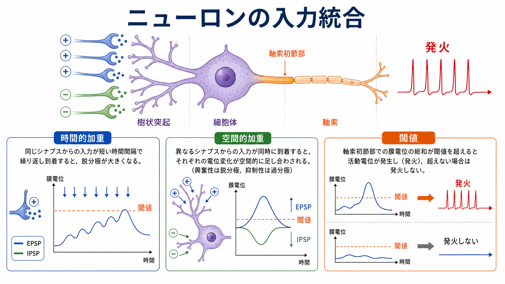
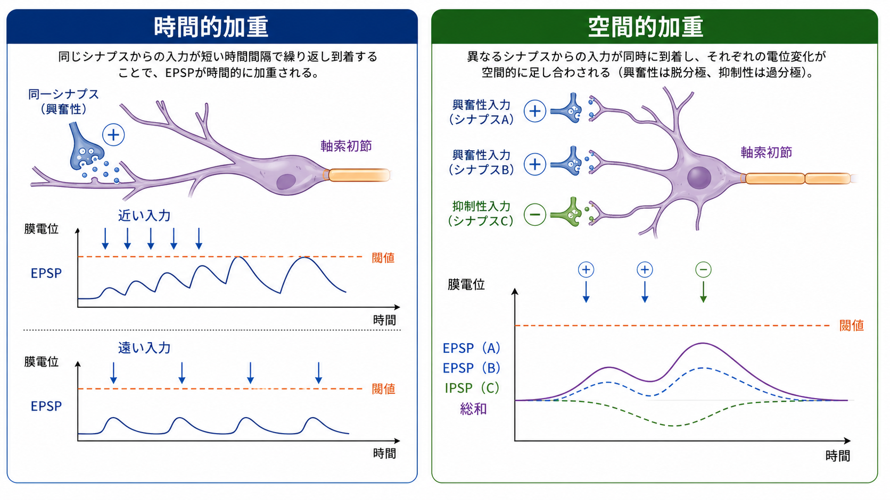
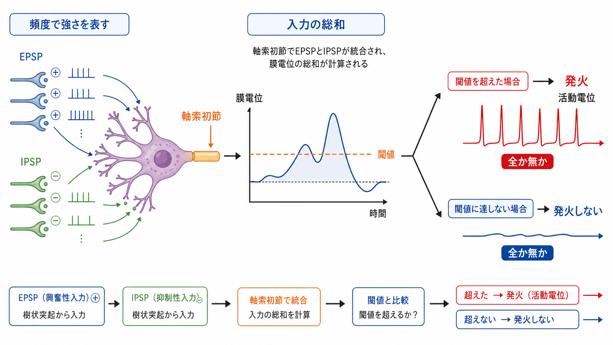

---
title: "ニューロンは複数の入力をどのように統合するのか"
description: "時間的加重・空間的加重・閾値による発火決定を、EPSP/IPSP、樹状突起、軸索初節の観点から整理する。"
aliases:
  - "入力統合"
  - "シナプス統合"
  - "時間的加重と空間的加重"
tags:
  - neuroscience
  - basic-neuroscience
  - obsidian
  - 脳・神経科学/基礎神経科学
created: "2026-04-27"
updated: "2026-04-27"
draft: true
publish: false
status: draft
enableToc: true
---

# ニューロンは複数の入力をどのように統合するのか

## 要点

- ニューロンは、1つの[[シナプスとは何か|シナプス]]入力だけで発火を決めるのではなく、多数の興奮性入力と抑制性入力を、時間と空間の中で足し合わせて出力を決める。
- 興奮性シナプス後電位（EPSP）は膜電位を発火しやすい方向へ、抑制性シナプス後電位（IPSP）は発火しにくい方向へ動かす。実際の発火は、EPSP と IPSP の総和が発火閾値を超えるかどうかに依存する[1]。
- 同じ入力が短い間隔で繰り返されると時間的加重が起こり、複数の場所から同時に入力が来ると空間的加重が起こる[1][2]。
- 樹状突起は単なる受動的な電線ではなく、距離による減衰、局所的なチャネル、スパイン、非線形応答によって、入力の重みづけを変える[3][4][5]。
- 多くのニューロンでは、最終的な活動電位の開始に[[軸索小丘はなぜ発火の起点になるのか|軸索初節]]が重要であり、ここで入力統合・内在性興奮性・発火出力が結びつく[6]。

## この記事で答える問い

同じ[[ニューロンとは何か|ニューロン]]には、数百から数千、ときにはそれ以上のシナプス入力が届く。それらは、興奮性・抑制性、近位・遠位、単発・連発、同期・非同期など、性質が異なる。この記事では、複数入力がどのように膜電位へ変換され、どのような条件で[[活動電位はどのように発生するのか|活動電位]]が発生するのかを整理する。

中心になる問いは次の3つである。

1. 時間的加重とは何か。
2. 空間的加重とは何か。
3. 加重された入力は、どこでどのように発火へ変換されるのか。

## まず結論

ニューロンの入力統合は、「EPSP を足して、IPSP を引いて、閾値を超えたら発火する」という単純な図で始めると理解しやすい。ただし、実際の細胞ではこの「足し算」は完全な算数ではない。入力が来る場所、タイミング、樹状突起の太さや長さ、膜抵抗、受容体、電位依存性イオンチャネル、抑制性入力の位置によって、同じシナプス入力でも細胞体や軸索初節に届く効果が変わる[2][3]。

したがって、ニューロンは単なる合計器ではなく、時間窓と空間配置をもつ生物物理学的な判定装置である。発火したかどうかは「全か無か」的だが、その発火確率や発火頻度は、入力の総和とその時間構造を反映する[6][7]。

## 背景

中枢神経系の多くのシナプス後電位は、単独では活動電位を発生させるほど大きくない。NCBI Bookshelf の神経科学教科書でも、個々の PSP は閾値以下であり、複数の PSP が空間的・時間的に加算されることでシナプス後ニューロンのふるまいが決まると説明されている[1]。

この性質は、脳が多数の弱い手がかりを統合して行動を決めるための基盤である。視覚、聴覚、体性感覚、運動制御、記憶など、ほとんどの神経回路では、単一入力ではなく「どの入力が、いつ、どこに、どの組み合わせで届いたか」が重要になる。

## 基本概念

### EPSP と IPSP

EPSP は excitatory postsynaptic potential の略で、興奮性シナプス後電位を指す。多くの場合、グルタミン酸作動性シナプスで AMPA 受容体などが開き、陽イオン流入によって膜電位が脱分極方向へ動く。これは発火閾値に近づく方向の変化である。

IPSP は inhibitory postsynaptic potential の略で、抑制性シナプス後電位を指す。典型的には [[GABAは脳で何をしているのか|GABA]] 作動性入力が関与し、塩化物イオンやカリウムイオンの流れを通じて膜電位を過分極させたり、膜コンダクタンスを増やして興奮性入力の効果を弱めたりする。抑制は「マイナスの入力」だけではなく、近くの興奮性入力を電気的に逃がすシャント抑制としても働く[1][5]。

### 発火閾値

発火閾値とは、膜電位の変化が電位依存性 Na+ チャネルの再生的な開口を十分に引き起こし、活動電位へ進む境界である。閾値を超えた後は、Na+ チャネルによる正のフィードバックで急速な脱分極が進むため、活動電位は全か無か的な性質をもつ[7]。

ただし、閾値は単一の固定値として理解しすぎないほうがよい。直前の膜電位、Na+ チャネルの不活性化、K+ チャネルの状態、入力の速度、軸索初節の状態によって、発火しやすさは変わる[6][7]。

## 仕組み

### 1. 時間的加重

時間的加重は、同じシナプスまたは近い経路からの入力が短い間隔で繰り返されると、前のシナプス後電位が消えきる前に次のシナプス後電位が重なり、膜電位変化が大きくなる現象である[1][2]。

たとえば、1回の EPSP が閾値に届かなくても、連続する EPSP が短い時間窓に入ると、膜電位は段階的に脱分極する。逆に、入力間隔が長いと、前の EPSP は膜時定数に従って減衰し、次の EPSP とあまり重ならない。このため、時間的加重は「入力頻度を読む仕組み」として理解できる。

### 2. 空間的加重

空間的加重は、異なるシナプス位置から来た複数の入力が、細胞体や軸索初節へ向かう過程で合流し、同時期に足し合わされる現象である[1][2]。

近位樹状突起や細胞体に近い入力は、比較的少ない減衰で軸索初節へ影響を及ぼしやすい。一方、遠位樹状突起の入力は、受動的なケーブル特性によって減衰しやすい。ただし、遠位入力が常に弱いわけではない。樹状突起には電位依存性 Na+、Ca2+、K+ チャネルや NMDA 受容体があり、局所的な増幅や樹状突起スパイクを生じうる[3][4][5]。

このため、空間的加重は「複数入力の場所による重みづけ」である。どのシナプスがどこにあるかは、単に距離の問題ではなく、樹状突起の区画、スパイン、抑制性入力の配置、局所チャネルの分布によって決まる。

### 3. 抑制性入力によるゲート

抑制性入力は、興奮性入力を単純に打ち消すだけではない。細胞体や軸索初節に近い抑制は、発火出力そのものを強く制御しやすい。樹状突起上の抑制は、特定の枝やスパイン群での局所的な興奮性入力を選択的に抑えうる[5]。

この局所性は重要である。同じ IPSP でも、遠く離れた枝にある興奮性入力をどの程度抑えるか、細胞体付近の発火判定をどの程度変えるかは、シナプス位置によって異なる。したがって、抑制はニューロン全体に一様なブレーキをかけるというより、入力統合のどの段階を通すかを調整するゲートとして働く。

### 4. 軸索初節での発火決定

加重された膜電位変化は、最終的に発火しやすい領域へ届く。多くのニューロンでは、軸索初節が活動電位開始に重要な領域である。軸索初節には電位依存性 Na+ チャネルなどが高密度に配置され、入力統合、内在性興奮性、活動電位出力を結びつける動的な信号処理単位として働く[6]。

入力の総和が軸索初節で閾値条件を満たすと活動電位が発生する。満たさない場合、膜電位変化は閾値下応答として終わる。出力の強さは、単一の活動電位の大きさではなく、主に活動電位の頻度やタイミングによって表される[6][7]。

## 図解

図1は、樹状突起、細胞体、軸索初節、活動電位出力を1つの流れとして示している。入力統合は、樹状突起で受け取った入力を細胞体で単純合計するだけではなく、時間的加重、空間的加重、抑制性入力、閾値判定を含む一連の過程である。

図2は、時間的加重と空間的加重の違いを示す。時間的加重では「いつ来たか」が重要で、空間的加重では「どこから同時に来たか」が重要になる。

図3は、EPSP と IPSP の総和が軸索初節で閾値と比較され、閾値を超えれば発火、超えなければ発火しないという判定を示す。実際には閾値は固定線ではなく、チャネル状態や直前の活動履歴によって変動する。

## 臨床・研究との接続

入力統合は、神経回路が情報をどう表現するかを考える基礎である。たとえば、興奮性と抑制性のバランス、樹状突起スパイク、軸索初節の可塑性、Na+ チャネルや GABA 作動性シナプスの変化は、発達、学習、てんかん、神経発達症、精神疾患モデルの研究で議論される。

ただし、個別の疾患や症状を「入力統合の異常」だけで説明することはできない。実際の臨床症状は、分子、細胞、回路、発達、環境、行動が多層的に関わる。ここでの説明は教育・研究目的の基礎知識であり、診断や治療方針を示すものではない。

## よくある誤解

### 誤解1: ニューロンは単純な足し算器である

初学者向けには「EPSP を足し、IPSP を引く」と説明できる。しかし、樹状突起はケーブル特性、電位依存性チャネル、スパイン、NMDA 受容体、抑制性入力によって非線形な処理を行う[3][4][5]。単純な足し算は入口として有用だが、実際の計算はより文脈依存的である。

### 誤解2: 遠位樹状突起の入力は弱いので重要ではない

遠位入力は受動的には減衰しやすいが、局所的な樹状突起スパイクや NMDA 依存性の増幅によって、細胞出力に大きく影響することがある[4][5]。遠い入力は「無視される」のではなく、別の条件で効く入力として見る必要がある。

### 誤解3: 閾値は常に一定の電圧である

閾値は説明上は水平線として描かれるが、実際にはチャネルの状態、直前の発火履歴、軸索初節の性質、入力の立ち上がり速度などに左右される[6][7]。固定値というより、再生的な Na+ 電流が優勢になる条件と考えるほうが正確である。

### 誤解4: 抑制は発火を止めるだけである

抑制性入力は、発火を止めるだけでなく、入力が統合される時間窓や空間範囲を調整する。特に、樹状突起上の抑制は局所的な興奮性入力の組み合わせを選択し、細胞体・軸索初節付近の抑制は発火出力を強く制御する[5]。

## 関連ノート

- [[ニューロンとは何か]]
- [[シナプスとは何か]]
- [[樹状突起はどのように情報を受け取るのか]]
- [[軸索小丘はなぜ発火の起点になるのか]]
- [[活動電位はどのように発生するのか]]
- [[活動電位はなぜ全か無かの法則に従うのか]]
- [[興奮性ニューロンと抑制性ニューロンは何が違うのか]]
- [[イオンチャネルとは何か]]
- [[静止膜電位はどのように生じるのか]]
- [[GABAは脳で何をしているのか]]

関連ノート候補:

- シナプス後電位とは何か
- 時間的加重とは何か
- 空間的加重とは何か
- EPSP と IPSP は何が違うのか
- 樹状突起スパイクとは何か
- シャント抑制とは何か
- 軸索初節の可塑性とは何か

MOC 更新候補:

- `content/00_MOC/MOC｜脳・神経科学.md` に本記事へのリンクを追加する候補。ただし並列生成ジョブとの衝突を避けるため、このタスクでは MOC 本体は更新しない。

## 理解チェック

1. 時間的加重と空間的加重の違いを、「いつ」と「どこ」という言葉を使って説明できるか。
2. EPSP と IPSP は、膜電位と発火確率にそれぞれどのような影響を与えるか。
3. 遠位樹状突起の入力が、単純な距離減衰だけでは説明できない理由は何か。
4. 軸索初節が入力統合と発火決定で重要になる理由は何か。
5. 「閾値を超えたら発火する」という説明の限界は何か。

## 参考文献

[1] Purves, D., Augustine, G. J., Fitzpatrick, D., et al., editors. (2001). *Neuroscience* (2nd ed.). Summation of Synaptic Potentials. NCBI Bookshelf. https://www.ncbi.nlm.nih.gov/books/NBK11104/

[2] Magee, J. C. (2000). Dendritic integration of excitatory synaptic input. *Nature Reviews Neuroscience, 1*, 181-190. https://doi.org/10.1038/35044552

[3] Spruston, N. (2008). Pyramidal neurons: dendritic structure and synaptic integration. *Nature Reviews Neuroscience, 9*, 206-221. https://doi.org/10.1038/nrn2286

[4] Stuart, G. J., & Spruston, N. (2015). Dendritic integration: 60 years of progress. *Nature Neuroscience, 18*, 1713-1721. https://doi.org/10.1038/nn.4157

[5] London, M., & Hausser, M. (2005). Dendritic computation. *Annual Review of Neuroscience, 28*, 503-532. https://doi.org/10.1146/annurev.neuro.28.061604.135703

[6] Kole, M. H. P., & Stuart, G. J. (2012). Signal processing in the axon initial segment. *Neuron, 73*(2), 235-247. https://doi.org/10.1016/j.neuron.2012.01.007

[7] Purves, D., Augustine, G. J., Fitzpatrick, D., et al., editors. (2001). *Neuroscience* (2nd ed.). Reconstruction of the Action Potential. NCBI Bookshelf. https://www.ncbi.nlm.nih.gov/books/NBK10958/

## 未解決問題

- 生体内の行動中に、個々の樹状突起枝でどの程度の非線形統合が起きているのか。
- 抑制性入力の細胞内位置が、学習や注意状態によってどのように再配置・再重みづけされるのか。
- 軸索初節の可塑性が、短期的な発火調整と長期的な疾患脆弱性にどの程度関与するのか。

## 更新ログ

- 2026-04-27: 初稿作成。時間的加重、空間的加重、閾値判定、樹状突起統合、軸索初節との接続、図解、関連ノート候補を整理。
