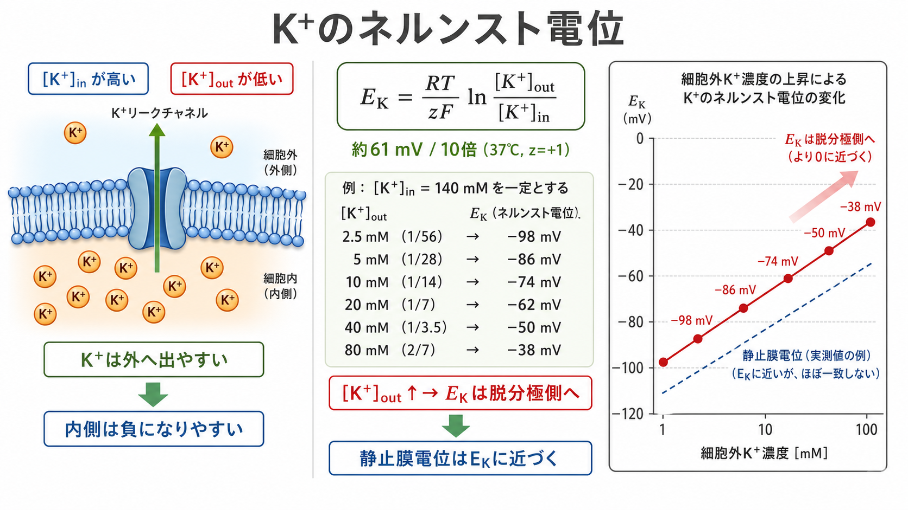
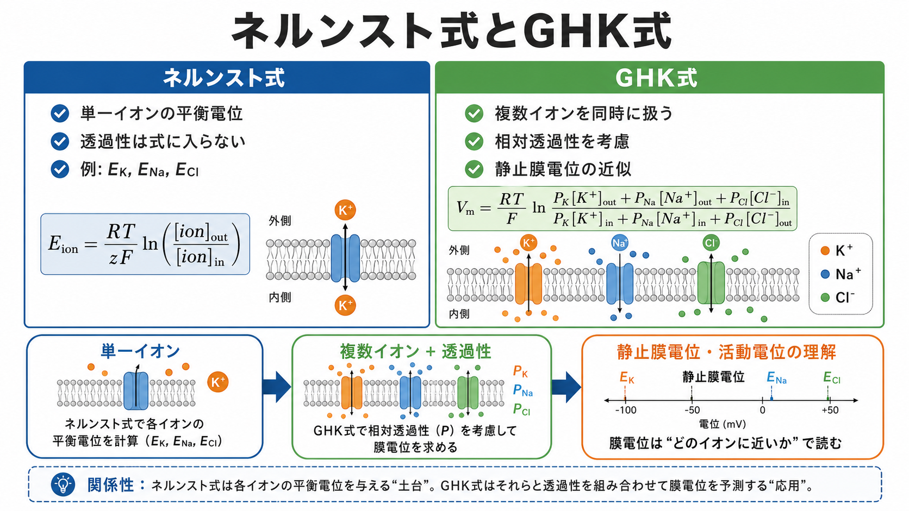

---
title: "ネルンスト電位とは何か"
description: "単一イオンの平衡電位を理解し、静止膜電位・活動電位・イオンチャネルの基礎として整理する。"
aliases:
  - "ネルンスト電位"
  - "平衡電位"
  - "Nernst potential"
tags:
  - neuroscience
  - basic-neuroscience
  - membrane-potential
  - obsidian
created: "2026-04-27"
updated: "2026-04-27"
draft: true
publish: false
status: draft
enableToc: true
---

# ネルンスト電位とは何か

## 要点

- ネルンスト電位とは、ある単一イオンについて、濃度勾配による力と電気的な力がつり合い、正味の流れが 0 になる膜電位である[1]。
- 平衡電位は「内外濃度が等しい状態」ではない。濃度差が残ったまま、電気的な引き戻しが拡散を打ち消す点である[1][2]。
- ニューロンの静止膜電位は、主に K+ の平衡電位に近いが、Na+、Cl-、Ca2+ などの透過性も加わるため、単一のネルンスト電位だけでは決まらない[2][4]。
- [[イオンチャネルとは何か]]を読むとき、チャネルを通るイオン電流の向きは「現在の膜電位」と「そのイオンのネルンスト電位」の差で考えると見通しがよい[6][7]。

## この記事で答える問い

この記事では、[[ニューロンとは何か]]、[[軸索小丘はなぜ発火の起点になるのか]]、[[軸索はどのように情報を遠くへ伝えるのか]]を理解するための前提として、次の問いに答える。

1. ネルンスト電位は何を表す値なのか。
2. なぜ濃度差があるのに、ある電位では正味のイオン移動が止まるのか。
3. 静止膜電位や活動電位を理解するとき、ネルンスト電位をどう使えばよいのか。
4. ネルンスト式と Goldman-Hodgkin-Katz 式は何が違うのか。

## まず結論

ネルンスト電位は、単一イオンにとっての「行きたい膜電位」である。たとえば K+ は細胞内に多く、K+ だけを通す膜があれば、濃度勾配によって外へ出ようとする。K+ が外へ出ると、細胞内には相対的に負の電荷が残る。すると、正電荷である K+ は電気的には内側へ引き戻される。外向きの濃度勾配と内向きの電気勾配が等しくなった膜電位が、K+ のネルンスト電位である[1][2]。

この値は、神経生理学ではしばしば $E_K$、$E_{Na}$、$E_{Cl}$、$E_{Ca}$ のように書かれる。膜電位 $V_m$ があるイオンの平衡電位 $E_{ion}$ から離れているほど、そのイオンが開いたチャネルを通って流れようとする「駆動力」が大きい。したがってネルンスト電位は、膜電位を単なる電圧としてではなく、どのイオンがどちら向きに流れやすいかを読むための基準線になる[6][7]。

## 背景

ニューロンは脂質二重層の膜で囲まれており、膜の内外で Na+、K+、Cl-、Ca2+ などの濃度が異なる。脂質二重層そのものは多くのイオンを通しにくいため、実際のイオン移動は主にチャネル、トランスポーター、ポンプに依存する[7]。

静止膜電位は、細胞が興奮していないときの膜内外の電位差である。伝統的には「細胞外を 0 mV としたときの細胞内電位」として表す。多くのニューロンで静止膜電位が負になるのは、K+ 透過性が相対的に大きく、膜電位が K+ の平衡電位に引き寄せられるためである。ただし、Na+ や Cl- などの漏れ透過性もあるため、静止膜電位は $E_K$ と完全には一致しない[2]。

## 基本概念

### 濃度勾配

濃度勾配とは、ある物質が濃い側から薄い側へ広がろうとする傾向である。K+ が細胞内に多く細胞外に少ない場合、K+ だけを通すチャネルが開くと、K+ は濃度勾配に従って外へ動きやすい。

### 電気勾配

イオンは電荷をもつため、電位差にも影響される。K+ のような陽イオンは、負の側へ引き寄せられる。K+ が細胞外へ出ると細胞内は相対的に負になり、その負電位は K+ を内側へ引き戻す。

### 電気化学勾配

実際のイオン移動は、濃度勾配と電気勾配を合わせた電気化学勾配で決まる。ネルンスト電位は、この二つの力がちょうどつり合う膜電位である。したがって、ネルンスト電位では「イオンがまったく動かない」というより、内向きと外向きの移動が釣り合い、正味の流れが 0 になると考えるのが正確である[1][2]。

## 仕組み

ネルンスト式は、単一イオンの平衡電位を次のように表す[1][2]。

$$
E_{ion} = \frac{RT}{zF}\ln\frac{[ion]_{out}}{[ion]_{in}}
$$

ここで、$R$ は気体定数、$T$ は絶対温度、$z$ はイオンの価数、$F$ はファラデー定数、$[ion]_{out}$ と $[ion]_{in}$ は細胞外・細胞内のイオン濃度である。生理学では、37℃付近で常用対数を使い、1価イオンについておおよそ次の形で近似されることが多い[2][3]。

$$
E_{ion} \approx \frac{61.5\ \mathrm{mV}}{z}\log_{10}\frac{[ion]_{out}}{[ion]_{in}}
$$

K+ の場合、$z=+1$ であり、細胞内濃度が細胞外濃度より高いため、$\log([K^+]_{out}/[K^+]_{in})$ は負になる。その結果、$E_K$ は負の値になる。Na+ の場合は細胞外濃度が細胞内濃度より高いため、$E_{Na}$ は正の値になりやすい。Cl- は $z=-1$ の陰イオンなので、同じ濃度比でも符号の読み方が陽イオンとは逆になる。

### 駆動力として読む

ネルンスト電位の実用的な読み方は、現在の膜電位 $V_m$ と $E_{ion}$ を比べることである。単純化すれば、あるイオン電流は次のように書ける[7]。

$$
I_{ion} = g_{ion}(V_m - E_{ion})
$$

$g_{ion}$ はそのイオンのコンダクタンス、つまり通りやすさである。チャネルが閉じていれば $g_{ion}$ は小さく、駆動力があっても電流はほとんど流れない。チャネルが開いて $g_{ion}$ が大きくなると、膜電位はそのイオンの平衡電位へ近づく方向に動く。

この考え方は活動電位の理解に直結する。電位依存性 Na+ チャネルが開くと、膜電位は正の $E_{Na}$ に向かって脱分極する。遅れて K+ チャネルが開くと、膜電位は負の $E_K$ に向かって再分極・過分極する[5][6]。

## 図解

ネルンスト式は「単一イオンの平衡電位」を与える式である。一方、実際の静止膜では複数のイオンが同時に透過し、それぞれの透過性も異なる。この状況を扱う代表的な式が Goldman-Hodgkin-Katz 式である[4][5]。

大まかに言えば、ネルンスト式は $E_K$、$E_{Na}$、$E_{Cl}$ のように「各イオンの基準電位」を計算する。GHK 式は、それらのイオン濃度に加えて相対透過性を考慮し、膜全体の電位を近似する。したがって、GHK 式はネルンスト式の代わりというより、複数イオンが関与する膜電位を読むための拡張である。

## 臨床・研究との接続

ネルンスト電位は、個別の診断や治療指示を直接与える概念ではない。しかし、神経細胞・筋細胞・心筋細胞の興奮性を理解するための土台であり、電解質濃度の変化が細胞の興奮しやすさにどう影響するかを考える基礎になる[2]。

たとえば細胞外 K+ 濃度が上がると、$[K^+]_{out}/[K^+]_{in}$ が大きくなり、$E_K$ は 0 mV に近づく。K+ 透過性が静止膜電位に強く効いている細胞では、これは静止膜電位を脱分極側へ動かしうる。研究では、このような関係がパッチクランプ法、電位固定法、計算モデルを読むときの基本語彙になる[5][7]。

## よくある誤解

### 誤解1: 平衡電位では内外濃度が等しい

平衡電位は、濃度差が消えた状態ではない。むしろ、濃度差があるからこそ電気的な力とのつり合いが生じる。膜電位を作るために移動するイオン量は、全体の濃度を大きく変えるほど多くないことも重要である[2]。

### 誤解2: 静止膜電位は K+ のネルンスト電位そのものである

静止膜電位は $E_K$ に近いことが多いが、完全には一致しない。静止時にも Na+ や Cl- などの透過性があり、さらに細胞種ごとにチャネル発現やイオン濃度が異なるためである[2][4]。

### 誤解3: ネルンスト式だけで活動電位全体を説明できる

ネルンスト式は各イオンの到達先を与えるが、チャネルがいつ、どの程度開くかは別問題である。活動電位には、電位依存性チャネルの時間変化、コンダクタンス、膜容量、軸索の形態などが関わる。Hodgkin と Katz の研究は、外液 Na+ の変化が活動電位に影響することを示し、後の活動電位モデルの重要な基礎になった[5]。

## 関連ノート

既存の関連ノート:

- [[ニューロンとは何か]]
- [[イオンチャネルとは何か]]
- [[軸索小丘はなぜ発火の起点になるのか]]
- [[軸索はどのように情報を遠くへ伝えるのか]]
- [[アストロサイトはシナプスと代謝をどう支えているのか]]

今後の作成候補:

- 静止膜電位とは何か
- 活動電位とは何か
- Goldman-Hodgkin-Katz 式とは何か
- 電気化学勾配とは何か
- Na+/K+ ポンプとは何か

MOC 更新候補:

- `content/00_MOC/` 内の脳・神経科学系 MOC に、本記事を「膜電位・興奮性」の基礎ノートとして追加する。

## 理解チェック

1. ネルンスト電位を「濃度勾配」と「電気勾配」という言葉で説明できるか。
2. K+ の細胞内濃度が高いとき、$E_K$ が負になりやすい理由を説明できるか。
3. $V_m$ が $E_{Na}$ よりずっと負のとき、Na+ チャネルが開くと膜電位はどちらへ動きやすいか。
4. ネルンスト式と GHK 式の違いを、「単一イオン」と「複数イオン + 透過性」という観点で説明できるか。

## 参考文献

[1] Purves D, Augustine GJ, Fitzpatrick D, et al., editors. (2001). The Forces that Create Membrane Potentials. *Neuroscience. 2nd edition*. Sinauer Associates; NCBI Bookshelf. https://www.ncbi.nlm.nih.gov/books/NBK11102/

[2] Chrysafides SM, Bordes SJ, Sharma S. (2023). *Physiology, Resting Potential*. StatPearls, NCBI Bookshelf. https://www.ncbi.nlm.nih.gov/books/NBK538338/

[3] Henley CL. *Membrane Potential*. Foundations of Neuroscience, Michigan State University Libraries. https://openbooks.lib.msu.edu/neuroscience/chapter/membrane-potential/

[4] Goldman DE. (1943). Potential, impedance, and rectification in membranes. *The Journal of General Physiology*, 27(1), 37-60. https://doi.org/10.1085/jgp.27.1.37

[5] Hodgkin AL, Katz B. (1949). The effect of sodium ions on the electrical activity of the giant axon of the squid. *The Journal of Physiology*, 108(1), 37-77. https://doi.org/10.1113/jphysiol.1949.sp004310

[6] Purves D, Augustine GJ, Fitzpatrick D, et al., editors. (2001). The Ionic Basis of Action Potentials. *Neuroscience. 2nd edition*. Sinauer Associates; NCBI Bookshelf. https://www.ncbi.nlm.nih.gov/books/NBK10897/

[7] Hille B, Catterall WA. Electrically Excitable Cells. In: Siegel GJ, Agranoff BW, Albers RW, et al., editors. *Basic Neurochemistry: Molecular, Cellular and Medical Aspects. 6th edition*. Lippincott-Raven; NCBI Bookshelf. https://www.ncbi.nlm.nih.gov/books/NBK28091/

## 未解決問題

- 実際の細胞では、細胞内外イオン濃度、チャネル密度、細胞形態、発達段階が同時に変わる。どの条件で単純なネルンスト式の直観が十分に使え、どの条件で GHK 式や詳細なコンパートメントモデルが必要になるかは、目的に応じて判断する必要がある。
- Cl- の平衡電位は、発達段階や細胞内 Cl- 調節機構によって大きく変わる。抑制性シナプスを理解するには、GABA_A 受容体を「常に抑制性」とみなすのではなく、$E_{Cl}$ と膜電位の関係を見る必要がある。
