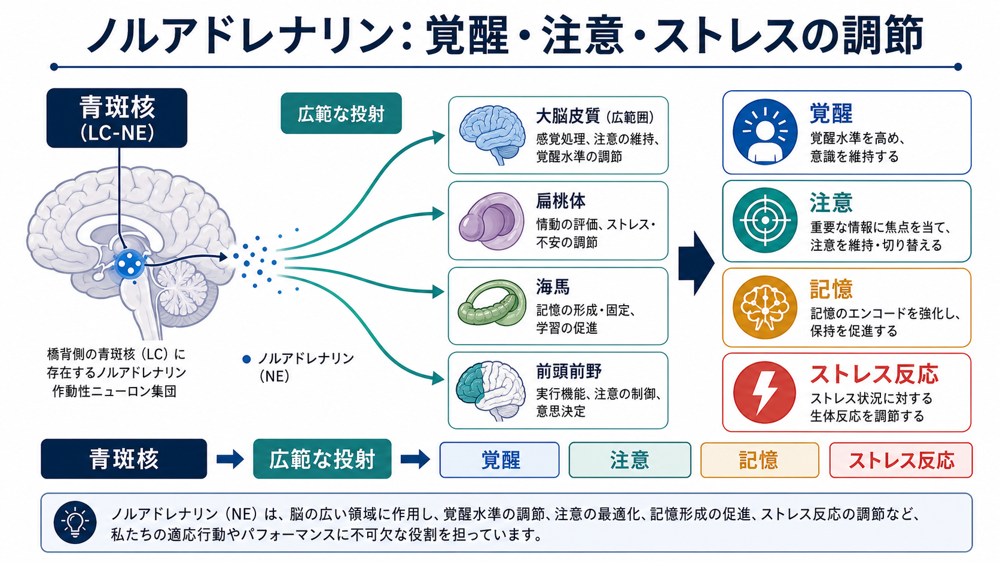
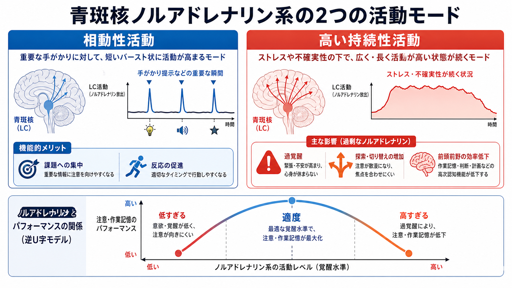
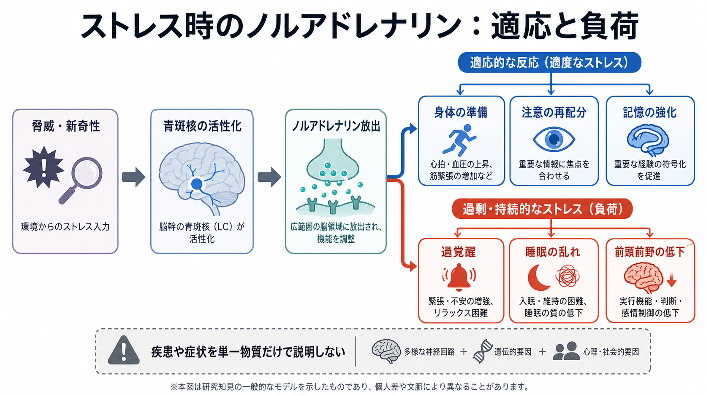

---
title: "ノルアドレナリンは覚醒とストレスにどう関わるのか"
description: "青斑核ノルアドレナリン系を、覚醒、注意、ストレス反応、記憶、前頭前野機能との関係から整理する。"
aliases:
  - "ノルアドレナリン"
  - "ノルエピネフリン"
  - "青斑核ノルアドレナリン系"
  - "LC-NE系"
tags:
  - neuroscience
  - basic-neuroscience
  - obsidian
  - 脳・神経科学/基礎神経科学
created: "2026-04-27"
updated: "2026-04-27"
draft: true
publish: false
status: draft
enableToc: true
---

# ノルアドレナリンは覚醒とストレスにどう関わるのか

## 要点

- ノルアドレナリンは、脳内では主に青斑核を中心とする広範な調節系として働き、覚醒水準、注意の切り替え、感覚処理、記憶、ストレス反応に関わる。
- 青斑核ノルアドレナリン系は、単に「興奮させる物質」ではない。相動性活動は重要な手がかりへの反応を助け、持続性活動の上昇は探索、警戒、ストレス負荷と関係しやすい[1][2]。
- 適度なノルアドレナリンは前頭前野の注意・作業記憶を支えるが、強いストレスでカテコールアミンが過剰になると、前頭前野の高次制御は低下しやすい[6]。
- 情動的に重要な出来事では、扁桃体や海馬と連動して記憶固定を強めることがある。ただし、強すぎる、または長引くストレスでは過覚醒や不安、睡眠の乱れなどと結びつきうる[7]。
- 臨床や研究で重要なのは、「ノルアドレナリンが多いか少ないか」だけでなく、脳部位、受容体、時間スケール、状況を分けて読むことである。

## この記事で答える問い

この記事では、[[ニューロンとは何か]]、[[シナプスとは何か]]、[[神経伝達物質はどのように放出されるのか]]、[[受容体にはどのような種類があるのか]]の基礎を前提に、次の問いに答える。

1. ノルアドレナリンは脳のどこから出て、どこへ作用するのか。
2. なぜ覚醒、注意、ストレス反応と同時に語られるのか。
3. 「適度な覚醒」と「過覚醒」は、どのように区別して考えればよいのか。
4. 臨床・研究でノルアドレナリン系を読むとき、どんな単純化を避けるべきか。

## まず結論

ノルアドレナリンは、脳を「いま何に備えるべきか」という状態へ調整する信号の一つである。青斑核は脳幹の小さな核だが、大脳皮質、海馬、扁桃体、小脳、脊髄などへ広く投射し、局所の回路をまとめて調整できる[3][4]。そのため、ノルアドレナリンは目を覚ます、注意を向ける、驚く、危険に備える、情動的な出来事を記憶に残す、といった複数の現象に関わる。

ただし、「ノルアドレナリン = ストレス物質」と考えると誤解が生じる。適度なノルアドレナリンは、手がかりを検出し、行動をすばやく切り替え、前頭前野の表象を支える。強いストレスや制御不能な状況では、ノルアドレナリン、ドパミン、グルココルチコイドなどが同時に変化し、前頭前野の高次制御が弱まり、扁桃体を含む情動・防御系の影響が相対的に強くなる[6][7]。

## 背景

ノルアドレナリンはカテコールアミン系の神経伝達物質であり、末梢では交感神経系や副腎髄質を通じて身体の覚醒・循環調整に関わる。脳内では、主に青斑核を中心とするニューロン群がノルアドレナリンを放出する。英語圏では norepinephrine と noradrenaline が使われ、薬理学や神経科学では NE または NA と略されることが多い。

青斑核は橋にある小さな核で、古くから上行性網様体賦活系の一部として、睡眠と覚醒、警戒、注意に関わると考えられてきた[5]。その後の研究では、青斑核ノルアドレナリン系は単なる「覚醒スイッチ」ではなく、感覚処理、注意の再配分、認知的柔軟性、記憶固定、意思決定、ストレス反応にまたがる調節系として理解されるようになった[2][3]。

この広さは、[[神経細胞の種類はどのように分類されるのか]]で扱う「調節性投射ニューロン」の典型例である。局所回路の速い興奮・抑制だけでなく、脳全体の状態を変える働きがある。

## 基本概念

### 青斑核

青斑核は脳幹の橋にあるノルアドレナリン作動性ニューロンの主要な集団である。サイズは小さいが、前脳、脳幹、小脳、脊髄へ広範に投射する[3][4]。このため、青斑核の活動変化は、一つの局所シナプスだけでなく、複数の脳領域の信号対雑音比、可塑性、行動準備性を同時に変えうる。

### 覚醒

覚醒とは、単に「眠っていない」ことではない。眠気が強い低覚醒、落ち着いた集中、警戒、過覚醒のように、脳と身体の準備状態には段階がある。青斑核ノルアドレナリン系は、睡眠・覚醒、瞳孔径、自律神経、注意、行動反応と結びついた覚醒調節に関わる[4][8]。

### 注意と再定位

注意は、何か一つに集中する働きだけではない。予想外の音、危険な手がかり、新奇な出来事に気づき、現在の課題から別の対象へ向き直る働きも含む。Sara と Bouret は、青斑核が「向き直り」や「再定位」を促し、皮質ネットワークを新しい状況へリセットする役割をもつと整理している[2]。

### ストレス反応

ストレス反応は、脅威や負荷に対して身体と脳を準備する適応反応である。ノルアドレナリンはこの反応の一部だが、単独でストレス全体を説明するわけではない。HPA軸、グルココルチコイド、ドパミン、セロトニン、GABA、免疫・炎症系なども関わる。ノルアドレナリンは、その中で「警戒」「注意の再配分」「情動的記憶」「身体の準備」をつなぐ重要な経路として位置づけられる。

## 仕組み

### 1. 低すぎても高すぎても認知は不安定になる

青斑核ノルアドレナリン系では、活動水準が低すぎると眠気や反応性低下が起こりやすく、適度な水準では重要な手がかりへの反応と課題遂行が支えられる。一方、過度に高い持続性活動は、課題への安定した集中よりも探索、警戒、切り替え、落ち着かなさと結びつきやすい[1]。

この考え方は、覚醒とパフォーマンスの逆U字型関係として理解しやすい。低覚醒ではぼんやりし、適度な覚醒では集中しやすく、過覚醒では注意が散りやすい。ただし、実際の脳では課題、個人差、薬理作用、睡眠状態、情動文脈によって形が変わるため、単純なグラフだけで説明しきれるわけではない。

### 2. 相動性活動は「重要な手がかり」への反応を助ける

Aston-Jones と Cohen の適応ゲイン理論では、青斑核ニューロンには相動性活動と持続性活動のモードがあると整理される[1]。相動性活動とは、課題に関係する手がかりや意思決定の結果に対して短く活動が高まるパターンである。このモードでは、現在の課題に関係する行動を促進し、重要な入力を回路上で通りやすくする。

たとえば、注意を向けている刺激が現れたとき、ノルアドレナリンは感覚処理や前頭前野・頭頂葉系の状態を調整し、反応をすばやく選びやすくする。これは[[活動電位はどのように発生するのか]]のような単一細胞レベルの発火だけでなく、回路全体の「どの入力を重く扱うか」を変える働きである。

### 3. 持続性活動の上昇は探索・警戒・ストレス負荷と関わる

持続性活動が高まると、現在の課題に安定して集中するよりも、周囲を探索したり、別の行動へ切り替えたりしやすくなると考えられている[1]。これは悪いことだけではない。環境が不確実で、今の行動方針が役に立たないときには、注意を広げて別の手がかりを探すことが適応的である。

しかし、脅威が強い、制御不能である、慢性的に続くといった状況では、警戒状態が過剰になりやすい。ストレス時にはノルアドレナリンだけでなく、ドパミンやグルココルチコイドも変化し、前頭前野の作業記憶・抑制制御・柔軟な判断が弱まりやすい[6]。この状態では、複雑に考えるよりも、素早い防御反応や習慣的反応に行動制御が寄りやすくなる。

### 4. 受容体と脳部位で作用が変わる

ノルアドレナリンは、α1、α2、βアドレナリン受容体などを介して作用する。受容体の種類、発現部位、濃度、タイミングによって、神経細胞の興奮性、シナプス可塑性、伝達物質放出、細胞内シグナルは変わる[3][6]。したがって、「ノルアドレナリンが上がると必ず注意が良くなる」とは言えない。

前頭前野では、適度なα2A受容体刺激が作業記憶ネットワークを支える一方、強いストレス下で高濃度のカテコールアミンが作用すると、cAMP-HCNチャネルやPKC系などを介して前頭前野のネットワーク機能が弱まると整理されている[6]。一方、扁桃体では情動的に重要な経験の記憶固定を強める方向に働くことがある[7]。

## 図解

図1は、青斑核から広い脳領域への投射と、覚醒、注意、記憶、ストレス反応のつながりをまとめた概念地図である。重要なのは、ノルアドレナリンを一つの機能に閉じ込めず、「脳全体の状態を調整する系」として見ることである。

図2は、相動性活動と高い持続性活動の違いを示している。相動性活動は重要な手がかりに対する短い応答で、課題への集中や反応促進と関係しやすい。高い持続性活動は、ストレス、不確実性、探索、過覚醒と関係しやすい[1][2]。

図3は、ストレス時のノルアドレナリンを、適応的な準備と過剰負荷の両面から整理している。短期的な警戒や注意の再配分は役に立つが、長期化・過剰化すると、睡眠、情動、前頭前野機能に負荷がかかりやすい。

## 臨床・研究との接続

ノルアドレナリン系は、睡眠・覚醒、不安、PTSD、うつ病、ADHD、疼痛、依存、神経変性疾患など、多くの臨床領域で話題になる。ただし、本記事は教育・研究目的の基礎整理であり、個別の診断や治療方針を示すものではない。

研究では、瞳孔径が青斑核ノルアドレナリン系と関係する指標としてよく使われる。瞳孔径は比較的測定しやすく、覚醒や認知負荷、手がかりへの反応を推定する手がかりになる[8]。しかし、瞳孔は光反射、上丘、自律神経、課題条件、薬物、疲労の影響も受けるため、「瞳孔が広がった = 青斑核が活動した」と直接同一視するのは危うい[8]。

臨床的にも同じ注意が必要である。過覚醒、不眠、注意散漫、情動記憶の強さなどにノルアドレナリン系が関係する可能性はあるが、症状は複数の神経系、身体状態、生活環境、心理社会的要因が重なって生じる。したがって、「この症状はノルアドレナリン過剰である」と単純化せず、仮説の一部として扱うのがよい。

## よくある誤解

### 誤解1: ノルアドレナリンはストレスだけの物質である

ノルアドレナリンはストレス反応に深く関わるが、それだけではない。覚醒、注意、感覚処理、記憶固定、認知的柔軟性にも関わる[2][3]。ストレスはその働きが強く見えやすい文脈の一つである。

### 誤解2: 多いほど集中できる

低すぎる覚醒では集中しにくいが、高すぎる覚醒でも集中は崩れやすい。前頭前野の作業記憶や注意制御には適度なカテコールアミン環境が必要で、強いストレスでは機能が落ちやすい[6]。

### 誤解3: 青斑核は脳全体を一様にオンにする

青斑核は広範に投射するが、作用は一様ではない。標的領域、受容体、局所回路、活動モードによって効果は異なる。感覚皮質、前頭前野、扁桃体、海馬では、同じノルアドレナリンでも意味が変わりうる[3][7]。

### 誤解4: 瞳孔を見ればノルアドレナリン活動がそのまま分かる

瞳孔径は有用な非侵襲的指標だが、青斑核だけの出力ではない。光反射、上丘、自律神経、認知負荷、薬物、疲労が関わるため、実験では照明、課題設計、ベースライン、時系列解析を慎重に扱う必要がある[8]。

## 関連ノート

既存ノート:

- [[ニューロンとは何か]]
- [[神経細胞の種類はどのように分類されるのか]]
- [[シナプスとは何か]]
- [[神経伝達物質はどのように放出されるのか]]
- [[受容体にはどのような種類があるのか]]
- [[ドパミンは報酬だけの物質なのか]]
- [[GABAは脳で何をしているのか]]
- [[活動電位はどのように発生するのか]]

関連ノート候補:

- 青斑核とは何か
- 覚醒水準と注意の逆U字関係
- 前頭前野はストレスでなぜ機能低下しやすいのか
- 扁桃体と情動記憶
- 瞳孔径は認知状態の指標になるのか
- HPA軸とは何か
- 交感神経系とストレス反応

MOC更新候補:

- `content/00_MOC/MOC｜脳・神経科学.md` に、基礎神経科学・神経調節系のノートとして本記事を追加する。

## 理解チェック

1. 青斑核ノルアドレナリン系が、少数の細胞群でありながら広い認知・情動機能に関わるのはなぜか。
2. 相動性活動と高い持続性活動は、注意や行動選択にどのような違いをもたらすと考えられるか。
3. 適度なノルアドレナリンが前頭前野を支え、過剰なストレスが前頭前野を弱める、という説明で注意すべき点は何か。
4. 瞳孔径を青斑核ノルアドレナリン系の指標として使うとき、どのような交絡要因があるか。
5. 「ノルアドレナリン = ストレス物質」という説明では、どの機能が見落とされるか。

## 参考文献

[1] Aston-Jones, G., & Cohen, J. D. (2005). An integrative theory of locus coeruleus-norepinephrine function: adaptive gain and optimal performance. *Annual Review of Neuroscience, 28*, 403-450. https://doi.org/10.1146/annurev.neuro.28.061604.135709

[2] Sara, S. J., & Bouret, S. (2012). Orienting and reorienting: the locus coeruleus mediates cognition through arousal. *Neuron, 76*(1), 130-141. https://doi.org/10.1016/j.neuron.2012.09.011

[3] Sara, S. J. (2009). The locus coeruleus and noradrenergic modulation of cognition. *Nature Reviews Neuroscience, 10*(3), 211-223. https://doi.org/10.1038/nrn2573

[4] Samuels, E. R., & Szabadi, E. (2008). Functional neuroanatomy of the noradrenergic locus coeruleus: its roles in the regulation of arousal and autonomic function part I: principles of functional organisation. *Current Neuropharmacology, 6*(3), 235-253. https://doi.org/10.2174/157015908785777229

[5] Foote, S. L., Bloom, F. E., & Aston-Jones, G. (1983). Nucleus locus ceruleus: new evidence of anatomical and physiological specificity. *Physiological Reviews, 63*(3), 844-914. https://doi.org/10.1152/physrev.1983.63.3.844

[6] Arnsten, A. F. T. (2009). Stress signalling pathways that impair prefrontal cortex structure and function. *Nature Reviews Neuroscience, 10*(6), 410-422. https://doi.org/10.1038/nrn2648

[7] Roozendaal, B., McEwen, B. S., & Chattarji, S. (2009). Stress, memory and the amygdala. *Nature Reviews Neuroscience, 10*(6), 423-433. https://doi.org/10.1038/nrn2651

[8] Joshi, S., & Gold, J. I. (2020). Pupil size as a window on neural substrates of cognition. *Trends in Cognitive Sciences, 24*(6), 466-480. https://doi.org/10.1016/j.tics.2020.03.005

## 未解決問題

- 青斑核の細胞集団の多様性を、覚醒、注意、ストレス、記憶の機能分類とどの程度対応づけられるのか。
- ヒトの瞳孔径、fMRI、脳幹画像、行動指標を組み合わせたとき、青斑核ノルアドレナリン系の相動性・持続性活動をどこまで分離できるのか。
- 急性ストレスと慢性ストレスで、前頭前野、扁桃体、海馬へのノルアドレナリン作用はどの時間スケールで変化するのか。
- 個人差、睡眠、薬物、発達段階、精神症状が、ノルアドレナリン系の覚醒調節にどのように影響するのか。

## 更新ログ

- 2026-04-27: 初稿作成。青斑核、覚醒、注意、ストレス反応、前頭前野、扁桃体、瞳孔径との関係を整理し、図解と参考文献を追加。
