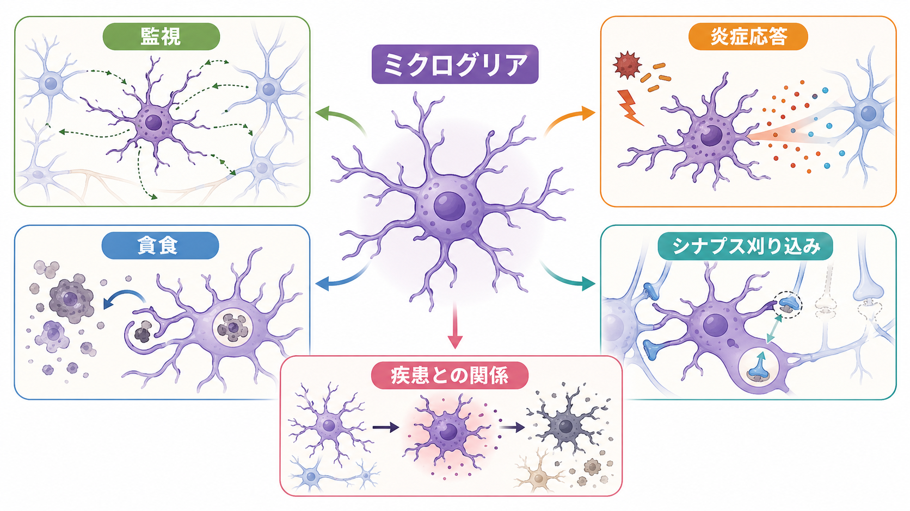
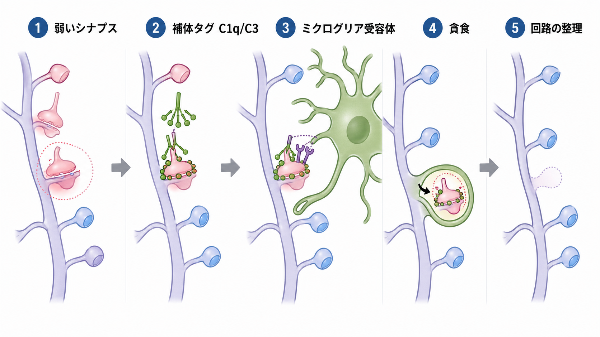
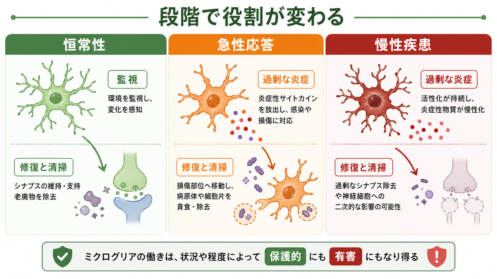

---
title: "ミクログリアは脳の免疫細胞として何をしているのか"
description: "ミクログリアを脳内の免疫細胞として、監視、炎症応答、貪食、シナプス刈り込み、神経疾患との関係から整理する。"
aliases:
  - "ミクログリア"
  - "脳の免疫細胞"
  - "小膠細胞"
tags:
  - neuroscience
  - basic-neuroscience
  - neuroimmunology
  - glia
  - obsidian
created: "2026-04-27"
updated: "2026-04-27"
draft: true
publish: false
status: draft
enableToc: true
---

# ミクログリアは脳の免疫細胞として何をしているのか

## 要点

- ミクログリアは中枢神経系に常在する免疫系の細胞で、単なる「炎症細胞」ではなく、発達、恒常性維持、修復、疾患応答に関わる [1]。
- 健常時にも突起を動かして周囲を監視し、損傷や感染の兆候があれば局所的に反応する [2]。
- 死細胞、細胞片、異常タンパク質、不要になったシナプス成分を貪食し、脳内環境の清掃と再編成を担う [3][5]。
- 発達期のシナプス刈り込みでは、補体系などの免疫分子が「除去候補」の目印として働くことがある [4][5]。
- 神経変性疾患では、ミクログリアは保護的にも有害にも働きうる。したがって「活性化しているから悪い」と単純化しないことが重要である [6][7]。

## この記事で答える問い

この記事では、「ミクログリアは脳の免疫細胞として何をしているのか」を、免疫応答だけでなく、[[ニューロンとは何か]]、[[グリア細胞は単なる支持細胞なのか]]、[[アストロサイトはシナプスと代謝をどう支えているのか]] と接続しながら整理する。中心になる問いは次の4つである。

1. ミクログリアは、健常な脳で何を監視しているのか。
2. 炎症応答と貪食は、どのように脳を守るのか。
3. シナプス刈り込みは、なぜ免疫細胞の仕事と関係するのか。
4. 疾患研究では、ミクログリアをどのように慎重に読むべきか。

## まず結論

ミクログリアは、脳内に常駐するマクロファージ系の細胞であり、脳組織の「警備」「清掃」「修復」「回路整理」を担う。健常時には静止しているのではなく、細い突起を絶えず伸縮させて周囲の環境、ニューロン、シナプス、血管周囲の変化を探っている [2]。損傷、感染、細胞死、タンパク質凝集などが起こると、受容体を介して危険信号を検出し、炎症性メディエーターの産生、貪食、組織修復の支援へと振る舞いを変える [1][7]。

ただし、ミクログリアは「善玉」か「悪玉」かで分けられる細胞ではない。発達中の脳では不要なシナプスや細胞を除去して回路形成を助けるが、慢性炎症や神経変性の文脈では、過剰な炎症応答や不適切なシナプス除去が病態に関わる可能性もある [5][6]。同じ貪食や炎症応答でも、時期、部位、疾患段階、周囲の細胞状態によって意味が変わる。

## 背景

脳は、血液脳関門や髄膜、脳脊髄液などに守られた特殊な環境である。そのため、末梢の免疫細胞がいつも自由に出入りするわけではない。ミクログリアはこの環境の中に常在し、中枢神経系に固有の免疫監視を行う細胞として位置づけられる [1]。

歴史的には、神経科学は長くニューロン中心に発展してきた。しかし現在では、脳機能はニューロンだけでなく、アストロサイト、オリゴデンドロサイト、ミクログリアなどのグリア細胞との相互作用として理解される。ミクログリアはその中でも、免疫受容体、サイトカイン、補体、貪食機構を使って、神経回路の状態に介入する点が特徴である [1][6]。

## 基本概念

### ミクログリア

ミクログリアは中枢神経系に常在する免疫細胞で、脳内の組織マクロファージに相当する。末梢血から常に補充される細胞というより、通常条件では脳内で維持される常在細胞として理解される [1]。形態は固定的ではなく、細かく枝分かれした突起をもつ状態から、損傷部位へ集まる状態、貪食に適した状態まで変化する。

### 炎症応答

炎症応答とは、感染、損傷、異常タンパク質、細胞死などに対して、細胞が危険信号を認識し、サイトカイン、ケモカイン、補体、活性酸素種などを通じて周囲の環境を変える反応である。急性の炎症は異物や細胞片の除去、修復の開始に役立つ。一方で、長期化した炎症は周囲のニューロンやシナプスに負担をかける可能性がある [7]。

### 貪食

貪食は、細胞が死細胞、細胞片、シナプス成分、病原体、異常タンパク質などを取り込み、分解する働きである。成体海馬の神経新生では、多くの新生細胞が成熟前にアポトーシスを起こし、ミクログリアがそれらを速やかに除去することが示されている [3]。この清掃が滞ると、炎症や組織環境の乱れにつながりうる。

### シナプス刈り込み

シナプス刈り込みとは、発達や経験依存的な回路再編成の過程で、過剰または不適切なシナプス結合が除去される現象である。補体 C1q や C3 が関わる古典的補体経路は、発達期の中枢神経系で不要なシナプス除去に関わることが示されている [4]。さらに、ミクログリアは補体受容体などを介して、活動依存的に一部のシナプス成分を貪食する [5]。

## 仕組み

### 1. 周囲を監視する

「休止状態」という言葉からは動いていない細胞が想像されやすいが、ミクログリアの突起は健常時にも活発に動いている。二光子イメージング研究では、成体脳内のミクログリアが突起を絶えず伸縮させ、脳実質を広く監視していることが示された [2]。損傷が起こると、ミクログリアは局所へ突起を集め、損傷部位を囲い込むような反応を示す。

この監視は、単に「敵を探す」だけではない。ニューロン活動、シナプス状態、細胞外ATP、損傷関連分子、補体、サイトカインなど、さまざまな信号を読み取ることで、ミクログリアは脳内の状態変化を検出する。

### 2. 炎症を起こして守る

ミクログリアは病原体由来分子や損傷関連分子を認識すると、炎症応答を開始する。これにより、異物除去、死細胞処理、修復の準備、周辺細胞への警告が進む [1][7]。急性損傷では、この反応は防御的である。

問題は、炎症応答が長期化した場合である。慢性的な炎症環境では、サイトカインや補体系の持続的な変化がシナプス機能やニューロンの生存に影響する可能性がある [7]。そのため、ミクログリアの炎症は「起こること自体が悪い」のではなく、「どの文脈で、どれくらい続き、何を標的にしているか」を見る必要がある。

### 3. いらなくなったものを貪食する

ミクログリアは、脳内の清掃担当として死細胞や細胞片を取り込む。発達期や成体神経新生では、細胞死は異常ではなく、回路や細胞集団を整える通常の過程でもある。ミクログリアは、こうしたアポトーシス細胞を炎症を大きく広げずに片づけることで、局所環境を安定させる [3]。

貪食の対象は死細胞だけではない。発達期のシナプス成分、損傷後の残骸、疾患で蓄積するタンパク質凝集体なども対象になりうる [1][7]。ただし、貪食が常に有益とは限らない。除去すべきでないシナプスや細胞成分まで巻き込まれると、回路機能の低下につながる可能性がある。

### 4. シナプスを刈り込む

発達期の脳では、最初に多めに作られた結合の一部が経験や活動に応じて整理される。このとき、免疫系で使われる補体分子が、シナプス除去の目印として再利用されることがある [4]。

古典的補体経路では、C1q や C3 が不要なシナプスの除去に関わる。視覚系の発達研究では、ミクログリアがシナプス前成分を取り込み、この過程が神経活動と CR3/C3 シグナルに依存することが示された [5]。つまり、ミクログリアは「免疫細胞でありながら、神経回路の彫刻家としても働く」と言える。

ただし、この仕組みを一般化しすぎてはいけない。すべてのシナプス刈り込みが同じ分子機構で起こるわけではなく、脳領域、発達段階、経験、疾患状態によって関与する経路は異なる。

## 図解

下の図は、ミクログリアの役割を「恒常性」「急性応答」「慢性疾患」の3つに分けて比較したものである。重要なのは、同じミクログリアでも、状況によって役割が変わる点である。

| 状態 | 主な働き | 読み方の注意 |
|---|---|---|
| 恒常性 | 環境監視、死細胞処理、シナプスとの相互作用 | 「休止」ではなく、動的な監視状態として見る |
| 急性応答 | 損傷部位への反応、炎症性シグナル、貪食、修復支援 | 防御的役割が大きい場合がある |
| 慢性疾患 | 持続的炎症、異常タンパク質への反応、シナプス変化 | 保護と障害が混在し、疾患段階で意味が変わる |

## 臨床・研究との接続

ミクログリア研究は、アルツハイマー病、パーキンソン病、多発性硬化症、脳損傷、精神疾患研究などと接続している。アルツハイマー病では、ミクログリアがアミロイドβや損傷関連分子を検出し、貪食や炎症応答を行う一方、慢性化した反応が神経炎症やシナプス障害に関わる可能性が議論されている [7]。

近年は、ミクログリアを単一の「活性化細胞」として扱うのではなく、疾患関連ミクログリア、恒常性ミクログリア、発達期ミクログリアなど、遺伝子発現や空間的位置、疾患段階によって異なる状態として理解する方向に進んでいる [6]。

臨床的には、ミクログリアに関する知見は治療標的の候補を与えるが、個別の診断や治療方針を直接決めるものではない。ミクログリアを抑えればよい、あるいは活性化すればよい、という単純な介入ではなく、どの時期にどの機能を調整するのかが研究課題である。

## よくある誤解

### 誤解1: ミクログリアは病気のときだけ働く

ミクログリアは健常時にも突起を動かして周囲を監視し、シナプスや細胞外環境と相互作用している [2]。病気のときだけ現れる細胞ではない。

### 誤解2: 炎症はすべて悪い

急性炎症は防御と修復に必要である。問題になるのは、反応の過剰さ、持続時間、標的、組織文脈である [1][7]。

### 誤解3: ミクログリアの活性化は M1/M2 で分ければ十分

マクロファージ由来の M1/M2 分類は便利な入口だが、脳内ミクログリアの状態を十分に表すとは限らない。実際のミクログリア状態は、連続的、多次元的、文脈依存的である [8]。

### 誤解4: シナプス刈り込みは単なる破壊である

発達期のシナプス刈り込みは、過剰な結合を整理して機能的な回路を作る過程である [4][5]。ただし、疾患や老化の文脈で同様の経路が不適切に働く可能性もあるため、発達における有益な刈り込みと病的なシナプス喪失は分けて考える必要がある。

## 関連ノート

- 既存MOC: [[MOC｜脳・神経科学]]
- 既存ノート: [[ニューロンとは何か]]
- 既存ノート: [[グリア細胞は単なる支持細胞なのか]]
- 既存ノート: [[アストロサイトはシナプスと代謝をどう支えているのか]]
- 関連ノート候補: シナプスとは何か
- 関連ノート候補: シナプス刈り込みはなぜ重要なのか
- 関連ノート候補: 神経炎症とは何か
- 関連ノート候補: アルツハイマー病ではミクログリアは何をしているのか

MOC更新候補:

- `content/00_MOC/MOC｜脳・神経科学.md` の基礎神経科学または神経免疫の項目に本記事へのリンクを追加する候補。
- 並列記事生成との衝突を避けるため、本タスクではMOCファイル自体は更新していない。

## 理解チェック

1. ミクログリアが「休止状態」でも実際には動的に働いていると言える理由を説明できるか。
2. 炎症応答が保護的にも有害にもなりうる理由を、時間経過と文脈から説明できるか。
3. 貪食の対象として、死細胞、細胞片、シナプス成分、異常タンパク質を区別できるか。
4. 補体 C1q/C3 とミクログリアが、発達期のシナプス刈り込みにどう関わるかを説明できるか。
5. M1/M2 分類だけでミクログリアを説明することの限界を説明できるか。

## 参考文献

[1] Li, Q., & Barres, B. A. (2018). Microglia and macrophages in brain homeostasis and disease. *Nature Reviews Immunology, 18*, 225-242. https://doi.org/10.1038/nri.2017.125

[2] Nimmerjahn, A., Kirchhoff, F., & Helmchen, F. (2005). Resting microglial cells are highly dynamic surveillants of brain parenchyma in vivo. *Science, 308*(5726), 1314-1318. https://doi.org/10.1126/science.1110647

[3] Sierra, A., Encinas, J. M., Deudero, J. J. P., Chancey, J. H., Enikolopov, G. N., Overstreet-Wadiche, L. S., Tsirka, S. E., & Maletic-Savatic, M. (2010). Microglia shape adult hippocampal neurogenesis through apoptosis-coupled phagocytosis. *Cell Stem Cell, 7*(4), 483-495. https://doi.org/10.1016/j.stem.2010.08.014

[4] Stevens, B., Allen, N. J., Vazquez, L. E., Howell, G. R., Christopherson, K. S., Nouri, N., Micheva, K. D., Mehalow, A. K., Huberman, A. D., Stafford, B., Sher, A., Litke, A. M., Lambris, J. D., Smith, S. J., John, S. W. M., & Barres, B. A. (2007). The classical complement cascade mediates CNS synapse elimination. *Cell, 131*(6), 1164-1178. https://doi.org/10.1016/j.cell.2007.10.036

[5] Schafer, D. P., Lehrman, E. K., Kautzman, A. G., Koyama, R., Mardinly, A. R., Yamasaki, R., Ransohoff, R. M., Greenberg, M. E., Barres, B. A., & Stevens, B. (2012). Microglia sculpt postnatal neural circuits in an activity and complement-dependent manner. *Neuron, 74*(4), 691-705. https://doi.org/10.1016/j.neuron.2012.03.026

[6] Butovsky, O., & Weiner, H. L. (2018). Microglial signatures and their role in health and disease. *Nature Reviews Neuroscience, 19*, 622-635. https://doi.org/10.1038/s41583-018-0057-5

[7] Sarlus, H., & Heneka, M. T. (2017). Microglia in Alzheimer's disease. *Journal of Clinical Investigation, 127*(9), 3240-3249. https://doi.org/10.1172/JCI90606

[8] Ransohoff, R. M. (2016). A polarizing question: do M1 and M2 microglia exist? *Nature Neuroscience, 19*, 987-991. https://doi.org/10.1038/nn.4338

## 未解決問題

- 発達期に有益なシナプス刈り込みと、疾患で起こる有害なシナプス喪失を、分子レベルでどこまで区別できるのか。
- ミクログリアの保護的機能だけを高め、有害な慢性炎症だけを抑える介入は可能か。
- ヒト脳内のミクログリア状態を、生体内でどの程度精密に測定できるのか。
- マウスで見つかったミクログリア状態や補体依存的刈り込みが、ヒト疾患にどの範囲で対応するのか。

## 更新ログ

- 2026-04-27: 初版作成。ミクログリアの監視、炎症応答、貪食、シナプス刈り込み、疾患との関係、図解、参考文献を整理。
