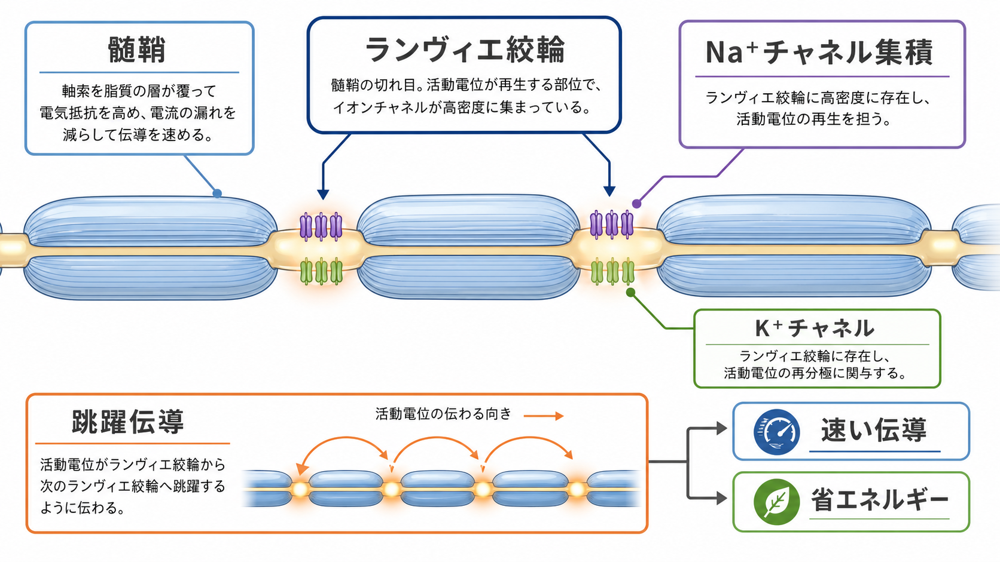
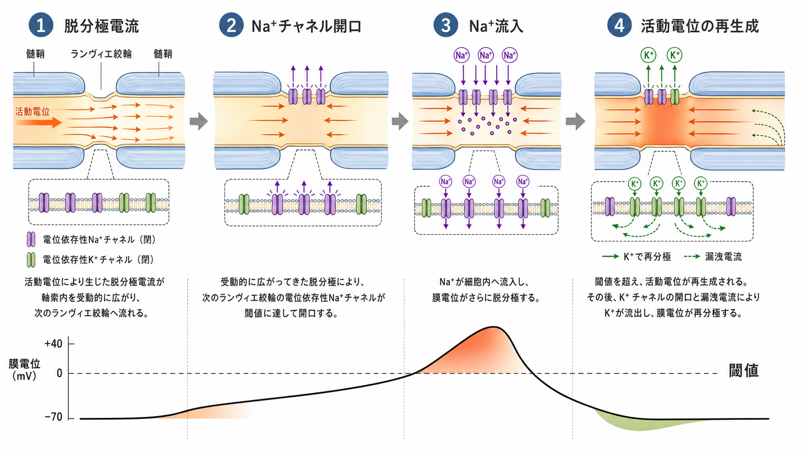
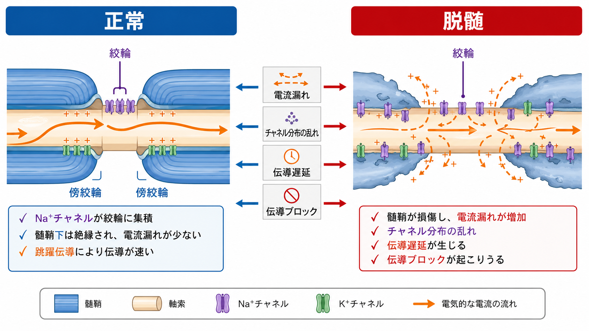

---
title: "ランヴィエ絞輪では何が起きているのか"
description: "ランヴィエ絞輪で電位依存性チャネルが集積し、有髄軸索の跳躍伝導が成立する仕組みを説明する。"
aliases:
  - "ランヴィエ絞輪"
  - "Node of Ranvier"
  - "跳躍伝導"
tags:
  - neuroscience
  - basic-neuroscience
  - obsidian
  - 神経科学/基礎神経科学
created: "2026-04-27"
updated: "2026-04-27"
draft: true
publish: false
status: draft
enableToc: true
---

# ランヴィエ絞輪では何が起きているのか

## 要点

- ランヴィエ絞輪は、有髄軸索の髄鞘と髄鞘の間にある短い非髄鞘化領域で、電位依存性 Na$^+$ チャネルと K$^+$ チャネルが高密度に組織化される場所である[1]。
- 髄鞘は軸索膜の電気容量を下げ、膜からの電流漏れを減らす。これにより、脱分極は髄鞘下を比較的遠くまで伝わり、次の絞輪で活動電位を再生成できる[2]。
- 「活動電位が跳ぶ」という表現は比喩であり、実際には絞輪間を受動的な電気的変化が広がり、各絞輪で能動的なチャネル開口が起こる[3]。
- 絞輪、傍絞輪、傍髄鞘部は分子構成が異なる区画であり、この区画化が崩れると伝導速度低下や伝導ブロックにつながりうる[4]。

## この記事で答える問い

この記事では、[[軸索はどのように情報を遠くへ伝えるのか]]を理解するために、次の問いに答える。

- ランヴィエ絞輪には、どのようなチャネルや分子足場が集まっているのか。
- 髄鞘があると、なぜ活動電位の伝導が速くなるのか。
- 跳躍伝導は、どの意味で「跳ぶ」のか。
- 脱髄や絞輪構造の異常は、神経伝導に何を起こしうるのか。

## まず結論

ランヴィエ絞輪は、単なる「髄鞘の切れ目」ではない。そこは、有髄軸索の電気信号を次の区間へ渡すために、電位依存性 Na$^+$ チャネル、K$^+$ チャネル、細胞接着分子、細胞骨格足場が集められた微小な発火装置である[1]。

髄鞘に覆われた区間では、軸索膜が外液と直接接する面が少なく、膜容量と漏洩コンダクタンスが小さい。そのため、ある絞輪で生じた脱分極電流は、隣の絞輪まで速く広がりやすい。隣の絞輪が閾値に達すると、Na$^+$ チャネルが開いて活動電位が再生成される。これが跳躍伝導である[2][3]。

## 背景

ニューロンの情報伝達は、[[神経細胞膜はどのように電気信号を生み出すのか]]で扱う膜電位変化に基づく。無髄軸索では、活動電位は膜の各位置で連続的に再生成される。一方、有髄軸索では、活動電位の主要な再生成地点がランヴィエ絞輪に集中する[2]。

この集中は偶然ではない。絞輪には Na$_\mathrm{v}$ チャネルが密に存在し、成熟した哺乳類の絞輪では Na$_\mathrm{v}$1.6 が主要なサブタイプとして局在することが示されている[5]。また、絞輪周辺には傍絞輪と傍髄鞘部があり、それぞれ細胞接着分子や K$^+$ チャネルを含む異なる分子領域を形成する[1][4]。

## 基本概念

### ランヴィエ絞輪

ランヴィエ絞輪は、髄鞘に覆われていない短い軸索膜領域である。ここには電位依存性 Na$^+$ チャネルが高密度に集まり、脱分極が閾値を超えたときに急速な Na$^+$ 流入を起こす[1]。この性質により、絞輪は活動電位の「再点火地点」として働く。

### 傍絞輪と傍髄鞘部

絞輪のすぐ隣には傍絞輪があり、髄鞘を作るグリア細胞の末端ループと軸索膜が接着する。さらに外側の傍髄鞘部には、主に K$^+$ チャネルが配置される。これらの境界は、チャネルが不適切な場所へ拡散するのを防ぐ障壁として働く[1][4]。

### 髄鞘

髄鞘は[[オリゴデンドロサイトとシュワン細胞は何が違うのか]]で扱うグリア細胞が形成する多層膜である。中枢神経系ではオリゴデンドロサイト、末梢神経系ではシュワン細胞が主に髄鞘形成を担う。髄鞘は軸索を単に「覆う」のではなく、膜容量を下げ、電流漏れを減らし、絞輪での活動電位再生成を効率化する[2]。

## 仕組み

### 1. ある絞輪で活動電位が起こる

絞輪の膜電位が閾値を超えると、電位依存性 Na$^+$ チャネルが開く。Na$^+$ が細胞内へ流入し、局所的な脱分極が急速に増幅される。これは[[イオンチャネルとは何か]]で扱うチャネル開閉の典型例である。

### 2. 脱分極電流が髄鞘下を広がる

開いた Na$^+$ チャネルによって生じた正電荷の流れは、軸索内部を前方へ広がる。髄鞘に覆われた区間では、膜を横切る電流漏れが小さく、膜容量も低いため、電圧変化が比較的速く遠くへ届く[2][6]。

### 3. 次の絞輪が閾値に達する

隣の絞輪に到達した脱分極が十分大きいと、その絞輪の Na$^+$ チャネルが開く。すると活動電位はそこで新たに再生成される。つまり、信号は髄鞘区間を「完全に無視して空間を飛ぶ」のではなく、受動的な電気的広がりと、絞輪での能動的な再生を組み合わせて進む[3][6]。

### 4. K$^+$ 電流とポンプが回復を支える

活動電位後には K$^+$ 電流などが膜電位の再分極に関与し、長期的なイオン勾配の維持には[[ナトリウムカリウムポンプは神経活動にどう関わるのか]]が重要である。ポンプは活動電位そのものの瞬間的な立ち上がりを作るわけではないが、繰り返し発火できる環境を維持する。

## 図解

上の図を言葉で整理すると、跳躍伝導は次のような連鎖である。

1. 絞輪 A で Na$^+$ チャネルが開き、活動電位が発生する。
2. 髄鞘下の軸索内部を脱分極電流が前方へ広がる。
3. 絞輪 B の膜電位が閾値を超える。
4. 絞輪 B の Na$^+$ チャネルが開き、活動電位が再生成される。
5. その後、K$^+$ 電流や漏洩電流が膜電位を回復方向へ戻す。

この過程で重要なのは、絞輪だけでなく、絞輪間の髄鞘区間も電気回路の一部であることだ。近年の実験・モデリング研究は、髄鞘内側の軸索周囲空間が単純な絶縁体ではなく、伝導波形の時空間構造に関与する可能性を示している[6]。

## 臨床・研究との接続

脱髄や傍絞輪構造の破綻では、髄鞘による絶縁とチャネル区画化が乱れる。その結果、脱分極電流が次の絞輪を十分に閾値まで押し上げられず、伝導遅延や伝導ブロックが起こりうる[4]。これは多発性硬化症などの中枢神経疾患を考えるうえで重要だが、この記事は教育・研究目的の概説であり、個別の診断や治療判断を目的としない。

絞輪長も固定的な値ではない。ラット視神経や皮質軸索を調べた研究では、絞輪長のばらつきが伝導速度を調整しうることがモデルから示された[7]。これは、髄鞘の厚さや節間長だけでなく、絞輪そのものの微細構造も情報到達時刻の調整因子になりうることを示す。

## よくある誤解

### 誤解1: 活動電位そのものが空間を飛び越える

「跳躍」は便利な比喩だが、軸索内部の電流と膜電位変化は連続的な電気過程である。各絞輪で活動電位が再生成されるため、観察上は絞輪から絞輪へ発火地点が移るように見える[3][6]。

### 誤解2: 髄鞘は単なる絶縁テープである

髄鞘は絶縁性を高めるだけでなく、傍絞輪や傍髄鞘部を通じてチャネル配置を支え、軸索とグリアの相互作用によって絞輪の分子構造を維持する[1][4]。

### 誤解3: Na$^+$ チャネルだけ見れば十分である

Na$^+$ チャネル集積は中心的だが、K$^+$ チャネル、細胞接着分子、アンクリンやスペクトリンなどの足場タンパク質も重要である。これらが組み合わさって、絞輪・傍絞輪・傍髄鞘部という区画が成立する[1]。

## 関連ノート

- [[軸索はどのように情報を遠くへ伝えるのか]]
- [[イオンチャネルとは何か]]
- [[神経細胞膜はどのように電気信号を生み出すのか]]
- [[オリゴデンドロサイトとシュワン細胞は何が違うのか]]
- [[ナトリウムカリウムポンプは神経活動にどう関わるのか]]
- [[静止膜電位はどのように生じるのか]]
- [[軸索小丘はなぜ発火の起点になるのか]]

## 理解チェック

1. ランヴィエ絞輪に電位依存性 Na$^+$ チャネルが集まると、跳躍伝導にどのような利点があるか。
2. 「活動電位が跳ぶ」という表現は、どの点で比喩なのか。
3. 髄鞘が膜容量と電流漏れを下げることは、隣の絞輪の発火にどう関係するか。
4. 傍絞輪や傍髄鞘部の区画化が壊れると、なぜ伝導が不安定になりうるか。

## MOC更新候補

- `content/00_MOC/` 配下の脳・神経科学または基礎神経科学 MOC に、本記事へのリンクを追加する候補。
- 並列生成ジョブとの競合を避けるため、この作業では MOC ファイル本体は更新しない。

## 未解決問題

- 絞輪長やチャネル密度の可塑的変化が、学習や発達における情報到達時刻の調整へどの程度寄与するかは、まだ研究課題である。
- 中枢神経系と末梢神経系では、絞輪形成と維持に関わる分子機構に共通点と相違点がある。疾患ごとの伝導異常を理解するには、この違いを分けて考える必要がある。

## 参考文献

[1] Rasband, M. N., & Peles, E. (2021). Mechanisms of node of Ranvier assembly. *Nature Reviews Neuroscience*, 22, 7-20. https://doi.org/10.1038/s41583-020-00406-8

[2] Carroll, S. L. (2017). The Molecular and Morphologic Structures That Make Saltatory Conduction Possible in Peripheral Nerve. *Journal of Neuropathology & Experimental Neurology*, 76(4), 255-257. https://doi.org/10.1093/jnen/nlx013

[3] Huxley, A. F., & Stämpfli, R. (1949). Evidence for saltatory conduction in peripheral myelinated nerve fibres. *The Journal of Physiology*, 108(3), 315-339. https://doi.org/10.1113/jphysiol.1949.sp004335

[4] Arancibia-Cárcamo, I. L., & Attwell, D. (2014). The node of Ranvier in CNS pathology. *Acta Neuropathologica*, 128, 161-175. https://doi.org/10.1007/s00401-014-1305-z

[5] Caldwell, J. H., Schaller, K. L., Lasher, R. S., Peles, E., & Levinson, S. R. (2000). Sodium channel Na$_\mathrm{v}$1.6 is localized at nodes of Ranvier, dendrites, and synapses. *Proceedings of the National Academy of Sciences of the United States of America*, 97(10), 5616-5620. https://doi.org/10.1073/pnas.090034797

[6] Cohen, C. C. H., Popovic, M. A., Klooster, J., Weil, M.-T., Möbius, W., Nave, K.-A., & Kole, M. H. P. (2020). Saltatory Conduction along Myelinated Axons Involves a Periaxonal Nanocircuit. *Cell*, 180(2), 311-322.e15. https://doi.org/10.1016/j.cell.2019.11.039

[7] Arancibia-Cárcamo, I. L., Ford, M. C., Cossell, L., Ishida, K., Tohyama, K., & Attwell, D. (2017). Node of Ranvier length as a potential regulator of myelinated axon conduction speed. *eLife*, 6, e23329. https://doi.org/10.7554/eLife.23329
