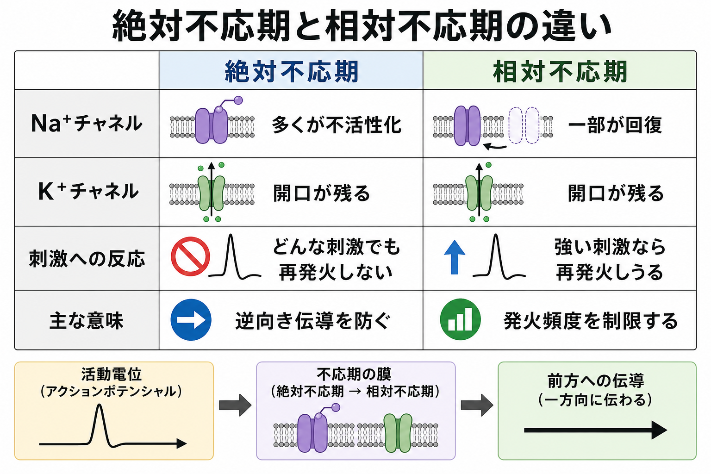

---
title: "不応期はなぜ生じるのか"
description: "絶対不応期・相対不応期とNa+チャネル不活性化、K+チャネル開口の関係を整理する。"
aliases:
  - "不応期"
  - "絶対不応期"
  - "相対不応期"
  - "神経の不応期"
tags:
  - neuroscience
  - basic-neuroscience
  - obsidian
created: "2026-04-27"
updated: "2026-04-27"
draft: true
publish: false
status: draft
enableToc: true
---

# 不応期はなぜ生じるのか

## 要点

- 不応期とは、活動電位の直後に、同じ場所の膜が次の活動電位を起こしにくくなる短い時間である。
- 絶対不応期では、多くの電位依存性Na+チャネルが不活性化しており、どれだけ強い刺激でも通常の活動電位を再発火できない。
- 相対不応期では、Na+チャネルの一部は回復しているが、K+チャネル開口や過分極が残るため、通常より強い刺激が必要になる。
- 不応期は、発火頻度に上限を与え、軸索上の活動電位が後戻りせず前方へ進むことにも寄与する[1]。

## この記事で答える問い

この記事では、[[活動電位はどのように発生するのか]]、[[イオンチャネルとは何か]]、[[神経細胞膜はどのように電気信号を生み出すのか]]を読むときに重要になる、次の問いに答える。

1. 絶対不応期と相対不応期は何が違うのか。
2. Na+チャネルの「閉じる」と「不活性化」は何が違うのか。
3. K+チャネルの開口は、なぜ相対不応期に関係するのか。
4. 不応期は、活動電位の一方向性や発火頻度とどう結びつくのか。

## まず結論

不応期は、単に「ニューロンが疲れる時間」ではない。主因は、活動電位を作った直後の電位依存性Na+チャネルが、すぐには再び開けない不活性化状態に入ることである。Na+チャネルは、脱分極で開くが、開いた直後にミリ秒程度の時間スケールで不活性化し、膜が再分極してからでないと回復しにくい[2][3]。

このため、活動電位の直後には、同じ場所で次のNa+電流を十分に立ち上げられない。これが絶対不応期である。その後、Na+チャネルの一部が回復しても、K+チャネルの遅れた開口が続き、膜電位が静止膜電位よりも負に寄ることがある。この段階では、発火は不可能ではないが、通常より強い脱分極が必要になる。これが相対不応期である[1][4]。

## 背景

活動電位は、膜電位がしきい値を超えると、電位依存性Na+チャネルが開き、Na+が細胞内へ流入することで急速に立ち上がる。続いてNa+チャネルは不活性化し、電位依存性K+チャネルが遅れて開くことでK+が細胞外へ流出し、膜は再分極する。HodgkinとHuxleyの古典的モデルは、このNa+透過性とK+透過性の時間依存・電位依存の変化で活動電位を定量的に説明した[2]。

この「Na+チャネルはすぐ開くが、すぐ不活性化する」「K+チャネルは遅れて開き、しばらく閉じにくい」という時間差が、不応期を理解する鍵である。つまり不応期は、活動電位の後に偶然生じる副作用ではなく、活動電位そのものを作るチャネル動態の一部である。

## 基本概念

### 絶対不応期

絶対不応期は、活動電位の直後に、同じ膜領域が新たな活動電位を発生できない期間である。この時期には、多くの電位依存性Na+チャネルが不活性化状態にある。不活性化状態のNa+チャネルは、単に閉じているだけではない。膜がまだ脱分極しているあいだは、追加の刺激を与えても再び開くことができない状態である[3][5]。

重要なのは、絶対不応期が「刺激が弱いから発火しない」期間ではないことだ。Na+チャネルの利用可能性そのものが失われているため、刺激を強くしても、十分な再生的Na+流入を作れない。

### 相対不応期

相対不応期は、絶対不応期の後に続く、発火しにくいが不可能ではない期間である。この段階では、一部のNa+チャネルは不活性化から回復している。しかし、K+チャネルの開口が残り、K+流出が続くため、膜電位はしきい値から遠ざかりやすい[1][4]。

そのため、相対不応期では、通常より強い刺激なら活動電位が起こりうる。ただし、発火しても振幅や立ち上がりが小さくなる場合があり、細胞種やチャネル構成によって回復の仕方は異なる。

### 「閉状態」と「不活性化状態」の違い

Na+チャネルには、少なくとも「閉状態」「開状態」「不活性化状態」という区別がある。閉状態のチャネルは、脱分極すれば開ける。開状態のチャネルは、Na+を通して活動電位の立ち上がりを作る。不活性化状態のチャネルは、膜が脱分極していても開けない。再び利用可能になるには、膜が再分極し、チャネルが不活性化から回復する必要がある[3][5]。

この区別を入れると、「なぜ活動電位の直後に、さらに脱分極させても発火しないのか」が理解しやすい。問題は脱分極の量だけではなく、Na+チャネルが開ける状態に戻っているかどうかである。

## 仕組み

### 1. 脱分極でNa+チャネルが開く

刺激によって膜電位がしきい値を超えると、電位依存性Na+チャネルが開く。Na+は細胞外に多く、細胞内は相対的に負であるため、Na+は電気化学的勾配に従って細胞内へ流入する。このNa+流入がさらに脱分極を強め、さらにNa+チャネルを開かせる。これが活動電位の急峻な立ち上がりである[2]。

### 2. Na+チャネルはすぐ不活性化する

Na+チャネルは、開きっぱなしにはならない。脱分極で開いた後、短時間で不活性化状態へ移る。Catterallのレビューが整理するように、電位依存性Na+チャネルは、活動電位を開始するだけでなく、速い不活性化によってNa+電流を停止させる分子機構も持っている[3]。

この不活性化により、膜がまだ脱分極しているあいだは、同じチャネルをすぐ再利用できない。したがって、活動電位の直後には、次の活動電位を立ち上げるためのNa+チャネル数が足りない。これが絶対不応期の中心である。

### 3. K+チャネルが遅れて開き、膜を再分極させる

Na+チャネルの不活性化と並行して、電位依存性K+チャネルが遅れて開く。K+は主に細胞内から細胞外へ流出し、膜電位を再び負の方向へ戻す。これが再分極である。K+チャネルの閉鎖はNa+チャネルの不活性化より遅れることが多く、活動電位後に膜が一時的により負になる過分極を作ることがある[1][4]。

### 4. Na+チャネルが回復しても、膜はまだ発火しにくい

膜が再分極すると、Na+チャネルは不活性化から回復し始める。しかし相対不応期では、すべてのNa+チャネルがすぐ利用可能になるわけではない。さらに、K+チャネル開口が残ると、刺激による脱分極がK+流出で打ち消されやすい。このため、通常より強い入力でなければしきい値に届かない。

この段階では「Na+チャネルの回復不足」と「K+コンダクタンスの残存」が重なって、発火しにくさを作っている。どちらの寄与が大きいかは、ニューロンの種類、軸索・樹状突起・細胞体などの場所、直前の発火履歴によって変わる[4][6]。

## 図解

下の図は、絶対不応期と相対不応期を、Na+チャネル、K+チャネル、刺激への反応、機能的意味に分けて整理したものである。

| 区分 | 主なチャネル状態 | 刺激への反応 | 機能的意味 |
|---|---|---|---|
| 絶対不応期 | 多くのNa+チャネルが不活性化 | どれだけ強い刺激でも再発火しにくい | 活動電位の直後に同じ場所が再発火するのを防ぐ |
| 相対不応期 | Na+チャネルは一部回復、K+チャネル開口が残る | 強い刺激なら再発火しうる | 発火頻度を制限し、回路の時間構造を作る |

## 臨床・研究との接続

不応期は、個々のニューロンの発火頻度を決めるだけでなく、神経回路がどれくらい速く情報を符号化できるかにも関係する。最大発火頻度は、Na+チャネルの回復速度、K+チャネルの種類、軸索初節やランヴィエ絞輪でのチャネル密度などに依存する。哺乳類中枢神経のニューロンでは、イカ巨大軸索より多様な電位依存性コンダクタンスがあり、活動電位の幅、発火頻度、発火パターンは細胞種によって大きく異なる[4]。

臨床的には、電位依存性Na+チャネルの変異や機能変化は、てんかん、片頭痛、運動失調、筋疾患などのチャネル病と関係することがある[3][7]。また、局所麻酔薬やテトロドトキシンのようにNa+チャネルを阻害する物質は、活動電位の発生・伝導を妨げる[7]。ただし、ここでの説明は教育・研究目的の一般的説明であり、個別の診断や治療方針を示すものではない。

研究面では、不応期は単一チャネルの分子構造、電気生理学、計算モデルをつなぐ概念である。Hodgkin-Huxleyモデルでは、Na+活性化・Na+不活性化・K+活性化の時間変化として表現できる。より現代的なモデルでは、速い不活性化だけでなく、遅い不活性化、再起性Na+電流、持続性Na+電流なども、発火頻度やスパイク列の形に影響する[5][6]。

## よくある誤解

### 誤解1: 不応期はニューロンが疲れて休んでいる時間である

不応期は代謝的な疲労というより、膜チャネルの状態遷移によって生じる。活動電位ごとにATPがただちに枯渇するから発火できない、という説明ではない。中心にあるのは、Na+チャネルの不活性化と回復、K+チャネル開口の残存である[1][3]。

### 誤解2: 絶対不応期と相対不応期は刺激強度だけの違いである

刺激強度は相対不応期の理解には重要だが、絶対不応期ではより根本的にNa+チャネルの利用可能性が失われている。したがって「強い刺激なら絶対不応期でも通常通り発火する」と考えるのは不正確である。

### 誤解3: 不応期は活動電位の一方向性だけのためにある

不応期は一方向性伝導に寄与するが、それだけが役割ではない。発火頻度に上限を与え、直前の発火履歴を次のしきい値に反映させ、神経回路の時間的な符号化にも関わる[1][4]。

### 誤解4: K+チャネルは再分極だけに関係し、不応期には関係しない

K+チャネルは再分極を担うだけでなく、相対不応期の発火しにくさにも関わる。K+コンダクタンスが残ると、膜はしきい値から遠ざかり、入力による脱分極も打ち消されやすくなる[1][4]。

## 関連ノート

- [[活動電位はどのように発生するのか]]
- [[活動電位はなぜ一方向に伝わるのか]]
- [[イオンチャネルとは何か]]
- [[神経細胞膜はどのように電気信号を生み出すのか]]
- [[軸索はどのように情報を遠くへ伝えるのか]]
- [[軸索小丘はなぜ発火の起点になるのか]]
- [[静止膜電位はどのように生じるのか]]

今後の作成候補:

- Na+チャネル不活性化とは何か
- K+チャネルは活動電位後に何をしているのか
- 発火頻度は何で決まるのか
- ランヴィエ絞輪では何が起きているのか
- テトロドトキシンはなぜ活動電位を止めるのか

MOC更新候補:

- `content/00_MOC/` の脳・神経科学系MOCに、活動電位・イオンチャネル関連ノートとして追加する。

## 理解チェック

1. 絶対不応期で、強い刺激を与えても再発火しにくい主な理由は何か。
2. Na+チャネルの「閉状態」と「不活性化状態」は何が違うか。
3. 相対不応期で通常より強い刺激が必要になる理由を、Na+チャネルとK+チャネルの両方から説明できるか。
4. 不応期が活動電位の一方向性伝導に寄与する理由を説明できるか。
5. 「不応期はニューロンの疲労である」という説明のどこが不十分か。

## 参考文献

[1] Purves D, Augustine GJ, Fitzpatrick D, et al., editors. (2001). The Refractory Period. *Neuroscience. 2nd edition*. NCBI Bookshelf. https://www.ncbi.nlm.nih.gov/books/NBK11146/

[2] Hodgkin AL, Huxley AF. (1952). A quantitative description of membrane current and its application to conduction and excitation in nerve. *The Journal of Physiology*, 117(4), 500-544. https://doi.org/10.1113/jphysiol.1952.sp004764

[3] Catterall WA. (2012). Voltage-gated sodium channels at 60: structure, function and pathophysiology. *The Journal of Physiology*, 590(11), 2577-2589. https://doi.org/10.1113/jphysiol.2011.224204

[4] Bean BP. (2007). The action potential in mammalian central neurons. *Nature Reviews Neuroscience*, 8, 451-465. https://doi.org/10.1038/nrn2148

[5] Ulbricht W. (2005). Sodium channel inactivation: molecular determinants and modulation. *Physiological Reviews*, 85(4), 1271-1301. https://doi.org/10.1152/physrev.00024.2004

[6] Goldfarb M. (2012). Voltage-gated sodium channel-associated proteins and alternative mechanisms of inactivation and block. *Cellular and Molecular Life Sciences*, 69, 1067-1076. https://doi.org/10.1007/s00018-011-0832-1

[7] Chen I, Lui F. (2023). Neuroanatomy, Neuron Action Potential. *StatPearls*. NCBI Bookshelf. https://www.ncbi.nlm.nih.gov/books/NBK546639/

## 未解決問題

- 細胞種ごとのNa+チャネルサブタイプ、K+チャネル構成、軸索初節構造が、不応期の長さをどの程度決めているのか。
- 速い不活性化、遅い不活性化、持続性Na+電流、再起性Na+電流を、学習用モデルでどこまで単純化してよいのか。
- 不応期の変化が、病的な過興奮や発作性活動のどの段階に最も効いているのか。
