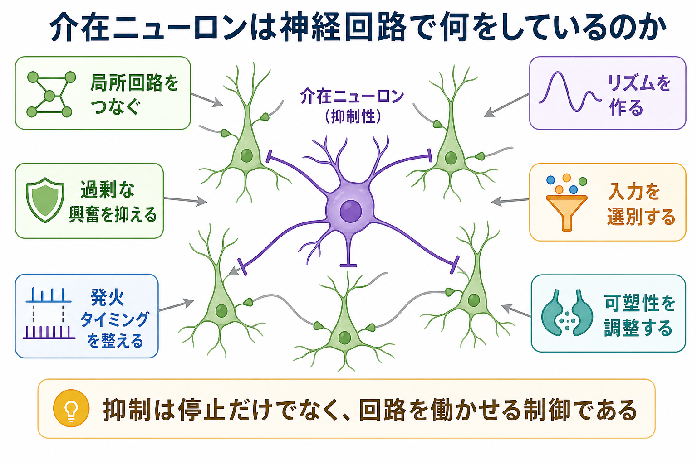
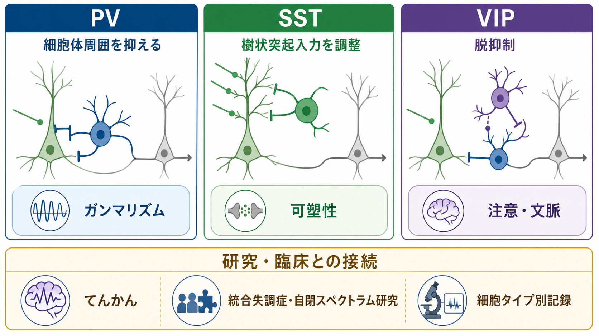

---
title: "介在ニューロンは神経回路で何をしているのか"
description: "局所回路、抑制、発火タイミング、リズム形成における介在ニューロンの役割を、基礎神経科学の観点から説明する。"
aliases:
  - "介在ニューロン"
  - "抑制性介在ニューロン"
  - "インターニューロン"
tags:
  - neuroscience
  - basic-neuroscience
  - obsidian
  - 領域/脳・神経科学
  - 種類/解説
created: "2026-04-27"
updated: "2026-04-27"
draft: true
publish: false
status: draft
enableToc: true
---

# 介在ニューロンは神経回路で何をしているのか

## 要点

- 介在ニューロンは、多くの場合、近くのニューロン同士を結ぶ局所回路の中で働くニューロンである。
- 大脳皮質や海馬でよく議論される介在ニューロンの多くはGABA作動性の抑制性ニューロンで、過剰な興奮を抑えるだけでなく、発火のタイミング、入力の選別、リズム形成を制御する[1][2]。
- 抑制は「活動を止めるブレーキ」だけではない。神経回路がいつ、どこで、どの入力を使って計算するかを決める制御信号でもある[3]。

## この記事で答える問い

この記事では、「介在ニューロンは、神経回路の中で具体的に何をしているのか」を扱う。特に、[[MOC｜脳・神経科学]]の基礎項目として、局所回路、抑制、興奮と抑制のバランス、神経リズム、臨床研究との接続を整理する。

## まず結論

介在ニューロンは、神経回路の「交通整理役」と考えるとわかりやすい。興奮性ニューロンが信号を遠くへ送る主要な出力線だとすれば、介在ニューロンはその周囲で、どの細胞が、どのタイミングで、どれくらい発火するかを細かく調整する。結果として、回路は無秩序に興奮するのではなく、入力を選別し、同期し、必要なリズムを作ることができる[3][5]。

ただし、介在ニューロンは一種類ではない。PV、SST、VIPなどの細胞群は、形態、発火特性、遺伝子発現、接続先が異なり、回路内で異なる役割を担う[2][6]。そのため、介在ニューロンを「抑制する細胞」とだけ見ると、重要な点を見落とす。

## 背景

神経回路は、興奮性入力だけで動くわけではない。興奮が増えるほど情報処理がよくなるなら、脳はすぐに過活動に陥る。実際の回路では、興奮性ニューロンと抑制性ニューロンが相互に作用し、活動量とタイミングを保っている。

大脳皮質では、ニューロン数としては興奮性の錐体細胞が多数を占めるが、少数派のGABA作動性介在ニューロンが回路の時間構造を強く制御する[1][2]。海馬でも、介在ニューロンは場所ごと、細胞層ごと、振動位相ごとに異なる働きをもち、記憶に関わる回路活動のタイミングを組織する[4][7]。

## 基本概念

### 介在ニューロンとは何か

広い意味では、介在ニューロンは感覚ニューロンや運動ニューロンのように長距離の入力・出力を主役とする細胞ではなく、回路内部でニューロン同士を結ぶ細胞を指す。基礎神経科学で「介在ニューロン」と言うと、しばしば大脳皮質や海馬のGABA作動性抑制性ニューロンが念頭に置かれる。

ただし、分類は単純ではない。介在ニューロンは、形、分子マーカー、発火様式、軸索の投射先、シナプス接続、発達起源など、複数の軸で分類される[1][2]。たとえばPV陽性細胞は細胞体周囲を強く抑え、SST陽性細胞は樹状突起入力に関わりやすく、VIP陽性細胞は他の抑制性細胞を抑えることで脱抑制を起こしやすい[2][6]。

### 抑制は何をしているのか

抑制性シナプスは、主にGABA受容体を介して標的細胞の発火しやすさを変える。重要なのは、抑制が単に「活動を下げる」だけではない点である。抑制は、入力が来た直後に発火できる時間窓を短くしたり、複数のニューロンの発火位相をそろえたり、不要な入力を通りにくくしたりする[3][5]。

## 仕組み

### 1. 興奮と抑制のバランスを保つ

神経回路では、興奮性入力が増えると、それに応じて抑制性入力も動員される。これにより、回路全体が過剰に発火し続けることを防ぐ。興奮と抑制のバランスは固定値ではなく、課題、脳状態、発達、学習によって変わる動的な調整である。

### 2. フィードフォワード抑制とフィードバック抑制

フィードフォワード抑制では、外から来た入力が興奮性ニューロンを動かすと同時に介在ニューロンも動かし、少し遅れて標的細胞を抑える。これにより、発火できる時間窓が狭くなる。フィードバック抑制では、興奮性ニューロンが介在ニューロンを活性化し、その介在ニューロンが同じ集団を抑え返す。これは局所回路の活動を自己制御する仕組みである[3]。

### 3. 細胞のどこを抑えるかで意味が変わる

同じ抑制でも、細胞体、軸索起始部、近位樹状突起、遠位樹状突起のどこを抑えるかで効果は変わる。細胞体周囲の抑制は発火出力を強く制御しやすい。樹状突起の抑制は、特定の入力枝で起きる局所的な統合や可塑性に影響しやすい[2][7]。したがって、介在ニューロンは「どの細胞を抑えるか」だけでなく、「細胞のどの部位を抑えるか」によって計算上の意味を変える。

### 4. リズムと同期を作る

脳活動には、シータ、ベータ、ガンマなどの周期的活動が見られる。とくにガンマ帯域の振動では、興奮性ニューロンと高速発火性の抑制性介在ニューロンの相互作用が重要だと考えられている[5]。介在ニューロンが周期的に発火の窓を開閉することで、ニューロン集団はばらばらに発火するのではなく、一定の位相にそろって活動しやすくなる。

### 5. 脱抑制によって入力を通す

抑制性ニューロンをさらに抑制すると、標的の興奮性ニューロンは相対的に活動しやすくなる。これを脱抑制という。VIP陽性介在ニューロンは、他の抑制性介在ニューロンを抑えることで、特定の入力や文脈に応じて回路を通りやすくする仕組みに関わると考えられている[2][6]。

## 図解

次の図は、介在ニューロンの代表的な細胞タイプと機能の対応を単純化して示したものである。実際には各群の中にも多様性があり、PV、SST、VIPだけで全介在ニューロンを説明できるわけではない。

## 臨床・研究との接続

介在ニューロン研究は、てんかん、統合失調症、自閉スペクトラム症などの研究と接続している。たとえば、抑制性回路の異常は過剰同期や発作活動と関係しうるし、PV陽性介在ニューロンやガンマ振動の変化は精神疾患研究でしばしば検討されてきた[5][8]。

ただし、ここで注意が必要である。介在ニューロンの変化があることは、特定の疾患を一対一で説明するものではない。精神医学的診断や治療方針は、回路メカニズムだけで決まるものではない。介在ニューロン研究は、疾患を単純化する道具ではなく、症状や認知機能の背景にある回路仮説を検討するための基礎研究として読むのがよい。

## よくある誤解

### 誤解1: 介在ニューロンはただのブレーキである

ブレーキという比喩は入口としては有用だが、不十分である。介在ニューロンは、活動量を下げるだけでなく、タイミング、入力選択、同期、脱抑制、可塑性を制御する[3][6]。

### 誤解2: 抑制が強いほどよい

抑制は強ければよいものではない。過剰な抑制は必要な発火や可塑性を妨げる可能性がある。一方で抑制が弱すぎると過活動やノイズが増える。重要なのは、課題や状態に応じたバランスである。

### 誤解3: PV、SST、VIPで分類は完結する

PV、SST、VIPは理解しやすい代表例だが、実際の介在ニューロン分類は連続的で多次元的である。近年は、形態、電気生理、遺伝子発現、接続性を組み合わせて細胞タイプを定義する方向に進んでいる[2][6]。

## 関連ノート

- 既存MOC: [[MOC｜脳・神経科学]]
- 関連MOC候補: [[MOC｜精神医学]], [[MOC｜数理モデル・計算論]]
- 今後の作成候補: ニューロンとシナプス、GABA受容体、興奮と抑制のバランス、神経振動、ガンマリズム、海馬、てんかん、統合失調症の神経回路仮説
- MOC更新候補: バッチ統合時に [[MOC｜脳・神経科学]] の基礎神経科学項目へ本記事を追加する。

## 理解チェック

1. 介在ニューロンを「ただ活動を止める細胞」と見ると、どの役割を見落とすか。
2. フィードフォワード抑制とフィードバック抑制は、どちらも抑制だが、回路内で何が違うか。
3. PV、SST、VIPの代表的な役割の違いを一文ずつ説明できるか。
4. ガンマリズムの説明で、介在ニューロンが重要になる理由は何か。

## 未解決問題

- 介在ニューロンの細胞タイプを、分子マーカー、形態、発火特性、接続性のどれで定義するのが最も妥当か。
- ヒトの精神疾患で観察される抑制性回路の変化が、症状の原因、結果、補償反応のどれに当たるのか。
- 動物モデルで見える介在ニューロン機能を、ヒトの認知・症状・治療反応へどこまで対応づけられるか。

## 参考文献

[1] Markram, H., Toledo-Rodriguez, M., Wang, Y., Gupta, A., Silberberg, G., & Wu, C. (2004). Interneurons of the neocortical inhibitory system. *Nature Reviews Neuroscience*, 5, 793-807. https://doi.org/10.1038/nrn1519

[2] Tremblay, R., Lee, S., & Rudy, B. (2016). GABAergic interneurons in the neocortex: From cellular properties to circuits. *Neuron*, 91(2), 260-292. https://doi.org/10.1016/j.neuron.2016.06.033

[3] Isaacson, J. S., & Scanziani, M. (2011). How inhibition shapes cortical activity. *Neuron*, 72(2), 231-243. https://doi.org/10.1016/j.neuron.2011.09.027

[4] Klausberger, T., & Somogyi, P. (2008). Neuronal diversity and temporal dynamics: The unity of hippocampal circuit operations. *Science*, 321(5885), 53-57. https://doi.org/10.1126/science.1149381

[5] Buzsaki, G., & Wang, X.-J. (2012). Mechanisms of gamma oscillations. *Annual Review of Neuroscience*, 35, 203-225. https://doi.org/10.1146/annurev-neuro-062111-150444

[6] Kepecs, A., & Fishell, G. (2014). Interneuron cell types are fit to function. *Nature*, 505, 318-326. https://doi.org/10.1038/nature12983

[7] Pelkey, K. A., Chittajallu, R., Craig, M. T., Tricoire, L., Wester, J. C., & McBain, C. J. (2017). Hippocampal GABAergic inhibitory interneurons. *Physiological Reviews*, 97(4), 1619-1747. https://doi.org/10.1152/physrev.00007.2017

[8] Marin, O. (2012). Interneuron dysfunction in psychiatric disorders. *Nature Reviews Neuroscience*, 13, 107-120. https://doi.org/10.1038/nrn3155

## 更新ログ

- 2026-04-27: 初版作成。介在ニューロンの局所回路、抑制、リズム形成、臨床研究との接続を整理し、図版3点を追加。
