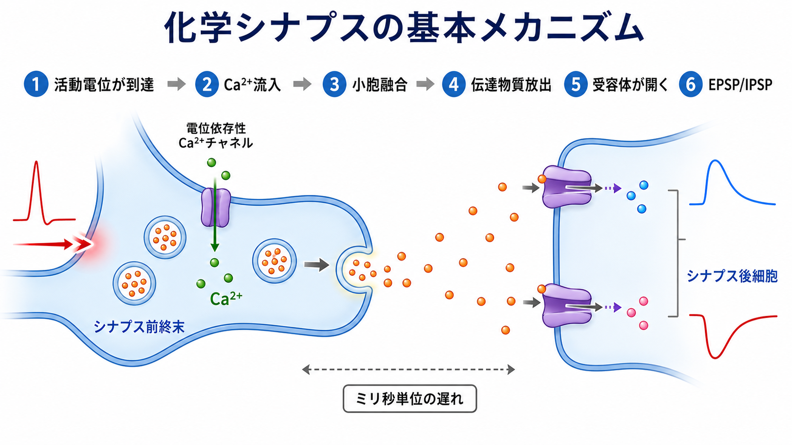
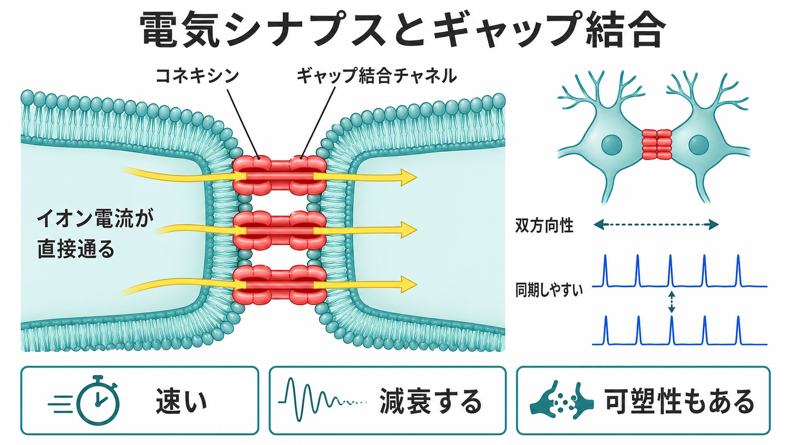

---
title: "化学シナプスと電気シナプスは何が違うのか"
description: "化学シナプスと電気シナプスの違いを、速度、可塑性、方向性、ギャップ結合の観点から比較する。"
aliases:
  - "化学シナプスと電気シナプス"
  - "電気シナプス"
  - "化学シナプス"
tags:
  - neuroscience
  - basic-neuroscience
  - obsidian
created: "2026-04-27"
updated: "2026-04-27"
draft: true
publish: true
status: draft
enableToc: true
---

# 化学シナプスと電気シナプスは何が違うのか

## 要点

- 化学シナプスは、[[活動電位はなぜ一方向に伝わるのか|活動電位]]が軸索終末に到達したあと、Ca2+流入、小胞融合、神経伝達物質の放出、受容体活性化を経て、次の細胞の膜電位を変える接続である[1][2]。
- 電気シナプスは、隣り合う細胞をギャップ結合チャネルで直接つなぎ、イオン電流や小分子を細胞間に通す接続である[4][5]。
- 速度だけを見ると電気シナプスが速い。調整の細かさ、信号の反転・増幅、多様な受容体作用、長期可塑性まで含めると、化学シナプスの方が柔軟である[1][2][3]。
- ただし「電気シナプスは単純で固定的」という理解は古い。電気シナプスも発達、神経修飾、活動履歴によって変化し、化学シナプスと相互作用する[6][7]。

## この記事で答える問い

この記事では、[[ニューロンとは何か|ニューロン]]同士の接続であるシナプスを、次の問いから整理する。

1. 化学シナプスと電気シナプスは、信号を何で伝えるのか。
2. なぜ電気シナプスは速く、化学シナプスは可塑的なのか。
3. 方向性はどのように決まるのか。
4. ギャップ結合は、単なる「穴」ではなく何をしているのか。

## まず結論

化学シナプスは「電気信号をいったん化学信号へ変換し、次の細胞で再び電気的・生化学的応答へ戻す接続」である。変換を挟むため、電気シナプスより遅いが、神経伝達物質、受容体、放出確率、再取り込み、細胞内シグナルの組み合わせによって、信号の強さ・持続時間・符号を細かく変えられる[1][2][3]。

電気シナプスは「隣の細胞と細胞質を低抵抗のチャネルでつなぎ、電流を直接流す接続」である。化学伝達のような小胞放出を待たないため非常に速く、ニューロン集団の同期やタイミング調整に向く[4][5]。一方で、信号は受動的に減衰しやすく、化学シナプスほど多様な符号変換はしにくい。

## 背景

神経回路は、1個の細胞が孤立して計算する仕組みではない。[[樹状突起はどのように情報を受け取るのか|樹状突起]]や細胞体に多数の入力が集まり、[[軸索はどのように情報を遠くへ伝えるのか|軸索]]を通じて別の細胞へ出力される。この接点がシナプスである。

シナプスには大きく分けて化学シナプスと電気シナプスがある。教科書的には、化学シナプスは神経伝達物質、電気シナプスはギャップ結合による直接電流として対比される[1]。しかし実際の回路では、両者は別々に働くというより、同じ細胞集団の中でタイミング、同期性、可塑性を分担しながら相互作用する[6]。

## 基本概念

### 化学シナプス

化学シナプスでは、前シナプス終末と後シナプス膜の間にシナプス間隙がある。活動電位が前シナプス終末に到達すると、電位依存性Ca2+チャネルが開き、Ca2+流入が小胞融合を引き起こす。小胞から放出された神経伝達物質は間隙を拡散し、後シナプス側の受容体に結合する[1][2]。

受容体がイオンチャネル型であれば、Na+、K+、Cl-、Ca2+などの透過性が変わり、[[神経細胞膜はどのように電気信号を生み出すのか|膜電位]]が変化する。代謝型受容体であれば、Gタンパク質やセカンドメッセンジャーを介して、より遅く持続的な調整が起こる。結果として、興奮性または抑制性の入力が生じる。これは[[興奮性ニューロンと抑制性ニューロンは何が違うのか|興奮性・抑制性]]の理解にも直結する。

### 電気シナプス

電気シナプスでは、隣接する細胞膜がギャップ結合で近接し、コネキシンからなるチャネルが細胞間を橋渡しする[4]。このチャネルを通じてイオン電流が直接流れるため、化学シナプスに比べて遅延が小さい。

多くの電気シナプスは双方向性だが、常に完全な双方向とは限らない。チャネルの性質、膜電位差、整流性、接続する細胞の入力抵抗によって、一方向に伝わりやすい場合もある[5][7]。したがって「電気シナプス = 必ず双方向」と覚えるより、「直接結合なので双方向性を取りやすいが、条件によって非対称にもなる」と理解する方が正確である。

## 仕組み

### 化学シナプスの流れ

化学シナプスの典型的な流れは、次のように整理できる。

1. 活動電位が軸索終末へ到達する。
2. 膜の脱分極により電位依存性Ca2+チャネルが開く。
3. 局所的なCa2+上昇が、シナプス小胞と前シナプス膜の融合を促す。
4. 神経伝達物質がシナプス間隙へ放出される。
5. 後シナプス受容体が活性化し、EPSPまたはIPSPなどの後シナプス応答が生じる[1][2]。

この過程には、SNAREタンパク質、シナプトタグミン、コンプレキシンなどの分子機械が関わる[3]。重要なのは、化学シナプスが単なる「物質の放出」ではなく、放出確率、受容体数、受容体サブタイプ、再取り込み、分解、シナプス後肥厚などを通じて細かく調整される点である。

### 電気シナプスの流れ

電気シナプスでは、細胞Aの膜電位変化がギャップ結合を通じて細胞Bへ直接伝わる。これは、伝達物質の放出や受容体結合を待たないため高速である。さらに、多数の細胞が電気的に結合していると、発火タイミングや閾値下の電位変動がそろいやすくなる[5]。

ただし、電気シナプスは「強ければよい」接続ではない。電気的結合が強すぎると個々の細胞の独立性が下がり、弱すぎると同期や高速伝達の役割を果たしにくい。実際の神経回路では、電気シナプスの強度も神経修飾物質や活動依存的な機構で変化しうる[6][7]。

## 図解

| 観点 | 化学シナプス | 電気シナプス |
|---|---|---|
| 伝達媒体 | 神経伝達物質 | イオン電流、小分子 |
| 構造 | シナプス間隙、前シナプス小胞、後シナプス受容体 | ギャップ結合、コネキシン/コネクソン |
| 速度 | ミリ秒単位の遅延がある | ほぼ直接で速い |
| 方向性 | 一方向が基本 | 双方向が多いが、整流性もありうる |
| 可塑性 | 非常に豊か | 以前考えられたより可塑的 |
| 得意な役割 | 符号変換、増幅、抑制、学習、長期調整 | 同期、高速伝達、タイミング調整 |

## 臨床・研究との接続

化学シナプスは、学習・記憶、薬理作用、精神疾患研究、神経変性疾患研究の中心的な対象である。多くの薬物は、神経伝達物質の放出、受容体、再取り込み、分解、細胞内シグナルのどこかに作用する。ただし、基礎的なシナプス機構から個別の診断や治療方針を直接導くことはできない。

電気シナプスは、[[介在ニューロンは神経回路で何をしているのか|介在ニューロン]]集団の同期、網膜、視床、下オリーブ核などの回路機能で重要である[5]。また、電気シナプスと化学シナプスは発達や損傷後の回路再編成でも相互作用する可能性があり、単純な二分法では捉えにくい[6]。

## よくある誤解

### 誤解1: 電気シナプスは原始的で単純な接続である

電気シナプスは高速で直接的だが、単純という意味ではない。コネキシンの種類、チャネルの開閉、整流性、細胞内シグナル、神経修飾によって性質が変わる[4][7]。

### 誤解2: 化学シナプスは遅いので劣っている

化学シナプスは変換を挟むため遅延がある。しかし、その遅延と引き換えに、信号の増幅、抑制、長期的な重み変更、多様な受容体応答が可能になる。学習や柔軟な行動には、この調整可能性が重要である[2][3]。

### 誤解3: 電気シナプスは可塑性がない

かつては、電気シナプスは固定的な低抵抗接続として説明されがちだった。しかし近年のレビューでは、電気シナプスも活動依存的・神経修飾依存的に変化し、回路を動的に再構成する要素として位置づけられている[6][7]。

## 関連ノート

- [[ニューロンとは何か]]
- [[活動電位はなぜ一方向に伝わるのか]]
- [[イオンチャネルとは何か]]
- [[神経細胞膜はどのように電気信号を生み出すのか]]
- [[樹状突起はどのように情報を受け取るのか]]
- [[興奮性ニューロンと抑制性ニューロンは何が違うのか]]
- [[介在ニューロンは神経回路で何をしているのか]]

## MOC更新候補

- `content/00_MOC/` 配下の脳・神経科学または基礎神経科学MOCに、本記事を「シナプス伝達」「神経回路の基本」の項目として追加する候補。
- 並列ジョブとの競合を避けるため、本タスクではMOC本体は更新していない。

## 理解チェック

1. 化学シナプスが電気シナプスより遅くなりやすい理由は何か。
2. 電気シナプスがニューロン集団の同期に向く理由は何か。
3. 「電気シナプスには可塑性がない」という説明が不十分なのはなぜか。
4. 化学シナプスの方向性は、どの構造的非対称性から生じるか。

## 参考文献

[1] OpenStax. "35.2 How Neurons Communicate." *Biology 2e*. https://openstax.org/books/biology/pages/35-2-how-neurons-communicate

[2] Südhof, T. C. (2013). Neurotransmitter release: The last millisecond in the life of a synaptic vesicle. *Neuron*, 80(3), 675-690. https://doi.org/10.1016/j.neuron.2013.10.022

[3] Jahn, R., & Fasshauer, D. (2012). Molecular machines governing exocytosis of synaptic vesicles. *Nature*, 490, 201-207. https://doi.org/10.1038/nature11320

[4] Goodenough, D. A., & Paul, D. L. (2009). Gap junctions. *Cold Spring Harbor Perspectives in Biology*, 1(1), a002576. https://doi.org/10.1101/cshperspect.a002576

[5] Connors, B. W., & Long, M. A. (2004). Electrical synapses in the mammalian brain. *Annual Review of Neuroscience*, 27, 393-418. https://doi.org/10.1146/annurev.neuro.26.041002.131128

[6] Pereda, A. E. (2014). Electrical synapses and their functional interactions with chemical synapses. *Nature Reviews Neuroscience*, 15, 250-263. https://doi.org/10.1038/nrn3708

[7] Alcamí, P., & Pereda, A. E. (2019). Beyond plasticity: The dynamic impact of electrical synapses on neural circuits. *Nature Reviews Neuroscience*, 20, 253-271. https://doi.org/10.1038/s41583-019-0133-5

## 未解決問題

- 電気シナプスの可塑性が、学習や疾患でどの程度因果的役割を持つのかは、回路ごとにまだ検討が必要である。
- 化学シナプスと電気シナプスの相互作用を、細胞型・発達段階・脳領域ごとにどうモデル化するかは、計算論的神経科学でも重要な課題である。

## 更新ログ

- 2026-04-27: 初版作成。化学シナプスと電気シナプスを速度、可塑性、方向性、ギャップ結合から比較。
