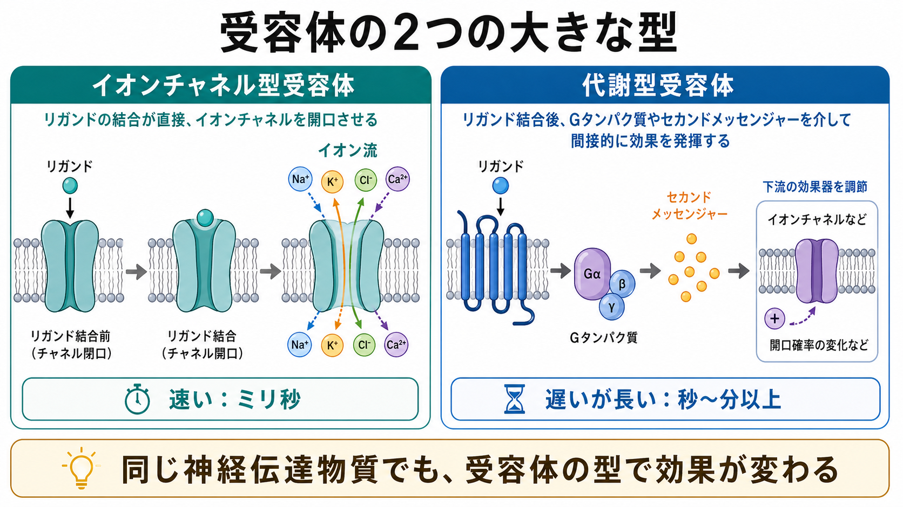
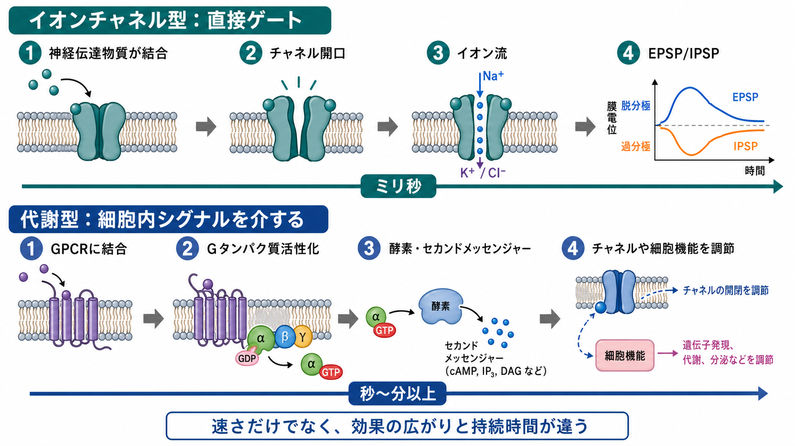
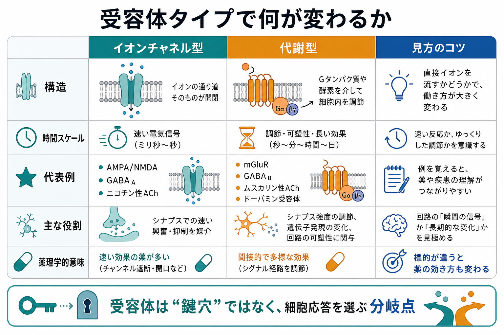

---
title: "受容体にはどのような種類があるのか"
description: "神経伝達物質の受容体を、イオンチャネル型受容体と代謝型受容体の違いから整理し、速さ、仕組み、代表例、研究・臨床との接続を説明する。"
aliases:
  - "受容体の種類"
  - "イオンチャネル型受容体"
  - "代謝型受容体"
  - "神経伝達物質受容体"
tags:
  - neuroscience
  - basic-neuroscience
  - obsidian
  - 脳・神経科学/基礎神経科学
created: "2026-04-27"
updated: "2026-04-27"
draft: true
publish: false
status: draft
enableToc: true
---

# 受容体にはどのような種類があるのか

## 要点

- 神経伝達物質の受容体は、大きく **イオンチャネル型受容体** と **代謝型受容体** に分けると理解しやすい。
- イオンチャネル型受容体は、受容体そのものがイオンの通り道を含むため、結合から電気的応答までが速い。典型的にはミリ秒単位のシナプス応答を担う[1][2]。
- 代謝型受容体は、多くの場合 G タンパク質共役型受容体（GPCR）として働き、G タンパク質、酵素、セカンドメッセンジャーを介して、イオンチャネルや細胞機能を間接的に調節する[1][3]。
- 同じ神経伝達物質でも、どの受容体に結合するかで効果は変わる。たとえばアセチルコリンにはニコチン性受容体とムスカリン性受容体があり、GABA には GABA_A 受容体と GABA_B 受容体がある[1][2][4]。
- 薬理学では「どの神経伝達物質か」だけでなく、「どの受容体サブタイプを標的にするか」が重要になる[3][6]。

## この記事で答える問い

この記事では、[[ニューロンとは何か]]、[[神経細胞膜はどのように電気信号を生み出すのか]]、[[イオンチャネルとは何か]]を読むための土台として、次の問いに答える。

1. 神経伝達物質の受容体は、どのように分類できるのか。
2. イオンチャネル型受容体と代謝型受容体は、仕組みと時間スケールがどう違うのか。
3. この違いは、シナプス伝達、神経調節、薬理学を理解するうえでなぜ重要なのか。

## まず結論

受容体は、細胞外の信号を細胞内の応答へ変換する分子である。神経科学でまず押さえるべき区別は、神経伝達物質が結合したあとに **イオンチャネルが直接開くか**、それとも **細胞内シグナルを介して間接的に効果が出るか** である。

イオンチャネル型受容体では、受容体タンパク質がリガンド結合部位とイオン孔を同じ分子複合体として持つ。神経伝達物質が結合すると構造が変わり、Na^+^、K^+^、Ca^2+^、Cl^-^ などが電気化学勾配に従って流れる。その結果、[[静止膜電位はどのように生じるのか|膜電位]]がすばやく変化し、興奮性または抑制性のシナプス後電位が生じる[1][2]。

代謝型受容体では、受容体そのものはイオン孔を持たない。神経伝達物質が受容体に結合すると、G タンパク質などの細胞内分子が活性化し、酵素、セカンドメッセンジャー、リン酸化反応などを通じてイオンチャネルや細胞機能を調節する。反応は遅いことが多いが、効果は長く、広く、可塑的になりやすい[1][3][5]。

## 背景

シナプスでは、前シナプス終末から放出された神経伝達物質が、後シナプス膜や前シナプス膜、グリア細胞などにある受容体へ結合する。ここで重要なのは、神経伝達物質そのものが「興奮性」や「抑制性」を絶対的に決めるわけではない、という点である。実際の効果は、受容体の種類、通るイオン、細胞の膜電位、受容体の場所、細胞内シグナルの状態によって決まる[1][2]。

たとえばグルタミン酸は、多くの中枢シナプスで AMPA 受容体や NMDA 受容体を介して速い興奮性応答を作る。一方で、代謝型グルタミン酸受容体（mGluR）は G タンパク質を介して、Ca^2+^ チャネル、K^+^ チャネル、AMPA/NMDA 受容体機能などを調節しうる[5]。つまり「グルタミン酸が出た」という情報だけでは不十分で、「どの受容体が、どこで、どの状態で活性化したか」を見る必要がある。

## 基本概念

### リガンドと受容体

リガンドとは、受容体に結合する分子である。神経科学では、グルタミン酸、GABA、アセチルコリン、ドーパミン、セロトニン、ノルアドレナリン、神経ペプチドなどが代表的なリガンドになる。受容体はリガンドを認識し、その結合を細胞の電気的・生化学的変化へ変換する。

ここでの「受容体」は、単なる鍵穴ではない。受容体は、どのリガンドを認識するかだけでなく、結合後にどの応答を選ぶかを決める分岐点である。

### イオンチャネル型受容体

イオンチャネル型受容体は、リガンド依存性イオンチャネルとも呼ばれる。神経伝達物質が結合すると、受容体の構造が変わり、イオンが通る孔が開く。IUPHAR/BPS の分類では、ニコチン性アセチルコリン受容体、5-HT_3 受容体、イオンチャネル型グルタミン酸受容体、P2X 受容体、GABA_A 受容体、グリシン受容体などが代表例である[2]。

この型の強みは速さである。イオン流が直接膜電位を変えるため、[[活動電位はどのように発生するのか|活動電位]]やシナプス後電位の時間スケールにすぐ結びつく。たとえば AMPA 受容体を介した Na^+^ 流入は脱分極を作りやすく、GABA_A 受容体を介した Cl^-^ 透過性の変化は細胞の状態に応じて抑制性に働きやすい[1][2]。

### 代謝型受容体

代謝型受容体は、神経伝達物質の結合後に細胞内シグナルを介して効果を出す受容体である。神経科学で典型的なのは GPCR で、7 回膜貫通構造を持ち、G タンパク質を活性化して酵素やイオンチャネルへ信号を伝える[3]。

代表例には、代謝型グルタミン酸受容体、GABA_B 受容体、ムスカリン性アセチルコリン受容体、ドーパミン受容体、多くのセロトニン受容体、アドレナリン受容体、神経ペプチド受容体がある[3][4][5]。この型は、発火のしやすさ、神経伝達物質放出、シナプス可塑性、遺伝子発現、細胞代謝などを、比較的ゆっくり、しかし長く調節できる。

## 仕組み

### 1. イオンチャネル型は「結合して、開く」

イオンチャネル型受容体では、神経伝達物質の結合がチャネル開口へ直接つながる。開いたチャネルをどのイオンが通るかによって、膜電位への効果が決まる。

- 陽イオンが流入しやすい受容体では、脱分極が起こりやすい。
- Cl^-^ 透過性が増える受容体では、細胞の Cl^-^ 平衡電位と膜電位の関係によって、過分極またはシャント抑制が起こりやすい。
- Ca^2+^ を通す受容体では、膜電位変化だけでなく、細胞内シグナルの入口としても働く。

この直接性が、ミリ秒単位の速いシナプス伝達を可能にする[1][2]。

### 2. 代謝型は「結合して、伝える」

代謝型受容体では、神経伝達物質の結合が、まず受容体の構造変化を起こす。GPCR では、これがヘテロ三量体 G タンパク質の GDP/GTP 交換を促し、Gα と Gβγ を介した下流シグナルにつながる[3]。

その後の経路は多様である。G タンパク質はイオンチャネルへ直接作用することもあれば、アデニル酸シクラーゼ、ホスホリパーゼ C、cAMP、IP_3、DAG、PKA、PKC などを介して、チャネル、酵素、受容体、転写過程を調節することもある[3][5]。

この間接性のため、反応はイオンチャネル型より遅い。しかし、複数の分子段階を介するため、増幅、持続、細胞種特異性、可塑性を持ちやすい。

### 3. 速い受容体と遅い受容体は対立物ではない

イオンチャネル型受容体と代謝型受容体は、「どちらが重要か」という関係ではない。むしろ同じシナプスや同じ回路の中で、速い電気信号と遅い調節信号を分担している。

たとえば速い興奮性入力は AMPA 受容体で作られ、NMDA 受容体や代謝型グルタミン酸受容体が Ca^2+^ シグナルや可塑性の条件を変えることがある。前シナプス側では、イオンチャネル型受容体も GPCR も神経伝達物質放出を調節し、局所的な回路機能や行動に影響しうる[6][7]。

## 図解

下の表は、二つの型を比較したものである。

| 観点 | イオンチャネル型受容体 | 代謝型受容体 |
|---|---|---|
| 別名 | リガンド依存性イオンチャネル | 多くは G タンパク質共役型受容体 |
| 受容体とチャネル | 同じ分子複合体に結合部位と孔がある | 受容体とチャネルは別で、細胞内シグナルを介する |
| 典型的な速さ | ミリ秒単位 | 秒から分、場合によってはさらに長い |
| 主な効果 | 速い EPSP/IPSP、膜電位変化 | 発火しやすさ、放出確率、可塑性、代謝、遺伝子発現の調節 |
| 代表例 | AMPA、NMDA、GABA_A、グリシン、ニコチン性 ACh、5-HT_3 | mGluR、GABA_B、ムスカリン性 ACh、ドーパミン、アドレナリン、多くのセロトニン受容体 |
| 学習上の注意 | 「速いが単純」と見なしすぎない。Ca^2+^ 透過性や脱感作も重要 | 「遅いだけ」と見なしすぎない。局所チャネル制御や前シナプス調節も重要 |

## 臨床・研究との接続

受容体分類は、薬の作用を理解するための基本語彙である。中枢神経系に作用する多くの薬は、神経伝達を増やす、減らす、あるいは特定の受容体を活性化・遮断することで効果をもたらす[1]。さらに GPCR は、神経伝達物質、ホルモン、感覚刺激など幅広い信号を扱う大きな受容体ファミリーであり、創薬標的としても非常に重要である[3]。

ただし、ここから個別の治療効果を単純に推論してはいけない。たとえば「ドーパミン受容体を遮断する」といっても、D_1 系と D_2 系、脳部位、投与量、時間経過、他の受容体への作用によって意味は変わる。医療・精神医学に関する解釈では、受容体薬理を教育・研究上の説明として扱い、個別診断や治療指示として断定しないことが重要である。

研究では、受容体タイプの違いを使って、シナプス伝達、可塑性、神経調節、行動の因果関係を調べる。たとえば薬理学的阻害、遺伝学的操作、パッチクランプ、カルシウムイメージング、光遺伝学、構造解析などを組み合わせることで、「どの受容体が、どの細胞で、どの時間スケールの応答を作るか」を調べる。

## よくある誤解

### 誤解1: 神経伝達物質が興奮性か抑制性かを決める

実際には、効果を決めるのは神経伝達物質だけではない。受容体の種類、通るイオン、膜電位、細胞内 Cl^-^ 濃度、受容体の場所が重要である。GABA は多くの成熟ニューロンで抑制性に働きやすいが、それは GABA_A 受容体、Cl^-^ 勾配、膜電位の関係に依存する。

### 誤解2: イオンチャネル型は速いだけで、代謝型は遅いだけである

速さは重要な違いだが、唯一の違いではない。イオンチャネル型受容体にも Ca^2+^ 透過性、脱感作、サブユニット構成、局在の違いがある。代謝型受容体には、下流経路の分岐、増幅、長期的な細胞状態の変化がある[2][3][5]。

### 誤解3: 代謝型受容体はすべて同じ GPCR である

GPCR は共通の原理を持つが、結合する G タンパク質、下流経路、発現細胞、脱感作、内在化、薬物応答は大きく異なる。代謝型グルタミン酸受容体だけを見ても、グループ I、II、III で結合する経路や機能が異なる[5]。

### 誤解4: 受容体は後シナプスにだけある

受容体は後シナプスだけでなく、前シナプス終末にも存在する。前シナプス受容体は、神経伝達物質放出を局所的に調節できる。近年のレビューでは、前シナプスのリガンド依存性イオンチャネルと GPCR が、局所回路と行動に関わる重要な制御点として整理されている[6][7]。

## 関連ノート

既存ノートとして、次の内容と接続しやすい。

- [[ニューロンとは何か]]
- [[神経細胞膜はどのように電気信号を生み出すのか]]
- [[イオンチャネルとは何か]]
- [[静止膜電位はどのように生じるのか]]
- [[活動電位はどのように発生するのか]]
- [[樹状突起はどのように情報を受け取るのか]]
- [[興奮性ニューロンと抑制性ニューロンは何が違うのか]]

今後の作成候補として、次のノートがある。

- グルタミン酸受容体にはどのような種類があるのか
- GABA受容体にはどのような種類があるのか
- GPCRとは何か
- セカンドメッセンジャーとは何か
- シナプス後電位とは何か

MOC 更新候補: `content/00_MOC/` 配下の脳・神経科学系 MOC に、本記事を基礎神経科学の受容体・シナプス伝達ノートとして追加する。

## 理解チェック

1. イオンチャネル型受容体が速い応答を作りやすいのはなぜか。
2. 代謝型受容体が、遅いが長く広い効果を持ちやすいのはなぜか。
3. 同じ神経伝達物質でも受容体の種類によって効果が変わる例を一つ挙げられるか。
4. GABA_A 受容体と GABA_B 受容体の違いを、イオンチャネル型と代謝型の観点から説明できるか。
5. 薬理学で「神経伝達物質名」だけでなく「受容体サブタイプ」が重要になる理由は何か。

## 参考文献

[1] Purves, D., Augustine, G. J., Fitzpatrick, D., et al. (2001). *Neuroscience, 2nd edition*, Chapter 7: Neurotransmitter Receptors and Their Effects. NCBI Bookshelf. https://www.ncbi.nlm.nih.gov/books/NBK11099/

[2] IUPHAR/BPS Guide to Pharmacology. Ligand-gated ion channels. https://www.guidetopharmacology.org/GRAC/FamilyDisplayForward?familyId=697

[3] Rehman, S., Rahimi, N., & Dimri, M. (2023). Biochemistry, G Protein Coupled Receptors. *StatPearls*. NCBI Bookshelf. https://www.ncbi.nlm.nih.gov/books/NBK518966/

[4] IUPHAR/BPS Guide to Pharmacology. G protein-coupled receptors. https://www.guidetopharmacology.org/GRAC/FamilyDisplayForward?familyId=694

[5] Conn, P. J., & Pin, J.-P. (1997). Pharmacology and functions of metabotropic glutamate receptors. *Annual Review of Pharmacology and Toxicology*, 37, 205-237. https://doi.org/10.1146/annurev.pharmtox.37.1.205

[6] Lovinger, D. M., Mateo, Y., Johnson, K. A., Engi, S. A., Antonazzo, M., et al. (2022). Local modulation by presynaptic receptors controls neuronal communication and behaviour. *Nature Reviews Neuroscience*, 23, 191-203. https://doi.org/10.1038/s41583-022-00561-0

[7] Engelman, H. S., & MacDermott, A. B. (2004). Presynaptic ionotropic receptors and control of transmitter release. *Nature Reviews Neuroscience*, 5, 135-145. https://doi.org/10.1038/nrn1297

## 未解決問題

- 同じ受容体サブタイプでも、細胞種、発達段階、脳部位、疾患状態によって下流効果がどう変わるか。
- 前シナプス受容体の局所作用が、自然な行動中にどの程度シナプス出力を変えるか。
- 受容体サブユニット構成、足場タンパク質、細胞内シグナルの違いを、計算モデルのどの粒度で表すべきか。

## 更新ログ

- 2026-04-27: 初版作成。イオンチャネル型受容体と代謝型受容体の比較、図解、参考文献、関連ノート候補を追加。
