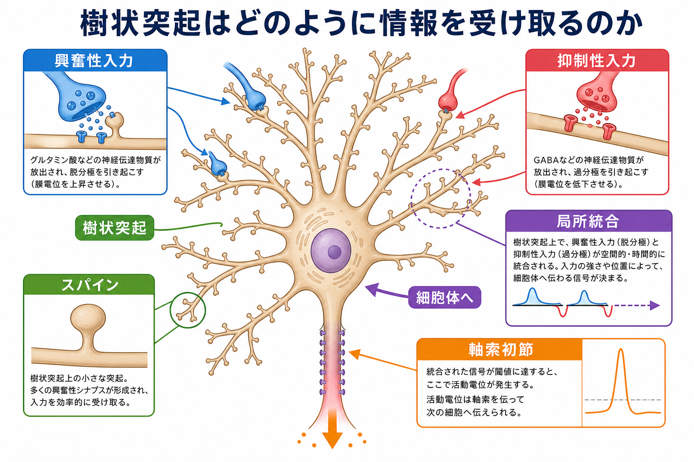
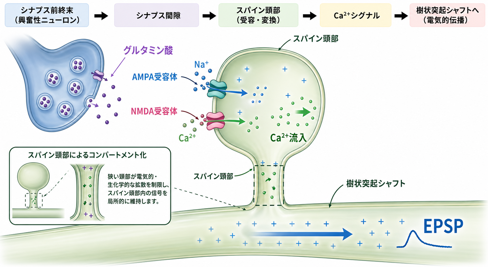

---
title: "樹状突起はどのように情報を受け取るのか"
description: "樹状突起の形態、スパイン、興奮性・抑制性シナプス入力、局所統合の基本を整理する。"
aliases:
  - "樹状突起"
  - "樹状突起入力"
  - "デンドライト"
tags:
  - neuroscience
  - basic-neuroscience
  - obsidian
  - 脳・神経科学/基礎神経科学
created: "2026-04-27"
updated: "2026-04-27"
draft: true
publish: false
status: draft
enableToc: true
---

# 樹状突起はどのように情報を受け取るのか

## 要点

- 樹状突起は、ニューロンが多数のシナプス入力を受け取るための枝状構造である。
- 多くの興奮性入力は樹状突起上の小さな突起であるスパインに入り、スパイン頭部・頸部・樹状突起シャフトの形が信号の局所性を左右する。
- 抑制性入力は細胞体、軸索初節、樹状突起シャフト、場合によってはスパイン近傍に配置され、興奮性入力の効き方を位置依存的に調整する。
- 樹状突起は単なる「入力ケーブル」ではなく、枝ごとの局所計算、時間的加算、空間的加算、Ca2+シグナル、活動依存的な可塑性に関わる。

## この記事で答える問い

樹状突起は「神経細胞の枝」と説明されることが多い。しかし、実際にはその枝のどこに入力が入るか、スパインを介するか、興奮性か抑制性か、入力が同時に来るか時間差で来るかによって、細胞体や軸索初節に届く意味は大きく変わる。本記事では、樹状突起がどのようにシナプス入力を受け取り、局所的に処理し、ニューロン全体の発火へつなげるのかを整理する。

## まず結論

樹状突起は、多数の入力を受け取って単純に足し合わせるだけの受動的な配線ではない。典型的な錐体細胞では、基底樹状突起、尖端樹状突起、遠位のタフトなどの領域ごとに、異なる入力源、膜特性、電位依存性チャネル、抑制性制御が組み合わさる。そのため、同じシナプス電流でも、近位入力と遠位入力では細胞体に届く大きさが異なり、複数入力が局所的に同期すると枝内で非線形な応答や樹状突起スパイクを生じることがある [1][2]。

## 背景

ニューロンは、樹状突起、細胞体、軸索という大まかな極性をもつ。教科書的には、樹状突起が入力、軸索が出力と説明される。ただし、この説明は入口としては便利でも、樹状突起の働きをかなり単純化している。

特に大脳皮質や海馬の錐体細胞では、樹状突起の形態が広く分岐し、遠位と近位で電気的距離が大きく異なる。遠位シナプスで生じた小さな脱分極は、細胞体へ向かう途中で減衰する。一方で、樹状突起にはNa+、Ca2+、K+、HCNなどの電位依存性チャネルが分布し、受動的な減衰を部分的に補ったり、特定の入力パターンを強調したりする [1][2]。

このため、樹状突起は「どの入力が来たか」だけでなく、「どこに、いつ、どの組み合わせで来たか」を細胞内で変換する構造と考える方がよい。

## 基本概念

### 樹状突起

樹状突起は、ニューロンの細胞体から伸びる枝状の突起である。枝分かれが多いほど、広い空間から多数のシナプス入力を受け取りやすい。ただし、枝は単なる表面積の増加ではない。枝の太さ、長さ、分岐点、膜抵抗、容量、イオンチャネル分布によって、シナプス入力の伝わり方が変わる。

### スパイン

スパインは、樹状突起シャフトから出る小さな棘状の突起で、多くの興奮性シナプスがここに形成される。スパイン頭部にはシナプス後肥厚部があり、AMPA受容体やNMDA受容体、足場タンパク質、シグナル伝達分子が集まる。スパイン頸部は細く、頭部で生じたCa2+シグナルや生化学反応を局所化する働きをもつと考えられてきた [3][5]。

### 興奮性入力

多くの興奮性シナプスでは、前シナプス終末からグルタミン酸が放出され、AMPA受容体とNMDA受容体を中心にシナプス後応答が生じる。AMPA受容体は主に速い脱分極を担い、NMDA受容体は膜電位依存性とCa2+透過性をもつため、シナプス可塑性の誘導に深く関わる [3][4]。

### 抑制性入力

抑制性入力の多くはGABA作動性であり、細胞体、軸索初節、樹状突起シャフト、スパイン近傍など、標的部位によって効果が変わる。たとえば細胞体や軸索初節への抑制は発火の出力段階を強く制御し、樹状突起への抑制は特定の枝や入力クラスターの統合を局所的に調整する [1][7][8]。

## 仕組み

### 1. シナプス入力は「場所」をもって入ってくる

同じ大きさの興奮性シナプス電流でも、細胞体に近い入力と遠い入力では、細胞体で観測される電位変化が異なる。遠位入力はケーブル特性によって減衰しやすい。ただし、遠位樹状突起では局所的な入力抵抗や電位依存性チャネルの働きにより、単純な距離減衰だけでは説明できない増幅や非線形応答も起こる [1][2]。

### 2. スパインは小さな受容・変換装置として働く

スパイン頭部では、前シナプス終末から放出されたグルタミン酸が受容体を活性化する。AMPA受容体を介したNa+流入は速い興奮性シナプス後電位を作り、NMDA受容体を介したCa2+流入は局所的なシグナル伝達を開始する。YusteとDenkの二光子Ca2+イメージング研究は、単一スパインが局所的なCa2+コンパートメントとして働きうることを示し、スパインを「ニューロン統合の機能単位」と見る考えを強めた [3]。

### 3. スパインの形は信号の強さと可塑性に関わる

スパイン頭部が大きいほど、一般にシナプス後肥厚部やAMPA受容体量が多く、シナプス強度が大きい傾向がある。単一スパインへのグルタミン酸uncaging実験では、刺激されたスパインが選択的に拡大し、その拡大がAMPA受容体媒介電流の増加と結びつくことが示された [4]。この結果は、スパインが入力特異的な長期増強の場になりうることを示している。

また、スパイン頸部の長さや太さは、頭部とシャフトの間の電気的・生化学的結合を調整する。超解像イメージングなどを用いた研究では、スパイン頸部の形態変化がシナプスのコンパートメント化を動的に調整しうることが示されている [5]。

### 4. 複数入力は時間的・空間的に加算される

シナプス入力が短い時間間隔で繰り返し入ると、膜電位が完全に戻る前に次の入力が重なり、時間的加算が起こる。別々の場所にある入力が同時に入ると、空間的加算が起こる。古典的には、これらの加算が細胞体で足し合わされ、軸索初節で発火閾値を超えるかが決まると説明される [2]。

しかし実際には、加算は細胞体だけでなく枝ごとにも起こる。近くのスパイン群が同期して活動すると、局所的な脱分極が大きくなり、NMDA受容体や電位依存性Ca2+チャネルを介した非線形応答を生みうる。つまり、樹状突起の枝は入力を「まとめてから細胞体へ送る」局所計算単位として働く場合がある [1]。

### 5. 抑制性入力は局所計算のゲートになる

抑制性入力は、単に膜電位を下げるだけではない。抑制性シナプスの位置によって、近くの興奮性入力、枝全体の統合、細胞体での発火、軸索初節での活動電位生成への影響が変わる。

樹状突起シャフトへのGABA作動性入力は、同じ枝に集まる興奮性入力の効果を抑え、入力クラスターの統合を局所的に制御しうる。スパインやその近傍への抑制は、個々の興奮性入力やCa2+シグナルをより細かく調整する可能性がある。ただし、スパイン上の抑制性シナプスの頻度や機能は細胞型・発達段階・領域によって異なり、一般化には注意が必要である [7][8]。

## 図解

図1は、樹状突起が興奮性入力、抑制性入力、スパイン、局所統合、軸索初節への出力をどのようにつなぐかを概念的に示している。図2は、単一スパインでのグルタミン酸入力、AMPA受容体、NMDA受容体、Ca2+流入、EPSPへの変換を示している。図3は、近位入力と遠位入力、時間的加算と空間的加算、抑制性入力によるゲートを比較している。

これらの図は概念図であり、実際の細胞では細胞型、脳領域、発達段階、活動状態によって形態やチャネル分布が大きく異なる。

## 臨床・研究との接続

樹状突起とスパインは、学習・記憶・発達・疾患研究をつなぐ重要な観察単位である。経験依存的なスパインの出現・消失や安定化は、回路の再編成と関連づけて研究されてきた [6]。また、スパイン形態、抑制性入力、Ca2+シグナル、興奮抑制バランスの変化は、神経発達症、てんかん、統合失調症などの研究文脈で議論されることがある。

ただし、スパイン密度や樹状突起形態の変化を、個別の症状や診断に直接対応させることはできない。ヒトの精神疾患や神経疾患では、分子、細胞、回路、発達、環境、行動が多層的に関わるため、樹状突起の知見は「機序を理解するための一階層」として扱うのが適切である。

## よくある誤解

### 誤解1: 樹状突起は入力を受け取るだけの受動的な枝である

樹状突起は受動的なケーブル特性をもつが、それだけではない。電位依存性チャネル、NMDA受容体、局所Ca2+シグナル、枝ごとの入力配置により、入力を能動的に変換する。

### 誤解2: スパインは単なる飾りである

スパインは、興奮性シナプスの受け皿であるだけでなく、Ca2+やシグナル伝達分子を局所化し、入力特異的な可塑性を支える構造である [3][4][5]。

### 誤解3: 抑制性入力はすべて同じように発火を止める

抑制性入力の効果は、標的部位によって大きく異なる。軸索初節や細胞体を標的にする抑制と、樹状突起シャフトやスパイン近傍を標的にする抑制では、制御する計算段階が異なる [7][8]。

### 誤解4: 遠位入力は弱いので重要ではない

遠位入力は細胞体で見ると減衰しやすいが、局所的な増幅、同期入力、樹状突起スパイク、抑制性ゲートと組み合わさることで、ニューロン出力に大きな影響を与えうる [1][2]。

## 関連ノート

- 既存ノート: [[MOC｜脳・神経科学]]
- 領域別MOC: [[MOC｜基礎神経科学]]
- [[シナプスとは何か]]
- [[シナプス後電位とは何か]]
- [[EPSPとIPSPはどのように発火を調節するのか]]
- [[長期増強LTPとは何か]]
- [[興奮性ニューロンと抑制性ニューロンは何が違うのか]]
- 関連ノート候補: スパイン可塑性、樹状突起スパイク

## MOC更新候補

- `content/00_MOC/MOC｜基礎神経科学.md` の「ニューロンの構造と細胞型」に追加済み。

## 理解チェック

1. 樹状突起入力の効果が、入力の「場所」によって変わる理由を説明できるか。
2. スパイン頭部とスパイン頸部が、それぞれどのような役割をもつか説明できるか。
3. AMPA受容体とNMDA受容体の違いを、EPSPとCa2+シグナルの観点から説明できるか。
4. 時間的加算と空間的加算の違いを説明できるか。
5. 抑制性入力が「発火を止める」以外に、局所的な入力統合を調整する例を説明できるか。

## 未解決問題

- 生体内で、個々の樹状突起枝がどの程度独立した計算単位として働くのか。
- スパイン頸部の形態変化が、行動レベルの学習や記憶にどの程度因果的に寄与するのか。
- 抑制性シナプスのサブセルラー配置が、発達、経験、疾患状態でどのように再編成されるのか。
- ヒト脳で観察される樹状突起・スパイン変化を、細胞型特異的な回路機能としてどう解釈するか。

## 参考文献

[1] Spruston, N. (2008). Pyramidal neurons: dendritic structure and synaptic integration. *Nature Reviews Neuroscience*, 9, 206-221. https://doi.org/10.1038/nrn2286

[2] Magee, J. C. (2000). Dendritic integration of excitatory synaptic input. *Nature Reviews Neuroscience*, 1, 181-190. https://doi.org/10.1038/35044552

[3] Yuste, R., & Denk, W. (1995). Dendritic spines as basic functional units of neuronal integration. *Nature*, 375, 682-684. https://doi.org/10.1038/375682a0

[4] Matsuzaki, M., Honkura, N., Ellis-Davies, G. C. R., & Kasai, H. (2004). Structural basis of long-term potentiation in single dendritic spines. *Nature*, 429, 761-766. https://doi.org/10.1038/nature02617

[5] Tønnesen, J., Katona, G., Rózsa, B., & Nägerl, U. V. (2014). Spine neck plasticity regulates compartmentalization of synapses. *Nature Neuroscience*, 17, 678-685. https://doi.org/10.1038/nn.3682

[6] Holtmaat, A., & Svoboda, K. (2009). Experience-dependent structural synaptic plasticity in the mammalian brain. *Nature Reviews Neuroscience*, 10, 647-658. https://doi.org/10.1038/nrn2699

[7] Higley, M. J. (2014). Localized GABAergic inhibition of dendritic Ca2+ signalling. *Nature Reviews Neuroscience*, 15, 567-572. https://doi.org/10.1038/nrn3803

[8] Boivin, J. R., & Nedivi, E. (2018). Functional implications of inhibitory synapse placement on signal processing in pyramidal neuron dendrites. *Current Opinion in Neurobiology*, 51, 16-22. https://doi.org/10.1016/j.conb.2018.01.013

## 更新ログ

- 2026-04-27: 初版作成。樹状突起形態、スパイン、興奮性・抑制性入力、局所統合、図解、参考文献を整理。
