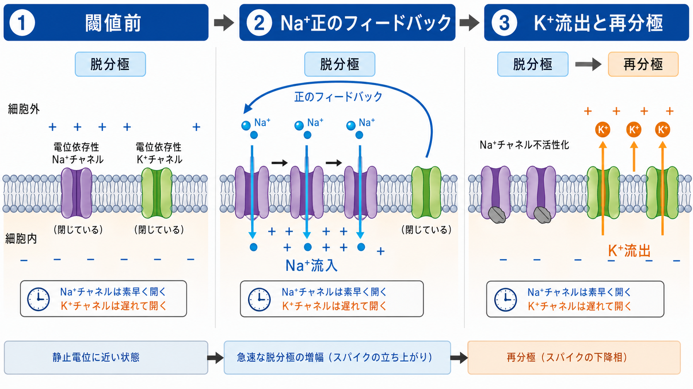
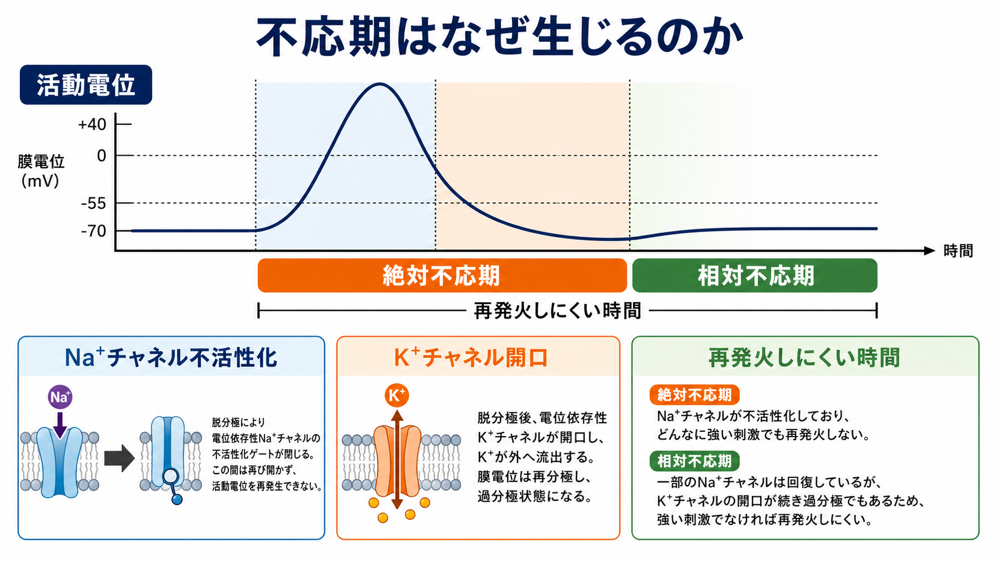

---
title: "活動電位はどのように発生するのか"
description: "脱分極・閾値・Na+流入・K+流出による活動電位の時間経過を整理する。"
aliases:
  - "活動電位"
  - "神経発火"
  - "スパイク"
tags:
  - neuroscience
  - basic-neuroscience
  - obsidian
created: "2026-04-27"
updated: "2026-04-27"
draft: true
publish: false
status: draft
enableToc: true
---

# 活動電位はどのように発生するのか

## 要点

- 活動電位は、膜電位が閾値を超えたときに生じる急速で一過性の電位変化である。
- 立ち上がりは主に電位依存性 Na+ チャネルの開口と Na+ 流入で生じ、下降相は Na+ チャネル不活性化と K+ チャネル開口による K+ 流出で生じる[1][2]。
- 閾値は「固定された電圧」ではなく、Na+ 内向き電流が漏れ電流や K+ 電流を上回り、脱分極が自己増幅へ入る条件として理解するとよい[3]。
- Na+ チャネルの不活性化と K+ チャネルの遅い閉鎖により不応期が生じ、活動電位の頻度と伝導方向が制限される[4][5]。
- 個々の活動電位の大きさはおおむね全か無かであり、刺激の強さは主にスパイクの高さではなく発火頻度や発火タイミングで表される[5]。

## この記事で答える問い

この記事では、[[神経細胞膜はどのように電気信号を生み出すのか]]、[[イオンチャネルとは何か]]、[[軸索小丘はなぜ発火の起点になるのか]]を読むための中心概念として、次の問いに答える。

1. 膜電位がどのようにして急速に上昇するのか。
2. なぜ閾値を超えると一気に活動電位へ進むのか。
3. Na+ 流入の後に、なぜ K+ 流出と不応期が必要になるのか。

## まず結論

活動電位は、膜に流れるイオン電流の時間差でできる。静止時のニューロンは、細胞内が外側より負で、Na+ は細胞外に多く、K+ は細胞内に多い。この濃度差と膜電位が、イオンを動かす電気化学的な力になる[1][6]。

シナプス入力などで膜が脱分極し、閾値付近に達すると、電位依存性 Na+ チャネルが開き始める。Na+ が細胞内へ入ると膜はさらに脱分極し、その脱分極がさらに Na+ チャネルを開く。これが正のフィードバックであり、活動電位の急峻な立ち上がりを作る[2][3]。

しかし、この上昇は続きっぱなしにはならない。Na+ チャネルは短時間で不活性化し、少し遅れて K+ チャネルが開く。K+ は細胞外へ流出し、膜電位は再び負の方向へ戻る。K+ チャネルがしばらく開き続けると、膜電位は静止電位より一時的に低くなり、過分極と不応期が生じる[2][4]。

## 背景

神経細胞は金属線のように電気を流すわけではない。信号の本体は、細胞膜をはさんだ電位差と、膜に埋め込まれたチャネルを通るイオンの移動である。活動電位は、この電位差が数ミリ秒のうちに大きく変化し、軸索に沿って再生されながら進む現象である[1]。

Hodgkin と Huxley はイカ巨大軸索を用いた電位固定実験から、活動電位を Na+ と K+ の膜コンダクタンスの時間変化として定量化した[2]。このモデルは単純化を含むが、「Na+ コンダクタンスが速く増える」「K+ コンダクタンスが遅れて増える」という骨格は、活動電位理解の基礎であり続けている。

## 基本概念

### 膜電位

膜電位とは、細胞内外の電位差である。静止時のニューロンでは、細胞内は外側に対して負である。これは K+ への高い背景透過性、Na+ や Cl- などへの透過性、Na+/K+ ATPase が維持する濃度勾配などが合わさって決まる[6]。

### 脱分極と過分極

脱分極は、膜電位が負の値から 0 mV 側、または正の方向へ近づく変化である。過分極は、膜電位が静止電位よりさらに負の方向へ動く変化である。活動電位では、脱分極が急速な上昇相を作り、その後の K+ 流出が再分極と過分極を作る。

### 閾値

閾値は、活動電位が始まる条件である。教科書的には -55 mV 付近のような値で説明されることが多いが、実際には細胞種、直前の膜電位、入力の速さ、Na+ チャネルの不活性化状態、K+ チャネルの状態によって変わる[3][5]。したがって、閾値は「Na+ 流入が自己増幅へ入る境目」として読む方が正確である。

## 仕組み

### 1. 静止状態ではイオン勾配が準備されている

静止状態では、Na+ は細胞外に多く、K+ は細胞内に多い。膜は K+ に比較的通りやすく、Na+ には通りにくいため、膜電位は負に保たれる[6]。この状態は何も起きていない状態ではなく、活動電位を起こすための勾配が保たれている状態である。

### 2. 入力が膜を脱分極させる

興奮性シナプス入力や感覚入力により陽イオン流入が起こると、膜電位は脱分極方向へ動く。小さな脱分極は漏れ電流や抑制性入力に打ち消されることがある。しかし、入力が時間的・空間的に加算され、[[軸索小丘はなぜ発火の起点になるのか|軸索起始部付近]]で閾値条件に近づくと、電位依存性 Na+ チャネルが開きやすくなる。

### 3. Na+ 流入が正のフィードバックを作る

閾値を超えると、Na+ チャネルの開口により Na+ が細胞内へ流入する。細胞内へ正電荷が入るため膜はさらに脱分極する。すると、より多くの Na+ チャネルが開き、さらに Na+ が流入する。この自己増幅が活動電位の急速な上昇相である[2][3]。

### 4. Na+ チャネル不活性化と K+ 流出が波形を下げる

Na+ チャネルは開いたままではなく、短時間で不活性化する。同時に、電位依存性 K+ チャネルが遅れて開き、K+ が細胞外へ流出する。Na+ の内向き電流が弱まり、K+ の外向き電流が強くなるため、膜電位は再分極へ向かう[2][4]。

### 5. 過分極と不応期が次の発火を制限する

K+ チャネルがすぐに閉じず、K+ 流出が続くと、膜電位は一時的に静止電位より負になる。この時期には、Na+ チャネルが不活性化から回復していない、または K+ 電流が残っているため、次の活動電位は起こりにくい。これが不応期であり、発火頻度の上限や活動電位の一方向性伝導に関わる[4][5]。

## 図解

上の3枚の図は、同じ現象を別の粒度で示している。1枚目は、膜電位波形の各段階と主要なチャネル・イオン移動を対応づける図である。2枚目は、閾値を超えた後の Na+ 正のフィードバックと、遅れて起こる K+ 流出を示す。3枚目は、不応期がなぜ生じ、なぜすぐには再発火しにくいのかを整理している。

## 臨床・研究との接続

活動電位の仕組みは、パッチクランプ法、電位固定法、計算モデル、薬理学、神経疾患研究の共通語になっている。局所麻酔薬やテトロドトキシンのように Na+ チャネル機能を変える物質は、活動電位の発生や伝導を大きく変える[7]。また、電位依存性 Na+ チャネルや K+ チャネルの遺伝子変異は、てんかん、片頭痛、疼痛、筋疾患などのチャネル病研究で重要である[7]。

ただし、ここでの説明は教育・研究目的の基礎知識であり、個別の症状を特定のチャネル異常だけで説明したり、診断・治療方針を示したりするものではない。臨床では、遺伝子、細胞種、発達段階、回路、薬物反応、生活背景を含む多層的な評価が必要になる。

## よくある誤解

### 誤解1: 活動電位は電子が軸索を流れる現象である

活動電位は金属線の電流とは違う。主役は、膜を横切る Na+ や K+ の局所的な移動と、それによる膜電位の変化である。軸索上では、隣接する膜を脱分極させ、そこでまた活動電位が再生される。

### 誤解2: 閾値はいつも同じ電圧である

閾値は便利な目安として数値化されるが、実際には状態依存的である。Na+ チャネルが不活性化していれば閾値は上がりやすく、急速な入力では発火しやすさが変わる。したがって「-55 mV になったら必ず発火する」という単純なスイッチではない[3][5]。

### 誤解3: 強い刺激ほど活動電位が高くなる

典型的な活動電位は全か無かの性質をもつ。閾値未満では発火せず、閾値を超えるとほぼ同じ大きさのスパイクが生じる。刺激強度は、スパイクの高さよりも発火頻度、発火タイミング、どのニューロン集団が発火するかによって表される[5]。

### 誤解4: Na+/K+ ATPase が活動電位の立ち上がりを直接作る

Na+/K+ ATPase は Na+ と K+ の濃度勾配を長期的に維持する重要な仕組みである。しかし、数ミリ秒の活動電位波形を直接作る主役は、電位依存性 Na+ チャネルと K+ チャネルを通る受動的なイオン流である[2][6]。

## 関連ノート

- [[ニューロンとは何か]]
- [[神経細胞膜はどのように電気信号を生み出すのか]]
- [[イオンチャネルとは何か]]
- [[軸索小丘はなぜ発火の起点になるのか]]
- [[軸索はどのように情報を遠くへ伝えるのか]]
- [[樹状突起はどのように情報を受け取るのか]]
- [[興奮性ニューロンと抑制性ニューロンは何が違うのか]]

今後の作成候補:

- 静止膜電位とは何か
- 電位依存性ナトリウムチャネルとは何か
- 電位依存性カリウムチャネルとは何か
- 不応期とは何か
- チャネル病とは何か

MOC更新候補:

- `content/00_MOC/MOC｜脳・神経科学.md` の「ニューロンとシナプス」周辺に本記事へのリンクを追加する。

## 理解チェック

1. Na+ 流入が脱分極をさらに強める理由を、正のフィードバックとして説明できるか。
2. K+ チャネルが Na+ チャネルより遅れて開くことは、活動電位波形のどの部分を作るか。
3. 不応期があると、活動電位の伝導方向と発火頻度はどのように制限されるか。
4. Na+/K+ ATPase と電位依存性チャネルの役割の違いを説明できるか。
5. 「刺激強度はスパイクの高さではなく頻度で表される」とはどういう意味か。

## 参考文献

[1] Purves D, Augustine GJ, Fitzpatrick D, et al., editors. *Neuroscience. 2nd edition*. Ionic Currents Across Nerve Cell Membranes. NCBI Bookshelf, 2001. https://www.ncbi.nlm.nih.gov/books/NBK10879/

[2] Hodgkin AL, Huxley AF. A quantitative description of membrane current and its application to conduction and excitation in nerve. *The Journal of Physiology*. 1952;117(4):500-544. https://doi.org/10.1113/jphysiol.1952.sp004764

[3] Bean BP. The action potential in mammalian central neurons. *Nature Reviews Neuroscience*. 2007;8:451-465. https://doi.org/10.1038/nrn2148

[4] Purves D, Augustine GJ, Fitzpatrick D, et al., editors. *Neuroscience. 2nd edition*. Voltage-Gated Ion Channels. NCBI Bookshelf, 2001. https://www.ncbi.nlm.nih.gov/books/NBK10883/

[5] Catterall WA. Voltage-gated sodium channels at 60: structure, function and pathophysiology. *The Journal of Physiology*. 2012;590(11):2577-2589. https://doi.org/10.1113/jphysiol.2011.224204

[6] Purves D, Augustine GJ, Fitzpatrick D, et al., editors. *Neuroscience. 2nd edition*. The Ionic Basis of the Resting Membrane Potential. NCBI Bookshelf, 2001. https://www.ncbi.nlm.nih.gov/books/NBK10931/

[7] Ashcroft FM. From molecule to malady. *Nature*. 2006;440:440-447. https://doi.org/10.1038/nature04707

## 未解決問題

- ニューロン型ごとの Na+ / K+ チャネル構成の違いは、発火頻度、発火パターン、情報符号化をどの程度規定しているのか。
- 樹状突起スパイク、軸索起始部、ランヴィエ絞輪で生じる局所的な興奮性を、1つの活動電位モデルの中でどう統合するのがよいか。
- チャネル変異が細胞レベルの発火変化から回路、行動、症状へつながる過程を、どの程度予測可能なモデルとして記述できるのか。

## 更新ログ

- 2026-04-27: 初稿作成。脱分極、閾値、Na+ 流入、K+ 流出、不応期を中心に整理し、図解3枚を追加。
