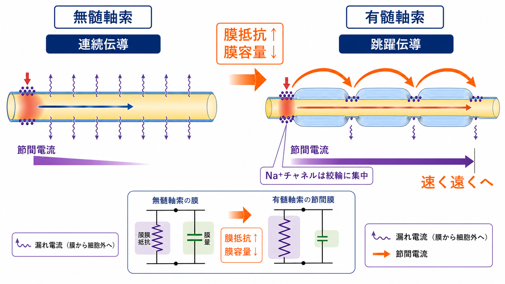

---
title: "活動電位はなぜ一方向に伝わるのか"
description: "不応期と軸索上の局所電流によって、活動電位が通常一方向へ伝わる理由を整理する。"
aliases:
  - "活動電位の一方向性"
  - "一方向性伝導"
  - "不応期と局所電流"
tags:
  - neuroscience
  - basic-neuroscience
  - obsidian
created: "2026-04-27"
updated: "2026-04-27"
draft: true
publish: false
status: draft
enableToc: true
---

# 活動電位はなぜ一方向に伝わるのか

## 要点

- 活動電位は、軸索膜を流れる電気がそのまま遠くへ走る現象ではなく、隣の膜を閾値まで脱分極させ、そこで新しい活動電位を再生しながら進む現象である[2][3]。
- 進行方向の膜はまだ発火していないため、局所電流によって閾値へ近づきやすい。
- 後方の膜は直前に発火したばかりで、Na+ チャネルの不活性化と K+ チャネルの遅い開口により不応期に入っているため、すぐには再発火しにくい[1][3]。
- したがって、一方向性は「前にだけ電流が流れる」からではなく、「電流は両側へ広がるが、後ろ側は一時的に発火できない」ために成立する。

## この記事で答える問い

この記事では、[[神経細胞膜はどのように電気信号を生み出すのか]]、[[イオンチャネルとは何か]]、[[軸索はどのように情報を遠くへ伝えるのか]]で扱う基礎を前提に、「活動電位はなぜ発火した場所へ戻らず、通常は軸索終末方向へ進むのか」を説明する。

中心となる問いは次の三つである。

1. 軸索上の局所電流は、どのように次の膜領域を発火させるのか。
2. 不応期は、なぜ逆向きの再発火を防ぐのか。
3. 無髄軸索と有髄軸索で、この原理はどう変わり、何が共通しているのか。

## まず結論

活動電位が一方向へ伝わる主な理由は、不応期と局所電流の組み合わせである。

ある軸索部位で活動電位が発生すると、Na+ 流入によってその部位の内側が相対的に正になる。すると、軸索内外の電位差に従って局所電流が隣接領域へ広がり、まだ発火していない前方の膜を脱分極させる。前方の膜が閾値に達すると、そこでも電位依存性 Na+ チャネルが開き、新しい活動電位が発生する[2][3]。

一方、直前に発火した後方の膜では、Na+ チャネルが不活性化しており、K+ チャネルもまだ開きやすい。この短い時間帯は不応期であり、同じ刺激では再び活動電位を起こしにくい[1]。そのため、局所電流が後方にも広がっていても、後方では再発火しにくく、結果として波は前方へ進む。

## 背景

ニューロンの出力信号は、[[軸索小丘はなぜ発火の起点になるのか]]で扱うように、しばしば軸索起始部で始まる。そこから軸索終末へ向かって活動電位が伝わることで、シナプス終末では Ca2+ 流入と神経伝達物質放出が起こり、次の細胞へ信号が渡される。

ここで重要なのは、活動電位が「電気信号が導線の中をそのまま流れていく」現象ではないことである。軸索は金属線ではなく、脂質二重膜、膜容量、膜抵抗、軸索内抵抗、電位依存性イオンチャネルをもつ興奮性構造である。局所的な脱分極は距離とともに減衰するが、隣の膜領域で新しい活動電位が再生されるため、信号は長距離でも保たれる[2][5]。

Hodgkin と Huxley の古典的研究は、活動電位の立ち上がりと回復を、Na+ と K+ の電位依存的な膜コンダクタンス変化として定量化した[4]。この時間差が、不応期と伝導方向の理解にもつながる。

## 基本概念

### 局所電流

局所電流とは、発火した膜領域と隣接する未発火領域の間に生じる小さな電流である。発火部位では Na+ が細胞内へ流入し、膜内側が一時的に正方向へ動く。この電位差によって、軸索内では前後の隣接部位へ電流が広がり、軸索外では対応する戻り電流が生じる。

この電流は、未発火の隣接膜を少し脱分極させる。脱分極が閾値を超えると、その場所の電位依存性 Na+ チャネルが開き、さらに脱分極が強まり、活動電位が再生される[3]。

### 不応期

不応期とは、活動電位の直後に、同じ膜領域が次の活動電位を起こしにくくなる期間である。大きく、絶対不応期と相対不応期に分けられる。

絶対不応期では、多くの電位依存性 Na+ チャネルが不活性化しており、たとえ強い脱分極があっても再び開きにくい。相対不応期では、一部の Na+ チャネルは回復しているが、K+ チャネルの開口や過分極が残るため、通常より強い刺激が必要になる[1][3]。

### 閾値

閾値は、固定された一つの電圧というより、Na+ 内向き電流が漏れ電流や K+ 外向き電流を上回り、脱分極の正のフィードバックに入る条件である。前方の膜はまだ発火していないため閾値へ近づきやすいが、後方の膜は不応期のため同じ局所電流では閾値条件を満たしにくい。

## 仕組み

### 1. ある部位で活動電位が発生する

膜電位が閾値を超えると、電位依存性 Na+ チャネルが開き、Na+ が細胞内へ流入する。Na+ 流入は膜をさらに脱分極させ、さらに多くの Na+ チャネルを開く。この正のフィードバックが活動電位の急峻な立ち上がりを作る[4]。

### 2. 局所電流が隣の膜を脱分極させる

発火部位の内側が正方向へ動くと、隣接する未発火部位との間に電位差ができる。軸索内の局所電流は、発火部位から周辺へ広がり、隣の膜を脱分極させる。未発火部位では Na+ チャネルがまだ利用可能なので、脱分極が閾値に達すると新しい活動電位が起こる[2][3]。

### 3. 後方の膜は不応期に入る

活動電位が通過した直後の膜では、Na+ チャネルの不活性化と K+ チャネルの遅い開口が残る。これにより、直前に発火した場所は一時的に再発火しにくい[1]。局所電流そのものは前後へ広がるが、後ろ側の膜は発火可能性が低いため、波は通常前方へ進む。

### 4. 有髄軸索では節から節へ再生される

無髄軸索では、隣り合う膜領域が連続的に脱分極していく。これに対して有髄軸索では、髄鞘が膜からの漏れ電流を減らし、電位変化がランヴィエ絞輪へ速く届く。活動電位は主にランヴィエ絞輪で再生されるため、節から節へ跳ぶように見える。これが跳躍伝導である[3][7]。

ただし、一方向性の基本原理は同じである。前方のランヴィエ絞輪は発火可能であり、後方の節は直前に発火して不応期に入っている。したがって、連続伝導でも跳躍伝導でも、局所電流と不応期の組み合わせが方向性を支える。

## 図解

図1は、一方向性伝導の全体像を示している。活動中の膜の前方では局所電流が未発火部位を閾値へ近づけ、後方では不応期が逆向きの再発火を抑える。

図2は、同じ仕組みを膜セグメントの時間差として示している。活動電位の場所は一見「移動」しているように見えるが、実際には隣の膜領域で新しい活動電位が順番に再生されている。

図3は、無髄軸索と有髄軸索の違いを比較している。有髄軸索では髄鞘とランヴィエ絞輪により伝導が速くなるが、方向性を支える基本原理は不応期と局所電流である。

## 臨床・研究との接続

この仕組みは、教育的な基礎知識にとどまらない。Na+ チャネルの機能変化は発火可能性や不応期に影響し、興奮性の異常につながりうる。神経科学研究では、パッチクランプ法や計算モデルにより、Na+ チャネル、K+ チャネル、膜抵抗、軸索径、髄鞘、ランヴィエ絞輪の配置が伝導速度と発火の安定性をどう変えるかが調べられている[5][6]。

また、脱髄では髄鞘による絶縁が失われ、電流が次のランヴィエ絞輪へ十分届きにくくなる。これにより伝導速度の低下や伝導ブロックが生じうる[7]。ただし、個別の症状や治療判断は、神経学的診察や検査に基づいて専門家が行うべきであり、ここでの説明は教育・研究目的の基礎整理である。

## よくある誤解

### 誤解1: 電流は前方にだけ流れる

局所電流は前方にも後方にも広がりうる。重要なのは、後方の膜が直前の発火によって不応期に入り、同じ電流では再発火しにくいことである。方向性は、電流の向きだけではなく、膜の時間的状態によって決まる。

### 誤解2: 活動電位そのものが軸索上を物体のように移動する

活動電位は、一つの塊がそのまま動くというより、隣接する膜領域で発火が再生される連鎖である。電位変化は受動的に広がるが、それだけでは減衰するため、電位依存性チャネルによる再生が必要になる[2][4]。

### 誤解3: 不応期は発火頻度を制限するだけで、伝導方向とは関係ない

不応期は最大発火頻度を制限するだけでなく、活動電位が直前に通過した部位へ戻りにくくする。Purves らの教科書的説明でも、不応期は活動電位が発生点へ逆戻りしない理由として位置づけられている[1]。

### 誤解4: 有髄軸索では不応期は重要ではない

有髄軸索では活動電位が主にランヴィエ絞輪で再生されるが、各節でも Na+ チャネルの不活性化と K+ 電流の時間経過が関わる。したがって、跳躍伝導でも不応期は方向性と発火パターンの理解に関係する。

## 関連ノート

- [[ニューロンとは何か]]
- [[神経細胞膜はどのように電気信号を生み出すのか]]
- [[イオンチャネルとは何か]]
- [[ネルンスト電位とは何か]]
- [[ナトリウムカリウムポンプは神経活動にどう関わるのか]]
- [[軸索はどのように情報を遠くへ伝えるのか]]
- [[軸索小丘はなぜ発火の起点になるのか]]
- [[オリゴデンドロサイトとシュワン細胞は何が違うのか]]

関連ノート候補:

- 活動電位とは何か
- 不応期とは何か
- ランヴィエ絞輪とは何か
- 跳躍伝導とは何か
- 電位依存性ナトリウムチャネルとは何か

MOC更新候補:

- バッチ統合時に、`content/00_MOC/` 内の脳・神経科学または基礎神経科学 MOC へ本記事を「活動電位・軸索伝導」の基礎ノートとして追加する。

## 理解チェック

1. 活動電位の伝導で、局所電流は何を脱分極させるか。
2. Na+ チャネルの不活性化は、なぜ後方への再発火を起こしにくくするか。
3. 絶対不応期と相対不応期の違いは何か。
4. 無髄軸索の連続伝導と有髄軸索の跳躍伝導で、共通している原理は何か。
5. 「活動電位が一方向に進む」という説明で、「電流が前方にだけ流れる」と言ってしまうと何が不正確か。

## 参考文献

[1] Purves D, Augustine GJ, Fitzpatrick D, et al., editors. *Neuroscience. 2nd edition.* The Refractory Period. NCBI Bookshelf, 2001. https://www.ncbi.nlm.nih.gov/books/NBK11146/

[2] Purves D, Augustine GJ, Fitzpatrick D, et al., editors. *Neuroscience. 2nd edition.* Long-Distance Signaling by Means of Action Potentials. NCBI Bookshelf, 2001. https://www.ncbi.nlm.nih.gov/books/NBK11107/

[3] Grider MH, Jessu R, Kabir R. Physiology, Action Potential. *StatPearls.* NCBI Bookshelf, updated 2023. https://www.ncbi.nlm.nih.gov/books/NBK538143/

[4] Hodgkin AL, Huxley AF. A quantitative description of membrane current and its application to conduction and excitation in nerve. *The Journal of Physiology.* 1952;117(4):500-544. https://doi.org/10.1113/jphysiol.1952.sp004764

[5] Debanne D, Campanac E, Bialowas A, Carlier E, Alcaraz G. Axon physiology. *Physiological Reviews.* 2011;91(2):555-602. https://doi.org/10.1152/physrev.00048.2009

[6] Kole MHP, Stuart GJ. Signal processing in the axon initial segment. *Neuron.* 2012;73(2):235-247. https://doi.org/10.1016/j.neuron.2012.01.007

[7] Arancibia-Carcamo IL, Attwell D. The node of Ranvier in CNS pathology. *Acta Neuropathologica.* 2014;128:161-175. https://doi.org/10.1007/s00401-014-1305-z

## 未解決問題

- 軸索径、ミエリン厚、ランヴィエ絞輪間隔、チャネル密度の組み合わせが、細胞種ごとの伝導安全率をどの程度決めているのか。
- 神経活動や発達、疾患によって AIS やランヴィエ絞輪のチャネル配置が変化したとき、発火方向性や逆伝播はどのように変わるのか。
- 不応期を単一の時間幅ではなく、チャネル状態の確率分布として扱うと、発火パターンの理解はどこまで精密になるのか。
