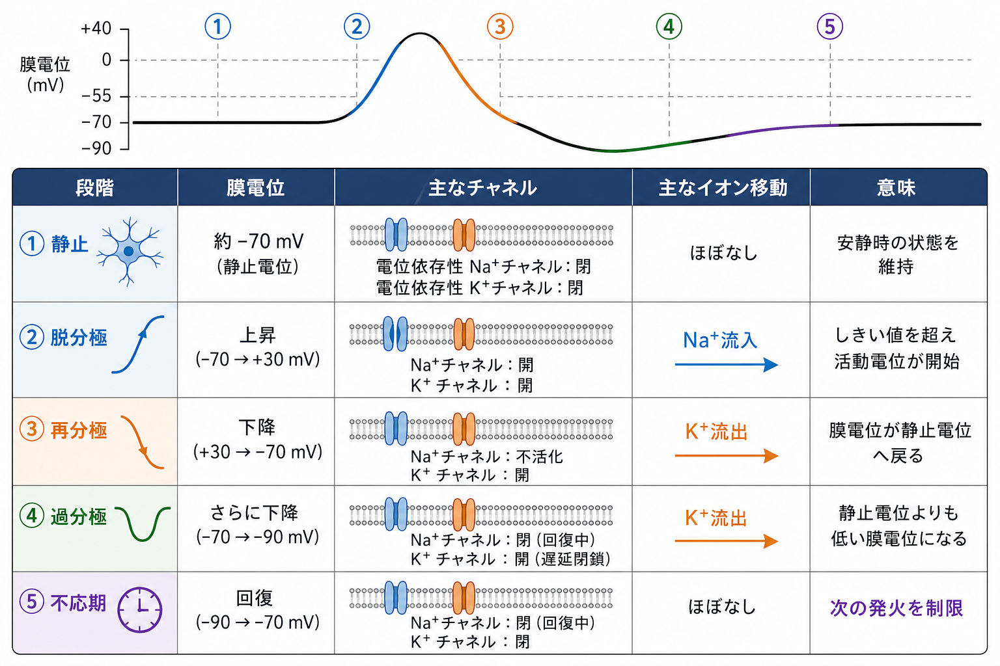
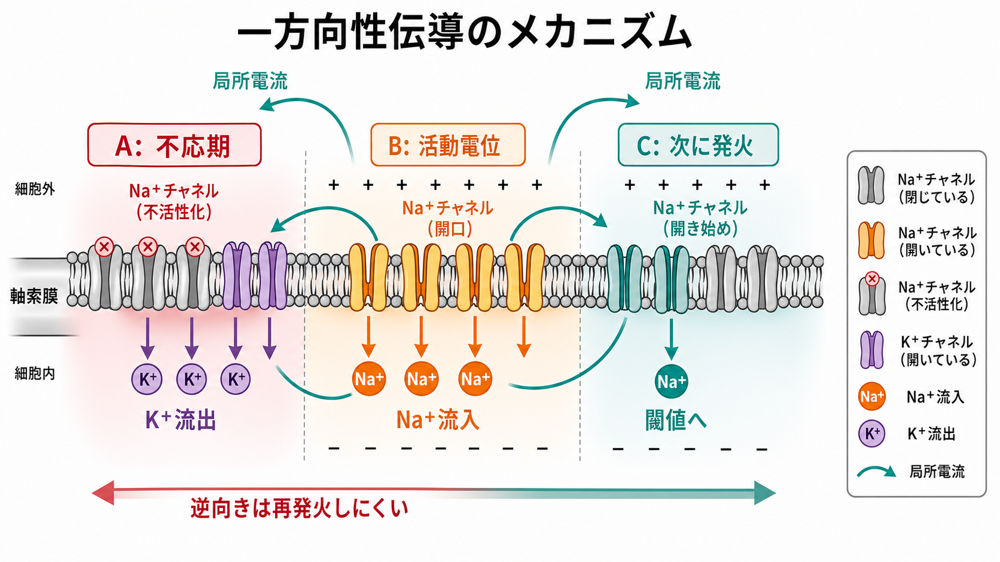
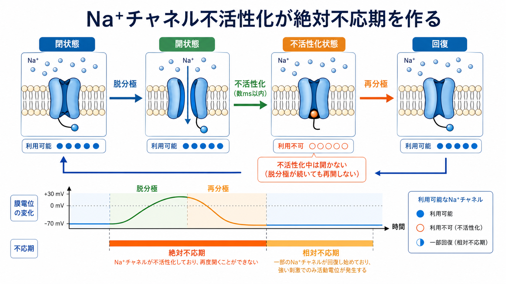

---
title: "活動電位はなぜ全か無かの法則に従うのか"
description: "活動電位が閾値と電位依存性Na+チャネルの正のフィードバックによって、発火するかしないかの離散的な現象として現れる理由を説明する。"
aliases:
  - "活動電位の全か無かの法則"
  - "全か無かの法則"
  - "活動電位の閾値"
tags:
  - neuroscience
  - basic-neuroscience
  - obsidian
created: "2026-04-27"
updated: "2026-04-27"
draft: true
publish: false
status: draft
enableToc: true
---

# 活動電位はなぜ全か無かの法則に従うのか

## 要点

- 活動電位の「全か無か」は、膜電位が閾値を超えると電位依存性Na+チャネルがまとまって開き、Na+流入がさらなる脱分極を呼ぶ正のフィードバックに入るために生じる[1][2]。
- 閾値未満の入力では、漏れ電流やK+電流などが脱分極を打ち消し、局所的な膜電位変化は小さく減衰する[1][3]。
- 閾値を超えた後のスパイク振幅は、刺激の強さそのものではなく、Na+チャネルの活性化、Na+チャネルの不活性化、K+チャネルによる再分極でほぼ決まる[2][4]。
- 強い刺激は、1発の活動電位を大きくするのではなく、発火の頻度、タイミング、発火する細胞集団を変えることで表現される[5]。

## この記事で答える問い

「刺激が少し強くなれば、活動電位も少し大きくなる」と考えると直感的である。しかし典型的な[[ニューロンとは何か|ニューロン]]の活動電位は、閾値を超えない限り発火せず、超えた場合にはほぼ同じ大きさのスパイクとして現れる。このノートでは、その性質がどのように[[イオンチャネルとは何か|イオンチャネル]]と[[神経細胞膜はどのように電気信号を生み出すのか|神経細胞膜]]の物理から生じるのかを説明する。

## まず結論

活動電位が全か無かに見えるのは、発火が「刺激の大きさをそのまま拡大した波」ではなく、「閾値を超えると自己増幅する再生的イベント」だからである。膜電位が十分に脱分極すると、電位依存性Na+チャネルが開く。Na+は細胞外から細胞内へ流入し、膜電位をさらに脱分極させる。その脱分極がさらに多くのNa+チャネルを開かせる。この正のフィードバックが始まると、発火は急速に立ち上がる[1][2]。

ただし、この自己増幅は無限には続かない。Na+チャネルは短時間で不活性化し、遅れて開く電位依存性K+チャネルがK+を外へ流すことで膜電位を再分極させる[2][4]。つまり活動電位の大きさと時間経過は、入力刺激の大きさだけではなく、Na+チャネルとK+チャネルの開閉速度、イオン濃度勾配、膜の受動的性質によって制約されている。

## 背景

活動電位は、[[軸索はどのように情報を遠くへ伝えるのか|軸索]]を伝わる神経信号の基本単位である。Hodgkin と Huxley はイカ巨大軸索の電位固定実験に基づいて、活動電位をNa+電流、K+電流、漏れ電流、膜容量の相互作用として定式化した[3]。この古典的モデルは、閾値、急速な立ち上がり、再分極、不応期を同じ枠組みで説明できる。

現実の哺乳類中枢ニューロンでは、イカ巨大軸索よりも多様な電位依存性チャネルが関与し、発火パターンも細胞種ごとに大きく異なる[5]。それでも、典型的なスパイクの立ち上がりにおいて、Na+チャネルの急速な活性化が脱分極を自己増幅するという骨格は変わらない。

## 基本概念

### 閾値

閾値とは、単に「ここを超えると発火する」という目印ではなく、内向きNa+電流が漏れ電流や外向き電流を上回り、脱分極が自己増幅へ入る条件である[2][3]。そのため閾値は絶対的に固定された電圧ではない。直前の発火履歴、Na+チャネルの不活性化、K+チャネルの開き具合、入力の速さ、軸索起始部の状態によって変わる[5]。

### 電位依存性Na+チャネル

電位依存性Na+チャネルは、膜電位の脱分極を検出して開くチャネルである。開くとNa+が細胞内へ入り、膜電位を急速に正方向へ動かす。Catterall のレビューが整理するように、電位依存性Na+チャネルは神経、筋、その他の興奮性細胞で活動電位開始の中心的役割を担う[4]。

### 正のフィードバック

正のフィードバックとは、ある変化が同じ方向の変化をさらに強める仕組みである。活動電位では、「脱分極 → Na+チャネル開口 → Na+流入 → さらに脱分極」というループがこれにあたる。閾値を超えると、このループが短時間で加速し、局所的な小さな入力が大きなスパイクへ変換される[1][2]。

## 仕組み

### 1. 閾値未満では局所応答で終わる

樹状突起や細胞体に入った興奮性入力は、膜を少し脱分極させる。しかし、膜には容量と抵抗があり、電位変化は時間と距離に応じて減衰する。また、静止時にも開いている漏れチャネルやK+に関わる外向き電流は、膜電位をもとの状態へ戻そうとする[1]。そのため、閾値に届かない入力は、シナプス後電位のような段階的な局所応答で終わる。

### 2. 閾値付近で内向き電流が勝ち始める

膜電位が十分に脱分極すると、電位依存性Na+チャネルの開口確率が上がる。Na+の電気化学的駆動力は細胞内向きに大きいため、開いたNa+チャネルを通って正電荷が流入する。ここで内向きNa+電流が、漏れ電流やK+電流による戻しを上回ると、膜電位はさらに脱分極する[2][3]。

### 3. Na+流入がさらにNa+チャネルを開く

この段階が全か無かの本体である。少し多く開いたNa+チャネルが膜をさらに脱分極させ、その脱分極がさらに多くのNa+チャネルを開かせる。こうして発火は再生的に立ち上がる。入力が閾値を十分に超えた後は、スパイクの立ち上がりは外部刺激の細かな強弱よりも、チャネルの開閉 kinetics によって支配される[3][4]。

### 4. Na+チャネル不活性化とK+流出がスパイクを止める

活動電位は上がり続けるわけではない。Na+チャネルには速い不活性化があり、開いた後すぐにNa+を通しにくい状態へ移る。さらに、電位依存性K+チャネルはNa+チャネルより遅れて開き、K+を細胞外へ流す。これにより膜電位は再分極し、場合によっては一時的に過分極する[2][4]。

### 5. 不応期が「連続的な大きさ」ではなく「発火列」を作る

Na+チャネルが不活性化している間は、同じ場所でただちに次の活動電位を作れない。これが絶対不応期である。その後も一部のNa+チャネルが回復していなかったり、K+チャネルが開いていたりすると、より強い入力が必要になる相対不応期が続く[2]。この制約により、強い入力は1発のスパイクを大きくするよりも、発火間隔を短くする方向に表れやすい。

## 図解

3枚の図は、同じ現象を別の粒度で示している。

| 図 | 見るポイント | 重要な意味 |
|---|---|---|
| 概念地図 | 入力、閾値、再生的発火の関係 | 閾値未満と閾値以上で応答が質的に変わる |
| 正のフィードバック | Na+チャネル開口とNa+流入の循環 | 全か無かを作る直接のメカニズム |
| 刺激強度の比較 | 同じ高さのスパイクと頻度の変化 | 強い刺激は振幅ではなく発火頻度へ変換される |

## 臨床・研究との接続

全か無かの法則は、神経科学の基礎概念であると同時に、薬理学や疾患研究にも直結する。局所麻酔薬やテトロドトキシンのようにNa+チャネル機能を妨げる物質は、活動電位の発生や伝導を抑える[4][6]。また、Na+チャネルの遺伝的変化は、てんかん、疼痛、筋の興奮性異常などの研究対象になる[4]。

研究上は、Hodgkin-Huxley 型モデルから、より単純化した発火モデル、さらに多チャネルを含む細胞種別モデルまで、活動電位の全か無か性は数理モデルの重要な検証点になる[3][7]。ただし、実際のニューロンではスパイク振幅も完全に不変ではなく、発火頻度、温度、チャネル状態、細胞内外イオン濃度、記録部位によって変化しうる[5]。したがって「全か無か」は、単一スパイクの振幅があらゆる条件で厳密に同一という意味ではなく、閾値を境に再生的発火へ入るという性質として理解するとよい。

## よくある誤解

### 誤解1: 閾値は固定された1つの電圧である

教科書ではしばしば -55 mV のような値で説明されるが、これは理解のための代表値である。実際の閾値は、細胞種、軸索起始部のチャネル密度、直前の活動履歴、入力の立ち上がり速度によって変わる[2][5]。

### 誤解2: 強い刺激ほど活動電位が高くなる

典型的な単一ニューロンの活動電位では、閾値を超えた後の1発のスパイク振幅はほぼ一定である。強い刺激は、より高いスパイクではなく、より高い発火頻度、より短い潜時、より多くの神経線維の動員として表れやすい[1][5]。

### 誤解3: 全か無かは、入力が全部無視されるという意味である

閾値未満の入力も無意味ではない。閾値未満の興奮性・抑制性入力は時間的・空間的に加算され、発火しやすさを連続的に調整する。全か無かは、最終的な活動電位発生イベントの性質であって、発火前の膜電位変化が連続的でないという意味ではない。

### 誤解4: 活動電位はNa+だけで説明できる

Na+チャネルの正のフィードバックは立ち上がりの中心だが、スパイクの終結、発火頻度、不応期、発火パターンにはK+チャネルや他の電位依存性チャネルが不可欠である[2][5]。

## 関連ノート

- [[ニューロンとは何か]]
- [[神経細胞膜はどのように電気信号を生み出すのか]]
- [[イオンチャネルとは何か]]
- [[軸索小丘はなぜ発火の起点になるのか]]
- [[軸索はどのように情報を遠くへ伝えるのか]]
- [[ナトリウムカリウムポンプは神経活動にどう関わるのか]]

今後の作成候補:

- 電位依存性ナトリウムチャネルとは何か
- シナプス後電位とは何か
- 不応期とは何か
- 発火頻度符号化とは何か
- Hodgkin-Huxleyモデルとは何か

MOC更新候補:

- `content/00_MOC/` の脳・神経科学または基礎神経科学 MOC に、本記事へのリンクを追加する。

## 理解チェック

1. 閾値未満の入力が活動電位にならないのは、どのような電流や膜性質に打ち消されるからか。
2. 「脱分極 → Na+チャネル開口 → Na+流入 → さらに脱分極」というループは、なぜ正のフィードバックと呼べるか。
3. Na+チャネルの不活性化とK+チャネルの開口は、活動電位のどの段階を説明するか。
4. 強い刺激が1発のスパイク振幅ではなく発火頻度として表れやすい理由は何か。
5. 「全か無か」は、実際のニューロンでスパイク波形が完全に不変であるという意味ではない。では、どの意味で有用な近似なのか。

## 参考文献

[1] OpenStax. (2013). 12.4 The Action Potential. *Anatomy and Physiology*. https://openstax.org/books/anatomy-and-physiology/pages/12-4-the-action-potential

[2] Chen I, Lui F. (2023). Neuroanatomy, Neuron Action Potential. *StatPearls*. NCBI Bookshelf. https://www.ncbi.nlm.nih.gov/sites/books/NBK546639/

[3] Hodgkin AL, Huxley AF. (1952). A quantitative description of membrane current and its application to conduction and excitation in nerve. *The Journal of Physiology*, 117(4), 500-544. https://doi.org/10.1113/jphysiol.1952.sp004764

[4] Catterall WA. (2012). Voltage-gated sodium channels at 60: structure, function and pathophysiology. *The Journal of Physiology*, 590(11), 2577-2589. https://doi.org/10.1113/jphysiol.2011.224204

[5] Bean BP. (2007). The action potential in mammalian central neurons. *Nature Reviews Neuroscience*, 8, 451-465. https://doi.org/10.1038/nrn2148

[6] Hernandez CM, Richards JR. (2023). Physiology, Sodium Channels. *StatPearls*. NCBI Bookshelf. https://www.ncbi.nlm.nih.gov/books/NBK545257/

[7] Izhikevich EM. (2007). *Dynamical Systems in Neuroscience: The Geometry of Excitability and Bursting*. MIT Press. https://mitpress.mit.edu/9780262090438/dynamical-systems-in-neuroscience/

## 未解決問題

- 実際の細胞種ごとの閾値変動を、どの程度まで単純な「閾値モデル」で近似できるか。
- 軸索起始部の可塑性が、発火頻度符号化や病的興奮性にどの程度寄与するか。
- スパイク振幅、発火頻度、発火タイミング、神経集団の動員を、どの粒度で分けて説明するのが学習上もっとも有効か。

## 更新ログ

- 2026-04-27: 初稿作成。閾値、Na+チャネルの正のフィードバック、不応期、発火頻度符号化を中心に整理。
