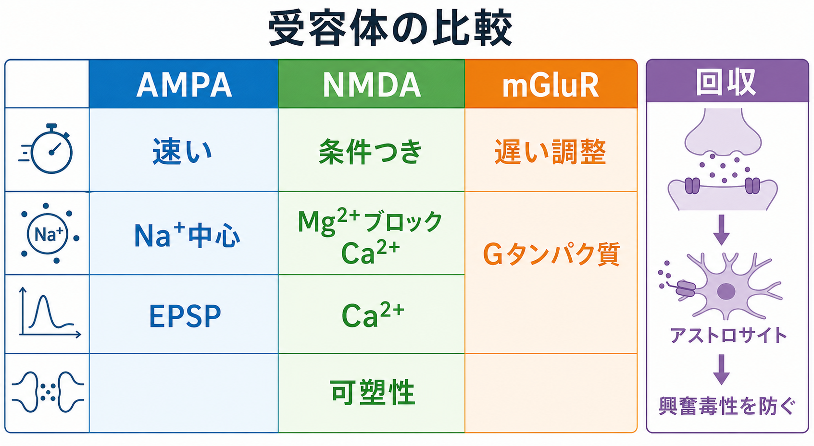
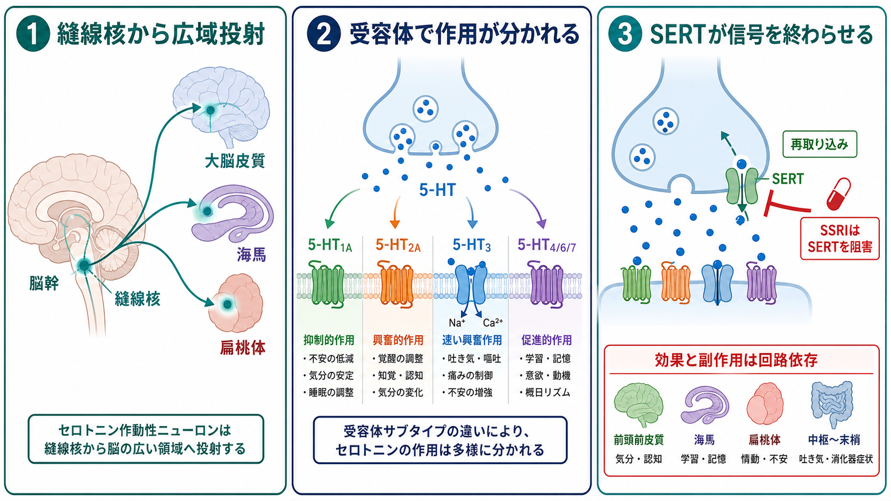

---
title: "神経伝達物質はどのように放出されるのか"
description: "シナプス小胞、SNARE複合体、Ca2+依存性開口放出を中心に、神経伝達物質が前シナプス終末から放出される仕組みを説明する。"
aliases:
  - "神経伝達物質の放出"
  - "シナプス小胞の開口放出"
  - "Ca2+依存性開口放出"
tags:
  - neuroscience
  - basic-neuroscience
  - obsidian
  - 脳・神経科学/基礎神経科学
created: "2026-04-27"
updated: "2026-04-27"
draft: true
publish: false
status: draft
enableToc: true
---

# 神経伝達物質はどのように放出されるのか

## 要点

- 神経伝達物質の多くは、前シナプス終末のシナプス小胞に貯蔵され、活動電位の到達に応じてシナプス間隙へ放出される。
- 放出の直接の引き金は、電位依存性Ca2+チャネルから入るCa2+である。Ca2+はシナプトタグミンなどのCa2+センサーに結合し、開口放出を高速に進める[1][2]。
- SNARE複合体は、小胞膜と前シナプス膜を近づけ、膜融合に必要な力を生む中心的な分子装置である[3][4]。
- 放出は「小胞が近くにある」だけでは起きない。ドッキング、プライミング、Ca2+チャネルとの近接配置、融合孔形成、リサイクリングが連続して働く[2][5]。
- この仕組みは短期可塑性、毒素、薬理学、神経疾患研究を理解する土台になる[6][7]。

## この記事で答える問い

この記事では、[[活動電位はどのように発生するのか]]や[[軸索はどのように情報を遠くへ伝えるのか]]の次に来る問いとして、次を扱う。

1. 活動電位が前シナプス終末に到達した後、何が神経伝達物質の放出を始めるのか。
2. シナプス小胞はどのように膜と融合するのか。
3. SNARE複合体、シナプトタグミン、Ca2+チャネルはどのように協調するのか。
4. この仕組みは、可塑性や毒素・疾患研究とどうつながるのか。

## まず結論

神経伝達物質の放出は、電気信号を化学信号へ変換する、前シナプス終末の高速な膜融合反応である。[[活動電位はどのように発生するのか|活動電位]]が終末に到達すると、電位依存性Ca2+チャネルが開き、局所的に高濃度のCa2+が流入する。このCa2+がシナプトタグミンに結合すると、あらかじめドッキング・プライミングされていたシナプス小胞が、SNARE複合体を介して前シナプス膜と融合する。融合孔が開くと、小胞内の神経伝達物質がシナプス間隙へ拡散し、後シナプス側の受容体へ結合する[1][2]。

重要なのは、放出が「最後の瞬間だけの反応」ではない点である。小胞は放出前から能動的に準備され、アクティブゾーンに配置され、Ca2+チャネルの近くに置かれている。だからこそ、活動電位から1ミリ秒以下の時間スケールで放出が起こりうる[1]。

## 背景

ニューロンは[[イオンチャネルとは何か|イオンチャネル]]を使って電気信号を生み、[[軸索はどのように情報を遠くへ伝えるのか|軸索]]を通じて遠くへ伝える。しかし、ニューロン同士の接点では、多くの場合、電気信号がそのまま相手細胞へ流れるのではなく、化学物質の放出に変換される。この接点が化学シナプスであり、放出される化学物質が神経伝達物質である。

前シナプス終末には多数のシナプス小胞があり、その一部がアクティブゾーンと呼ばれる放出部位の近くに配置される。小胞は神経伝達物質を内部に取り込み、必要なときに膜融合によって内容物を外へ出す。放出後、小胞膜成分はエンドサイトーシスなどで回収され、再び小胞として使われる。この一連の循環をシナプス小胞サイクルという[5]。

## 基本概念

### シナプス小胞

シナプス小胞は、神経伝達物質を入れた小さな膜小胞である。小胞は単なる袋ではなく、VAMP/シナプトブレビン、シナプトタグミン、輸送体などの膜タンパク質をもち、放出と再利用のための分子装置を備えている[5]。

小胞は大まかに、予備プール、リサイクリングプール、即時放出可能プールとして説明されることがある。ここで重要なのは、すべての小胞が同じ確率で同時に放出されるわけではなく、アクティブゾーンに近く、すでに準備された小胞ほど、活動電位に応じて放出されやすいという点である[2][5]。

### アクティブゾーン

アクティブゾーンは、前シナプス膜のうち、小胞放出が起こりやすい特殊化された領域である。ここにはCa2+チャネル、RIM、Munc13、Munc18などのタンパク質が集まり、小胞の配置、プライミング、Ca2+流入の位置合わせを担う[1][2]。

この配置は、放出の速さに直結する。Ca2+は細胞内で広く均一に増える前に、チャネルの近くで局所的な高濃度領域を作る。準備済み小胞がその近くに置かれていると、シナプトタグミンがすばやくCa2+を検出できる[1][6]。

### SNARE複合体

SNARE複合体は、小胞膜側のVAMP/シナプトブレビンと、前シナプス膜側のシンタキシン、SNAP-25が作るタンパク質複合体である。これらは4本のらせん束を作り、小胞膜と細胞膜を強く近づける[3][4]。

よく使われる比喩では、SNAREは「ジッパー」のようにN末端側からC末端側へ組み上がり、2枚の膜を引き寄せる。ただし、実際の放出ではSNAREだけでなく、Munc13、Munc18、シナプトタグミン、コンプレキシンなどが反応のタイミングと方向を制御する[2][3]。

### シナプトタグミンとCa2+

シナプトタグミンは、シナプス小胞膜にある主要なCa2+センサーである。活動電位によってCa2+が流入すると、シナプトタグミンのC2ドメインがCa2+と結合し、膜脂質やSNARE複合体との相互作用を変える。これにより、融合孔形成が促進される[1][2]。

## 仕組み

### 1. 小胞に神経伝達物質が詰め込まれる

放出前の小胞には、専用の輸送体によって神経伝達物質が取り込まれる。多くの場合、この取り込みは小胞膜をはさんだプロトン勾配を利用する。つまり、神経伝達物質の放出は、活動電位が来てから突然すべてを始めるのではなく、事前に小胞を準備しておく仕組みに支えられている[5]。

### 2. 小胞がアクティブゾーンへ近づく

小胞は前シナプス終末内を移動し、アクティブゾーン近くに配置される。この段階はドッキングと呼ばれる。ドッキングした小胞は、放出部位に物理的に近いだけでなく、RIM、Rab、Munc13などのタンパク質ネットワークによって、Ca2+チャネルの近くに置かれる[1][2]。

### 3. プライミングで放出可能状態になる

プライミングとは、小胞が実際に融合できる状態へ整えられる過程である。Munc13やMunc18は、シンタキシンの構造変化やSNARE複合体形成を助ける。SNARE複合体が部分的に組み上がることで、小胞は融合直前の高エネルギー状態に近づく[2][3]。

この段階を理解すると、なぜ「小胞が膜に接している」だけでは十分でないかが分かる。放出には、膜同士を近づける力、反応の抑制、Ca2+到来時の解除が組み合わさる必要がある。

### 4. 活動電位がCa2+流入を起こす

[[活動電位はどのように発生するのか|活動電位]]が前シナプス終末へ到達すると、膜電位変化によって電位依存性Ca2+チャネルが開く。Ca2+は細胞外から終末内へ流入し、チャネル近傍に高濃度のCa2+マイクロドメインを作る[1][6]。

このCa2+濃度は、細胞全体で平均した濃度よりも、放出部位の局所濃度が重要である。小胞とCa2+チャネルの距離が近いほど、短い活動電位でもシナプトタグミンがCa2+を検出しやすい[1][6]。

### 5. シナプトタグミンがCa2+を検出し、融合孔が開く

Ca2+がシナプトタグミンに結合すると、シナプトタグミンは膜脂質やSNARE複合体との相互作用を通じて、膜融合を促す。コンプレキシンはSNARE複合体に結合し、融合を助ける一方で、Ca2+到来前の不用意な融合を抑える役割ももつと考えられている[1][2]。

最終的に小胞膜と前シナプス膜の間に融合孔が形成される。融合孔が開くと、小胞内の神経伝達物質がシナプス間隙へ放出される。小胞が完全に膜へ崩れ込む場合もあれば、融合孔の開閉を含む複数の様式が議論される[2][5]。

### 6. 神経伝達物質が受容体に結合し、小胞膜が回収される

放出された神経伝達物質はシナプス間隙を拡散し、後シナプス膜の受容体へ結合する。ここで[[樹状突起はどのように情報を受け取るのか|樹状突起]]や細胞体側の電気的・生化学的応答が始まる。放出後の小胞膜成分はエンドサイトーシスなどで回収され、再び小胞として再利用される[5]。

## 図解

1枚目の図は、活動電位到達からCa2+流入、SNARE複合体形成、開口放出、受容体結合までの全体像を示している。2枚目の図は、SNARE複合体とシナプトタグミンを中心に、最も重要な分子機構を拡大している。3枚目の図は、この仕組みが短期可塑性、毒素、実験手法へどう接続するかをまとめている。

## 臨床・研究との接続

### 短期可塑性

同じシナプスでも、直前にどれだけ活動したかによって放出確率は変わる。短期促通では、残存Ca2+などにより次の放出が起こりやすくなる。短期抑圧では、即時放出可能な小胞の枯渇や放出装置の状態変化により、応答が弱くなる。これらは、シナプスが単なる中継点ではなく、活動履歴を反映する動的な変換器であることを示す[6][8]。

### ボツリヌス毒素と破傷風毒素

ボツリヌス毒素や破傷風毒素は、SNAREタンパク質を切断することで神経伝達物質放出を阻害する。たとえばボツリヌス毒素の一部はSNAP-25を、別の型はVAMP/シナプトブレビンやシンタキシンを標的にする。SNAREが切断されると、小胞膜と前シナプス膜の融合がうまく進まず、放出が低下する[7]。

ここでの記述は教育・研究目的の基礎説明であり、個別の診断や治療方針を示すものではない。

### 実験手法

神経伝達物質放出は、電気生理学、蛍光イメージング、遺伝学、構造生物学、生化学的再構成実験によって研究されてきた。SNARE複合体の結晶構造は、シナプトブレビン、シンタキシン、SNAP-25が4本のらせん束を作ることを示した[4]。また、SNAREを人工膜に再構成した実験は、SNAREが膜融合の最小装置として働きうることを示した[3]。

ただし、生体内の神経伝達物質放出はSNAREだけでは説明しきれない。速さ、同期性、Ca2+依存性、放出確率の調節には、アクティブゾーンタンパク質、Ca2+チャネル配置、シナプトタグミン、コンプレキシン、Munc13/Munc18などの統合が必要である[1][2]。

## よくある誤解

### 誤解1: 神経伝達物質は、活動電位が来た瞬間にその場で合成される

多くの高速シナプス伝達では、神経伝達物質はあらかじめシナプス小胞に貯蔵されている。活動電位は合成開始の合図というより、準備済み小胞の開口放出を引き起こす合図である[5]。

### 誤解2: Ca2+は細胞内全体に増えれば十分である

高速放出では、平均的な細胞内Ca2+濃度より、Ca2+チャネル近傍の局所濃度と小胞との距離が重要である。Ca2+チャネルと放出可能小胞を近接させるアクティブゾーンの構成が、ミリ秒以下の応答を支える[1][6]。

### 誤解3: SNARE複合体だけで神経伝達物質放出はすべて説明できる

SNAREは膜融合の中心装置だが、神経シナプスの放出にはタイミング制御が必要である。シナプトタグミン、コンプレキシン、Munc13、Munc18、RIMなどが、放出を「速く、必要な時だけ」起こすための制御層を作る[1][2]。

### 誤解4: すべてのシナプスで放出の起こりやすさは同じである

放出確率、Ca2+チャネルとの距離、小胞プールの大きさ、短期可塑性はシナプスごとに異なる。したがって、同じ活動電位でも、シナプスの種類や活動履歴によって後シナプス応答は変わる[6][8]。

## 関連ノート

- [[ニューロンとは何か]]
- [[活動電位はどのように発生するのか]]
- [[軸索はどのように情報を遠くへ伝えるのか]]
- [[樹状突起はどのように情報を受け取るのか]]
- [[イオンチャネルとは何か]]

### 今後の作成候補

- シナプスとは何か
- 神経伝達物質とは何か
- シナプス可塑性とは何か
- 短期可塑性とは何か
- ボツリヌス毒素は神経伝達をどう止めるのか

### MOC更新候補

- `content/00_MOC/` 配下の脳・神経科学または基礎神経科学MOCに、本記事へのリンクを追加する候補。
- 並列ジョブとの競合を避けるため、本記事作成時点ではMOC本体は更新しない。

## 理解チェック

1. 活動電位が前シナプス終末へ到達した後、最初に開く主要なチャネルは何か。
2. SNARE複合体を構成する代表的な3種類のタンパク質は何か。
3. シナプトタグミンは、放出過程のどの段階で重要になるか。
4. 「小胞が膜の近くにあること」と「小胞が放出可能であること」はなぜ同じではないのか。
5. ボツリヌス毒素がSNAREを切断すると、なぜ放出が低下するのか。

## 参考文献

[1] Südhof, T. C. (2013). Neurotransmitter release: the last millisecond in the life of a synaptic vesicle. *Neuron*, 80(3), 675-690. https://doi.org/10.1016/j.neuron.2013.10.022

[2] Rizo, J. (2022). Molecular mechanisms underlying neurotransmitter release. *Annual Review of Biophysics*, 51, 377-408. https://doi.org/10.1146/annurev-biophys-111821-104732

[3] Weber, T., Zemelman, B. V., McNew, J. A., Westermann, B., Gmachl, M., Parlati, F., Sollner, T. H., & Rothman, J. E. (1998). SNAREpins: minimal machinery for membrane fusion. *Cell*, 92(6), 759-772. https://doi.org/10.1016/S0092-8674(00)81404-X

[4] Sutton, R. B., Fasshauer, D., Jahn, R., & Brunger, A. T. (1998). Crystal structure of a SNARE complex involved in synaptic exocytosis at 2.4 A resolution. *Nature*, 395, 347-353. https://doi.org/10.1038/26412

[5] Südhof, T. C. (2004). The synaptic vesicle cycle. *Annual Review of Neuroscience*, 27, 509-547. https://doi.org/10.1146/annurev.neuro.26.041002.131412

[6] Neher, E., & Sakaba, T. (2008). Multiple roles of calcium ions in the regulation of neurotransmitter release. *Neuron*, 59(6), 861-872. https://doi.org/10.1016/j.neuron.2008.08.019

[7] Pirazzini, M., Rossetto, O., Eleopra, R., & Montecucco, C. (2017). Botulinum neurotoxins: biology, pharmacology, and toxicology. *Pharmacological Reviews*, 69(2), 200-235. https://doi.org/10.1124/pr.116.012658

[8] Regehr, W. G. (2012). Short-term presynaptic plasticity. *Cold Spring Harbor Perspectives in Biology*, 4(7), a005702. https://doi.org/10.1101/cshperspect.a005702

## 未解決問題

- SNARE、シナプトタグミン、コンプレキシン、Munc13/Munc18が、融合孔形成の瞬間にどの順序と構造状態で働くかには、なお議論がある。
- シナプスごとの放出確率の違いを、分子配置、Ca2+チャネル距離、小胞プール、発達段階からどこまで予測できるかは重要な研究課題である。
- 高速同期放出、非同期放出、自発放出がどの程度同じ分子装置を共有し、どこから異なる制御を受けるのかは、現在も精密化が進んでいる。

## 更新ログ

- 2026-04-27: 初版作成。シナプス小胞、SNARE複合体、Ca2+依存性開口放出、研究・臨床接続を整理。
