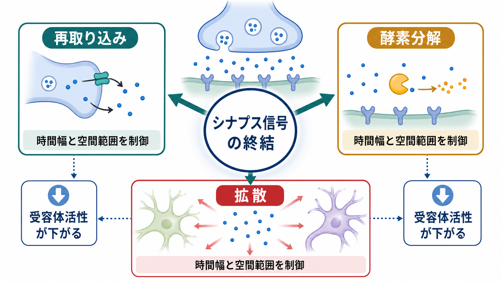
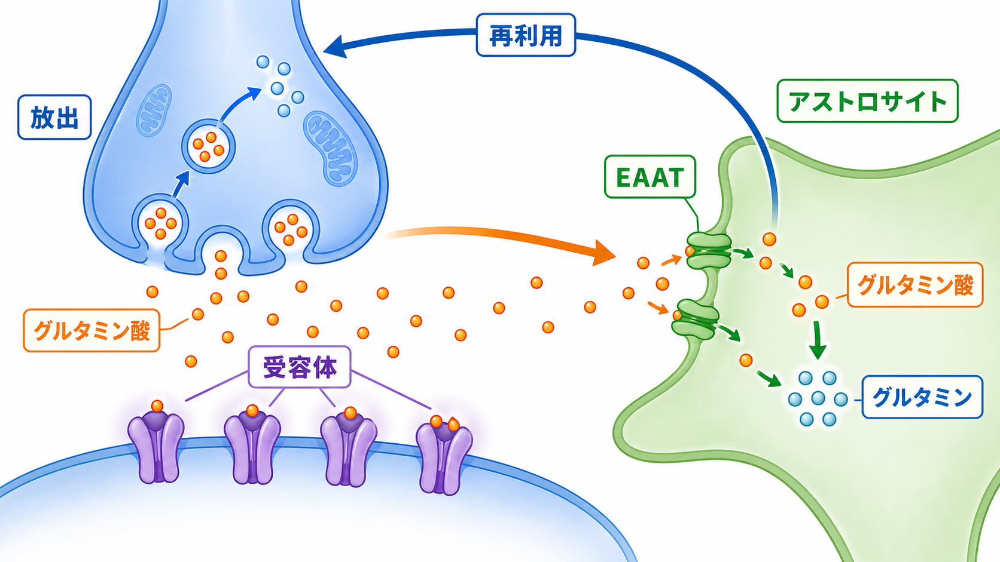
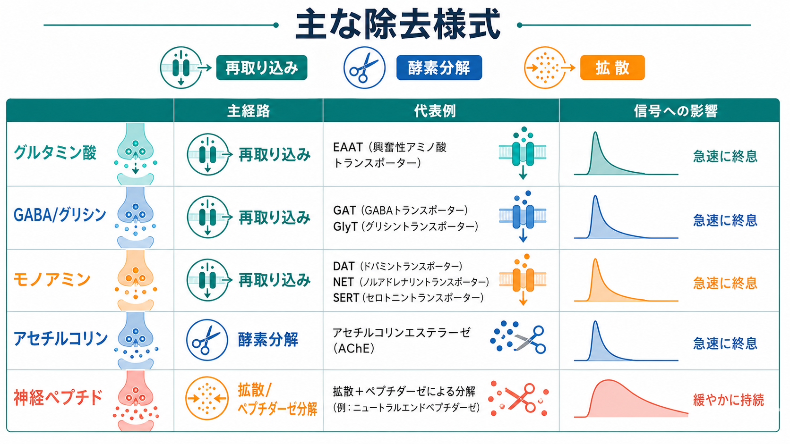

---
title: "神経伝達物質はどのように除去されるのか"
description: "再取り込み、酵素分解、拡散によってシナプス間隙から神経伝達物質が除去され、シナプス信号が終結する仕組みを整理する。"
aliases:
  - "神経伝達物質の除去"
  - "シナプス信号の終結"
  - "再取り込み"
tags:
  - neuroscience
  - basic-neuroscience
  - synapse
  - neurotransmitter
  - obsidian
created: "2026-04-27"
updated: "2026-04-27"
draft: true
publish: false
status: draft
enableToc: true
---

# 神経伝達物質はどのように除去されるのか

## 要点

- [[神経伝達物質はどのように放出されるのか|神経伝達物質の放出]]だけでなく、その後の除去も[[シナプスとは何か|シナプス]]信号の時間幅と空間範囲を決める。
- 主な終結経路は、トランスポーターによる**再取り込み**、酵素による**分解**、シナプス間隙からの**拡散**である[1][2]。
- グルタミン酸、GABA、グリシン、モノアミンでは、神経終末やグリア細胞のトランスポーターが重要である[3][4][5]。
- アセチルコリンでは、シナプス間隙付近のアセチルコリンエステラーゼによる高速な加水分解が代表的な終結機構である[6]。
- 神経ペプチドは小分子伝達物質のようにそのまま小胞へ再利用されにくく、拡散とペプチダーゼ分解を受けやすい[7][8]。

## この記事で答える問い

1. 放出された神経伝達物質は、なぜすぐ消えなければならないのか。
2. 再取り込み、酵素分解、拡散はどう違うのか。
3. グルタミン酸、GABA、モノアミン、アセチルコリン、神経ペプチドでは、どの経路が目立つのか。
4. 除去機構は、薬理学や疾患研究とどうつながるのか。

## まず結論

シナプス信号は、神経伝達物質が受容体に結合して始まり、神経伝達物質が受容体の近くから減ることで終わる。したがって、除去は「後片づけ」ではなく、[[シナプス後電位とは何か|シナプス後電位]]の長さ、隣のシナプスへの漏れ、次の入力に反応できるまでの時間を決める制御過程である[1][2]。

除去の3本柱は、再取り込み、酵素分解、拡散である。再取り込みは、細胞膜トランスポーターが神経伝達物質を神経終末や[[アストロサイトはシナプスと代謝をどう支えているのか|アストロサイト]]へ戻す仕組みで、再利用と細胞外濃度の低下を同時に支える。酵素分解は、神経伝達物質を別の分子に変えて受容体を活性化できなくする。拡散は、分子がシナプス間隙から離れて濃度勾配に従って広がる過程で、単独でも働くが、多くの場合は取り込みや分解と組み合わさる[1][2]。

## 背景

[[受容体にはどのような種類があるのか|受容体]]は、神経伝達物質が存在するあいだ活性化されやすい。もし放出された分子がいつまでもシナプス間隙に残れば、次の信号との区別が難しくなり、周辺の受容体にも作用し、回路の時間精度が落ちる。特に[[グルタミン酸は脳で何をしているのか|グルタミン酸]]のような興奮性伝達物質では、細胞外濃度を低く保つことが過剰な受容体活性化を防ぐうえでも重要である[3]。

一方で、除去はただ速ければよいわけではない。除去が速いほど信号は短く局所的になり、遅いほど広がりや持続性が増す。神経修飾物質や神経ペプチドでは、広い範囲にゆっくり作用すること自体が情報処理の一部になる[7][8]。つまり、除去機構は「信号を消す装置」であると同時に、「どの時間・空間スケールで信号を読ませるか」を決める装置でもある。

## 基本概念

### 再取り込み

再取り込みは、細胞膜上のトランスポーターが神経伝達物質を細胞内へ運ぶ過程である。小分子伝達物質では特に重要で、神経終末へ戻されれば再合成や再包装に回り、グリア細胞へ入れば代謝や前駆体への変換を経て神経細胞へ戻ることがある[1][3]。

代表例はグルタミン酸輸送体 EAAT である。EAAT は神経細胞にも存在するが、とくにアストロサイトで高く発現し、細胞外グルタミン酸を低く保ち、シナプス外への漏れを制限する[3]。[[GABAは脳で何をしているのか|GABA]]でも GAT 系のトランスポーターが神経細胞とアストロサイトに存在し、細胞外 GABA 濃度と抑制性入力の時間幅を調節する[4]。

### 酵素分解

酵素分解は、神経伝達物質を受容体に結合しにくい分子へ変える。最も教科書的な例はアセチルコリンで、[[アセチルコリンは注意や記憶にどう関わるのか|アセチルコリン]]はアセチルコリンエステラーゼによってコリンと酢酸に分解される[6]。このため、コリン作動性シナプスでは、伝達物質をそのまま再取り込みするよりも、まず分解して信号を終結させることが中心になる。

モノアミンでは、ドパミン、ノルアドレナリン、セロトニンをトランスポーターが再取り込みした後、細胞内で MAO や COMT などの酵素が代謝に関わる。したがって、モノアミンの終結は「再取り込みか分解か」の二択ではなく、細胞外からの除去と細胞内代謝が連続した過程として理解するほうがよい[5]。

### 拡散

拡散は、神経伝達物質が濃度の高いシナプス間隙から周囲へ広がる過程である。拡散だけで信号が完全に終わるというより、拡散によって受容体近傍の濃度が下がり、さらに周辺のトランスポーターや酵素に捕捉される。シナプス間隙の形、細胞外空間、アストロサイト突起の配置は、拡散しやすさと捕捉されやすさを変える[1][3]。

神経ペプチドでは、放出部位から比較的広く拡散して体積伝達のように働くことがあり、細胞外ペプチダーゼによる分解が終結に関わる[7][8]。

## 仕組み

### 1. 放出直後、受容体近傍の濃度が急上昇する

神経伝達物質はシナプス小胞から一気に放出され、狭いシナプス間隙で一時的に高濃度になる。この濃度上昇が受容体を活性化し、イオンチャネル型受容体では速い電流を、代謝型受容体では比較的遅い調節性反応を生む[1][2]。

### 2. 拡散で濃度勾配が崩れ始める

放出点付近の濃度が高いため、分子は自然に周囲へ広がる。これにより受容体近傍の濃度は下がり始める。ただし、拡散した分子が近くの受容体を活性化することもあるため、拡散は信号を弱めるだけでなく、信号の空間的広がりにも関わる。

### 3. トランスポーターが細胞外濃度を下げる

トランスポーターは、シナプス間隙やその周辺から神経伝達物質を取り込む。グルタミン酸では EAAT が特に重要で、取り込まれたグルタミン酸はアストロサイト内でグルタミンへ変換され、神経細胞へ戻される。これはグルタミン酸-グルタミン循環として説明される[3]。

GABA やグリシンでも高親和性トランスポーターが終結に関わる。GABA トランスポーターの分布や膜上での動きは、抑制性シナプス入力の強さと持続時間に影響しうる[4]。

### 4. 酵素が分子の意味を変える

アセチルコリンエステラーゼは、アセチルコリンを非常に速く加水分解する。受容体を活性化する分子そのものが減るため、コリン作動性信号は短く区切られる[6]。神経ペプチドでは、細胞外のペプチダーゼがペプチドを短い断片へ分解し、受容体活性を下げる[7]。

### 5. 再利用または代謝へ回る

除去された分子は、そのまま捨てられるとは限らない。コリンは再び神経終末に取り込まれてアセチルコリン合成に使われ、グルタミンは神経細胞へ戻ってグルタミン酸や GABA の前駆体になる。モノアミンは DAT、NET、SERT などで再取り込みされ、再貯蔵または代謝を受ける[3][5][6]。

## 図解

図1は、シナプス信号の終結を「再取り込み」「酵素分解」「拡散」の3経路として整理した概念地図である。図2は、グルタミン酸がアストロサイトの EAAT によって取り込まれ、グルタミンとして神経細胞へ戻る流れを示す。図3は、伝達物質ごとに主な除去様式が異なることを比較する。

## 臨床・研究との接続

薬理学では、除去機構は主要な標的になる。セロトニン再取り込み阻害薬は SERT に作用し、シナプス外のセロトニン動態を変える。ドパミンやノルアドレナリンでは DAT や NET が重要な標的であり、[[ドパミンは報酬だけの物質なのか|ドパミン]]、[[ノルアドレナリンは覚醒とストレスにどう関わるのか|ノルアドレナリン]]、[[セロトニンは気分だけに関わるのか|セロトニン]]の各系の時間・空間的な作用範囲を考えるうえで、再取り込みは不可欠である[5]。

アセチルコリンエステラーゼ阻害薬は、アセチルコリン分解を抑えてコリン作動性信号を延長する。これはアルツハイマー病などの治療薬や、有機リン中毒の理解とも関係する。ただし、ここで述べているのは教育・研究目的の一般的な機構であり、個別の診断や治療判断を指示するものではない[6]。

基礎研究では、除去機構を測ることはシナプスの「入力」だけでなく「残り方」を測ることでもある。トランスポーター密度、アストロサイト突起の近さ、細胞外空間の形は、同じ放出量でも受容体が見る濃度波形を変える[3][4]。

## よくある誤解

### 「神経伝達物質は受容体にくっついたら終わり」

受容体結合だけでは終わらない。結合と解離を繰り返しながら、周囲の濃度が下がることで受容体活性も下がる。終結には、細胞外濃度を下げる除去機構が必要である。

### 「すべての神経伝達物質は再取り込みされる」

小分子伝達物質では再取り込みが重要だが、アセチルコリンでは酵素分解が中心であり、神経ペプチドでは拡散とペプチダーゼ分解が大きい。伝達物質の種類によって、終結の主役は異なる[6][7]。

### 「拡散はただの受動的な消失で、重要ではない」

拡散は受動的な物理過程だが、信号の広がりを決める。細胞外空間やグリア突起の配置が変われば、同じ分子でも受容体に届く範囲と時間が変わる[3]。

## 関連ノート

- [[シナプスとは何か]]
- [[神経伝達物質はどのように放出されるのか]]
- [[受容体にはどのような種類があるのか]]
- [[シナプス後電位とは何か]]
- [[アストロサイトはシナプスと代謝をどう支えているのか]]
- [[グルタミン酸は脳で何をしているのか]]
- [[GABAは脳で何をしているのか]]
- [[アセチルコリンは注意や記憶にどう関わるのか]]
- [[ドパミンは報酬だけの物質なのか]]
- [[セロトニンは気分だけに関わるのか]]
- [[ノルアドレナリンは覚醒とストレスにどう関わるのか]]

## MOC更新候補

- `content/00_MOC/` 内の基礎神経科学またはシナプス関連 MOC に、本記事 `[[神経伝達物質はどのように除去されるのか]]` を追加する候補。
- 並列ジョブとの競合を避けるため、このタスクでは MOC 本体は更新しない。

## 理解チェック

1. 神経伝達物質の除去が遅いと、シナプス信号の時間幅と空間範囲はどう変わるか。
2. グルタミン酸除去でアストロサイトが重要になる理由は何か。
3. アセチルコリンの終結機構が「再取り込み中心」と言いにくいのはなぜか。
4. モノアミンで再取り込みトランスポーターが薬理学的標的になりやすい理由は何か。
5. 神経ペプチドの作用が小分子伝達物質より広く・遅くなりやすい理由を、除去機構から説明できるか。

## 参考文献

[1] Purves D, Augustine GJ, Fitzpatrick D, et al., editors. (2001). *Neuroscience. 2nd edition*. Chapter 6, Neurotransmitter Release and Removal. NCBI Bookshelf. https://www.ncbi.nlm.nih.gov/books/NBK11106/

[2] Purves D, Augustine GJ, Fitzpatrick D, et al., editors. (2001). *Neuroscience. 2nd edition*. Chapter 6, Neurotransmitters. NCBI Bookshelf. https://www.ncbi.nlm.nih.gov/books/NBK10795/

[3] Tzingounis AV, Wadiche JI. (2007). Glutamate transporters: confining runaway excitation by shaping synaptic transmission. *Nature Reviews Neuroscience*, 8, 935-947. https://doi.org/10.1038/nrn2274

[4] Scimemi A. (2014). Structure, function, and plasticity of GABA transporters. *Frontiers in Cellular Neuroscience*, 8, 161. https://doi.org/10.3389/fncel.2014.00161

[5] Kristensen AS, Andersen J, Jørgensen TN, et al. (2011). SLC6 neurotransmitter transporters: structure, function, and regulation. *Pharmacological Reviews*, 63(3), 585-640. https://doi.org/10.1124/pr.108.000869

[6] Silman I, Sussman JL. (2005). Acetylcholinesterase: 'classical' and 'non-classical' functions and pharmacology. *Current Opinion in Pharmacology*, 5(3), 293-302. https://doi.org/10.1016/j.coph.2005.01.014

[7] Purves D, Augustine GJ, Fitzpatrick D, et al., editors. (2001). *Neuroscience. 2nd edition*. Chapter 6, Peptide Neurotransmitters. NCBI Bookshelf. https://www.ncbi.nlm.nih.gov/books/NBK10873/

[8] Xiong H, Wilson BA, Slesinger PA, Qin Z. (2023). Understanding neuropeptide transmission in the brain by optical uncaging and release. *ACS Chemical Neuroscience*, 14(4), 516-523. https://doi.org/10.1021/acschemneuro.2c00684

## 未解決問題

- 個々のシナプスで、トランスポーター密度とアストロサイト突起の位置がどの程度動的に変わるのか。
- 細胞外空間の形や粘性が、病態時に神経伝達物質の拡散をどの程度変えるのか。
- 神経ペプチドの「どこまで届くか」を、生体内で分子種ごとにどこまで精密に測れるのか。
