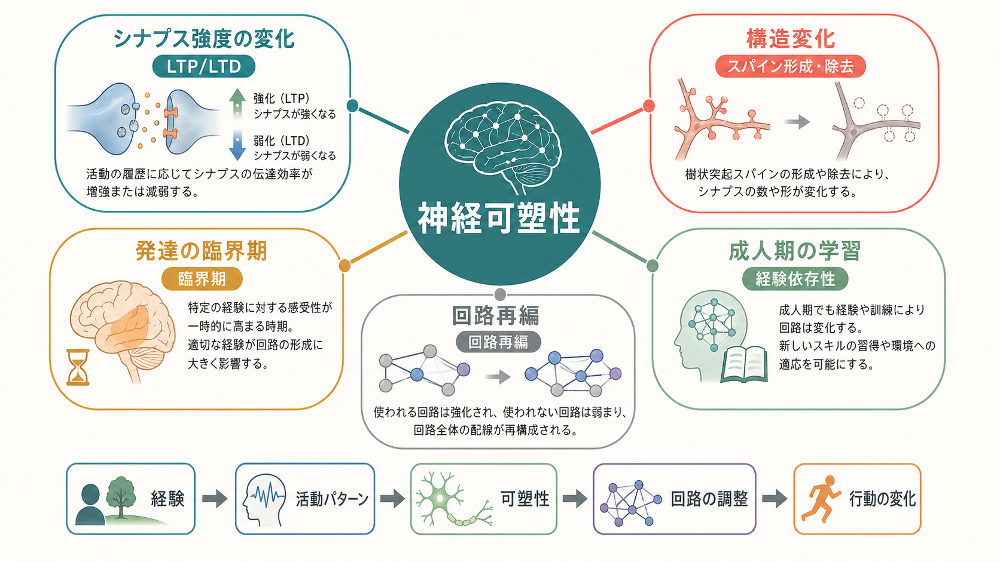
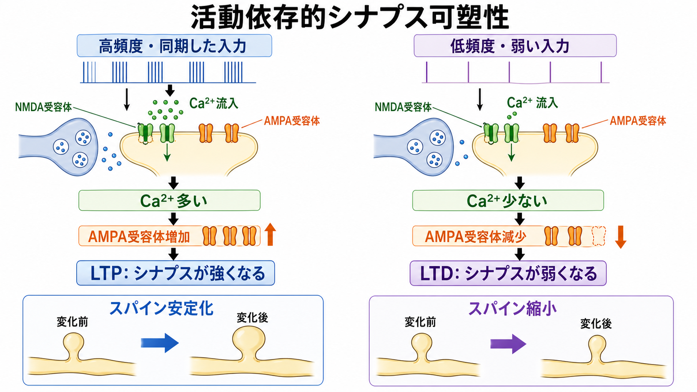
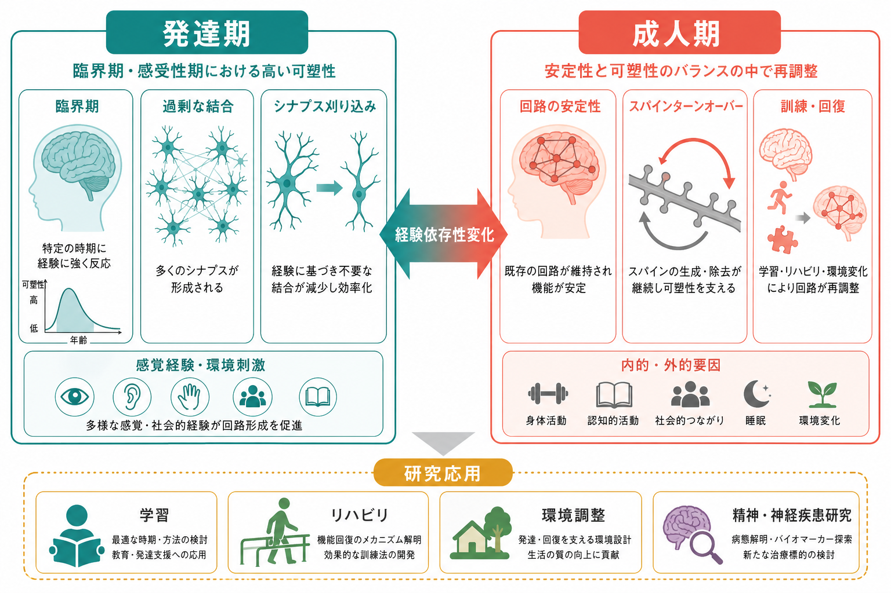

---
title: "神経可塑性は発達と学習をどう支えるのか"
description: "シナプス強度の変化、構造変化、回路再編、経験依存性変化を統合し、神経可塑性が発達と学習をどう支えるのかを説明する。"
aliases:
  - "神経可塑性"
  - "neuroplasticity"
  - "経験依存性可塑性"
tags:
  - neuroscience
  - basic-neuroscience
  - synapse
  - learning-memory
  - development
  - obsidian
created: "2026-04-27"
updated: "2026-04-27"
draft: true
publish: false
status: draft
enableToc: true
---

# 神経可塑性は発達と学習をどう支えるのか

## 要点

- 神経可塑性とは、経験・活動・発達段階に応じて、[[ニューロンとは何か|ニューロン]]間の結合強度、[[シナプスとは何か|シナプス]]の構造、回路の使われ方が変わる性質である。
- 学習では、既存シナプスの効率が変わる[[シナプス可塑性とは何か|シナプス可塑性]]と、スパイン形成・除去などの構造変化が組み合わさる[1][2]。
- 発達では、遺伝的に大枠が作られた回路が、感覚入力・運動・社会的経験によって選択、安定化、刈り込みを受ける[4][7]。
- 可塑性は「変わりやすさ」だけではなく、変化しすぎないための恒常性、抑制性回路、睡眠、注意、情動、環境条件にも支えられる[5][8]。
- 医療や教育に直結する便利な合言葉ではなく、細胞・回路・行動をつなぐ研究上の枠組みとして慎重に扱う必要がある。

## この記事で答える問い

この記事では、次の問いに答える。

1. 神経可塑性では、具体的に何が変わるのか。
2. シナプス変化、構造変化、回路再編はどうつながるのか。
3. 発達期の可塑性と成人期の学習は何が同じで、何が違うのか。
4. 臨床・教育・研究で神経可塑性を語るとき、どこに注意が必要か。

## まず結論

神経可塑性は、脳が経験を「保存する」単一の仕組みではない。むしろ、短時間の活動変化から、数時間から数日のシナプス強度変化、数日から数か月のスパイン再編、発達期にまたがる回路選択までを含む多層的な現象である[1][2][6]。

学習では、ある入力が行動にとって意味をもつと、その入力に関わるシナプスが強まり、不要な結合が弱まり、関連する回路の通り道が再利用されやすくなる。発達では、過剰に作られた結合が経験によって選別され、安定した回路へ整えられる[4][7]。したがって神経可塑性は、「脳は何歳でも自由に作り替えられる」という話ではなく、「経験が、制約のある生物学的仕組みを通じて回路の重みづけを変える」という話である。

## 背景

神経系は、発生の初期から完全に配線済みの装置として作られるわけではない。軸索誘導、細胞移動、分子勾配などにより大まかな接続地図が作られた後、神経活動と経験が結合の安定化や除去を進める。視覚、聴覚、運動、言語、社会認知などの発達では、特定の時期に経験への感受性が高くなる「臨界期」または「感受性期」が知られている[4]。

一方、成人の脳も固定されたものではない。新しい技能の練習、環境変化、損傷後のリハビリ、ストレス、薬物、睡眠、加齢などは、神経活動とシナプス機能を通じて回路の状態を変えうる[6][8]。ただし成人期の可塑性は、発達期ほど大規模で自由な再配線ではなく、既存回路の安定性と変化可能性のバランスの上に成り立つ。

## 基本概念

### シナプス強度の可塑性

最もよく研究されている単位は、[[グルタミン酸は脳で何をしているのか|グルタミン酸]]作動性シナプスにおける長期増強（LTP）と長期抑圧（LTD）である。LTPでは、同期した強い入力によってNMDA受容体を介したCa2+流入が起こり、AMPA受容体の機能や数が増え、同じ入力に対する応答が強くなる[1][2]。LTDでは、活動パターンやCa2+シグナルの違いによりAMPA受容体の除去などが起こり、応答が弱くなる[3]。

これは「よく使うシナプスは強くなる」という直感に近いが、実際には[[受容体にはどのような種類があるのか|受容体]]の種類、発達段階、脳領域、抑制性入力、細胞内シグナルによって条件が変わる。

### 構造可塑性

可塑性は、シナプス効率だけでなく形にも現れる。特に[[樹状突起はどのように情報を受け取るのか|樹状突起]]スパインは、興奮性シナプスの入力部位として、形成、拡大、安定化、縮小、消失を示す。成人の大脳皮質でも、長期イメージング研究は一部のスパインが経験や学習によって安定化することを示している[6]。

重要なのは、構造変化が単なる「増加」ではないことである。新しいスパインが作られても多くは一過性であり、持続的に残る結合だけが回路の長期的な変化に寄与しやすい。発達では過剰な結合が作られ、その後に不要な結合が刈り込まれる。成人期では、全体の回路構造は比較的安定しつつ、局所的なスパインターンオーバーが経験依存的な調整を支える[6][7]。

### 回路再編

個々のシナプス変化が積み重なると、回路レベルでは「どの入力がどの出力へ影響しやすいか」が変わる。たとえば技能学習では、課題に関わる感覚入力、運動計画、報酬予測、誤差修正の回路が反復的に使われる。すると、関連する結合が強まり、不要な結合が弱まり、行動がより速く、正確に、少ない努力で実行されるようになる。

この再編には、[[介在ニューロンは神経回路で何をしているのか|介在ニューロン]]による抑制、[[アストロサイトはシナプスと代謝をどう支えているのか|アストロサイト]]によるシナプス環境の調整、[[ミクログリアは脳の免疫細胞として何をしているのか|ミクログリア]]による発達期の刈り込みなど、ニューロン以外の要素も関わる。神経可塑性をニューロン単独の現象として見ると、回路の安定化や選択の仕組みを見落としやすい。

## 仕組み

### 1. 経験が活動パターンを変える

外界からの刺激、運動、注意、報酬、情動は、特定の神経集団の発火タイミングを変える。学習にとって重要なのは、単に活動量が増えることではなく、どの入力が同時に起こり、どの出力や結果と結びつくかである。同期した活動はヘッブ型可塑性を誘導しやすいが、過剰な興奮は回路を不安定にするため、恒常性可塑性が平均活動を調整する[5]。

### 2. シナプスが重みづけを変える

活動パターンは、NMDA受容体、AMPA受容体、Ca2+シグナル、タンパク質リン酸化、局所タンパク質合成などを介してシナプス効率を変える[1][3]。この段階では、短期的な伝達効率の変化から、数時間以上持続するLTP/LTDまで、時間スケールの異なる変化が重なる。

### 3. 構造が安定化または除去される

繰り返し有用な活動パターンに参加するシナプスは、スパイン拡大や分子構成の安定化を通じて維持されやすい。一方、活動への寄与が乏しい結合や競合に負けた結合は、弱化または除去されやすい。発達期にはこの選択が大規模に起こり、前頭前野のスパイン密度変化のように、長い時間をかけて成熟する領域もある[7]。

### 4. 回路と行動が変わる

シナプスと構造の変化が十分に蓄積すると、回路の入出力関係が変わる。結果として、知覚の分解能、運動の精度、記憶の想起しやすさ、習慣化、環境への適応が変化する。ただし、行動変化を特定のシナプス変化だけで説明することは難しい。多くの場合、可塑性は複数の脳領域、神経修飾系、身体状態、環境条件にまたがって起こる。

## 図解

3枚の図は、同じ現象を異なるスケールから見ている。

1. 図1は、経験、活動パターン、シナプス強度、構造変化、回路再編、行動変化のつながりを示す。
2. 図2は、LTP/LTDを中心に、NMDA受容体、Ca2+流入、AMPA受容体変化、スパイン変化を示す。
3. 図3は、発達期と成人期の可塑性を比較し、学習、リハビリ、環境調整、研究応用への接続を示す。

## 臨床・研究との接続

神経可塑性は、リハビリテーション、発達支援、学習、精神・神経疾患研究で重要な概念である。脳損傷後の機能回復では、残存回路が訓練と環境に応じて代償的に再編する可能性がある。発達支援では、感受性期に適切な経験を提供することが、回路形成に影響しうる[4][8]。

ただし、ここから「特定の訓練をすれば必ず脳が望むように変わる」とは言えない。可塑性には個人差、発達段階、病態、睡眠、注意、動機づけ、身体活動、社会環境などが関わる。臨床的には、可塑性は治療効果を説明する候補メカニズムであって、個別の診断や治療指示そのものではない。

## よくある誤解

### 誤解1: 可塑性が高いほどよい

可塑性が高すぎる回路は不安定になりうる。学習には変化が必要だが、記憶や技能を保持するには安定性も必要である。恒常性可塑性は、ヘッブ型可塑性による暴走を抑え、平均活動を保つ役割をもつ[5]。

### 誤解2: 大人の脳は変わらない

成人の脳にも可塑性は残る。経験依存的なスパイン変化や技能学習に伴う回路変化は成人でも観察される[6]。ただし、発達期の臨界期と成人期の学習は同じではない。成人期の変化は、既存回路の制約と安定性の中で起こる。

### 誤解3: LTPが起きれば記憶ができる

LTPは記憶研究の重要なモデルだが、記憶そのものではない。記憶には、符号化、固定化、想起、再固定化、忘却があり、シナプス可塑性以外の多くの過程が関わる[2][3]。

### 誤解4: 神経可塑性は意志だけで操作できる

意図的な練習や注意は可塑性に影響しうるが、可塑性は睡眠、身体状態、報酬、ストレス、発達段階、病態、環境に強く左右される。単純な自己啓発的表現に置き換えると、生物学的制約を見落とす。

## 関連ノート

- [[ニューロンとは何か]]
- [[シナプスとは何か]]
- [[シナプス可塑性とは何か]]
- [[グルタミン酸は脳で何をしているのか]]
- [[受容体にはどのような種類があるのか]]
- [[樹状突起はどのように情報を受け取るのか]]
- [[介在ニューロンは神経回路で何をしているのか]]
- [[アストロサイトはシナプスと代謝をどう支えているのか]]
- [[ミクログリアは脳の免疫細胞として何をしているのか]]

## 理解チェック

1. 神経可塑性で変わるものを、シナプス強度、構造、回路の3層に分けて説明できるか。
2. LTPとLTDは、それぞれシナプス応答をどの方向へ変えるか。
3. 発達期の臨界期と成人期の学習は、どの点で似ていて、どの点で異なるか。
4. 「可塑性が高いほどよい」と言い切れない理由は何か。
5. 神経可塑性を臨床や教育に応用するとき、どのような過剰解釈を避けるべきか。

## 関連ノート候補

- 長期増強（LTP）とは何か
- 長期抑圧（LTD）とは何か
- 臨界期とは何か
- シナプス刈り込みとは何か
- 経験依存性可塑性とは何か
- 恒常性可塑性とは何か
- スパイン可塑性とは何か

## MOC更新候補

- `content/00_MOC/MOC｜脳・神経科学.md` に `[[神経可塑性は発達と学習をどう支えるのか]]` を追加する候補。
- 並列生成ジョブとの衝突を避けるため、今回はMOC本体を更新しない。

## 未解決問題

- 実験室で測定されるLTP/LTDと、自然な学習中に起こる可塑性をどこまで同一視できるか。
- 個々のシナプス変化が、どのような条件で長期記憶や技能の安定化へ結びつくか。
- 発達期の感受性期を、介入可能性と過剰介入リスクの両面からどう評価するか。
- 精神・神経疾患における可塑性異常を、症状、回路、細胞機構の間でどう対応づけるか。

## 参考文献

[1] Citri, A., & Malenka, R. C. (2008). Synaptic plasticity: multiple forms, functions, and mechanisms. *Neuropsychopharmacology*, 33, 18-41. https://doi.org/10.1038/sj.npp.1301559

[2] Bliss, T. V. P., & Collingridge, G. L. (1993). A synaptic model of memory: long-term potentiation in the hippocampus. *Nature*, 361, 31-39. https://doi.org/10.1038/361031a0

[3] Malenka, R. C., & Bear, M. F. (2004). LTP and LTD: an embarrassment of riches. *Neuron*, 44(1), 5-21. https://doi.org/10.1016/j.neuron.2004.09.012

[4] Hensch, T. K. (2004). Critical period regulation. *Annual Review of Neuroscience*, 27, 549-579. https://doi.org/10.1146/annurev.neuro.27.070203.144327

[5] Turrigiano, G. G., & Nelson, S. B. (2004). Homeostatic plasticity in the developing nervous system. *Nature Reviews Neuroscience*, 5, 97-107. https://doi.org/10.1038/nrn1327

[6] Holtmaat, A., & Svoboda, K. (2009). Experience-dependent structural synaptic plasticity in the mammalian brain. *Nature Reviews Neuroscience*, 10, 647-658. https://doi.org/10.1038/nrn2699

[7] Petanjek, Z., Judaš, M., Šimić, G., Rašin, M. R., Uylings, H. B. M., Rakic, P., & Kostović, I. (2011). Extraordinary neoteny of synaptic spines in the human prefrontal cortex. *Proceedings of the National Academy of Sciences*, 108(32), 13281-13286. https://doi.org/10.1073/pnas.1105108108

[8] Kolb, B., Harker, A., & Gibb, R. (2017). Principles of plasticity in the developing brain. *Developmental Medicine & Child Neurology*, 59(12), 1218-1223. https://doi.org/10.1111/dmcn.13546

## 更新ログ

- 2026-04-27: 初版作成。シナプス変化、構造可塑性、発達期と成人期の経験依存性変化、臨床・研究との接続を整理。
