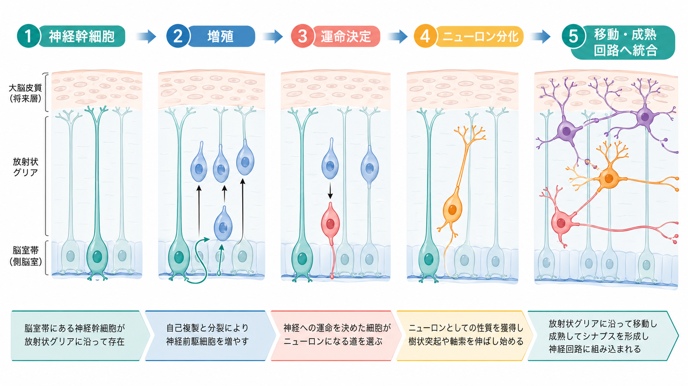
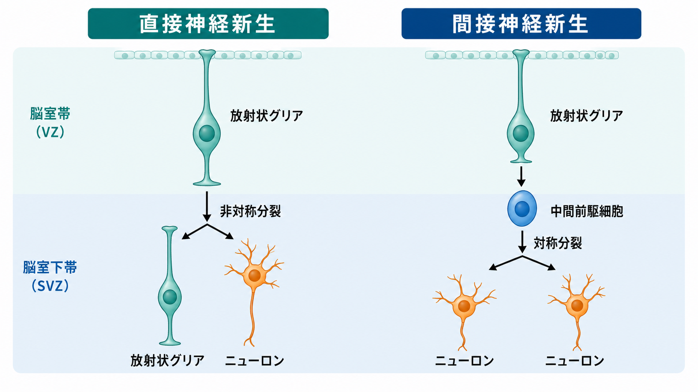
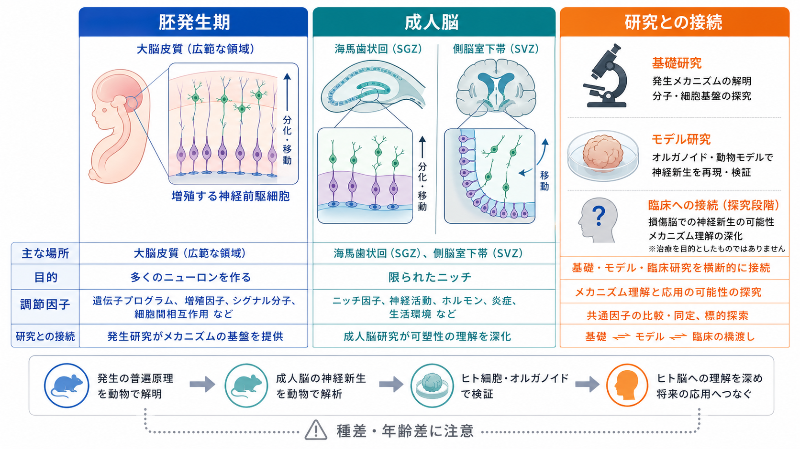

---
title: "神経発生ではニューロンはどのように作られるのか"
description: "神経幹細胞、放射状グリア、前駆細胞の増殖と分化を軸に、ニューロン新生の基本過程を整理する。"
aliases:
  - "ニューロン新生"
  - "神経発生"
  - "神経幹細胞"
tags:
  - neuroscience
  - basic-neuroscience
  - obsidian
  - neurodevelopment
created: "2026-04-27"
updated: "2026-04-27"
draft: true
publish: true
status: draft
enableToc: true
---

# 神経発生ではニューロンはどのように作られるのか

## 要点

- ニューロンは、神経幹細胞や神経前駆細胞が「増える」「運命を選ぶ」「分化する」「移動して回路に入る」という段階を経て作られる。
- 発生期の大脳皮質では、放射状グリアが重要な幹細胞として働き、脳室帯で直接ニューロンを生む経路と、中間前駆細胞を介して間接的にニューロンを増やす経路がある[1][2]。
- 増殖と分化のバランスは、細胞周期、Notch などのシグナル、細胞極性、代謝状態、周囲のニッチによって調節される[3][4]。
- 成人哺乳類でも限られた領域では神経新生が議論されるが、成人ヒト海馬でどの程度続くかは研究間で見解が分かれている[5][6][7]。

## この記事で答える問い

この記事では、[[ニューロンとは何か]]をまだ学び始めた読者を想定し、次の問いに答える。

1. 神経幹細胞と神経前駆細胞は何が違うのか。
2. 発生中の脳では、どのような分裂によってニューロンが増えるのか。
3. 生まれたばかりのニューロンは、どのように移動し成熟するのか。
4. 成人脳のニューロン新生について、どこまで確かなことが言えるのか。

## まず結論

神経発生におけるニューロン作りは、単に「未熟な細胞がニューロンに変わる」だけではない。まず神経幹細胞が自己複製によって細胞集団を保ちつつ、一部の娘細胞を神経前駆細胞やニューロン系列へ送る。次に、その前駆細胞が限られた回数だけ増殖し、神経細胞としての運命を強める。最後に、若いニューロンは移動し、軸索や樹状突起を伸ばし、[[シナプスとは何か|シナプス]]を形成して回路に組み込まれる[1][2]。

この過程で重要なのは、細胞数を増やすことと、適切な時期に分化を始めることの両立である。増殖しすぎれば腫瘍や脳サイズ異常につながりうるし、早く分化しすぎれば十分な数のニューロンを作れない。発生中の脳は、このバランスを細胞内プログラムと周囲の環境シグナルによって制御している[3]。

## 背景

神経発生とは、神経管の形成から、脳領域のパターン化、神経幹細胞の増殖、ニューロンやグリアへの分化、細胞移動、軸索誘導、シナプス形成までを含む広い過程である。このノートでは、その中でも「ニューロンがどのように作られるか」に焦点を絞る。

発生期の大脳皮質では、脳室に面した脳室帯に神経上皮細胞や放射状グリアが並ぶ。放射状グリアは、胎生期には支持細胞というより神経幹細胞として働き、長い突起を脳表面側へ伸ばしながら、ニューロンや前駆細胞を生み出す[1]。この見方は、グリア細胞を単なる支持細胞としてではなく、発生期のニューロン産生の中心に置く理解へつながる。関連して、[[グリア細胞は単なる支持細胞なのか]]も参照できる。

## 基本概念

### 神経幹細胞

神経幹細胞とは、自己複製でき、ニューロン・アストロサイト・オリゴデンドロサイトなど複数の神経系細胞へ分化できる細胞である。発生期には神経上皮細胞や放射状グリアがこの役割を担う。成人脳では、限られたニッチに残る幹細胞様細胞が議論される[1][5]。

### 神経前駆細胞

神経前駆細胞は、幹細胞より分化方向が狭まり、限られた回数だけ増殖してニューロンなどを生み出す細胞である。大脳皮質発生では、中間前駆細胞が脳室下帯で対称分裂し、複数のニューロンを増幅する経路が重要である[2]。

### 対称分裂と非対称分裂

対称分裂では、似た性質をもつ娘細胞が 2 つ生じる。幹細胞が 2 つに増える場合もあれば、前駆細胞が 2 つのニューロン系列細胞を生む場合もある。非対称分裂では、一方の娘細胞が幹細胞性を保ち、もう一方が分化方向へ進む。ニューロン新生では、この 2 種類の分裂を組み合わせることで、幹細胞プールの維持とニューロン産生を両立する[2][3]。

## 仕組み

### 1. 増殖する

初期の神経上皮細胞や放射状グリアは、まず細胞数を増やす。ここでの増殖は脳の大きさや領域ごとのニューロン数に直結するため、細胞周期の長さ、栄養・代謝状態、成長因子、Notch などのシグナルが厳密に関わる[3][4]。

ただし、増殖は多ければよいわけではない。脳では細胞数の変化を細胞サイズだけで補うことが難しいため、神経幹細胞と前駆細胞の分裂制御の乱れは、小頭症や巨脳症などの発達異常と結びつきうる[3]。

### 2. 運命を決める

増殖した細胞の一部は、神経幹細胞性を保つのではなく、ニューロンになる方向へ進む。これを神経運命決定と呼ぶ。細胞内の転写因子、Notch シグナルの強さ、細胞極性、娘細胞が受け継ぐ細胞質成分、周囲の細胞との接触が、どちらの娘細胞が幹細胞性を保つか、どちらが分化へ進むかを左右する[3][4]。

### 3. 直接または間接にニューロンを作る

発生期大脳皮質では、放射状グリアが脳室帯で非対称分裂し、放射状グリアとニューロンを直接生む経路がある。一方で、放射状グリアが中間前駆細胞を生み、その中間前駆細胞が脳室下帯で分裂して複数のニューロンを作る経路もある[2]。

間接神経新生は、幹細胞が直接すべてのニューロンを作るよりも、前駆細胞段階で細胞数を増幅できる。したがって、大きな皮質を作るうえで重要な仕組みと考えられる。ただし、どの前駆細胞がどの種類の[[神経細胞の種類はどのように分類されるのか|神経細胞]]を生むかは、脳領域、時期、種によって異なる。

### 4. 移動する

生まれたばかりのニューロンは、その場で完成するとは限らない。大脳皮質の興奮性ニューロンでは、放射状グリアの突起に沿って脳表面側へ移動し、皮質板に配置される。Noctor らのタイムラプス研究は、新生ニューロンが単純に一直線に移動するのではなく、複数の移動相を示すことを報告した[2]。

移動の失敗は、神経細胞が正しい層や領域に配置されないことを意味する。これは[[興奮性ニューロンと抑制性ニューロンは何が違うのか|興奮性・抑制性]]のバランスや回路形成にも影響しうる。

### 5. 成熟し、回路へ入る

若いニューロンは、移動後に樹状突起と軸索を伸ばし、[[軸索はどのように情報を遠くへ伝えるのか|軸索]]による出力経路と、[[樹状突起はどのように情報を受け取るのか|樹状突起]]による入力面を形成する。さらに、シナプスを作り、活動依存的な調整を受けながら回路へ統合される。したがって、神経発生は細胞を作るだけでなく、[[神経可塑性は発達と学習をどう支えるのか|可塑性]]と接続して回路を完成させる過程でもある[5][8]。

## 図解

上の 2 枚は、発生期の神経新生の基本流れと、直接神経新生・間接神経新生の違いを示している。次の図は、発生期と成人脳の神経新生を分けて見るための比較である。

## 臨床・研究との接続

神経発生の研究は、脳がどのように作られるかを理解する基礎研究である。同時に、発達障害、脳サイズ異常、てんかん、神経変性疾患、脳損傷後の修復可能性を考えるうえでも重要な背景になる。ただし、このノートの内容は教育・研究目的の説明であり、個別の診断や治療方針を示すものではない。

近年は、動物モデルだけでなく、ヒト iPS 細胞由来の神経細胞、脳オルガノイド、単一細胞 RNA シーケンス、ライブイメージングなどを組み合わせて、ヒト脳発生の特徴を調べる研究が進んでいる。ここで注意すべきなのは、マウスでよく観察される神経新生のルールを、そのままヒト成人脳へ外挿できないことである[6][7]。

成人の哺乳類では、海馬歯状回の顆粒下帯や側脳室下帯が神経新生ニッチとして研究されてきた[5]。一方、成人ヒト海馬で新生ニューロンが豊富に存在するという報告[6]と、成人では検出困難または極めて稀だとする報告[7]があり、組織処理、マーカー、年齢、疾患、死後時間などの方法論的差が解釈に大きく影響する。

## よくある誤解

### 誤解1: 神経幹細胞はいつでも同じようにニューロンを作る

神経幹細胞の性質は、発生段階、脳領域、種、細胞外環境によって変わる。発生期には大量のニューロンを作るが、成人脳では神経新生があるとしても限定的で、ニッチに強く依存する[1][5]。

### 誤解2: ニューロン新生は「細胞が増える」だけである

ニューロン新生には、増殖、分化、移動、成熟、シナプス形成、回路統合が含まれる。細胞数が増えても、適切な場所へ移動し、機能的な回路に組み込まれなければ、成熟したニューロンとして働けない[2][8]。

### 誤解3: 成人ヒト脳では神経新生が完全に確立した事実である

成人哺乳類、とくに齧歯類では成人神経新生の知見が多い。一方、成人ヒト海馬については、存在量や機能的意義をめぐって議論が続いている。したがって、「運動すれば成人ヒト脳で大量にニューロンが増える」といった断定は避けるべきである[5][6][7]。

## 関連ノート

- [[ニューロンとは何か]]
- [[神経細胞の種類はどのように分類されるのか]]
- [[グリア細胞は単なる支持細胞なのか]]
- [[アストロサイトはシナプスと代謝をどう支えているのか]]
- [[シナプスとは何か]]
- [[神経可塑性は発達と学習をどう支えるのか]]
- [[軸索はどのように情報を遠くへ伝えるのか]]
- [[樹状突起はどのように情報を受け取るのか]]

## MOC更新候補

- `content/00_MOC/` 配下の脳・神経科学系 MOC がある場合、「基礎神経科学」「発生神経科学」「ニューロン・グリア」の項目に追加候補。
- 並列ジョブとの衝突を避けるため、このタスクでは MOC 本体は更新しない。

## 理解チェック

1. 神経幹細胞と神経前駆細胞の違いは何か。
2. 直接神経新生と間接神経新生では、どの細胞がどこで分裂するか。
3. ニューロン新生を「増殖」だけで説明すると、何を見落とすか。
4. 成人ヒト海馬の神経新生について、なぜ断定を避ける必要があるか。

## 未解決問題

- ヒト成人海馬で、どの条件なら新生ニューロンを安定して検出できるのか。
- 発生期の神経幹細胞の時間的変化を、ヒト脳でどこまで因果的に検証できるのか。
- 脳オルガノイドや移植モデルは、実際の神経発生のどの側面を再現し、どの側面を再現できないのか。
- 神経新生を促す介入が、回路機能や行動にとって本当に有益かをどう評価するか。

## 参考文献

[1] Kriegstein, A., & Alvarez-Buylla, A. (2009). The glial nature of embryonic and adult neural stem cells. *Annual Review of Neuroscience*, 32, 149-184. https://doi.org/10.1146/annurev.neuro.051508.135600

[2] Noctor, S. C., Martinez-Cerdeno, V., Ivic, L., & Kriegstein, A. R. (2004). Cortical neurons arise in symmetric and asymmetric division zones and migrate through specific phases. *Nature Neuroscience*, 7, 136-144. https://doi.org/10.1038/nn1172

[3] Homem, C. C. F., Repic, M., & Knoblich, J. A. (2015). Proliferation control in neural stem and progenitor cells. *Nature Reviews Neuroscience*, 16, 647-659. https://doi.org/10.1038/nrn4021

[4] Obernier, K., & Alvarez-Buylla, A. (2019). Neural stem cells: origin, heterogeneity and regulation in the adult mammalian brain. *Development*, 146(4), dev156059. https://doi.org/10.1242/dev.156059

[5] Ming, G. L., & Song, H. (2011). Adult neurogenesis in the mammalian brain: significant answers and significant questions. *Neuron*, 70(4), 687-702. https://doi.org/10.1016/j.neuron.2011.05.001

[6] Moreno-Jimenez, E. P., Flor-Garcia, M., Terreros-Roncal, J., et al. (2019). Adult hippocampal neurogenesis is abundant in neurologically healthy subjects and drops sharply in patients with Alzheimer's disease. *Nature Medicine*, 25, 554-560. https://doi.org/10.1038/s41591-019-0375-9

[7] Sorrells, S. F., Paredes, M. F., Cebrian-Silla, A., et al. (2018). Human hippocampal neurogenesis drops sharply in children to undetectable levels in adults. *Nature*, 555, 377-381. https://doi.org/10.1038/nature25975

[8] Denoth-Lippuner, A., & Jessberger, S. (2021). Formation and integration of new neurons in the adult hippocampus. *Nature Reviews Neuroscience*, 22, 223-236. https://doi.org/10.1038/s41583-021-00433-z
