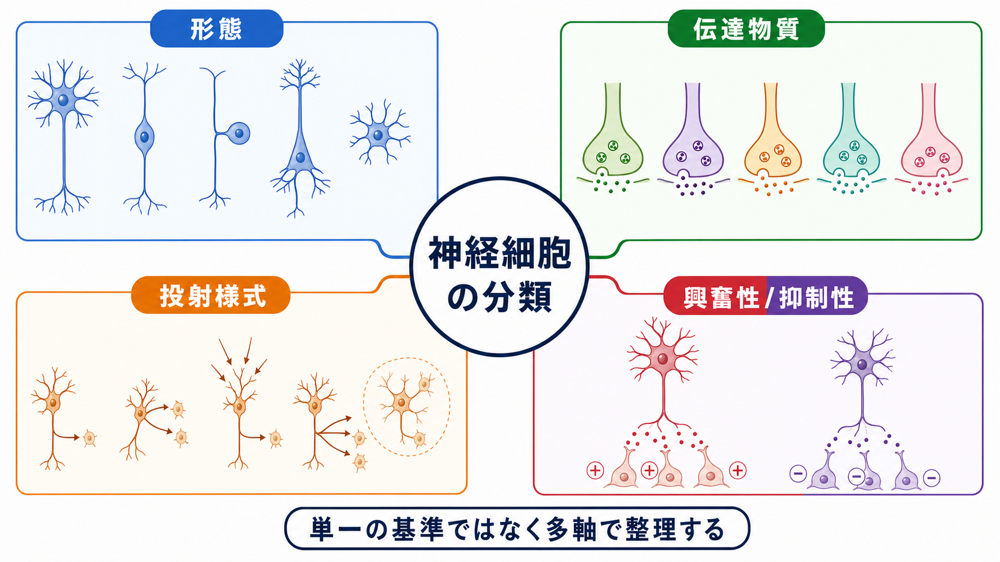
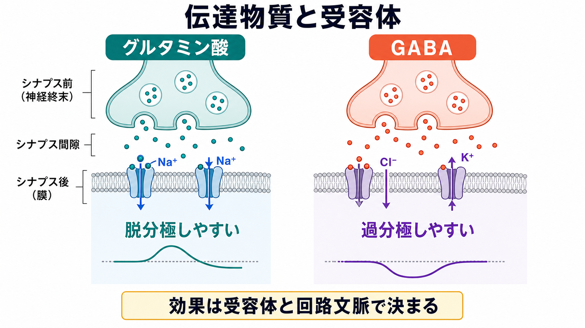
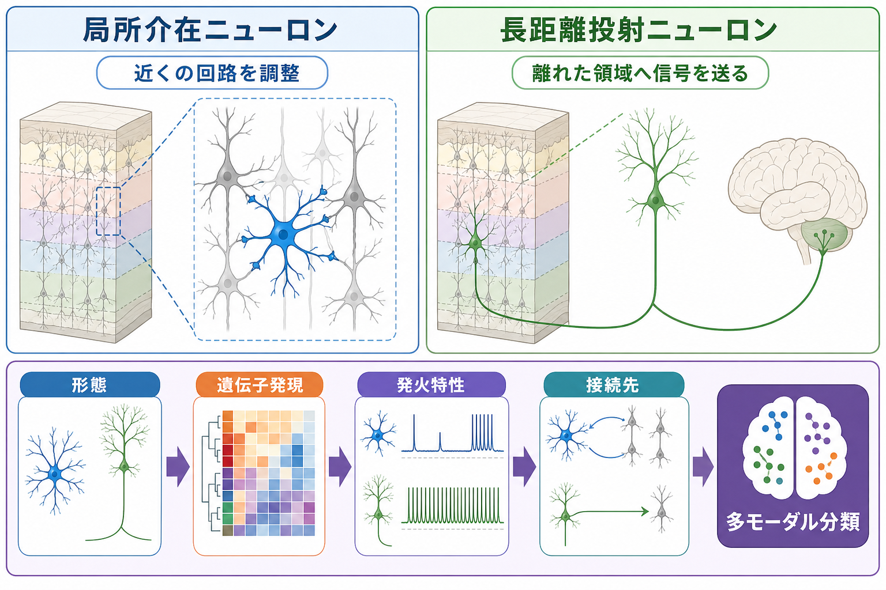

---
title: "神経細胞の種類はどのように分類されるのか"
description: "形態・伝達物質・投射様式・興奮性/抑制性によるニューロン分類を、多軸分類として整理する。"
aliases:
  - "ニューロンの分類"
  - "神経細胞の分類"
  - "神経細胞の種類"
tags:
  - neuroscience
  - basic-neuroscience
  - obsidian
created: "2026-04-27"
updated: "2026-04-27"
draft: true
publish: true
status: draft
enableToc: true
---

# 神経細胞の種類はどのように分類されるのか

## 要点

- 神経細胞は「1つの正しい分類表」に収まるものではなく、形態、伝達物質、投射様式、発火特性、遺伝子発現、接続先などを組み合わせて分類する。
- 古典的には、軸索と樹状突起の配置から多極性・双極性・偽単極性などに分ける形態分類が使われる[2][3]。
- 機能面では、グルタミン酸作動性の興奮性ニューロン、GABA作動性の抑制性ニューロン、ドーパミン・セロトニン・アセチルコリンなどの調節性ニューロンが重要である[6][7]。
- 現代の細胞型分類では、形態・電気生理・分子マーカー・接続性を統合する「多モーダル分類」が重視される[1][5]。

## この記事で答える問い

この記事では、[[ニューロンとは何か]]を前提に、神経細胞の「種類」をどう考えればよいかを整理する。特に次の問いに答える。

1. 神経細胞は形だけで分類できるのか。
2. 「興奮性ニューロン」「抑制性ニューロン」は何を意味するのか。
3. 局所介在ニューロンと投射ニューロンはどう違うのか。
4. なぜ現代神経科学では、単一基準ではなく多軸の分類が必要なのか。

## まず結論

神経細胞の分類は、地図の縮尺を切り替えるように使い分ける。細胞の形を見たいときは形態分類、信号の化学的性質を見たいときは伝達物質分類、回路内での役割を見たいときは投射様式や興奮性/抑制性の分類を使う。

ただし、どれか1つだけで「本当の種類」が決まるわけではない。たとえば大脳皮質のGABA作動性介在ニューロンは、形態、発火パターン、分子マーカー、標的細胞、皮質層内の位置によってさらに細かく分けられる[4]。近年は単一細胞RNAシーケンスなどにより、遺伝子発現パターンを細胞型分類の重要な軸として扱うようになった[1][5]。

## 背景

神経細胞の分類は、神経系の複雑さを扱うための実用的な道具である。視覚系、運動系、大脳皮質、海馬、小脳、脊髄では、同じ「ニューロン」という名前の下に、形も接続も機能もかなり異なる細胞が含まれる。分類は、細胞を再現よく同定し、別の実験室や別の研究手法で得られた知見を比較するために必要になる[1]。

歴史的には、ゴルジ染色などで見える細胞形態から分類が始まった。現在はそれに加えて、パッチクランプで測る発火特性、免疫染色や遺伝子発現で見る分子特徴、トレーシングやコネクトミクスで見る接続性が統合される。Zeng と Sanes は、神経細胞型は形態・生理・分子・接続特性を複数基準で定義する必要があると整理している[1]。

## 基本概念

### 形態による分類

形態分類は、細胞体から伸びる突起の数や配置、樹状突起と軸索の広がり方に注目する。OpenStax や神経解剖学の標準的整理では、神経細胞は多極性、双極性、偽単極性、無軸索様の細胞などに分けられる[2][3]。

| 分類 | 形態の特徴 | 典型例・見方 |
|---|---|---|
| 多極性ニューロン | 1本の軸索と多数の樹状突起をもつ | 大脳皮質の錐体細胞、運動ニューロンなど |
| 双極性ニューロン | 細胞体の両側に1本ずつ突起をもつ | 網膜、嗅上皮などの感覚系で重要 |
| 偽単極性ニューロン | 1本の突起がT字型に分岐する | 脊髄後根神経節などの感覚ニューロン |
| 無軸索様ニューロン | 軸索と樹状突起の区別が難しい | 局所回路で働く小型ニューロンの一部 |

この分類は初学者にとって見通しがよいが、細胞型を完全には決めない。たとえば同じ多極性ニューロンでも、錐体細胞、プルキンエ細胞、運動ニューロンでは、接続先も発火特性も異なる。

### 伝達物質による分類

神経細胞は、主に放出する神経伝達物質によっても分類される。中枢神経系では、グルタミン酸は主要な興奮性伝達物質、GABAは主要な抑制性伝達物質として扱われる[6][7]。

| 分類 | 主な伝達物質 | 概要 |
|---|---|---|
| グルタミン酸作動性 | グルタミン酸 | 大脳皮質の錐体細胞など。多くは興奮性出力を担う。 |
| GABA作動性 | GABA | 多くは局所回路の抑制を担う。介在ニューロン分類で重要。 |
| グリシン作動性 | グリシン | 脊髄・脳幹の抑制性伝達で重要。 |
| コリン作動性 | アセチルコリン | 注意、覚醒、自律神経、神経筋接合部などに関わる。 |
| モノアミン作動性 | ドーパミン、ノルアドレナリン、セロトニンなど | 広範な調節性投射を通じて行動状態や学習を調整する。 |

ただし「伝達物質名 = 細胞の全機能」ではない。共伝達、受容体サブタイプ、発達段階、細胞内外のイオン濃度、標的細胞の状態によって、同じ伝達物質でも効果は変わりうる。

### 投射様式による分類

投射様式は、軸索がどこへ伸び、どの範囲の細胞に影響するかを見る分類である。

- 局所介在ニューロン: 近傍の細胞と短距離回路を作り、タイミング、ゲイン、同期、抑制性制御を調整する。
- 長距離投射ニューロン: 皮質から視床、脊髄、線条体、別の皮質領域など、離れた領域へ出力を送る。
- 調節性投射ニューロン: 少数の細胞群から広範な脳領域へ投射し、覚醒、報酬、気分、注意などの状態変数を調整する。

この軸は、形態分類や伝達物質分類と重なる。たとえば大脳皮質の錐体細胞は多くがグルタミン酸作動性の投射ニューロンであり、GABA作動性ニューロンの多くは局所介在ニューロンである。しかし、GABA作動性の長距離投射ニューロンも報告されており、単純な対応関係だけで理解すると例外を見落とす[4]。

### 興奮性/抑制性による分類

興奮性ニューロンと抑制性ニューロンの区別は、標的細胞の発火確率を上げる方向に働くか、下げる方向に働くかという回路機能の分類である。中枢神経系では、グルタミン酸作動性シナプスはしばしば興奮性、GABA作動性シナプスはしばしば抑制性として扱われる[6][7]。

重要なのは、興奮性/抑制性は細胞名だけでなく、受容体、イオン勾配、標的細胞、発達段階、回路文脈に依存することである。GABA受容体は塩化物イオンやカリウムイオンの流れを通じて膜電位を抑制方向へ動かすことが多いが、発達期や塩化物勾配の条件によっては単純に「GABA = 常に抑制」とは言えない[7]。

## 仕組み

### 1. 形態は入力と出力の幾何を決める

樹状突起の広がりは、どこから入力を受けるかを制約する。軸索の長さと分岐は、どこへ出力を送るかを制約する。したがって、形態は単なる見た目ではなく、神経回路内での計算上の役割と結びつく。

### 2. 伝達物質はシナプス効果の初期条件を作る

グルタミン酸、GABA、アセチルコリン、ドーパミンなどの伝達物質は、受容体と組み合わさって標的細胞の膜電位や細胞内シグナルを変える。速い興奮・抑制だけでなく、可塑性、覚醒水準、報酬予測、運動制御などの時間スケールの長い調整にも関わる[6]。

### 3. 投射様式は回路レベルの役割を決める

局所介在ニューロンは、同じ領域内で入力を整形する。長距離投射ニューロンは、ある領域で処理された情報を別領域へ送る。調節性ニューロンは、脳全体の状態を変えるような広範な影響をもつ。分類の焦点を細胞形態から回路へ移すと、同じニューロンでも別の側面が見える。

### 4. 多モーダル分類は矛盾を減らす

単一の軸だけで分類すると、形は似ているが遺伝子発現が異なる細胞、伝達物質は同じだが接続先が異なる細胞を区別しにくい。皮質介在ニューロンのPetilla terminologyは、GABA作動性介在ニューロンについて、解剖学的特徴、生理学的特徴、分子特徴を統一的に記述する必要性を示した[4]。単一細胞トランスクリプトーム研究は、遺伝子発現を使って皮質領域をまたぐ細胞型の共通性と差異を分類できることを示している[5]。

## 図解

1枚目の図は、神経細胞分類を「形態」「伝達物質」「投射様式」「興奮性/抑制性」の4軸で見る全体地図である。2枚目は、伝達物質だけでなく受容体と回路文脈がシナプス効果を決めることを示す。3枚目は、局所介在ニューロンと長距離投射ニューロンの違い、および多モーダル分類の考え方をまとめている。

## 臨床・研究との接続

神経細胞の分類は、疾患研究や治療研究でも重要である。てんかん、自閉スペクトラム症、統合失調症、認知症、脳損傷などでは、興奮性/抑制性バランスや特定の細胞集団の脆弱性が研究対象になる。グルタミン酸とGABAの伝達・輸送は、脳の興奮性/抑制性バランスを維持する主要な要素として整理されている[8]。

ただし、臨床症状を「ある1種類のニューロンの異常」だけに還元するのは危険である。疾患は細胞型、シナプス、回路、発達、代謝、免疫、環境要因が重なって生じる。神経細胞分類は、個別診断や治療指示ではなく、研究上の仮説を精密にするための地図として使うのが適切である。

## よくある誤解

### 誤解1: 神経細胞は形態だけで完全に分類できる

形態は重要だが、同じ形に見える細胞でも発火特性、分子マーカー、接続先が異なることがある。現代の分類では、形態だけでなく複数のデータを合わせて細胞型を定義する[1]。

### 誤解2: グルタミン酸ニューロンは常に興奮、GABAニューロンは常に抑制である

多くの成熟中枢神経系ではこの近似が役立つ。しかし、シナプス効果は受容体、イオン勾配、標的細胞、発達段階に依存する。特にGABAの効果は塩化物イオン勾配に左右されるため、常に同じ意味で抑制とは限らない[7]。

### 誤解3: 「介在ニューロン」は小さくて単純な補助役である

介在ニューロンは局所回路のタイミング、同期、入力選択、可塑性に深く関わる。大脳皮質GABA作動性介在ニューロンは非常に多様で、標的部位や分子マーカーによって細かく分類される[4]。

### 誤解4: 単一細胞RNA分類があれば、古典的形態分類は不要になる

遺伝子発現分類は強力だが、細胞の形態、接続、発火、行動中の機能を自動的に説明するわけではない。むしろ、分子分類と古典的な形態・電気生理・回路分類を対応づけることが重要である[1][5]。

## 関連ノート

- [[ニューロンとは何か]]
- [[MOC｜基礎神経科学]]
- [[興奮性ニューロンと抑制性ニューロンは何が違うのか]]
- [[介在ニューロンは神経回路で何をしているのか]]
- [[シナプスとは何か]]
- [[グルタミン酸は脳で何をしているのか]]
- [[GABAは脳で何をしているのか]]

### 関連ノート候補

- 単一細胞RNAシーケンスによる細胞型分類

## 理解チェック

1. 多極性、双極性、偽単極性ニューロンは、何を基準に区別されるか。
2. 「GABA作動性」と「抑制性」は、なぜ完全に同義ではないのか。
3. 局所介在ニューロンと長距離投射ニューロンの違いを、軸索の届く範囲から説明できるか。
4. 現代の神経細胞分類で、形態・電気生理・分子・接続性を統合する理由は何か。

## 参考文献

[1] Zeng, H., & Sanes, J. R. (2017). Neuronal cell-type classification: challenges, opportunities and the path forward. *Nature Reviews Neuroscience*, 18, 530-546. https://doi.org/10.1038/nrn.2017.85

[2] OpenStax. (2013). 12.2 Nervous Tissue. *Anatomy and Physiology*. https://openstax.org/books/anatomy-and-physiology/pages/12-2-nervous-tissue

[3] Ludwig, P. E., Reddy, V., & Varacallo, M. A. (2023). Neuroanatomy, Neurons. *StatPearls*. NCBI Bookshelf. https://www.ncbi.nlm.nih.gov/books/NBK441977/

[4] The Petilla Interneuron Nomenclature Group. (2008). Petilla terminology: nomenclature of features of GABAergic interneurons of the cerebral cortex. *Nature Reviews Neuroscience*, 9, 557-568. https://doi.org/10.1038/nrn2402

[5] Tasic, B., et al. (2018). Shared and distinct transcriptomic cell types across neocortical areas. *Nature*, 563, 72-78. https://doi.org/10.1038/s41586-018-0654-5

[6] Sheffler, Z. M., Reddy, V., & Pillarisetty, L. S. (2023). Physiology, Neurotransmitters. *StatPearls*. NCBI Bookshelf. https://www.ncbi.nlm.nih.gov/books/NBK539894/

[7] Jewett, B. E., & Sharma, S. (2023). Physiology, GABA. *StatPearls*. NCBI Bookshelf. https://www.ncbi.nlm.nih.gov/books/NBK513311/

[8] Sears, S. M., & Hewett, S. J. (2021). Influence of glutamate and GABA transport on brain excitatory/inhibitory balance. *Experimental Biology and Medicine*, 246(9), 1069-1083. https://doi.org/10.1177/1535370221989263

## 未解決問題

- 単一細胞トランスクリプトームで得られるクラスターと、形態・発火・接続・行動中の機能はどの程度一対一に対応するのか。
- ヒト脳の細胞型分類は、マウスや霊長類モデルの分類とどこまで対応づけられるのか。
- 疾患ごとの症状や治療反応を、どの細胞型・回路型の変化として記述できるのか。
