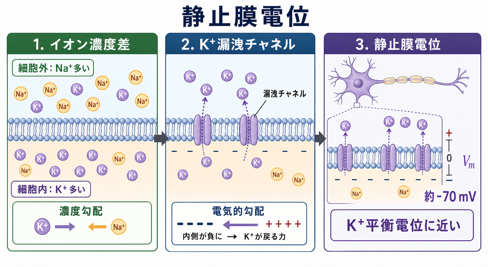
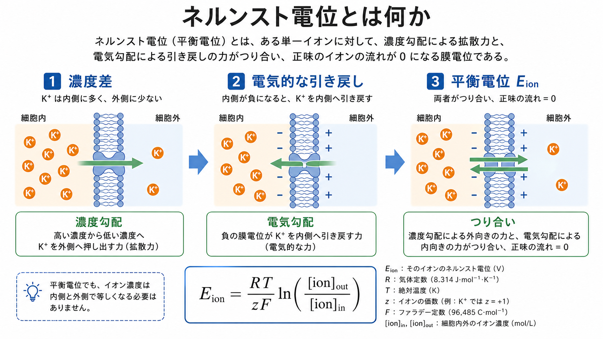
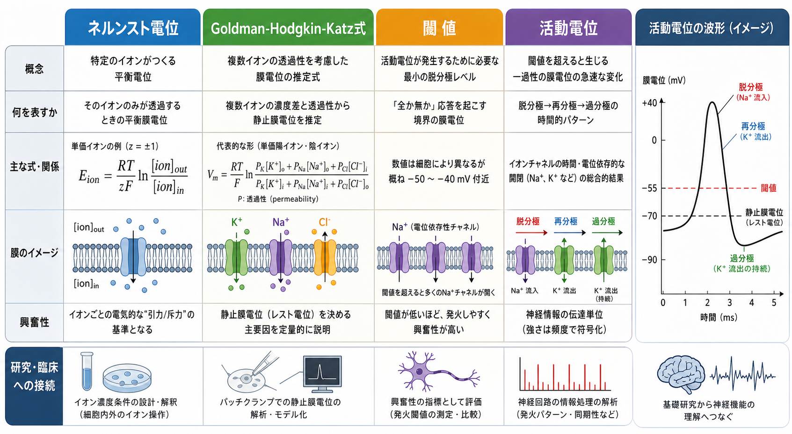

---
title: "神経細胞膜はどのように電気信号を生み出すのか"
description: "脂質二重膜・イオンチャネル・電気化学的勾配から、静止膜電位と活動電位が生まれる仕組みを理解する。"
aliases:
  - "神経細胞膜"
  - "膜電位"
  - "膜興奮性"
tags:
  - neuroscience
  - basic-neuroscience
  - obsidian
created: "2026-04-27"
updated: "2026-04-27"
draft: true
publish: false
status: draft
enableToc: true
---

# 神経細胞膜はどのように電気信号を生み出すのか

## 要点

- 神経細胞膜は、脂質二重膜という「イオンを通しにくい薄い絶縁層」と、イオンチャネルという「選択的な通り道」からできている。
- Na+、K+、Cl- などの濃度差と電気的な引力・反発が合わさると、膜をはさんだ電位差、つまり膜電位が生まれる。
- 静止膜電位は、主に K+ への高い透過性と Na+/K+ ポンプが維持する濃度勾配によって、K+ 平衡電位に近い負の値になる[1][3]。
- 活動電位は、電位依存性 Na+ チャネルと K+ チャネルが時間差をもって開閉することで、脱分極、再分極、過分極として現れる[2][5]。
- 膜興奮性は単なる「電気の流れ」ではなく、膜容量、抵抗、イオン選択性、チャネル密度、チャネルの開閉確率が組み合わさった細胞生物学的な性質である[6][7]。

## この記事で答える問い

この記事では、[[ニューロンとは何か|ニューロン]]がなぜ電気信号を使えるのかを、細胞膜の性質から説明する。中心となる問いは次の三つである。

1. 脂質二重膜は、なぜ電位差を蓄えられるのか。
2. イオンチャネルは、なぜ膜電位を変えるのか。
3. 静止膜電位と活動電位は、どのように同じ原理から生まれるのか。

## まず結論

神経細胞膜は、薄い脂質二重膜をはさんで電荷を分けておけるため、電気的には小さなコンデンサーのように振る舞う。脂質部分そのものは Na+ や K+ などの荷電粒子をほとんど通さない。一方、膜に埋め込まれたイオンチャネルは、特定のイオンだけを通しやすくする。したがって、膜電位は「脂質二重膜が電荷を分ける能力」と「チャネルがどのイオンをどれだけ通すか」の組み合わせで決まる。

静止時には K+ が細胞内に多く、Na+ が細胞外に多い。膜が K+ に比較的よく透過するため、K+ は濃度勾配に従って外へ出ようとする。しかし K+ が外へ出るほど細胞内は負になり、今度は電気的な力が K+ を内側へ引き戻す。この二つの力がつり合う電位が K+ の平衡電位であり、実際の静止膜電位は K+ だけでなく Na+ や Cl- の透過性も反映して決まる[1][4]。

活動電位は、この静止状態が壊れて回復する一過性の現象である。膜が閾値を超えて脱分極すると、電位依存性 Na+ チャネルが急速に開き、Na+ 流入がさらに脱分極を進める。続いて Na+ チャネルは不活性化し、K+ チャネルが開いて K+ が外へ流れ、膜電位は再び負の方向へ戻る[5][6]。

## 背景

神経細胞の情報処理を理解するとき、しばしば「電気信号」という言葉が使われる。しかしニューロンは金属線ではない。軸索を伝わる信号は、電子が導線を流れる現象ではなく、膜をまたぐイオンの移動と、イオンチャネルの開閉がつくる電位変化である。

この違いは重要である。金属線では電荷を運ぶ主役は電子だが、神経細胞では Na+、K+、Ca2+、Cl- などのイオンが主役になる。さらに、イオンは水溶液中で移動し、脂質二重膜を直接通り抜けにくい。そのため、信号は「膜を横切るイオンの通り道」がどこで、いつ、どれだけ開くかに依存する。

## 基本概念

### 脂質二重膜

脂質二重膜は、親水性の頭部を水側に、疎水性の尾部を内側に向けた薄い膜である。疎水性の内部は荷電粒子を通しにくいため、細胞内外のイオン濃度を分けておく障壁になる。

電気的には、膜の内側と外側に電荷が分かれて蓄えられる。このため膜は、一定の容量をもつ。膜容量があるということは、膜電位を変えるには電荷の移動が必要であり、電位変化には時間がかかるということである。樹状突起や細胞体で生じた小さな入力が時間的・空間的に足し合わされる背景には、この膜容量と膜抵抗がある。

### イオンチャネル

イオンチャネルは、膜を貫通するタンパク質性の孔である。重要なのは、チャネルが「穴」一般ではなく、選択性をもつことである。K+ チャネルは K+ を通しやすく、Na+ チャネルは Na+ を通しやすい。さらにチャネルには、常に開きやすい漏洩チャネル、膜電位で開閉する電位依存性チャネル、神経伝達物質などのリガンドで開くリガンド依存性チャネルがある[7]。

### 電気化学的勾配

イオンの移動方向は、濃度勾配だけでは決まらない。正に帯電した K+ は、濃い側から薄い側へ拡散しようとする一方、膜電位が内側を負にすると内側へ引き戻される。濃度差による力と電気的な力を合わせたものが、電気化学的勾配である。

単一イオンについて、正味の流れが 0 になる膜電位はネルンスト電位で表せる。たとえば K+ の場合、細胞内に K+ が多いので、K+ の平衡電位は通常かなり負の値になる。複数のイオンが関わる実際の膜電位は、各イオンの濃度差だけでなく膜透過性も重みとして含む Goldman-Hodgkin-Katz 式で近似される[4]。

## 仕組み

### 1. 濃度勾配が準備される

神経細胞では、Na+ は細胞外に多く、K+ は細胞内に多い。この非対称性は、Na+/K+ ATPase などの輸送体によって維持される。Na+/K+ ATPase は ATP のエネルギーを使い、典型的には 3 個の Na+ を外へ、2 個の K+ を内へ運ぶ。これにより、膜電位を生み出す「材料」としてのイオン濃度差が保たれる[1][8]。

ただし、ポンプがその瞬間に直接「活動電位の波形」を作るわけではない。活動電位の速い立ち上がりと下降は、主に電位依存性チャネルを通る受動的なイオン流で説明される。ポンプは長い時間スケールで濃度勾配を維持し、発火後の回復を支える。

### 2. 静止膜では K+ 透過性が効く

静止時の神経細胞膜は、K+ 漏洩チャネルなどのために K+ へ比較的高い透過性をもつ。K+ は濃度勾配に従って外へ出ようとするが、外へ出るほど細胞内が負になり、電気的な力が K+ を内側へ引き戻す。最終的に、外向きの拡散力と内向きの電気的力がつり合う。

Hodgkin と Katz はイカ巨大軸索を用い、外液 K+ 濃度を変えると静止膜電位が予測どおり変化することを示した。この結果は、静止膜電位が K+ 濃度勾配と K+ 透過性に強く依存するという考えを支えた[3]。

### 3. 脱分極が閾値を超える

シナプス入力や感覚入力によって膜が少し脱分極すると、電位依存性 Na+ チャネルが開きやすくなる。脱分極が小さい間は、漏れ電流や K+ 電流によって元に戻る。しかし、ある範囲を超えると Na+ 流入が脱分極をさらに強め、さらに多くの Na+ チャネルが開く。これが正のフィードバックである。

この「どこで発火しやすいか」は、[[軸索小丘はなぜ発火の起点になるのか|軸索小丘や軸索起始部]]のチャネル密度、形態、細胞体からの電気的距離に左右される。したがって閾値は固定された一つの電圧ではなく、細胞種や履歴、入力状態によって変わる。

### 4. Na+ 流入と K+ 流出が波形を作る

活動電位の上昇相では、Na+ 透過性が急上昇し、Na+ が細胞内へ流入する。膜電位は Na+ の平衡電位に近づく方向へ動く。続いて Na+ チャネルは不活性化し、K+ チャネルが遅れて開く。K+ が外へ流れると膜電位は再分極し、場合によっては静止膜電位よりも一時的に負になる。

Hodgkin と Huxley は、この過程を Na+ コンダクタンス、K+ コンダクタンス、漏洩コンダクタンスの時間変化として定量化した[5]。このモデルは、神経細胞膜の電気現象をチャネルの開閉確率と電流の組み合わせとして扱う出発点になった。

## 図解

下の図は、混同しやすい概念を一枚にまとめたものである。ネルンスト電位は「単一イオンがつり合う電位」、Goldman-Hodgkin-Katz 式は「複数イオンの透過性を重みづけした膜電位」、閾値は「活動電位が起こりやすくなる状態依存的な境界」、活動電位は「チャネル開閉による一過性の膜電位変化」と考えると整理しやすい。

## 臨床・研究との接続

膜興奮性の理解は、神経科学の基礎にとどまらない。パッチクランプ法では、膜電位を固定したり電流を測定したりして、チャネルの性質を直接調べる。計算論的神経科学では、Hodgkin-Huxley 型モデルやその簡略モデルを用いて、発火パターン、同期、神経回路の安定性を解析する。

臨床との接続では、イオン濃度の異常、チャネル遺伝子の変異、薬物によるチャネル遮断などが膜興奮性を変える。たとえば Na+ チャネルや電位センサーの機能異常は、筋・神経の興奮性疾患や発作性の症状と関連して研究されている[7][8]。ただし、ここで述べた内容は教育・研究目的の基礎知識であり、個別の症状の診断や治療方針を示すものではない。

## よくある誤解

### 誤解1: 神経信号は電子が軸索を流れる現象である

神経信号は金属線の電流とは異なる。軸索内部や外液には電流が流れるが、活動電位の本体は、膜上のチャネルが開閉し、膜を横切るイオン流が局所的な膜電位を変える現象である。

### 誤解2: 静止膜電位は Na+/K+ ポンプだけで作られる

Na+/K+ ポンプは濃度勾配を維持するうえで不可欠だが、静止膜電位の近い値を直接決める主役は、静止時にどのイオンへどれだけ透過的かである。多くの神経細胞では K+ 透過性が大きいため、静止膜電位は K+ 平衡電位に近い[1][3]。

### 誤解3: 閾値はすべてのニューロンで同じ電圧である

閾値は便利な説明概念だが、厳密には固定値ではない。Na+ チャネルの不活性化状態、K+ チャネルの活性、直前の発火履歴、温度、入力の速さ、軸索起始部の性質などで変わる[6]。

### 誤解4: 活動電位が強いほど情報量が多い

典型的な活動電位は全か無かの性質をもつため、単発の大きさよりも、発火頻度、タイミング、発火パターン、どの細胞集団が活動するかが重要になる。情報表現は膜電位だけでなく、シナプス、回路、可塑性と結びついている。

## 関連ノート

- [[ニューロンとは何か]]
- [[軸索はどのように情報を遠くへ伝えるのか]]
- [[軸索小丘はなぜ発火の起点になるのか]]
- [[樹状突起はどのように情報を受け取るのか]]
- [[興奮性ニューロンと抑制性ニューロンは何が違うのか]]

今後の作成候補:

- 活動電位
- 静止膜電位
- イオンチャネル
- ネルンスト電位
- Goldman-Hodgkin-Katz 式
- 電位依存性ナトリウムチャネル
- Na+/K+ ATPase

MOC更新候補:

- `content/00_MOC/` の基礎神経科学または脳・神経科学 MOC に、本記事へのリンクを追加する。

## 理解チェック

1. 脂質二重膜がイオンを通しにくいことは、膜電位の形成にどのように役立つか。
2. K+ が細胞外へ出ようとする濃度勾配と、細胞内が負になることで生じる電気的な力は、どのように拮抗するか。
3. ネルンスト電位と Goldman-Hodgkin-Katz 式は、何を説明する範囲が違うか。
4. 活動電位の脱分極相と再分極相では、それぞれどのイオンチャネルが中心的に働くか。
5. Na+/K+ ポンプは、活動電位の速い波形そのものではなく、どの時間スケールの役割を担っているか。

## 参考文献

[1] Purves D, Augustine GJ, Fitzpatrick D, et al., editors. *Neuroscience. 2nd edition*. “The Ionic Basis of the Resting Membrane Potential.” NCBI Bookshelf, 2001. https://www.ncbi.nlm.nih.gov/books/NBK10931/

[2] Purves D, Augustine GJ, Fitzpatrick D, et al., editors. *Neuroscience. 2nd edition*. “Ionic Currents Across Nerve Cell Membranes.” NCBI Bookshelf, 2001. https://www.ncbi.nlm.nih.gov/books/NBK10879/

[3] Hodgkin AL, Katz B. The effect of sodium ions on the electrical activity of the giant axon of the squid. *The Journal of Physiology*. 1949;108(1):37-77. https://doi.org/10.1113/jphysiol.1949.sp004310

[4] Goldman DE. Potential, impedance, and rectification in membranes. *Journal of General Physiology*. 1943;27(1):37-60. https://doi.org/10.1085/jgp.27.1.37

[5] Hodgkin AL, Huxley AF. A quantitative description of membrane current and its application to conduction and excitation in nerve. *The Journal of Physiology*. 1952;117(4):500-544. https://doi.org/10.1113/jphysiol.1952.sp004764

[6] Bean BP. The action potential in mammalian central neurons. *Nature Reviews Neuroscience*. 2007;8:451-465. https://doi.org/10.1038/nrn2148

[7] Catterall WA. Ion channel voltage sensors: structure, function, and pathophysiology. *Neuron*. 2010;67(6):915-928. https://doi.org/10.1016/j.neuron.2010.08.021

[8] Chrysafides SM, Bordes SJ, Sharma S. Physiology, Resting Potential. *StatPearls*. Last update 2023. NCBI Bookshelf. https://www.ncbi.nlm.nih.gov/books/NBK538338/

## 未解決問題

- 実際のニューロンでは、樹状突起、細胞体、軸索起始部、ランヴィエ絞輪でチャネル分布が異なるため、単純な一室モデルだけでは膜興奮性を十分に表せない。
- 活動履歴、神経修飾物質、発達、疾患、薬物によってチャネル発現や開閉特性が変わるため、閾値や発火パターンは固定的ではない。
- 膜電位の理解を神経回路、シナプス可塑性、行動、臨床症状へ接続するには、細胞膜の物理化学だけでなく多階層のモデル化が必要になる。
