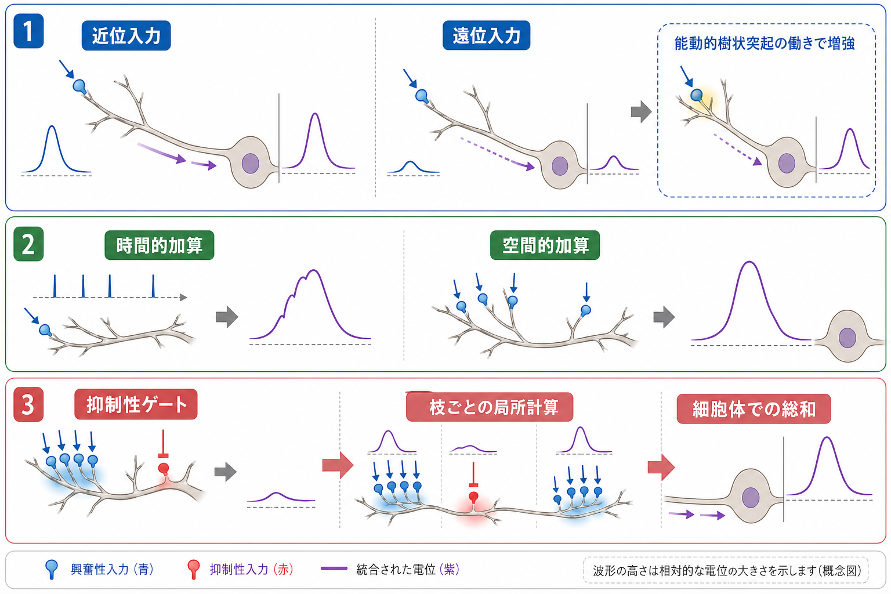
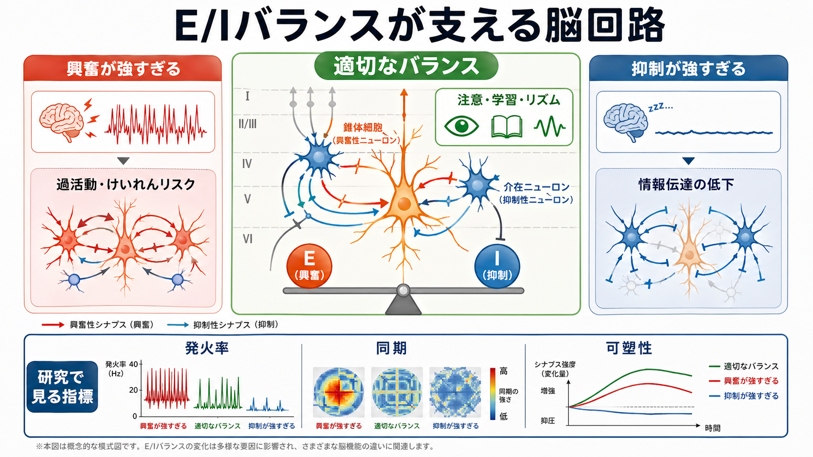

---
title: "興奮性ニューロンと抑制性ニューロンは何が違うのか"
description: "グルタミン酸作動性ニューロンとGABA作動性ニューロンの違いを、伝達物質、受容体、シナプス後電位、回路内での役割から比較する。"
aliases:
  - "興奮性ニューロンと抑制性ニューロン"
  - "グルタミン酸作動性ニューロンとGABA作動性ニューロン"
tags:
  - neuroscience
  - basic-neuroscience
  - synapse
  - neurotransmitter
  - obsidian
created: "2026-04-27"
updated: "2026-04-27"
draft: true
publish: false
status: draft
enableToc: true
---

# 興奮性ニューロンと抑制性ニューロンは何が違うのか

## 要点

- 興奮性ニューロンは、典型的にはグルタミン酸を放出し、相手のニューロンを発火しやすい方向へ動かす。
- 抑制性ニューロンは、典型的にはGABAを放出し、相手のニューロンを発火しにくい方向へ動かす。
- 違いは「よい細胞／悪い細胞」ではなく、回路内での役割の違いである。
- 大脳新皮質では、多くの興奮性ニューロンは長距離または局所へ出力する錐体細胞であり、GABA作動性ニューロンは局所回路を調整する介在ニューロンとして働くことが多い [5][6]。
- 脳は興奮と抑制の釣り合い、すなわちE/Iバランスによって、情報を伝えながら暴走を防いでいる [6][7]。

## この記事で答える問い

この記事では、「興奮性ニューロンと抑制性ニューロンは何が違うのか」を、細胞そのものの性質だけでなく、シナプスで起こる電気的変化と回路レベルの役割から整理する。関連する入口としては [[MOC｜脳・神経科学]] も参照できる。

## まず結論

もっとも短く言えば、興奮性ニューロンは相手の膜電位を発火しきい値へ近づける信号を出し、抑制性ニューロンは相手の膜電位を発火しきい値から遠ざける、または興奮性入力の効き目を弱める信号を出す。

ただし、これは「興奮性ニューロンはいつも発火を増やす」「抑制性ニューロンはいつも活動を止める」という意味ではない。実際の脳回路では、どの細胞のどの部位に入力するか、受容体の種類、塩化物イオン濃度、発達段階、入力のタイミングによって効果が変わる。分類は便利だが、最終的な作用は回路文脈の中で決まる。

## 背景

脳の情報処理は、単にニューロンが多く発火すればよいというものではない。感覚入力を強める、不要な活動を抑える、タイミングをそろえる、可塑性を起こす、過活動を防ぐといった働きが同時に必要になる。

このため、神経回路には「活動を広げる成分」と「活動を絞る成分」が組み込まれている。前者の代表がグルタミン酸作動性の興奮性ニューロン、後者の代表がGABA作動性の抑制性ニューロンである。グルタミン酸は中枢神経系の主要な興奮性伝達物質であり [1]、GABAは中枢神経系の主要な抑制性伝達物質とされる [2][4]。

## 基本概念

### 興奮性ニューロン

興奮性ニューロンは、多くの場合グルタミン酸を放出する。グルタミン酸がシナプス後膜のAMPA受容体、NMDA受容体、カイニン酸受容体などに結合すると、陽イオンの流れによってシナプス後細胞が脱分極しやすくなる [3]。この脱分極性の変化を、興奮性シナプス後電位、すなわちEPSPという。

大脳新皮質では、興奮性ニューロンの代表は錐体細胞である。錐体細胞は局所回路内の相手にも、別の皮質領域・皮質下領域・脳幹など遠くの標的にも出力できる。したがって、興奮性ニューロンは「信号を次へ運ぶ主な出力線」として働くことが多い [6]。

### 抑制性ニューロン

抑制性ニューロンは、多くの場合GABAを放出する。GABA_A受容体は塩化物イオンチャネルとして働き、GABA_B受容体はGタンパク質共役型受容体としてカリウム・カルシウムチャネルなどを介してゆっくりした抑制を生む [2][4]。この結果、シナプス後細胞は発火しにくくなり、抑制性シナプス後電位、すなわちIPSPが生じる。

大脳新皮質のGABA作動性ニューロンは、しばしば介在ニューロンとして局所回路の中に入り、錐体細胞の細胞体、軸索起始部、樹状突起など特定の場所を狙って抑制をかける。PV、SST、VIPなどのサブタイプは、発火様式、分子マーカー、接続先、機能が異なる [5]。

## 仕組み

### 1. 伝達物質が違う

もっとも分かりやすい違いは、主に放出する神経伝達物質である。

| 観点 | 興奮性ニューロン | 抑制性ニューロン |
|---|---|---|
| 代表的伝達物質 | グルタミン酸 | GABA |
| 代表的受容体 | AMPA、NMDA、カイニン酸、代謝型グルタミン酸受容体 | GABA_A、GABA_B、GABA_C |
| 典型的な膜電位変化 | 脱分極 | 過分極、またはシャント抑制 |
| シナプス後電位 | EPSP | IPSP |
| 回路内での役割 | 信号の伝播、可塑性、長距離出力 | 活動の制御、タイミング調整、ゲイン制御、過活動の防止 |

### 2. 受容体とイオンの流れが違う

グルタミン酸受容体のうち、AMPA受容体とカイニン酸受容体は速い興奮性電流を生み、NMDA受容体は電位依存的なマグネシウムブロックとカルシウム透過性をもつため、シナプス可塑性と関係が深い [3]。とくにNMDA受容体は、グルタミン酸入力とシナプス後細胞の脱分極が同時にそろったときに働きやすく、入力の一致検出器のような役割をもつ [3]。

一方、GABA_A受容体は速い抑制を担う塩化物イオンチャネルであり、GABA_B受容体はより遅い抑制を担う代謝型受容体である [2][4]。成熟した多くのニューロンでは、GABA_A受容体の活性化により細胞は発火しにくくなる。ただし発達初期には細胞内外の塩化物イオン勾配が異なるため、GABAが脱分極性に働く場合がある [2]。

### 3. 接続の届く範囲が違う

興奮性ニューロンは、局所回路だけでなく遠くの脳領域へ投射することが多い。これに対して、抑制性ニューロンは局所回路内で近くのニューロンを制御することが多い。もちろん例外はあるが、大脳皮質を理解するうえでは「興奮性ニューロンは主な出力線、抑制性ニューロンは局所調整役」という整理が役に立つ [5][6]。

### 4. 抑制は単なるブレーキではない

抑制性入力は、活動を止めるだけではない。たとえば、錐体細胞の細胞体周辺を抑制すると発火タイミングを鋭く制御できる。樹状突起を抑制すると、特定の入力枝で生じる可塑性や局所計算を調整できる。VIP介在ニューロンのように、別の抑制性ニューロンを抑制することで、結果として錐体細胞を脱抑制する回路もある [5]。

## 図解

下の図は、E/Iバランスを概念的に示したものである。図中の「興奮が強すぎる」「抑制が強すぎる」は、個別疾患の診断や治療判断を意味しない。神経回路研究でよく使われる抽象化として、活動量、同期、発火率、可塑性などの指標を考えるための枠組みである。

## 臨床・研究との接続

興奮と抑制のバランスは、てんかん、発達障害、統合失調症、感覚処理、睡眠、可塑性など多くの研究領域で議論される。ただし、E/Iバランスは単一の数値ではない。ある領域、ある細胞型、あるシナプス、ある発達段階での興奮と抑制の比率を指すこともあれば、発火率や同期のような回路レベルの結果を指すこともある [7][8]。

光遺伝学を用いた研究では、新皮質の興奮・抑制バランスを操作すると、情報処理や行動指標が変化しうることが示された [8]。ただし、このような研究は「疾患は単に興奮が多すぎるから起きる」という単純な話ではない。局所回路のどこで、どの時間スケールで、どの細胞型が変化するかを区別する必要がある [6][7]。

## よくある誤解

### 誤解1: 興奮性ニューロンは「アクセル」、抑制性ニューロンは「ブレーキ」だけである

この比喩は入口としては便利だが、十分ではない。抑制は単なる停止ではなく、タイミング、同期、入力選択、ノイズ除去、可塑性の窓を調整する。

### 誤解2: GABAは常に過分極を起こす

成熟脳ではGABA_A受容体を介した抑制が典型的だが、発達初期や特定条件ではGABAが脱分極性に働くことがある [2]。したがって、「GABA = いつでも過分極」と覚えるより、「塩化物イオン勾配と回路文脈に依存する」と理解した方が正確である。

### 誤解3: 抑制性ニューロンは少ないので重要性も低い

大脳新皮質ではGABA作動性ニューロンは興奮性ニューロンより少ないが、局所回路の安定性と情報処理に大きな影響をもつ [5][6]。少数でも、細胞体や軸索起始部など戦略的な部位を制御すれば、発火出力を強く調整できる。

### 誤解4: E/Iバランスは病気を一対一で説明する

E/Iバランスの変化は多くの疾患研究で重要な仮説だが、疾患名と単純に対応する指標ではない。領域、細胞型、発達段階、測定法によって意味が変わるため、研究知見として慎重に読む必要がある [6][7]。

## 関連ノート

- 既存MOC: [[MOC｜脳・神経科学]]
- 領域別MOC: [[MOC｜基礎神経科学]]
- [[ニューロンとは何か]]
- [[シナプスとは何か]]
- [[グルタミン酸は脳で何をしているのか]]
- [[GABAは脳で何をしているのか]]
- [[EPSPとIPSPはどのように発火を調節するのか]]
- [[介在ニューロンは神経回路で何をしているのか]]

## 理解チェック

1. 興奮性ニューロンが「興奮性」と呼ばれるのは、ニューロン自身が常に高頻度で発火するからではなく、典型的にはシナプス後細胞を発火しやすくする信号を出すからである。
2. 抑制性ニューロンの代表的な伝達物質はGABAであり、GABA_A受容体は主に速い抑制を担う。
3. NMDA受容体はグルタミン酸入力だけでなく、シナプス後細胞の脱分極にも依存して働きやすい。
4. E/Iバランスは「興奮性ニューロンの数 ÷ 抑制性ニューロンの数」だけではなく、シナプス強度、入力タイミング、細胞型、回路状態を含む概念である。

## 参考文献

[1] Institute of Medicine (US) Forum on Neuroscience and Nervous System Disorders. (2011). *Glutamate-Related Biomarkers in Drug Development for Disorders of the Nervous System: Workshop Summary*, Chapter 2: Overview of the Glutamatergic System. National Academies Press. https://www.ncbi.nlm.nih.gov/books/NBK62187/

[2] Jewett, B. E., & Sharma, S. (2023). Physiology, GABA. *StatPearls*. https://www.ncbi.nlm.nih.gov/books/NBK513311/

[3] Purves, D., Augustine, G. J., Fitzpatrick, D., et al. (2001). Glutamate Receptors. In *Neuroscience* (2nd ed.). Sinauer Associates. https://www.ncbi.nlm.nih.gov/books/NBK10802/

[4] Chen, R. J., & Sharma, S. (2025). GABA Receptor. *StatPearls*. https://www.ncbi.nlm.nih.gov/books/NBK526124/

[5] Tremblay, R., Lee, S., & Rudy, B. (2016). GABAergic Interneurons in the Neocortex: From Cellular Properties to Circuits. *Neuron*, 91(2), 260-292. https://doi.org/10.1016/j.neuron.2016.06.033

[6] Tatti, R., Haley, M. S., Swanson, O. K., Tselha, T., & Maffei, A. (2017). Neurophysiology and Regulation of the Balance Between Excitation and Inhibition in Neocortical Circuits. *Biological Psychiatry*, 81(10), 821-831. https://doi.org/10.1016/j.biopsych.2016.09.017

[7] Froemke, R. C. (2015). Plasticity of Cortical Excitatory-Inhibitory Balance. *Annual Review of Neuroscience*, 38, 195-219. https://doi.org/10.1146/annurev-neuro-071714-034002

[8] Yizhar, O., Fenno, L. E., Prigge, M., et al. (2011). Neocortical excitation/inhibition balance in information processing and social dysfunction. *Nature*, 477, 171-178. https://doi.org/10.1038/nature10360

## 未解決問題

- E/Iバランスを、細胞型・領域・時間スケールをまたいでどのように統一的に測るべきか。
- 抑制性介在ニューロンのサブタイプごとの機能を、ヒトの認知・精神症状とどの程度対応づけられるか。
- 発達期のGABA作用の変化が、成熟後の回路安定性や可塑性にどのように影響するか。

## 更新ログ

- 2026-04-27: 初版作成。興奮性・抑制性ニューロンの比較、E/Iバランス、図解、参考文献を追加。
