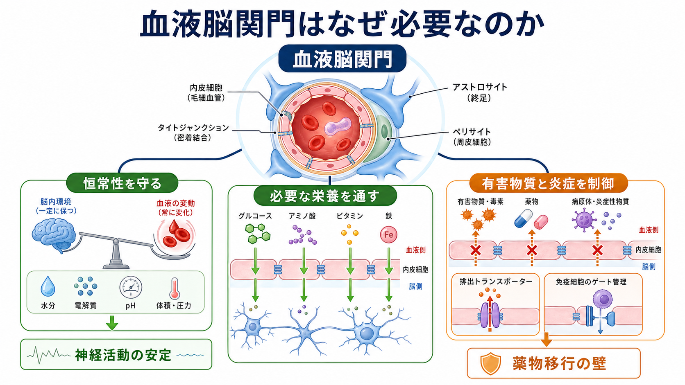
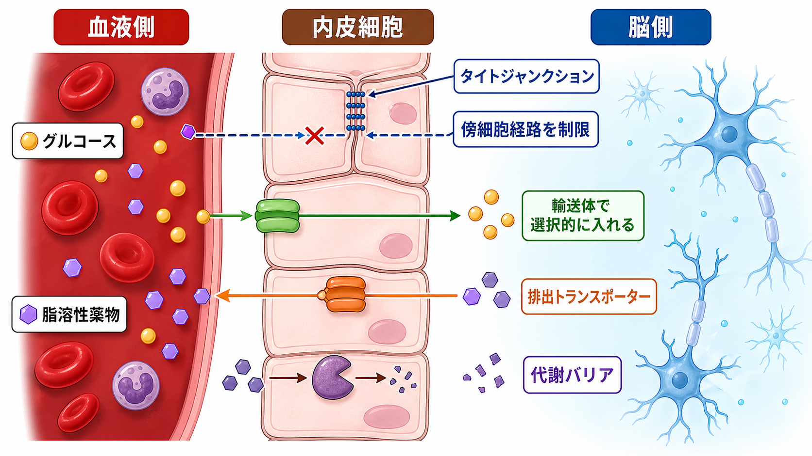
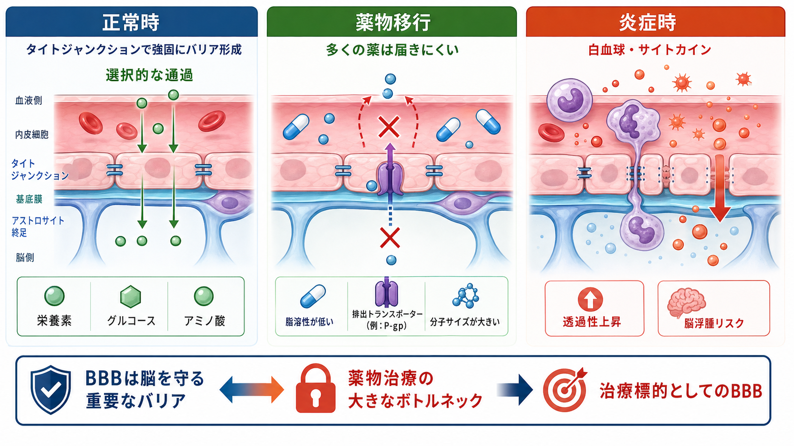

---
title: "血液脳関門はなぜ必要なのか"
description: "血液脳関門が脳内環境の恒常性を守る仕組みと、薬物移行・炎症・疾患研究との関係を整理する。"
aliases:
  - "血液脳関門"
  - "BBB"
  - "blood-brain barrier"
tags:
  - neuroscience
  - basic-neuroscience
  - blood-brain-barrier
  - neurovascular-unit
  - obsidian
created: "2026-04-27"
updated: "2026-04-27"
draft: true
publish: false
status: draft
enableToc: true
---

# 血液脳関門はなぜ必要なのか

## 要点

- 血液脳関門（blood-brain barrier; BBB）は、血液と脳組織のあいだで「何を通し、何を通しにくくするか」を制御する選択的な界面である。
- BBB の中心は脳毛細血管の内皮細胞だが、タイトジャンクション、輸送体、排出トランスポーター、周皮細胞、アストロサイト終足、基底膜などがまとまって機能する。
- BBB は脳内のイオン、栄養、神経伝達関連物質、水分、免疫細胞の移動を制御し、[[ニューロンとは何か|ニューロン]]が安定して活動できる微小環境を保つ。
- 同じ仕組みは、脳を守る一方で、多くの中枢神経系薬が脳へ届きにくい理由にもなる。
- 炎症や疾患では BBB の透過性、輸送、免疫細胞移行が変化し、脳浮腫、神経炎症、神経変性、薬物反応性の変化に関わる。

## この記事で答える問い

血液は酸素や栄養を運ぶ一方で、血漿タンパク質、免疫細胞、炎症性分子、代謝産物、薬物、病原体なども含む。では、なぜ脳は一般の臓器と同じように血液成分へ開放されていないのか。この記事では、BBB を「壁」としてだけでなく、脳の恒常性を能動的に調整する神経血管単位の一部として整理する。

## まず結論

BBB が必要なのは、[[神経細胞の種類はどのように分類されるのか|神経細胞]]が化学的にきわめて敏感な環境で動いているからである。[[軸索はどのように情報を遠くへ伝えるのか|軸索]]や[[樹状突起はどのように情報を受け取るのか|樹状突起]]の信号処理は、細胞外のイオン濃度、pH、浸透圧、神経伝達物質濃度、エネルギー供給の変化に左右される。血液成分が無制限に脳へ入れば、[[興奮性ニューロンと抑制性ニューロンは何が違うのか|興奮と抑制]]のバランス、膜電位、シナプス伝達、炎症反応が乱れやすくなる。

そのため BBB は、酸素やグルコースなど必要な物質を供給しつつ、血液中の毒性成分、病原体、過剰な免疫細胞移行、多くの薬物を制限する。Daneman と Prat は、BBB を中枢神経系の恒常性維持と神経組織の保護に不可欠な血管特性として整理している[1]。Sweeney らも、BBB が神経細胞環境の化学組成を厳密に制御し、破綻すると有害な血液成分の漏出や細胞浸潤が起こるとまとめている[2]。

## 背景

脳は体重に比べて高いエネルギー需要を持ち、血流から酸素とグルコースを継続的に受け取る必要がある。一方で、神経回路はミリ秒単位の電気信号と化学シナプスで動くため、細胞外環境のわずかな変動にも影響される。BBB はこの矛盾、つまり「血液から十分に供給を受ける必要」と「血液成分から脳を隔離する必要」を両立する仕組みである。

BBB は単独の膜ではない。脳毛細血管内皮細胞、タイトジャンクション、周皮細胞、基底膜、アストロサイト終足、ミクログリア、ニューロンを含む神経血管単位の機能として理解される[1][3]。この単位は血流調節、代謝支援、炎症応答、バリア維持を連動させる。

## 基本概念

BBB の「関門」は、単に物理的に穴が小さいという意味ではない。少なくとも三つの層で選択性が作られる。

第一に、物理的バリアである。脳毛細血管内皮細胞同士はタイトジャンクションで密に接合し、細胞と細胞の隙間を通る傍細胞経路を強く制限する[3]。

第二に、輸送バリアである。グルコース、アミノ酸、乳酸、鉄などは、それぞれの輸送体を介して選択的に出入りする。一方で、P糖タンパク質などの排出トランスポーターは、多くの脂溶性薬物や異物を血液側へ戻す[2][5]。

第三に、代謝バリアである。内皮細胞や周辺細胞は、血液由来物質を分解・修飾する酵素活性を持ち、脳へ入る前に物質の作用を弱めることがある[3]。

## 仕組み

### 1. タイトジャンクションが漏れを減らす

一般的な末梢毛細血管では、組織によっては物質が比較的通りやすい。しかし脳毛細血管では、内皮細胞間の接合が強く、血漿タンパク質や水溶性分子が無秩序に脳実質へ入ることを防ぐ。これは、[[軸索小丘はなぜ発火の起点になるのか|発火の起点]]やシナプス周囲のイオン環境を安定させるうえで重要である。

### 2. 必要なものは輸送体で入れる

BBB は「何も通さない壁」ではない。脳はエネルギー貯蔵が限られるため、グルコースなどの基質を血液から継続的に取り込む必要がある。輸送体は、必要な物質を必要な速度で通すためのゲートとして働く[2]。

### 3. 薬物や異物は排出されやすい

中枢神経系薬の開発では、薬が標的に効く以前に「脳内へ十分に届くか」が問題になる。BBB は脂溶性や分子量だけでなく、排出トランスポーター、血漿タンパク結合、代謝、受容体介在性輸送などによって薬物移行を左右する[5]。このため BBB は治療上の障壁であると同時に、薬物送達技術の重要な標的でもある。

### 4. 免疫細胞の出入りを制御する

脳は免疫から完全に隔離された場所ではないが、免疫細胞の侵入は強く調整されている。炎症時には接着分子、ケモカイン、サイトカイン、内皮細胞の活性化によって、白血球が血管壁へ接着し、脳側へ移動しやすくなる[6]。この制御が過剰または長期化すると、神経炎症や組織障害に関わる。

## 図解

上の 1 枚目は BBB の全体像である。重要なのは、BBB が「遮断」と「供給」を同時に行う点である。2 枚目は、タイトジャンクション、輸送体、排出トランスポーター、代謝バリアという主要機構を分けて示している。

3 枚目は臨床・研究との接続である。正常時には BBB は脳を守るが、薬物移行ではボトルネックになり、炎症時には透過性上昇や白血球移行を通じて病態に関わる。

## 臨床・研究との接続

BBB 研究は、基礎神経科学、薬理学、神経免疫学、神経変性疾患研究をつなぐ領域である。

薬物送達では、BBB を一時的・局所的に開く方法、受容体介在性トランスサイトーシスを利用する方法、ナノ粒子や抗体工学を使う方法などが検討されている。ただし、BBB を開けばよいという単純な話ではない。脳を守る機能を損なうと、浮腫、炎症、毒性、感染リスクが増える可能性がある[5]。

神経炎症では、BBB は免疫細胞や炎症性分子の通過点になる。多発性硬化症などの疾患では、血管内皮の活性化、白血球接着、バリア機能変化が病態の一部として研究されている[4][6]。

神経変性疾患でも、BBB の破綻、周皮細胞機能の低下、血管性因子、アミロイドβなどの排出・流入バランスが注目されている[2][7]。ただし、BBB 異常が原因なのか、病態進行の結果なのか、あるいは相互に悪化させるのかは疾患や時期によって異なる。

## よくある誤解

### 誤解1: BBB は完全な壁である

BBB は完全遮断の壁ではない。酸素、二酸化炭素、一部の脂溶性分子は拡散し、グルコースやアミノ酸は輸送体で入る。重要なのは「通すか通さないか」ではなく、「どの経路で、どの程度、どの条件で通すか」である。

### 誤解2: BBB は薬の邪魔をするだけである

BBB がなければ薬は届きやすくなるかもしれないが、同時に血液由来の毒性成分や炎症性分子も入りやすくなる。薬物送達では、BBB を壊すのではなく、保護機能を尊重しながら必要な分子だけを届ける設計が重要になる[5]。

### 誤解3: 炎症時に BBB が開くのは常に悪い

炎症時の透過性上昇や免疫細胞移行は、有害な場合もあるが、損傷応答や免疫監視の一部でもある。問題は、反応の強さ、場所、時間、解決のされ方である。短期の防御反応と慢性炎症を同じものとして扱うと、病態理解を誤りやすい。

## 関連ノート

- [[MOC｜脳・神経科学]]
- [[ニューロンとは何か]]
- [[神経細胞の種類はどのように分類されるのか]]
- [[興奮性ニューロンと抑制性ニューロンは何が違うのか]]
- [[軸索はどのように情報を遠くへ伝えるのか]]
- [[樹状突起はどのように情報を受け取るのか]]

### 関連ノート候補

MOC の同時編集は避けるため、ここでは今後作成すると有用な候補に留める。

- アストロサイトは血液脳関門をどう支えるのか
- 周皮細胞とは何か
- 神経血管単位とは何か
- 脳浮腫とは何か
- 中枢神経系薬はなぜ脳に届きにくいのか
- 神経炎症とは何か

## 理解チェック

1. BBB が「完全な壁」ではなく「選択的な界面」と呼べる理由は何か。
2. タイトジャンクション、輸送体、排出トランスポーターはそれぞれ何を制御しているか。
3. BBB が薬物治療にとって障壁でありながら、同時に治療標的にもなるのはなぜか。
4. 炎症時に BBB の変化が問題になるのは、どのような経路を通じてか。

## 参考文献

[1] Daneman, R., & Prat, A. (2015). The blood-brain barrier. *Cold Spring Harbor Perspectives in Biology*, 7(1), a020412. https://doi.org/10.1101/cshperspect.a020412

[2] Sweeney, M. D., Zhao, Z., Montagne, A., Nelson, A. R., & Zlokovic, B. V. (2019). Blood-Brain Barrier: From Physiology to Disease and Back. *Physiological Reviews*, 99(1), 21-78. https://doi.org/10.1152/physrev.00050.2017

[3] Abbott, N. J., Patabendige, A. A. K., Dolman, D. E. M., Yusof, S. R., & Begley, D. J. (2010). Structure and function of the blood-brain barrier. *Neurobiology of Disease*, 37(1), 13-25. https://doi.org/10.1016/j.nbd.2009.07.030

[4] Obermeier, B., Daneman, R., & Ransohoff, R. M. (2013). Development, maintenance and disruption of the blood-brain barrier. *Nature Medicine*, 19(12), 1584-1596. https://doi.org/10.1038/nm.3407

[5] Banks, W. A. (2016). From blood-brain barrier to blood-brain interface: new opportunities for CNS drug delivery. *Nature Reviews Drug Discovery*, 15(4), 275-292. https://doi.org/10.1038/nrd.2015.21

[6] Ransohoff, R. M., & Engelhardt, B. (2012). The anatomical and cellular basis of immune surveillance in the central nervous system. *Nature Reviews Immunology*, 12(9), 623-635. https://doi.org/10.1038/nri3265

[7] Zhao, Z., Nelson, A. R., Betsholtz, C., & Zlokovic, B. V. (2015). Establishment and Dysfunction of the Blood-Brain Barrier. *Cell*, 163(5), 1064-1078. https://doi.org/10.1016/j.cell.2015.10.067

[8] Abbott, N. J., Ronnback, L., & Hansson, E. (2006). Astrocyte-endothelial interactions at the blood-brain barrier. *Nature Reviews Neuroscience*, 7(1), 41-53. https://doi.org/10.1038/nrn1824

## 更新ログ

- 2026-04-27: 初版作成。BBB の恒常性維持、薬物移行、炎症との関係を整理し、図解 3 点を追加。
