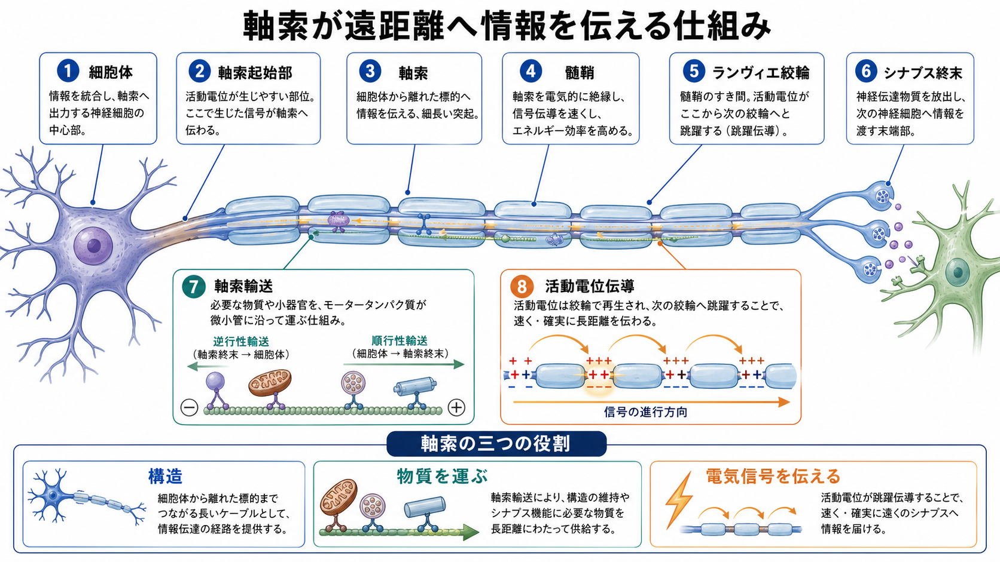
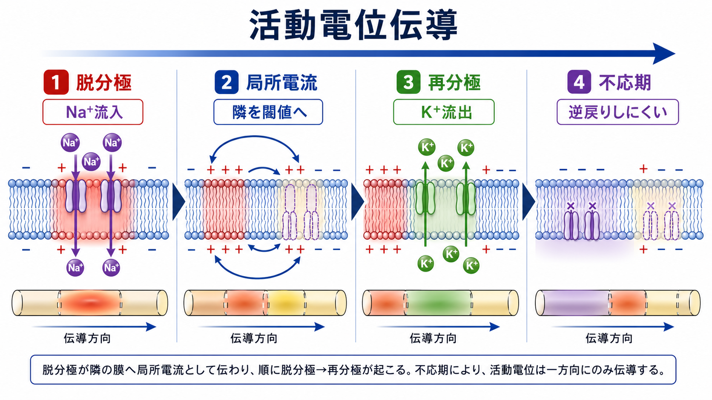
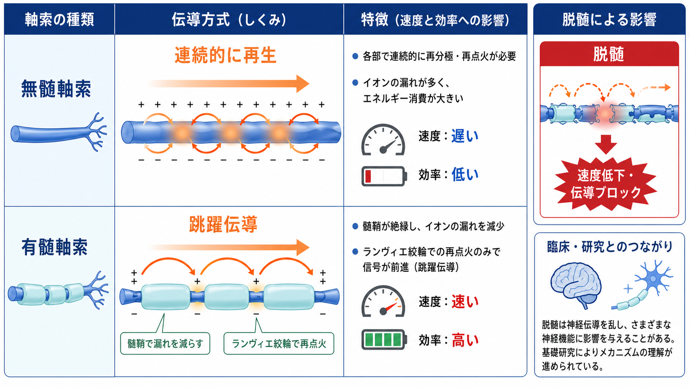

---
title: "軸索はどのように情報を遠くへ伝えるのか"
description: "軸索の構造、軸索輸送、活動電位伝導を、遠距離情報伝達という観点から整理する。"
aliases:
  - "軸索"
  - "活動電位伝導"
  - "軸索輸送"
tags:
  - neuroscience
  - basic-neuroscience
  - obsidian
  - 脳・神経科学/基礎神経科学
created: "2026-04-27"
updated: "2026-04-27"
draft: true
publish: false
status: draft
enableToc: true
---

# 軸索はどのように情報を遠くへ伝えるのか

## 要点

- 軸索は、神経細胞の出力を遠くの標的へ届ける長い突起である。
- 遠距離伝達は、単なる「電線」ではなく、膜の電気的興奮、髄鞘、ランヴィエ絞輪、シナプス終末、細胞内輸送が組み合わさって成立する。
- 活動電位は、電位依存性 Na+ チャネルと K+ チャネルの開閉により、軸索膜上で再生されながら進む[1][2]。
- 軸索輸送は、遠く離れたシナプス終末へタンパク質、脂質、小胞、ミトコンドリアなどを届け、不要物やシグナルを細胞体へ戻す[5][6]。
- 髄鞘とランヴィエ絞輪は、伝導速度とエネルギー効率を大きく高めるが、脱髄や節部の障害では伝導が乱れうる[7][8]。

## この記事で答える問い

この記事では、「軸索はなぜ長距離でも信号を失わずに伝えられるのか」を、次の三つの問いに分けて考える。

1. 軸索はどのような構造をもつのか。
2. 軸索の内部では、物質がどのように運ばれるのか。
3. 活動電位は、どのように軸索上を進むのか。

## まず結論

軸索の遠距離情報伝達は、二つの「運ぶ」仕組みの重ね合わせである。

一つは、膜電位の変化を活動電位として遠くへ伝える電気的な伝導である。局所的な脱分極が隣の膜を閾値まで押し上げ、そこで再び活動電位が発生するため、信号は減衰しきる前に何度も再生される[1][4]。

もう一つは、細胞体と軸索終末を結ぶ物質輸送である。軸索終末は細胞体から遠く離れているため、シナプス機能の維持には、微小管、キネシン、ダイニンなどを使った軸索輸送が必要になる[5][6]。

## 背景

神経細胞は、樹状突起や細胞体で入力を受け、軸索を通じて出力を送る。軸索の長さは細胞種によって大きく異なり、末梢神経では細胞体から標的まで非常に長い距離を伸びることがある。したがって軸索は、「遠くへ届く形」をもつだけでなく、「遠くまで機能を保つ仕組み」を備えている必要がある。

軸索を金属線のような受動的な導線として考えると、信号は距離とともに減衰する。しかし神経の活動電位は、電位依存性イオンチャネルによって軸索膜上で繰り返し再生される。これにより、軸索は遠距離でも比較的安定した信号伝達を実現する[1]。

## 基本概念

### 軸索

軸索は、細胞体から伸びる長い突起で、神経細胞の出力路として働く。軸索起始部では電位依存性 Na+ チャネルが高密度に集まり、活動電位が生じやすい構造になっている。多くの中枢神経・末梢神経の軸索では、さらに髄鞘が巻きつき、ところどころにランヴィエ絞輪という髄鞘の切れ目がある[2][3]。

### 活動電位

活動電位は、膜電位が閾値を超えたときに生じる急速な電気的変化である。脱分極では Na+ が細胞内へ流入し、再分極では K+ の流出が重要になる。Hodgkin と Huxley の古典的研究は、この電気現象を Na+ と K+ の電位依存的な膜コンダクタンスの変化として定量化した[4]。

### 軸索輸送

軸索輸送は、軸索内部の微小管をレールとして、モータータンパク質が物質を運ぶ仕組みである。細胞体から軸索終末へ向かう順行性輸送には主にキネシンが関与し、軸索末端から細胞体へ戻る逆行性輸送には主にダイニンが関与する[5][6]。

## 仕組み

### 1. 構造としての長距離化

軸索は、細胞体から離れた標的へ到達するために長く伸びる。内部には微小管、神経フィラメント、アクチンなどの細胞骨格があり、形を保つだけでなく輸送路としても働く。髄鞘をもつ軸索では、膜の多くが絶縁され、ランヴィエ絞輪にイオンチャネルが集中する。この配置により、信号は節から節へ効率よく進みやすくなる[3][7]。

### 2. 軸索輸送で「遠くの終末」を維持する

軸索終末では、神経伝達物質の放出、シナプス小胞のリサイクル、ミトコンドリアによるエネルギー供給などが必要になる。しかし、多くのタンパク質や膜成分は細胞体側で合成・処理される。そこで、順行性輸送が新しく作られた成分を末端へ届け、逆行性輸送が古くなった成分、損傷シグナル、栄養因子シグナルなどを細胞体へ戻す[5]。

この輸送は単純な一方通行ではない。多くの積荷には複数のモーターや調節因子が関わり、積荷の種類に応じて速度、停止、方向転換が制御される。長い軸索をもつ神経細胞では、この輸送の破綻がシナプス機能や細胞生存に影響しやすい[5][8]。

### 3. 活動電位は「再生されながら」進む

活動電位が軸索の一部で発生すると、その近くの膜へ局所電流が流れ、隣接部位を脱分極させる。隣の膜が閾値を超えると、そこでも Na+ チャネルが開き、新しい活動電位が発生する。この繰り返しにより、信号は受動的に弱まるだけでなく、軸索上で能動的に再生されながら進む[1][2]。

活動電位が通常一方向に進むのは、通過直後の膜が不応期に入るためである。Na+ チャネルの不活性化などにより、直前に興奮した膜はすぐには再び活動電位を起こしにくい。その結果、興奮はまだ閾値に近づいていない前方へ進みやすくなる[2][4]。

### 4. 髄鞘と跳躍伝導

無髄軸索では、膜の隣接部位が連続的に脱分極し、活動電位が少しずつ進む。一方、有髄軸索では、髄鞘が膜からの電流漏れを減らし、電位依存性チャネルが集まるランヴィエ絞輪で活動電位が再点火される。この節から節への伝導は跳躍伝導と呼ばれ、速度と効率を高める[2][7]。

## 図解

上の図では、軸索を三つの層で見ると理解しやすい。

- 構造の層: 細胞体、軸索起始部、髄鞘、ランヴィエ絞輪、シナプス終末。
- 物質輸送の層: 微小管上を進むキネシンとダイニン、順行性輸送と逆行性輸送。
- 電気信号の層: Na+ 流入、局所電流、K+ 流出、不応期、跳躍伝導。

この三つは独立していない。たとえば、髄鞘やランヴィエ絞輪の分子構成が変わると活動電位伝導が変わり、軸索輸送が乱れるとシナプス終末の維持やミトコンドリア配置が影響を受ける[7][8]。

## 臨床・研究との接続

脱髄やランヴィエ絞輪周辺の構造変化は、神経伝導の速度低下や伝導ブロックと関連しうる。ただし、個々の症状や疾患の診断は、神経学的診察、検査、画像所見などを総合して専門家が判断するものであり、この記事は教育・研究目的の基礎説明に限る[7]。

研究面では、軸索は神経細胞の「出力ケーブル」であるだけでなく、可塑性、代謝、細胞内物流、疾患脆弱性を考える場でもある。特に長い軸索をもつ神経細胞では、軸索輸送の小さな障害が遠位部からの機能低下として現れる可能性があるため、神経変性疾患研究でも重要な論点になっている[5][8]。

## よくある誤解

### 誤解1: 軸索はただの電線である

軸索は電気信号を伝えるが、金属線のように電流をそのまま通すわけではない。活動電位は、膜のイオンチャネルが時間的・空間的に開閉することで、軸索上で再生されながら進む[1][4]。

### 誤解2: 髄鞘があれば活動電位は膜全体で起きない

有髄軸索では、活動電位は主にランヴィエ絞輪で再生される。髄鞘で覆われた部分は電気的に絶縁されやすく、節間を受動的な電流が進み、次の節で再び活動電位が発生する[2][7]。

### 誤解3: 軸索輸送は補助的な物流にすぎない

軸索輸送は、シナプス終末の維持、ミトコンドリア配置、古い成分の回収、遠位シグナルの細胞体への伝達に関わる。したがって、活動電位伝導とは別の意味で、軸索の遠距離機能を支える中核的な仕組みである[5][6]。

## 関連ノート

- 既存 MOC: [[MOC｜脳・神経科学]]
- 領域別MOC: [[MOC｜基礎神経科学]]
- [[ニューロンとは何か]]
- [[活動電位はどのように発生するのか]]
- [[活動電位はなぜ一方向に伝わるのか]]
- [[髄鞘はなぜ神経伝導を速くするのか]]
- [[ランヴィエ絞輪では何が起きているのか]]
- [[軸索輸送とは何か]]
- 関連ノート候補: 神経変性疾患

## 理解チェック

1. 活動電位が距離とともに消えにくいのはなぜか。
2. 順行性輸送と逆行性輸送は、それぞれ何をどちら向きに運ぶのか。
3. 有髄軸索でランヴィエ絞輪が重要なのはなぜか。
4. 軸索輸送の障害が、シナプス機能や神経変性と結びつきうるのはなぜか。

## 参考文献

[1] Purves D, Augustine GJ, Fitzpatrick D, et al., editors. *Neuroscience. 2nd edition.* Long-Distance Signaling by Means of Action Potentials. NCBI Bookshelf, 2001. https://www.ncbi.nlm.nih.gov/books/NBK11107/

[2] Grider MH, Jessu R, Kabir R. Physiology, Action Potential. *StatPearls.* NCBI Bookshelf, updated 2023. https://www.ncbi.nlm.nih.gov/books/NBK538143/

[3] Debanne D, Campanac E, Bialowas A, Carlier E, Alcaraz G. Axon physiology. *Physiological Reviews.* 2011;91(2):555-602. https://doi.org/10.1152/physrev.00048.2009

[4] Hodgkin AL, Huxley AF. A quantitative description of membrane current and its application to conduction and excitation in nerve. *The Journal of Physiology.* 1952;117(4):500-544. https://doi.org/10.1113/jphysiol.1952.sp004764

[5] Maday S, Twelvetrees AE, Moughamian AJ, Holzbaur ELF. Axonal transport: cargo-specific mechanisms of motility and regulation. *Neuron.* 2014;84(2):292-309. https://doi.org/10.1016/j.neuron.2014.10.019

[6] Brady ST, Siegel GJ, Albers RW, Price DL, editors. Molecular Motors: Kinesin, Dynein and Myosin. *Basic Neurochemistry.* NCBI Bookshelf. https://www.ncbi.nlm.nih.gov/books/NBK27955/

[7] Arancibia-Carcamo IL, Attwell D. The node of Ranvier in CNS pathology. *Acta Neuropathologica.* 2014;128:161-175. https://doi.org/10.1007/s00401-014-1305-z

[8] Millecamps S, Julien JP. Axonal transport deficits and neurodegenerative diseases. *Nature Reviews Neuroscience.* 2013;14:161-176. https://doi.org/10.1038/nrn3380

## 未解決問題

- 軸索輸送の積荷ごとの制御規則はどこまで一般化できるのか。
- ランヴィエ絞輪の分子構成変化は、疾患ごとにどの程度共通しているのか。
- 活動電位伝導、ミトコンドリア配置、局所翻訳、軸索変性を一つのモデルとしてどう統合できるのか。
