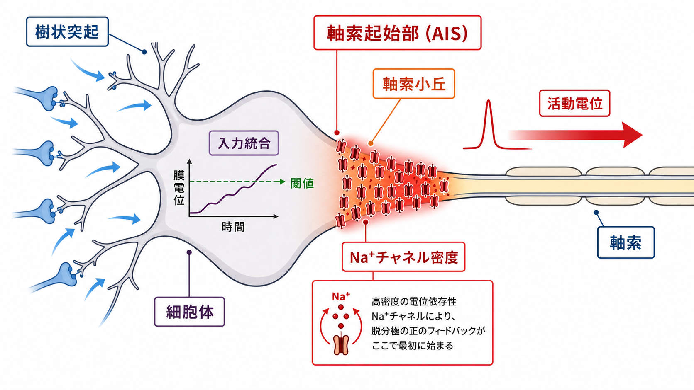
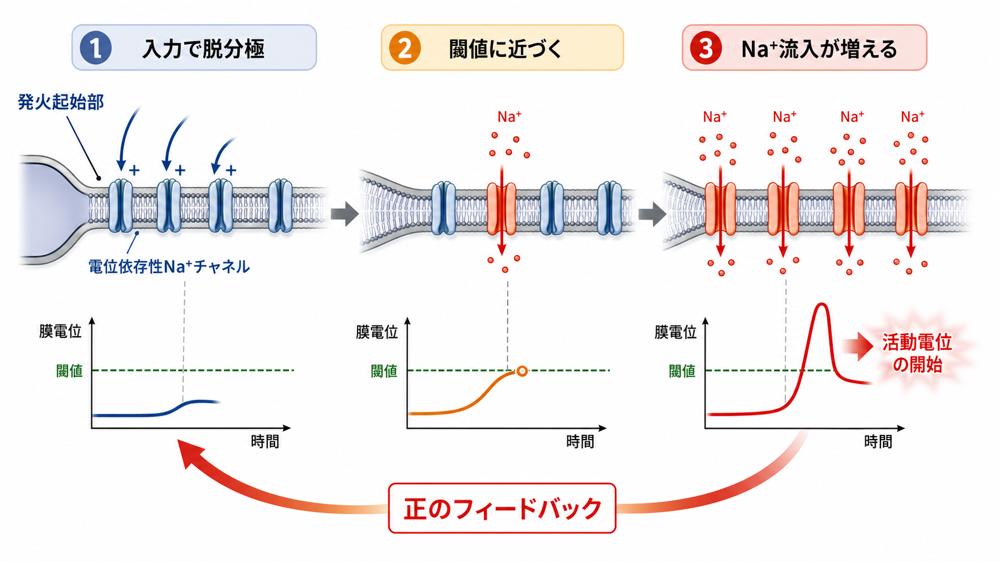
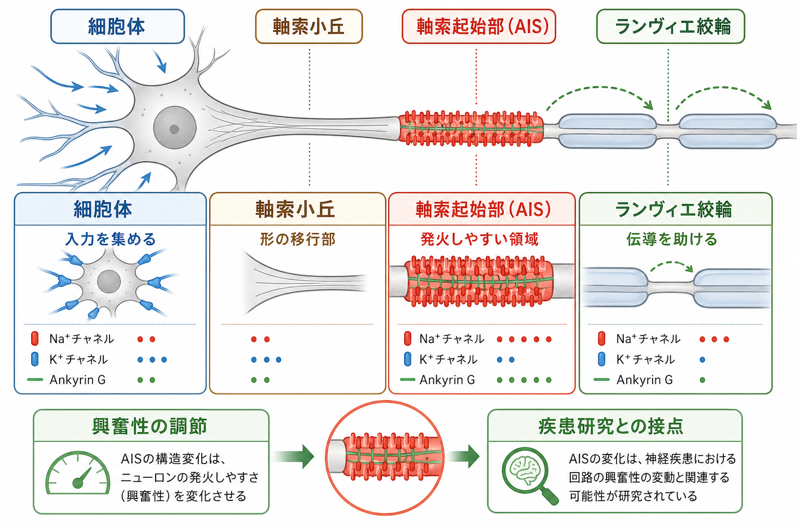

---
title: "軸索小丘はなぜ発火の起点になるのか"
description: "入力統合、閾値、電位依存性ナトリウムチャネル密度から、軸索小丘と軸索起始部が発火起始に関わる理由を整理する。"
aliases:
  - "軸索小丘"
  - "軸索起始部"
  - "発火起始部"
tags:
  - neuroscience
  - basic-neuroscience
  - obsidian
created: "2026-04-27"
updated: "2026-04-27"
draft: true
publish: false
status: draft
enableToc: true
---

# 軸索小丘はなぜ発火の起点になるのか

## 要点

- 神経細胞の発火は、樹状突起と細胞体で生じたシナプス入力が膜電位を押し上げ、ある領域で電位依存性 Na+ チャネルの再生的開口を始める現象である。
- 教科書的には「軸索小丘が発火の起点」と説明されることが多いが、実験的には多くのニューロンで、軸索小丘のすぐ先にある軸索起始部（axon initial segment; AIS）が主要な発火起始部になる[2][3]。
- AIS が発火しやすいのは、単に「細胞体に近い」からではない。Na+ チャネルが高密度に集まり、チャネルの種類・活性化閾値・細胞体からの電気的距離が組み合わさって、局所的な正のフィードバックが始まりやすいからである[4][5]。
- AIS は固定された部品ではなく、発達、活動履歴、疾患モデルで位置や長さ、チャネル構成が変わり、ニューロン全体の興奮性を調節する[7][8]。

## この記事で答える問い

「なぜ細胞体や樹状突起ではなく、軸索小丘付近から活動電位が始まるのか」を、3つの観点から説明する。

1. 入力統合: 樹状突起と細胞体に届いた興奮性・抑制性入力が、どこで発火判定に近づくのか。
2. 閾値: 膜電位がどの条件で、Na+ チャネルの再生的開口に入るのか。
3. チャネル密度: なぜ AIS では、同じ脱分極でも活動電位が始まりやすいのか。

## まず結論

発火の「起点」は、入力を受け取る場所ではなく、脱分極が最初に自己増幅へ入る場所である。興奮性シナプス入力は主に樹状突起や細胞体で生じるが、そこで生じた電位変化は空間的・時間的に加算され、軸索小丘から AIS に伝わる。AIS には電位依存性 Na+ チャネルが高密度に集積しており、膜電位が閾値付近に達すると Na+ 流入が脱分極をさらに強め、さらに多くの Na+ チャネルを開く。この正のフィードバックが局所的に最初に成立するため、AIS が活動電位の起始部になりやすい[3][4]。

ただし、「軸索小丘」と「AIS」は同じではない。軸索小丘は細胞体から軸索へ移行する形態的な領域であり、AIS はその先の軸索近位部にある分子・電気生理学的に特殊化した領域である。日常的な説明では両者がまとめて語られやすいが、厳密には AIS を中心に考えるほうがよい[7]。

## 背景

活動電位の基礎は、Hodgkin と Huxley が示したように、膜電位依存的に変化する Na+ と K+ のコンダクタンスで説明できる。脱分極が十分に進むと Na+ チャネルが開き、Na+ 流入が膜をさらに脱分極させる。この自己増幅過程が活動電位の急峻な立ち上がりを作る[1]。

神経細胞では、シナプス入力の多くは樹状突起と細胞体に届く。しかし、活動電位は多くの場合、細胞体の中心ではなく軸索近位部で始まる。層5錐体細胞などを対象にした同時記録研究は、発火起始が細胞体から少し離れた軸索近位部で生じることを示してきた[2]。この領域が AIS であり、現在では「発火起始」「活動電位の形」「軸索と細胞体・樹状突起の境界維持」を担う特殊な細胞内区画として理解されている[3][7]。

## 基本概念

### 入力統合

入力統合とは、興奮性入力、抑制性入力、膜抵抗、膜容量、樹状突起の形、イオンチャネルの分布が合わさり、膜電位が時間と空間の中でどのように変化するかを決める過程である。発火は「1つのシナプスが押すスイッチ」ではなく、多数の入力が作る膜電位の履歴に依存する。

細胞体は入力統合の大きな結節点だが、必ずしも最も発火しやすい場所ではない。細胞体は比較的大きく、膜容量も大きいため、同じ電流でも電位変化が分散しやすい。一方、AIS は細い軸索上にあり、Na+ チャネルの集積によって局所的な脱分極を活動電位へ変換しやすい[3][4]。

### 閾値

閾値は、固定された電圧値というより、「Na+ チャネルによる内向き電流が、漏れ電流や K+ 電流などを上回り、脱分極が自己増幅へ入る条件」と考えると理解しやすい。したがって閾値は、直前の膜電位、入力の速度、チャネルの不活性化、ニューロンの種類によって変わる。

AIS に低閾値で開きやすい Na+ チャネルが集まると、細胞体で観察される発火閾値よりも軸索側で先に再生的脱分極が始まる。Na+ チャネル密度だけでなく、チャネルのゲーティング特性も発火起始を左右する[5][6]。

### 電位依存性 Na+ チャネル密度

AIS では電位依存性 Na+ チャネルが高密度に集積する。Kole らは皮質錐体細胞で、AIS の Na+ チャネル密度が近位樹状突起より約50倍高いことを示し、この高密度が活動電位生成に必要であると論じた[4]。別のニューロン型では倍率は異なりうるが、「軸索近位部の Na+ チャネル密度とゲーティングが発火起始を有利にする」という考えは広く支持されている[3][6]。

## 仕組み

### 1. 樹状突起と細胞体で入力が集まる

興奮性入力は膜電位を脱分極側へ、抑制性入力は過分極側またはシャント側へ動かす。これらの入力は樹状突起内で減衰しながら細胞体へ伝わり、さらに軸索近位部へ届く。ここまでは「発火するかどうかの材料」が集まる段階である。

### 2. AIS が局所的な判定点になる

AIS は、細胞体から電気的に近すぎると大きな細胞体に電流が吸い取られやすく、遠すぎると入力が届きにくい。実際の AIS はこの両者の間にあり、細胞体からの入力を受け取りつつ、局所的なチャネル集積で発火しやすい位置にある[3][5]。

### 3. Na+ チャネルの開口が脱分極を自己増幅する

膜電位が閾値に近づくと、AIS の Na+ チャネルが開き始める。Na+ が流入すると膜はさらに脱分極し、その脱分極がさらに Na+ チャネルを開かせる。これが正のフィードバックであり、活動電位の立ち上がりを作る[1]。

### 4. 発火は軸索へ進み、細胞体へも逆向きに伝わる

AIS で始まった活動電位は軸索を下流へ伝わり、神経終末で伝達物質放出を促す。同時に、細胞体や樹状突起へも逆向きに広がることがある。Na_v1.6 と Na_v1.2 のような Na+ チャネルサブタイプは、発火起始と細胞体への逆伝播に異なる寄与をする[5]。

## 図解

| 領域 | 主な役割 | 発火起始との関係 |
|---|---|---|
| 樹状突起 | シナプス入力を受ける | 入力の発生源。局所スパイクを持つ場合もあるが、典型的な軸索活動電位の起点ではない。 |
| 細胞体 | 入力を集め、核や代謝機能を担う | 膜電位の観測点として重要だが、多くのニューロンでは最初の発火部位ではない。 |
| 軸索小丘 | 細胞体から軸索への形態的移行部 | 教科書的に発火起点として語られやすいが、厳密には AIS と区別する。 |
| AIS | Na+ チャネル、K+ チャネル、Ankyrin G などが集まる特殊区画 | 多くのニューロンで主要な発火起始部。閾値、発火波形、興奮性を調節する。 |
| ランヴィエ絞輪 | 有髄軸索で跳躍伝導を支える | 活動電位の伝導を助けるが、通常の最初の起始部とは限らない。 |

## 臨床・研究との接続

AIS は、ニューロンの興奮性を調節する小さな構造である。Ankyrin G は AIS の足場タンパク質として、Na+ チャネル、細胞接着分子、スペクトリン骨格などを組織化する。したがって AIS の構造が崩れると、単にチャネルが減るだけでなく、軸索と細胞体・樹状突起の境界やチャネル配置そのものが変わりうる[7]。

また AIS は活動依存的に位置を変えることがある。Grubb と Burrone は、慢性的な脱分極などの条件で AIS 構成要素が細胞体から遠ざかり、その変化が発火閾値の変化と対応することを示した[8]。これは、AIS がニューロンの「固定された引き金」ではなく、活動履歴に応じて興奮性を微調整する構造であることを示す。

疾患との関係を考えるときは注意が必要である。AIS や Na+ チャネルの異常はてんかん、発達障害、神経変性などの研究文脈で扱われるが、個別の症状を AIS だけで説明することはできない。本記事の内容は教育・研究目的の基礎知識であり、診断や治療方針を示すものではない。

## よくある誤解

### 誤解1: 軸索小丘そのものが必ず最初に発火する

より正確には、軸索小丘から続く AIS が発火起始部になることが多い。軸索小丘は形態名、AIS は分子構成と電気生理学的機能を持つ特殊区画として区別すると混乱が減る[7]。

### 誤解2: 閾値はどのニューロンでも同じ固定値である

閾値は単一の定数ではない。直前の膜電位、入力の立ち上がり、Na+ チャネルの不活性化、K+ チャネルの状態、AIS の位置や長さによって変わる。実験で細胞体から測った閾値は、AIS 内部で起きている局所的な閾値条件を間接的に見ている場合がある。

### 誤解3: Na+ チャネル密度だけで全部決まる

Na+ チャネル密度は重要だが、それだけでは不十分である。Na_v1.6 と Na_v1.2 の分布差、K+ チャネル、AIS の細胞体からの距離、軸索径、膜容量、シナプス入力のタイミングも発火起始に関わる[5][6]。

### 誤解4: AIS は発火だけの構造である

AIS は発火起始だけでなく、軸索と細胞体・樹状突起の分子境界を保つ役割も持つ。輸送、拡散障壁、細胞骨格の組織化を含む「ニューロン極性の境界」として見る必要がある[7]。

## 関連ノート

- [[MOC｜脳・神経科学]]
- [[MOC｜基礎神経科学]]
- [[活動電位はどのように発生するのか]]
- [[ニューロンは複数の入力をどのように統合するのか]]
- [[樹状突起はどのように情報を受け取るのか]]
- [[軸索はどのように情報を遠くへ伝えるのか]]
- [[ランヴィエ絞輪では何が起きているのか]]

今後の作成候補:

- 電位依存性ナトリウムチャネル
- 軸索起始部
- 閾値
- Ankyrin G

MOC 更新候補:

- `content/00_MOC/MOC｜基礎神経科学.md` の「ニューロンの構造と細胞型」に追加済み。

## 理解チェック

1. 発火の起点を「入力が最も多い場所」ではなく「脱分極が最初に自己増幅へ入る場所」と考えると、なぜ AIS が重要になるか。
2. 軸索小丘と AIS は、形態・分子構成・機能の点でどう違うか。
3. Na+ チャネル密度が高いだけでなく、チャネルサブタイプや AIS の位置が重要になるのはなぜか。
4. AIS の活動依存的な移動は、ニューロンの興奮性にどのような影響を与えうるか。

## 参考文献

[1] Hodgkin, A. L., & Huxley, A. F. (1952). A quantitative description of membrane current and its application to conduction and excitation in nerve. *The Journal of Physiology*, 117(4), 500-544. https://doi.org/10.1113/jphysiol.1952.sp004764

[2] Palmer, L. M., & Stuart, G. J. (2006). Site of action potential initiation in layer 5 pyramidal neurons. *The Journal of Neuroscience*, 26(6), 1854-1863. https://doi.org/10.1523/JNEUROSCI.4812-05.2006

[3] Kole, M. H. P., & Stuart, G. J. (2012). Signal processing in the axon initial segment. *Neuron*, 73(2), 235-247. https://doi.org/10.1016/j.neuron.2012.01.007

[4] Kole, M. H. P., Ilschner, S. U., Kampa, B. M., Williams, S. R., Ruben, P. C., & Stuart, G. J. (2008). Action potential generation requires a high sodium channel density in the axon initial segment. *Nature Neuroscience*, 11, 178-186. https://doi.org/10.1038/nn2040

[5] Hu, W., Tian, C., Li, T., Yang, M., Hou, H., & Shu, Y. (2009). Distinct contributions of Na_v1.6 and Na_v1.2 in action potential initiation and backpropagation. *Nature Neuroscience*, 12, 996-1002. https://doi.org/10.1038/nn.2359

[6] Schmidt-Hieber, C., & Bischofberger, J. (2010). Fast sodium channel gating supports localized and efficient axonal action potential initiation. *The Journal of Neuroscience*, 30(30), 10233-10242. https://doi.org/10.1523/JNEUROSCI.6335-09.2010

[7] Leterrier, C. (2018). The axon initial segment: An updated viewpoint. *The Journal of Neuroscience*, 38(9), 2135-2145. https://doi.org/10.1523/JNEUROSCI.1922-17.2018

[8] Grubb, M. S., & Burrone, J. (2010). Activity-dependent relocation of the axon initial segment fine-tunes neuronal excitability. *Nature*, 465, 1070-1074. https://doi.org/10.1038/nature09160

## 未解決問題

- ニューロン型ごとに、AIS の長さ・位置・Na+ / K+ チャネル構成がどの程度違い、その違いが計算機能にどう対応するのか。
- AIS の構造可塑性が、短期的な興奮性調節と長期的な疾患脆弱性をどのように結びつけるのか。
- ヒト脳組織で観察される AIS 変化を、動物実験や培養系の知見からどこまで一般化できるのか。

## 更新ログ

- 2026-04-27: 初稿作成。入力統合、閾値、Na+ チャネル密度、AIS 可塑性を中心に整理。
