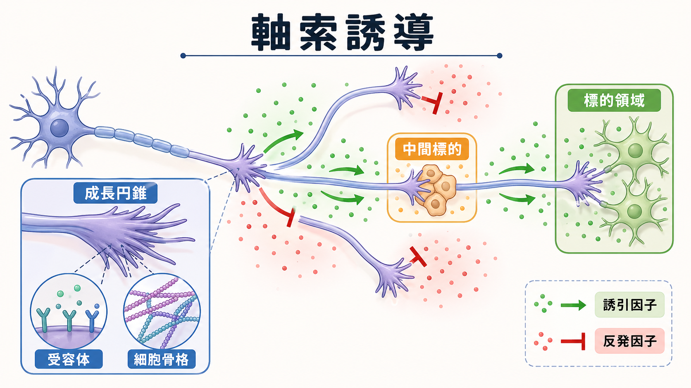
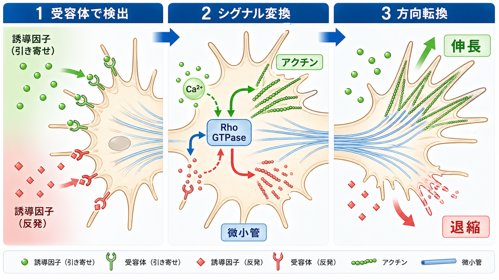
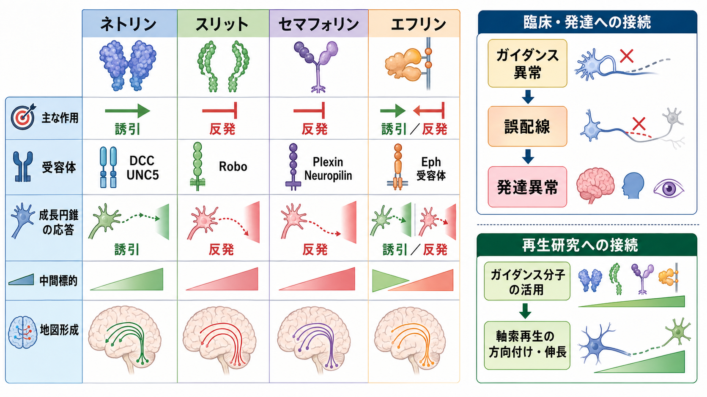

---
title: "軸索誘導はどのように正しい接続を作るのか"
description: "誘引因子・反発因子・成長円錐がどのように神経配線の経路選択と標的到達を支えるかを説明する。"
aliases:
  - "軸索誘導"
  - "axon guidance"
  - "成長円錐"
tags:
  - neuroscience
  - basic-neuroscience
  - neurodevelopment
  - obsidian
created: "2026-04-27"
updated: "2026-04-27"
draft: true
publish: false
status: draft
enableToc: true
---

# 軸索誘導はどのように正しい接続を作るのか

## 要点

- 軸索誘導とは、発生中の[[ニューロンとは何か|ニューロン]]が[[軸索はどのように情報を遠くへ伝えるのか|軸索]]を伸ばし、適切な経路を通って標的領域へ到達する過程である。
- 先端の成長円錐は、誘引因子と反発因子を受容体で読み取り、アクチンや微小管などの細胞骨格を局所的に組み替える。
- 正しい接続は、単一の「住所ラベル」だけでなく、複数の手がかり、発生時期、受容体発現、活動依存的な洗練によって段階的に作られる。
- 軸索誘導の異常は、交連線維、脳神経、視覚地図などの配線異常を通じて、発達性の神経疾患と関係することがある。

## この記事で答える問い

神経回路は、最初から完成した配線図として存在するわけではない。発生中の神経系では、多数のニューロンが軸索を伸ばし、途中で曲がり、束になったり離れたりしながら、最終的に特定の標的細胞や領域に近づく。この記事では、「軸索はどのようにして行き先を間違えずに進むのか」を、成長円錐、誘引因子、反発因子、受容体、細胞骨格という観点から整理する。

## まず結論

軸索誘導は、成長円錐が周囲の分子環境を読む「移動するセンサー」として働くことで成立する。成長円錐は、遠くから拡散してくる分子、細胞表面に固定された分子、細胞外基質、隣接する軸索などを同時に読み取り、進む・曲がる・止まる・退縮するという局所的な運動へ変換する[1][2]。

重要なのは、誘導因子が常に「誘引」または「反発」として固定されているわけではない点である。同じネトリンでも、DCC単独で受け取る場合とUNC5系受容体を含む場合では応答が変わりうる。つまり、外の分子そのものだけでなく、成長円錐側の受容体構成、細胞内シグナル、発生段階が、進路決定を左右する[3][4]。

## 背景

軸索誘導の考え方の歴史的な出発点の一つは、Sperryの化学親和性仮説である。網膜から視蓋への投射のような秩序だった結合を説明するために、神経線維と標的領域の間に分子的な対応関係があると考えられた[5]。その後、成長円錐の観察、遺伝学、生化学、発生神経科学の進展により、ネトリン、スリット、セマフォリン、エフリンなどの主要な軸索誘導分子ファミリーと、それらに対応する受容体が同定されてきた[1][2]。

ただし、現代的な理解では「分子ラベルが1対1で標的を指定する」というより、複数の局所ルールが積み重なって配線ができると考えるほうが近い。軸索は、神経管の正中線、境界領域、中間標的、既存の軸索束、標的領域の濃度勾配などを順番に利用する。これは[[神経発生ではニューロンはどのように作られるのか|神経発生]]の中で、細胞分化、移動、軸索伸長、[[シナプスとは何か|シナプス]]形成が連続して起こることを意味している。

## 基本概念

### 成長円錐

成長円錐は、伸長中の軸索先端にある扇形または手のような構造である。糸状仮足と葉状仮足を伸ばし、周囲の分子を探索しながら進む。内部では、アクチン線維が突出と退縮を担い、微小管が軸索の安定した伸長方向を支える。誘導因子の情報は、最終的にはこの細胞骨格の非対称な再編成に変換される[3]。

### 誘引因子と反発因子

誘引因子は成長円錐を近づける方向に働き、反発因子は遠ざける方向に働く。古典的には、接触依存性の誘引、長距離性の化学誘引、接触依存性の反発、長距離性の化学反発という4種類の働き方が区別される[1]。

代表例として、ネトリンはDCC系受容体を介して交連軸索の誘引に関わり、スリットはRobo受容体を介して正中線からの反発や再交差防止に関わる。セマフォリンはプレキシンやニューロピリンを介して成長円錐の崩壊や進路変更を起こし、エフリンとEph受容体は視覚系などの地図形成に重要である[2][6]。

### 中間標的

長距離を一気に標的まで進む軸索は少ない。多くの軸索は、途中の中間標的を利用する。たとえば、交連軸索は正中線へ近づき、そこを横断した後は、同じ正中線へ戻らないように応答性を変える。このような「通過前」と「通過後」の状態切り替えは、正しい経路選択に不可欠である[2][4]。

## 仕組み

### 1. 成長円錐が分子勾配を読む

成長円錐表面には、DCC、UNC5、Robo、プレキシン、ニューロピリン、Ephなどの受容体が発現している。これらは外部の誘導分子と結合し、どの方向に分子が多いか、どの面が接触しているか、どの標的領域に近づいているかを検出する[2][3]。

ただし、勾配は単純な「濃いほうへ進む矢印」ではない。実際の組織では、複数の分子が重なり、細胞外基質や細胞表面に固定された手がかりも加わる。さらに、近年のネトリン研究では、床板由来の長距離勾配だけでは説明しきれず、局所的な接着・基質結合型のネトリンが重要であることも示されている[7]。

### 2. 受容体情報が細胞内シグナルへ変換される

受容体が誘導因子を受け取ると、RhoファミリーGTPase、カルシウムシグナル、キナーゼ、膜輸送、受容体の内在化などが変化する。これらはアクチン重合、アクチン脱重合、微小管の侵入、接着の形成と解除を調節する[3][4]。

成長円錐の片側でアクチン重合が強まり、反対側で退縮が起これば、成長円錐全体は一方向へ曲がる。反発性の手がかりが強い場所では、局所的なフィロポディアの退縮や成長円錐崩壊が起こり、その方向を避ける。これは[[活動電位はどのように発生するのか|活動電位]]のような高速な電気信号ではなく、細胞形態を変える発生過程のシグナルである。

### 3. 応答性が発生段階によって変わる

同じ成長円錐でも、発生時期や通過した場所によって受容体の発現、局在、感受性が変わる。正中線を横断する軸索では、横断前には正中線へ近づく応答が必要だが、横断後には再び正中線へ戻らない応答が必要になる。この切り替えには、Robo系受容体やその調節が関与する[2][4]。

また、成長円錐内にはmRNA、翻訳装置、タンパク質分解系が存在し、誘導分子に応じて局所的なタンパク質合成や分解が数分単位で変化しうる。CampbellとHoltの研究は、ネトリンやSema3Aに対する成長円錐の曲がり応答が、局所翻訳やタンパク質分解に依存することを示した[8]。

### 4. 標的到達後も配線は洗練される

軸索誘導は、正しい場所へ「だいたい到達する」ための発生過程であり、その後の[[シナプス可塑性とは何か|シナプス可塑性]]や[[シナプス刈り込みはなぜ重要なのか|シナプス刈り込み]]と組み合わさって、機能的な回路が洗練される。したがって、軸索誘導は神経回路形成の前半を担い、活動依存的な選別は後半の精密化を担う、と捉えると理解しやすい。

## 図解

軸索誘導は、分子ファミリーごとに一つの固定機能を持つというより、受容体の組み合わせと文脈に応じて働き方が変わる。以下の図では、代表的な誘導分子ファミリーと、発達異常・再生研究への接続をまとめている。

| 分子ファミリー | 代表的受容体 | 典型的な働き | 注意点 |
|---|---|---|---|
| ネトリン | DCC, UNC5 | 誘引、場合により反発 | 受容体構成と局所環境で応答が変わる |
| スリット | Robo | 正中線からの反発、再交差防止 | 交連軸索の状態切り替えに関わる |
| セマフォリン | プレキシン, ニューロピリン | 反発、成長円錐崩壊、進路変更 | 免疫・血管系にも関わる分子群がある |
| エフリン | Eph | 地図形成、境界形成、誘引・反発 | 細胞接触依存性で双方向シグナルを持つ |

## 臨床・研究との接続

軸索誘導は基礎発生神経科学のテーマだが、人間の疾患理解ともつながる。たとえば、ROBO3変異は水平注視麻痺と進行性側弯を伴う疾患と関連し、後脳や脊髄の交連軸索が正しく正中線を横断できないことが関係すると考えられている[6]。また、DCC変異は先天性鏡像運動、脳梁形成不全、developmental split-brain syndrome などと関連し、ネトリン-DCC系による交連線維形成の異常が示唆される[6]。

一方で、軸索誘導分子をそのまま治療に使えば神経再生が簡単に起こる、という段階にはない。損傷後の中枢神経では、炎症、グリア瘢痕、髄鞘関連阻害因子、細胞外基質、ニューロン自身の成長能低下などが重なる。軸索誘導の知識は、再生軸索を望ましい方向へ伸ばすための重要な部品だが、単独の万能スイッチではない。

## よくある誤解

### 誤解1: 軸索は最初から正確な標的を知っている

軸索は完成図を知っているわけではない。成長円錐が局所的な手がかりを読み、その時点での最も適切な方向へ進む。この局所判断が連鎖することで、全体として秩序だった経路ができる。

### 誤解2: 誘引因子はいつも誘引し、反発因子はいつも反発する

同じ分子でも、受容体の組み合わせ、細胞内cAMPやCa2+、発生段階、他の手がかりとの相互作用で応答が変わる。したがって、分子名だけで作用を固定的に覚えると誤解しやすい[3][4]。

### 誤解3: 軸索誘導が終われば神経回路は完成する

軸索誘導は、配線の大まかな経路と標的到達を支える。機能的な回路として成熟するには、シナプス形成、活動依存的な強化・弱化、刈り込み、髄鞘化などが続く。

## 関連ノート

- [[ニューロンとは何か]]
- [[軸索はどのように情報を遠くへ伝えるのか]]
- [[軸索輸送とは何か]]
- [[シナプスとは何か]]
- [[神経発生ではニューロンはどのように作られるのか]]
- [[シナプス刈り込みはなぜ重要なのか]]
- [[神経可塑性は発達と学習をどう支えるのか]]

## MOC更新候補

- `content/00_MOC/` 配下の脳・神経科学系MOCに、本記事へのリンクを追加する候補。
- 並列生成ジョブとの競合を避けるため、このタスクではMOC本体は更新しない。

## 理解チェック

1. 成長円錐は、誘導因子の情報を最終的に何の変化へ変換するか。
2. ネトリンが常に誘引だけを起こすとは限らない理由は何か。
3. 正中線を横断する軸索では、横断前後でどのような応答性の切り替えが必要か。
4. 軸索誘導とシナプス刈り込みは、神経回路形成の中でどのように役割が異なるか。

## 参考文献

[1] Tessier-Lavigne, M., & Goodman, C. S. (1996). The molecular biology of axon guidance. *Science*, 274(5290), 1123-1133. https://doi.org/10.1126/science.274.5290.1123

[2] Kolodkin, A. L., & Tessier-Lavigne, M. (2011). Mechanisms and molecules of neuronal wiring: A primer. *Cold Spring Harbor Perspectives in Biology*, 3(6), a001727. https://doi.org/10.1101/cshperspect.a001727

[3] Huber, A. B., Kolodkin, A. L., Ginty, D. D., & Cloutier, J.-F. (2003). Signaling at the growth cone: Ligand-receptor complexes and the control of axon growth and guidance. *Annual Review of Neuroscience*, 26, 509-563. https://doi.org/10.1146/annurev.neuro.26.010302.081139

[4] O'Donnell, M., Chance, R. K., & Bashaw, G. J. (2009). Axon growth and guidance: Receptor regulation and signal transduction. *Annual Review of Neuroscience*, 32, 383-412. https://doi.org/10.1146/annurev.neuro.051508.135614

[5] Sperry, R. W. (1963). Chemoaffinity in the orderly growth of nerve fiber patterns and connections. *Proceedings of the National Academy of Sciences*, 50(4), 703-710. https://doi.org/10.1073/pnas.50.4.703

[6] Engle, E. C. (2010). Human genetic disorders of axon guidance. *Cold Spring Harbor Perspectives in Biology*, 2(3), a001784. https://doi.org/10.1101/cshperspect.a001784

[7] Dominici, C., Moreno-Bravo, J. A., Puiggros, S. R., et al. (2017). Floor-plate-derived netrin-1 is dispensable for commissural axon guidance. *Nature*, 545, 350-354. https://doi.org/10.1038/nature22331

[8] Campbell, D. S., & Holt, C. E. (2001). Chemotropic responses of retinal growth cones mediated by rapid local protein synthesis and degradation. *Neuron*, 32(6), 1013-1026. https://doi.org/10.1016/S0896-6273(01)00551-7

## 未解決問題

- 成長円錐が多数の誘導手がかりをどのような重みづけで統合するのかは、細胞種・発生時期ごとにまだ完全には説明できない。
- ヒトの高次認知や精神疾患における微細な配線差へ、軸索誘導遺伝子の変異や多型がどの程度寄与するかは慎重な検証が必要である。
- 損傷後の神経再生で、発生期の誘導ルールをどこまで再利用できるかは、再生医学上の重要課題である。

## 更新ログ

- 2026-04-27: 初版作成。軸索誘導の基本概念、成長円錐メカニズム、代表的分子、疾患・再生研究との接続を整理。
