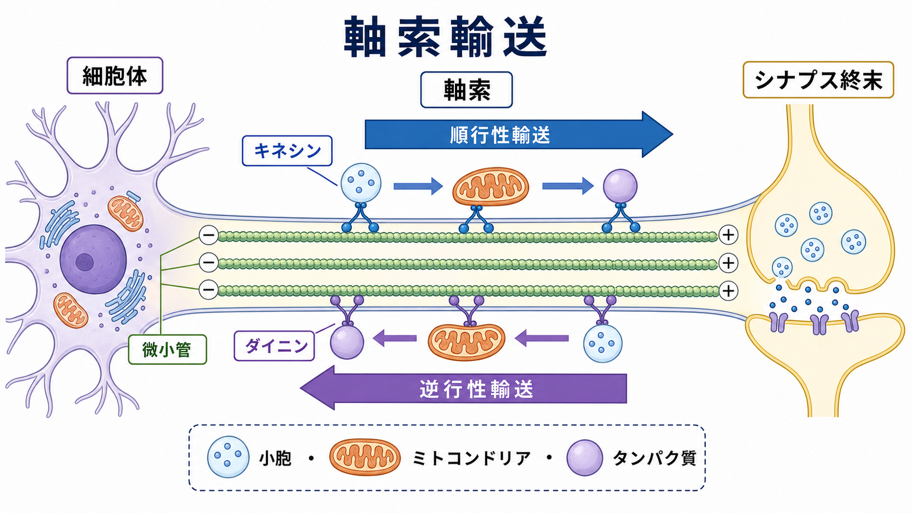
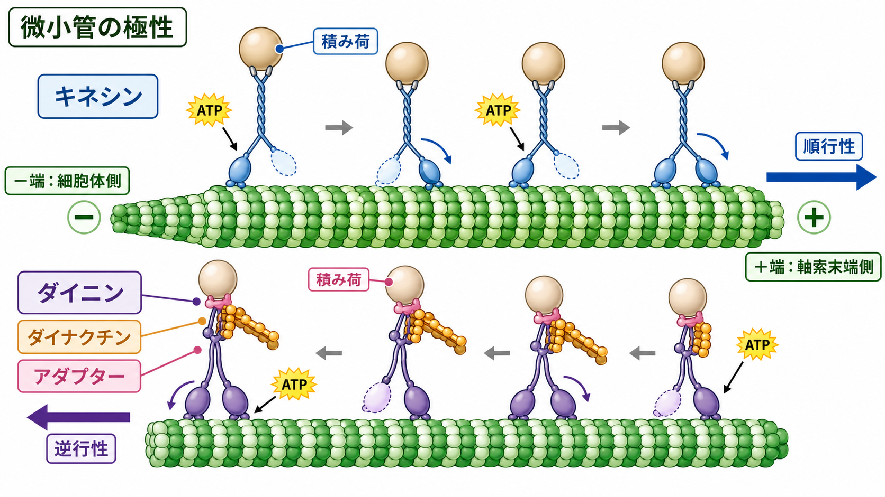
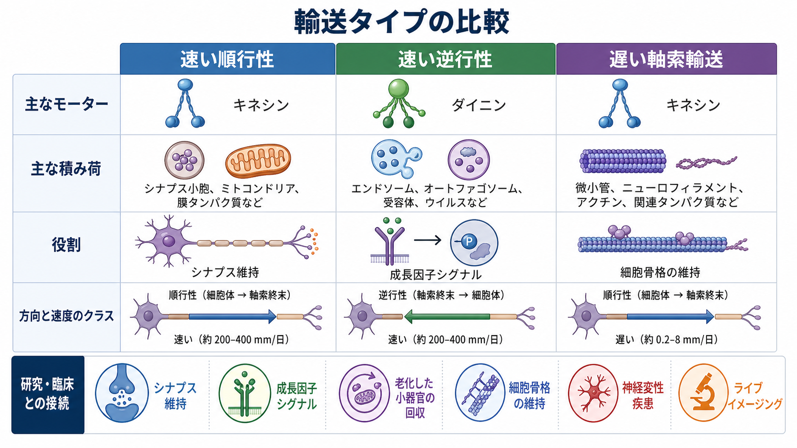

---
title: "軸索輸送とは何か"
description: "キネシン・ダイニン・微小管による順行性/逆行性輸送を、神経細胞の構造維持・シナプス機能・神経変性疾患との関係から整理する。"
aliases:
  - "軸索輸送"
  - "axon transport"
  - "axonal transport"
tags:
  - neuroscience
  - basic-neuroscience
  - obsidian
  - 神経科学
  - 基礎神経科学
created: "2026-04-27"
updated: "2026-04-27"
draft: true
publish: false
status: draft
enableToc: true
---

# 軸索輸送とは何か

## 要点

- 軸索輸送とは、[[ニューロンとは何か|ニューロン]]の細胞体で作られたタンパク質・脂質・小胞・ミトコンドリアなどを、長い[[軸索はどのように情報を遠くへ伝えるのか|軸索]]の中で能動的に運ぶ仕組みである。
- 軸索内では微小管が「レール」として働き、キネシンは主に細胞体から軸索末端へ向かう順行性輸送、ダイニンは主に軸索末端から細胞体へ戻る逆行性輸送を担う[1][2]。
- 輸送は「速い輸送」と「遅い輸送」に分けられる。小胞やオルガネラは速く動き、細胞骨格や可溶性タンパク質はより遅い時間スケールで軸索へ供給される[1][4]。
- 軸索輸送はシナプス維持、ミトコンドリア配置、成長因子シグナル、損傷応答、老化した小器官の回収に関わる[2][5]。
- 輸送の破綻は神経変性疾患の病態に関わるが、単一の原因として単純化せず、タンパク質凝集、ミトコンドリア機能、炎症、局所翻訳などと合わせて理解する必要がある[6]。

## この記事で答える問い

1. 軸索輸送は、なぜ神経細胞に必要なのか。
2. キネシン・ダイニン・微小管は、それぞれ何をしているのか。
3. 順行性輸送と逆行性輸送は、何をどちら向きに運ぶのか。
4. 速い軸索輸送と遅い軸索輸送は、何が違うのか。
5. 軸索輸送の異常は、研究・臨床でどのように重要なのか。

## まず結論

軸索輸送は、長い軸索をもつ神経細胞が「遠隔地にあるシナプスを維持する」ための物流システムである。細胞体はタンパク質合成や分解の中心であり、シナプス終末は情報伝達の現場である。この二つが数ミリメートルから、ときには 1 メートル近く離れるため、単なる拡散だけでは必要な物質を必要な場所へ届けられない[1]。

そこで神経細胞は、微小管という極性をもつ細胞骨格をレールとして使い、ATP を消費する分子モーターで荷物を運ぶ。一般に、キネシンは細胞体から軸索末端へ向かう順行性輸送を担い、ダイニンは軸索末端から細胞体へ向かう逆行性輸送を担う[3]。ただし、実際の積み荷にはキネシンとダイニンが同時に結合することも多く、アダプタータンパク質や足場タンパク質が、どちらのモーターをいつ働かせるかを調整している[1]。

## 背景

[[ニューロンの細胞体は何をしているのか|細胞体]]には核、粗面小胞体、ゴルジ体などがあり、多くのタンパク質や膜成分がここで合成・加工される。一方、シナプス終末では神経伝達物質の放出、膜小胞のリサイクル、カルシウム調節、ミトコンドリアによるエネルギー供給が必要になる。軸索が長いほど、細胞体で作った材料を末端へ運ぶ問題と、末端で生じた情報や老廃物を細胞体へ戻す問題が大きくなる。

軸索輸送研究は、放射性標識したタンパク質が軸索内を時間とともに移動することを追跡する実験から発展した。その後、微小管を壊す薬剤やライブイメージングにより、輸送が細胞骨格とモータータンパク質に依存する能動過程であることが示された[1][7]。現在では、蛍光標識した小胞・ミトコンドリア・エンドソーム・オートファゴソームを生きたニューロンで観察し、停止、反転、加速、局所的な捕捉まで解析できる。

## 基本概念

### 微小管は向きのあるレールである

微小管はチューブリンからできた細胞骨格で、プラス端とマイナス端という極性をもつ。成熟した軸索では、多くの微小管がプラス端を軸索末端側、マイナス端を細胞体側へ向けて並ぶ。この向きがあるため、モータータンパク質の進む方向が、細胞内の輸送方向に対応する[3]。

キネシンの多くは微小管のプラス端方向へ進むため、軸索では細胞体から軸索末端へ荷物を運びやすい。細胞質ダイニンはマイナス端方向へ進むため、軸索末端から細胞体へ戻る輸送を担いやすい[3]。この向きの対応が、順行性輸送と逆行性輸送の基本である。

### 積み荷は小胞だけではない

軸索輸送の積み荷には、シナプス小胞前駆体、膜タンパク質、受容体、エンドソーム、リソソーム関連小器官、オートファゴソーム、ミトコンドリア、RNA 顆粒、細胞骨格タンパク質などが含まれる[1][2]。したがって「軸索輸送 = 小胞輸送」ではない。小胞輸送は目立つ一部であり、軸索の形と機能を維持するには、細胞骨格や可溶性タンパク質の遅い供給も重要である[4]。

### 速い輸送と遅い輸送

速い軸索輸送は、小胞や膜性オルガネラを比較的高速に運ぶ。古典的な研究では、速い成分はおよそ 50-400 mm/日、または約 1 μm/秒程度のスケールで観察される[1][4]。一方、遅い軸索輸送は、細胞骨格タンパク質や可溶性タンパク質を 0.2-8 mm/日程度の遅いスケールで運ぶと整理される[4]。

この区別は「速いものは重要で、遅いものは補助的」という意味ではない。速い輸送はシナプス活動や小器官配置に直結し、遅い輸送は軸索の構造そのものを長期的に維持する。

## 仕組み

### 順行性輸送

順行性輸送は、細胞体から軸索末端へ向かう輸送である。主な役割は、シナプスで使う膜成分、シナプス小胞前駆体、膜タンパク質、ミトコンドリア、軸索内で必要なタンパク質を遠位部へ供給することにある[1][2]。

キネシンはこの方向の代表的なモーターである。キネシンは ATP を使って微小管上をステップし、積み荷に直接またはアダプターを介して結合する。たとえばミトコンドリア輸送では、モーターそのものだけでなく、Miro/TRAK などのアダプター系、カルシウム、局所的なエネルギー需要が、動くか止まるかを調整する[5]。

### 逆行性輸送

逆行性輸送は、軸索末端から細胞体へ向かう輸送である。主な役割は、使用済みの膜成分や老化した小器官を回収すること、損傷や成長因子に関するシグナルを細胞体へ伝えること、分解・再利用のためにオートファゴソームやエンドソームを戻すことにある[1][2]。

細胞質ダイニンは、ダイナクチン複合体や各種アダプターと協調して逆行性輸送を実行する。特に成長因子受容体を含むシグナル伝達エンドソームは、軸索末端で受け取った情報を細胞体の遺伝子発現へつなぐために重要である[1][2]。

### 双方向性と調節

実際の軸索輸送は、単純な「キネシンだけが前へ、ダイニンだけが後ろへ」という一方向のベルトコンベアではない。多くの積み荷には、順行性モーターと逆行性モーターが同時に結合しうる[1]。そのため、積み荷は前進、停止、後退を繰り返すことがある。

この双方向性は無秩序な引っ張り合いだけでは説明できない。積み荷の種類、成熟段階、局所環境、リン酸化、Rab GTPase、足場タンパク質、アダプタータンパク質が、モーターの結合・活性化・不活性化を調整する[1]。つまり、軸索輸送は「モーターが荷物を引く」だけでなく、「どの荷物に、どのモーターを、いつ、どこで働かせるか」を制御するシステムである。

### ミトコンドリア輸送

ミトコンドリアは ATP 産生、カルシウム緩衝、局所代謝に関わるため、活動の高いシナプスや成長円錐、ランヴィエ絞輪周辺などに適切に配置される必要がある。ミトコンドリアは順行性にも逆行性にも動き、必要な場所で停止する。したがってミトコンドリア輸送では「どれだけ速く動くか」だけでなく、「どこで止まるか」も重要な制御点である[5]。

### 遅い軸索輸送

遅い軸索輸送は、微小管、ニューロフィラメント、アクチン関連タンパク質、代謝酵素、シャペロンなどを軸索へ供給する。見かけ上は遅いが、分子が常にゆっくり歩いているというより、短い移動と停止、複合体形成、局所拡散などが組み合わさって、全体として遅い前進になると考えられている[4]。

この輸送はライブイメージングで捉えにくかったため、速い小胞輸送に比べて理解が遅れた。しかし、軸索の太さ、機械的安定性、長期的なシナプス維持を考えると、遅い輸送は基礎構造を支える中心的な過程である。

## 図解

| 分類 | 主な方向 | 代表的なモーター | 主な積み荷 | 役割 |
|---|---|---|---|---|
| 速い順行性輸送 | 細胞体 → 軸索末端 | キネシン | シナプス小胞前駆体、膜タンパク質、ミトコンドリア | シナプス材料の供給、局所代謝の維持 |
| 速い逆行性輸送 | 軸索末端 → 細胞体 | ダイニン、ダイナクチン | エンドソーム、オートファゴソーム、損傷シグナル | 成長因子シグナル、分解・再利用、損傷応答 |
| 遅い軸索輸送 | 主に細胞体 → 軸索末端 | キネシンなどが関与するが詳細は積み荷依存 | 微小管、ニューロフィラメント、可溶性タンパク質 | 軸索構造の長期維持 |

## 臨床・研究との接続

軸索輸送は、神経変性疾患の研究で重要な観察点になっている。アルツハイマー病、パーキンソン病、筋萎縮性側索硬化症、ハンチントン病、遺伝性痙性対麻痺、シャルコー・マリー・トゥース病などでは、輸送障害が病態の一部として議論されてきた[6]。特に長い軸索をもつ運動ニューロンや末梢神経では、輸送のわずかな不全が遠位軸索やシナプスから先に現れる可能性がある。

ただし、医療・精神医学的には、軸索輸送の異常だけで個別の疾患を診断したり、治療方針を決めたりすることはできない。教育・研究目的では、軸索輸送を「神経細胞が長距離構造を維持するための脆弱な物流基盤」と捉えると理解しやすい。

研究手法としては、培養ニューロンやモデル動物で蛍光標識したミトコンドリア、小胞、エンドソーム、オートファゴソームをライブイメージングし、速度、移動距離、停止時間、方向転換頻度、順行性/逆行性の比率を定量する。これにより、モーター、アダプター、疾患関連タンパク質、薬剤、損傷刺激が輸送に与える影響を評価できる。

## よくある誤解

### 誤解1：順行性輸送はキネシンだけ、逆行性輸送はダイニンだけで決まる

基本方向としては正しいが、実際の積み荷には複数のモーターが同時に結合することが多い。輸送方向は、モーターの有無だけでなく、アダプター、足場タンパク質、リン酸化、積み荷の成熟段階によって調整される[1]。

### 誤解2：軸索輸送はシナプス小胞を運ぶ仕組みだけである

シナプス小胞前駆体の輸送は重要だが、軸索輸送はミトコンドリア、エンドソーム、オートファゴソーム、RNA 顆粒、細胞骨格タンパク質なども含む広い概念である[1][2][5]。

### 誤解3：拡散で十分ではないのか

短距離なら拡散も働くが、長い軸索では距離が大きすぎる。特に膜性小器官や大きなタンパク質複合体は、必要なタイミングで遠位軸索へ届けたり、細胞体へ戻したりするには能動輸送が必要になる[1][7]。

### 誤解4：速い輸送だけを見れば軸索輸送が分かる

ライブイメージングで見えやすいのは速く動く小胞やオルガネラである。しかし、遅い軸索輸送は細胞骨格と可溶性タンパク質を支え、軸索の長期的な形態維持に不可欠である[4]。

## 関連ノート

- [[ニューロンとは何か]]
- [[ニューロンの細胞体は何をしているのか]]
- [[軸索はどのように情報を遠くへ伝えるのか]]
- [[樹状突起はどのように情報を受け取るのか]]
- [[活動電位はなぜ一方向に伝わるのか]]
- [[オリゴデンドロサイトとシュワン細胞は何が違うのか]]

## 関連ノート候補

- 微小管とは何か
- キネシンとは何か
- ダイニンとは何か
- シナプス小胞輸送とは何か
- ミトコンドリア輸送と神経変性疾患
- オートファジーと神経細胞の恒常性

## MOC更新候補

- `content/00_MOC/` 配下の神経科学・基礎神経科学系 MOC に、バッチ統合時に `[[軸索輸送とは何か]]` を追加する。
- 近接ノートとして `[[軸索はどのように情報を遠くへ伝えるのか]]`、`[[ニューロンの細胞体は何をしているのか]]`、`[[ニューロンとは何か]]` からの相互リンク候補を確認する。

## 理解チェック

1. 軸索輸送が、長い軸索をもつ神経細胞で特に重要になる理由は何か。
2. 軸索内の微小管の極性は、キネシンとダイニンの輸送方向にどう関係するか。
3. 順行性輸送と逆行性輸送では、代表的な積み荷と役割はどう違うか。
4. 速い軸索輸送と遅い軸索輸送は、速度だけでなく積み荷の点でどう違うか。
5. 軸索輸送の異常を神経変性疾患と結びつけるとき、どのような単純化を避けるべきか。

## 参考文献

[1] Maday, S., Twelvetrees, A. E., Moughamian, A. J., & Holzbaur, E. L. F. (2014). Axonal transport: cargo-specific mechanisms of motility and regulation. *Neuron*, 84(2), 292-309. https://doi.org/10.1016/j.neuron.2014.10.019

[2] Guedes-Dias, P., & Holzbaur, E. L. F. (2019). Axonal transport: driving synaptic function. *Science*, 366(6462), eaaw9997. https://doi.org/10.1126/science.aaw9997

[3] Hirokawa, N., & Takemura, R. (2005). Molecular motors and mechanisms of directional transport in neurons. *Nature Reviews Neuroscience*, 6, 201-214. https://doi.org/10.1038/nrn1624

[4] Roy, S. (2014). Seeing the unseen: the hidden world of slow axonal transport. *The Neuroscientist*, 20(1), 71-81. https://doi.org/10.1177/1073858413498306

[5] Saxton, W. M., & Hollenbeck, P. J. (2012). The axonal transport of mitochondria. *Journal of Cell Science*, 125(9), 2095-2104. https://doi.org/10.1242/jcs.053850

[6] Millecamps, S., & Julien, J.-P. (2013). Axonal transport deficits and neurodegenerative diseases. *Nature Reviews Neuroscience*, 14, 161-176. https://doi.org/10.1038/nrn3380

[7] Stenoien, D. L., & Brady, S. T. (1999). Axonal Transport. In G. J. Siegel et al. (Eds.), *Basic Neurochemistry: Molecular, Cellular and Medical Aspects* (6th ed.). NCBI Bookshelf. https://www.ncbi.nlm.nih.gov/books/NBK20410/

## 未解決問題

- 積み荷ごとに、キネシンとダイニンの競合・協調がどのように切り替わるのか。
- 軸索の局所環境、活動履歴、損傷状態が、輸送の停止・再開・方向転換をどう制御するのか。
- 神経変性疾患で観察される輸送障害が、原因、結果、代償反応のどれに当たるのかをどう切り分けるか。
- 遅い軸索輸送を生体内で高精度に測定し、疾患モデルと結びつける方法をどう改善するか。
