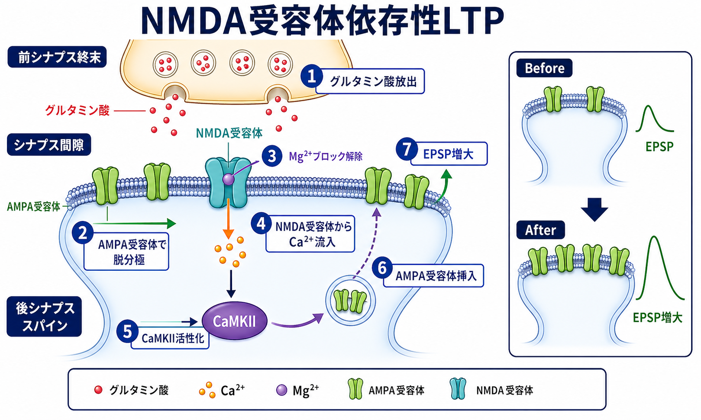

---
title: "長期増強LTPとは何か"
description: "長期増強（LTP）を、NMDA受容体、Ca2+流入、CaMKII活性化、AMPA受容体挿入という流れから整理し、学習・記憶研究との関係と限界を説明する。"
aliases:
  - "長期増強"
  - "LTP"
  - "long-term potentiation"
  - "NMDA受容体依存性LTP"
tags:
  - neuroscience
  - basic-neuroscience
  - synapse
  - plasticity
  - obsidian
created: "2026-04-27"
updated: "2026-04-27"
draft: true
publish: false
status: draft
enableToc: true
---

# 長期増強LTPとは何か

## 要点

- 長期増強（long-term potentiation; LTP）は、特定のシナプス入力が強い活動を受けたあと、その入力に対するシナプス応答が長く増大する現象である[1][8]。
- 海馬でよく研究されるNMDA受容体依存性LTPでは、グルタミン酸放出と後シナプス脱分極が重なることでNMDA受容体のMg2+ブロックが外れ、Ca2+流入が起こる[2][3]。
- Ca2+はCaMKIIなどのシグナル分子を活性化し、AMPA受容体のリン酸化、シナプス膜への挿入、足場タンパク質との安定化を通じて、同じ入力がより大きなEPSPを生むようにする[5][6]。
- LTPは学習・記憶の重要な細胞モデルだが、記憶そのものではない。脳領域、発達段階、刺激条件、シナプスの種類によって、LTPの分子機構は異なる[4][7]。

## この記事で答える問い

1. LTPとは、どのようなシナプス変化を指すのか。
2. NMDA受容体は、なぜLTP誘導の「一致検出器」と呼ばれるのか。
3. Ca2+流入、CaMKII、AMPA受容体挿入は、どの順序でつながるのか。
4. LTPを学習・記憶と結びつけるとき、どこまで言えて、どこからは慎重に読むべきか。

## まず結論

LTPは、[[シナプスとは何か|シナプス]]が「過去の活動履歴に応じて強さを変える」ことを示す代表的な現象である。典型例として、海馬の興奮性シナプスに高頻度刺激や協調した入力を与えると、その後の同じ入力に対するシナプス応答が長時間増大する[1][8]。

NMDA受容体依存性LTPの中心は、グルタミン酸入力と後シナプス細胞の脱分極が同時に起きたときだけ、大きなCa2+シグナルが入る点にある。AMPA受容体がまず脱分極を作り、脱分極によってNMDA受容体のMg2+ブロックが解除される。するとNMDA受容体からCa2+が流入し、CaMKIIを含むシグナル経路が活性化され、AMPA受容体の機能増強やシナプス膜への挿入が起こる[2][3][5][6]。

## 背景

LTPは1970年代、BlissとLømoによる海馬歯状回の研究で古典的に記述された。穿通路を反復刺激すると、その後の単発刺激で誘発される応答が30分から数時間にわたり増大した[1]。この「短い活動が長い変化を残す」という性質が、学習や記憶の細胞機構を考えるうえで強い関心を集めた。

ただし、LTPは単一の分子イベント名ではない。脳領域、シナプス、発達段階、誘導プロトコルによって、前シナプス放出確率の変化、後シナプス受容体の変化、スパイン形態変化、タンパク質合成依存的な安定化など、関与する機構が変わる[4]。この記事では、最も教科書的に説明される「海馬CA1のNMDA受容体依存性LTP」を軸に整理する。

## 基本概念

LTPを理解するには、まずシナプス強度を「同じ入力に対して、後シナプス側がどれくらい大きく応答するか」と考えるとよい。[[グルタミン酸は脳で何をしているのか|グルタミン酸]]性シナプスでは、前シナプス終末から放出されたグルタミン酸が、後シナプス膜上のAMPA受容体やNMDA受容体に結合する。

AMPA受容体は速い興奮性シナプス伝達を担い、Na+流入などを通じてEPSPを作る。NMDA受容体はグルタミン酸が結合するだけでは十分に開かず、静止膜電位付近ではMg2+によってチャネルがふさがれやすい。後シナプス膜が脱分極すると、このMg2+ブロックが解除され、Ca2+を含む陽イオンが流入しやすくなる[3]。

この性質のため、NMDA受容体は「入力が来た」という化学信号と、「後シナプス細胞が十分に脱分極している」という電気的状態を同時に読む装置として働く。これは、Hebb的な「一緒に活動した結合が強くなる」という直感と結びつけて説明されることが多い。

## 仕組み

### 1. 強い入力で後シナプス膜が脱分極する

反復入力や同期入力によって前シナプス終末からグルタミン酸が放出されると、まずAMPA受容体を介して後シナプス側が脱分極する。単発の弱い入力ではNMDA受容体のMg2+ブロックが十分に外れないことが多いが、強い入力や複数入力の同期では脱分極が大きくなり、NMDA受容体が開きやすくなる[2][3]。

### 2. NMDA受容体からCa2+が流入する

NMDA受容体の重要性は、単に電流を流すことではなく、Ca2+を局所的なシグナルとして後シナプススパイン内へ入れる点にある。[[樹状突起はどのように情報を受け取るのか|樹状突起スパイン]]は小さな区画なので、Ca2+シグナルは入力を受けたシナプス近傍に比較的局在しやすい。この局所性が、LTPの入力特異性を説明する手がかりになる。

### 3. CaMKIIが活性化し、シナプス後部の状態を変える

流入したCa2+はカルモジュリンを介してCaMKIIを活性化する。CaMKIIは後シナプス肥厚部に多く存在し、NMDA受容体近傍でCa2+シグナルを受け取る位置にある。CaMKIIは自己リン酸化によって活動状態をある程度持続させ、AMPA受容体機能やシナプス内での受容体配置を変える候補分子として研究されてきた[5]。

### 4. AMPA受容体が増え、同じ入力への応答が大きくなる

LTPの発現では、AMPA受容体の単一チャネル性質の変化、リン酸化、シナプス膜への挿入、既存受容体の安定化が重要になる。AMPA受容体がシナプス後膜で増えると、同じ量のグルタミン酸放出に対して、より大きなEPSPが生じる[6]。この変化が、電気生理学的にはシナプス応答の長期的な増大として測定される。

## 図解

図1は、LTPを「機能的可塑性」と「構造的可塑性」の両面から整理した概念図である。受容体数や放出確率の変化は比較的速い機能変化として、スパイン形態や結合配置の変化はより遅い構造変化として捉えられる。

図2は、NMDA受容体依存性LTPの中核機構である。グルタミン酸放出、AMPA受容体による脱分極、Mg2+ブロック解除、Ca2+流入、CaMKII活性化、AMPA受容体挿入を、同じシナプス内の一連の流れとして見る。

図3は、LTPを学習・記憶研究の中でどう位置づけるかを示す。LTPはシナプス変化を観察・操作するための強力なモデルだが、行動としての記憶は、多数のシナプス、回路、脳領域、身体状態、環境との相互作用から生じる[7]。

## 臨床・研究との接続

LTPは、記憶研究、発達可塑性、神経発達症、てんかん、慢性痛、神経変性疾患など、多くの研究領域に接続する。ただし、基礎的なLTP機構から個別の診断や治療方針を直接導くことはできない。医療・精神医学の文脈では、「シナプス可塑性が関与する可能性がある」という研究仮説と、「特定の人に何をすべきか」という臨床判断を分けて読む必要がある。

研究上は、LTPが学習に関わるかを問うとき、少なくとも三つの水準を区別する必要がある。第一に、学習時にLTP様の変化が観察されるか。第二に、その変化を妨げると学習や記憶が損なわれるか。第三に、その変化を人工的に作ると記憶様の行動や回路状態が再現されるかである。シナプス可塑性と記憶の仮説は強力だが、証明には多階層の因果関係を慎重に積み上げる必要がある[7]。

## よくある誤解

### 誤解1: LTPは記憶そのものである

LTPは記憶を説明する有力な細胞モデルだが、記憶そのものではない。記憶は、シナプス変化、細胞内シグナル、回路活動、再固定化、検索、注意、情動などが組み合わさった現象である[7]。

### 誤解2: NMDA受容体が開けば必ずLTPになる

NMDA受容体からのCa2+流入は重要だが、Ca2+の量、時間幅、場所、同時に働くホスファターゼや他のキナーゼ、発達段階、受容体サブユニット構成によって結果は変わる。同じCa2+でも、条件によってLTPではなく長期抑圧（LTD）に関わることがある[4]。

### 誤解3: AMPA受容体挿入だけでLTPのすべてが説明できる

AMPA受容体のトラフィッキングは多くのLTPで中心的だが、前シナプス放出確率、スパイン形態、局所タンパク質合成、細胞接着分子、抑制性入力の変化も関わりうる。LTPは「ひとつの部品」ではなく、シナプスが長期的に強くなる現象名として読む必要がある[4][6]。

## 関連ノート

- [[シナプスとは何か]]
- [[グルタミン酸は脳で何をしているのか]]
- [[受容体にはどのような種類があるのか]]
- [[樹状突起はどのように情報を受け取るのか]]
- [[神経伝達物質はどのように放出されるのか]]
- [[アセチルコリンは注意や記憶にどう関わるのか]]

## 関連ノート候補

- シナプス可塑性とは何か
- 長期抑圧LTDとは何か
- NMDA受容体はなぜ一致検出器と呼ばれるのか
- AMPA受容体トラフィッキングとは何か
- CaMKIIとは何か
- 海馬CA1回路とは何か

## MOC更新候補

- `content/00_MOC/MOC｜脳・神経科学.md` に、本記事を「基礎神経科学」または「シナプス・可塑性」項目として追加する。
- 並列生成ジョブとの衝突を避けるため、このタスクではMOC本体は更新しない。

## 理解チェック

1. LTPを「同じ入力に対する応答の変化」として説明できるか。
2. NMDA受容体に、グルタミン酸結合と後シナプス脱分極の両方が必要になる理由を説明できるか。
3. Ca2+流入からCaMKII活性化、AMPA受容体挿入までの流れを順番に言えるか。
4. 「LTPは記憶そのものではない」と言う理由を、細胞・回路・行動の水準の違いから説明できるか。

## 未解決問題

- 学習中に生じる多数のシナプス変化のうち、どれが記憶の保存に必要で、どれが副次的な変化なのか。
- LTP、LTD、構造的可塑性、抑制性可塑性は、実際の行動学習中にどのように組み合わさるのか。
- ヒトの記憶や精神疾患研究に、動物実験・スライス実験で測定されるLTPをどの程度直接対応させられるのか。

## 参考文献

[1] Bliss, T. V. P., & Lømo, T. (1973). Long-lasting potentiation of synaptic transmission in the dentate area of the anaesthetized rabbit following stimulation of the perforant path. *The Journal of Physiology, 232*(2), 331-356. https://doi.org/10.1113/jphysiol.1973.sp010273

[2] Collingridge, G. L., Kehl, S. J., & McLennan, H. (1983). Excitatory amino acids in synaptic transmission in the Schaffer collateral-commissural pathway of the rat hippocampus. *The Journal of Physiology, 334*, 33-46. https://doi.org/10.1113/jphysiol.1983.sp014478

[3] Nowak, L., Bregestovski, P., Ascher, P., Herbet, A., & Prochiantz, A. (1984). Magnesium gates glutamate-activated channels in mouse central neurones. *Nature, 307*, 462-465. https://doi.org/10.1038/307462a0

[4] Malenka, R. C., & Bear, M. F. (2004). LTP and LTD: An embarrassment of riches. *Neuron, 44*(1), 5-21. https://doi.org/10.1016/j.neuron.2004.09.012

[5] Lisman, J., Schulman, H., & Cline, H. (2002). The molecular basis of CaMKII function in synaptic and behavioural memory. *Nature Reviews Neuroscience, 3*, 175-190. https://doi.org/10.1038/nrn753

[6] Anggono, V., & Huganir, R. L. (2012). Regulation of AMPA receptor trafficking and synaptic plasticity. *Current Opinion in Neurobiology, 22*(3), 461-469. https://doi.org/10.1016/j.conb.2011.12.006

[7] Takeuchi, T., Duszkiewicz, A. J., & Morris, R. G. M. (2014). The synaptic plasticity and memory hypothesis: encoding, storage and persistence. *Philosophical Transactions of the Royal Society B, 369*(1633), 20130288. https://doi.org/10.1098/rstb.2013.0288

[8] Nicoll, R. A. (2017). A brief history of long-term potentiation. *Neuron, 93*(2), 281-290. https://doi.org/10.1016/j.neuron.2016.12.015

## 更新ログ

- 2026-04-27: 初稿作成。NMDA受容体依存性LTP、Ca2+流入、CaMKII、AMPA受容体挿入、研究上の位置づけ、図解、参考文献を整理。
