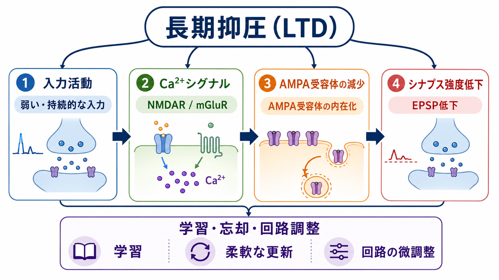
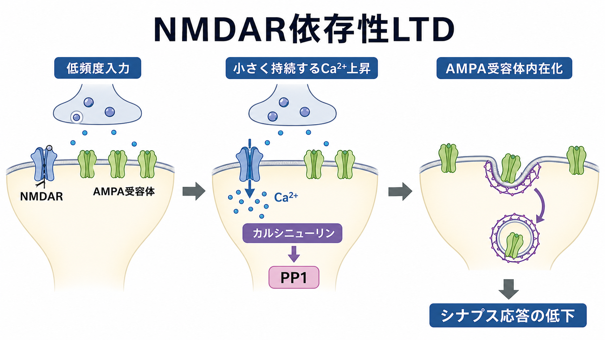
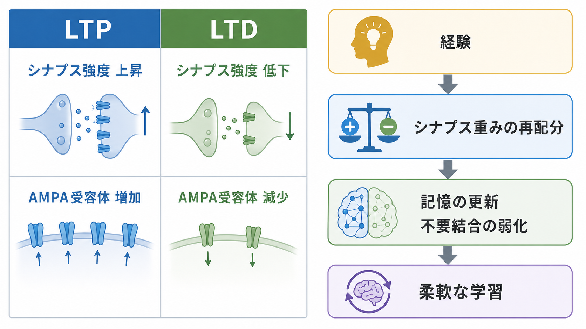

---
title: "長期抑圧LTDとは何か"
description: "シナプス強度が長く低下する長期抑圧（LTD）の基本概念、主要な分子機構、学習と回路調整における意義を説明する。"
aliases:
  - "長期抑圧"
  - "LTD"
  - "long-term depression"
tags:
  - neuroscience
  - basic-neuroscience
  - synaptic-plasticity
  - obsidian
created: "2026-04-27"
updated: "2026-04-27"
draft: true
publish: false
status: draft
enableToc: true
---

# 長期抑圧LTDとは何か

## 要点

- 長期抑圧（long-term depression: LTD）は、特定の[[シナプスとは何か|シナプス]]で伝達効率が長時間低下する[[シナプス可塑性とは何か|シナプス可塑性]]である。
- 代表例は、弱い持続的な入力や特定の活動パターンによって、シナプス後部の AMPA 受容体が減少し、興奮性シナプス後電位（EPSP）が小さくなる現象である[1][2]。
- LTD は「記憶を消す仕組み」だけではなく、[[長期増強LTPとは何か|長期増強（LTP）]]と組み合わさって、シナプス重みを再配分し、回路を柔軟に調整する。
- NMDA 受容体依存性 LTD、代謝型グルタミン酸受容体（mGluR）依存性 LTD、小脳 LTD など、部位と受容体に応じて複数の型がある[1][3]。

## この記事で答える問い

- LTD は、何が「長期」で、何が「抑圧」なのか。
- LTP と LTD は、単なる正反対の現象なのか。
- LTD では、シナプスの中で何が変わるのか。
- LTD は、学習・忘却・発達・疾患研究とどう関係するのか。

## まず結論

LTD は、神経回路が「使った接続をすべて強くする」のではなく、状況に応じて一部の接続を弱めるための仕組みである。[[グルタミン酸は脳で何をしているのか|グルタミン酸]]作動性シナプスでは、NMDA 受容体や mGluR を介した細胞内シグナルにより、AMPA 受容体のリン酸化状態・局在・内在化が変わり、シナプス応答が長く低下する[1][4]。この弱化は、不要な結合を単純に破壊するというより、学習済みの重みを再調整し、新しい経験に合わせて回路を更新する過程として理解するとよい。

## 背景

神経回路の学習は、単に神経細胞が発火するかどうかだけではなく、細胞間の結合強度がどの程度変化するかに依存する。代表的な強化方向の可塑性が LTP であり、逆に長時間続く弱化方向の可塑性が LTD である[2]。

LTD の重要性が見えにくいのは、「弱くなる」という表現が受動的に聞こえるからである。しかし実際には、LTD は能動的な調整過程である。たとえば、ある入力が現在の課題や環境に合わなくなったとき、回路はその入力の影響を下げる必要がある。すべてのシナプスが強化され続けると、信号対雑音比が崩れ、記憶の選択性も失われる。LTD は、LTP と対になって、回路の可塑性を双方向に保つ。

## 基本概念

LTD の「抑圧」は、神経細胞そのものが機能停止するという意味ではない。多くの場合、ある入力が同じ強さで来ても、シナプス後細胞に生じる応答が以前より小さくなることを指す。電気生理学的には、EPSP や興奮性シナプス後電流（EPSC）の振幅が長時間低下する形で測定される[1][5]。

「長期」とは、ミリ秒から秒単位の一過性抑制ではなく、誘導刺激が終わったあとも数十分以上続く変化を意味する。実験条件によっては、さらに長い時間スケールの維持機構が問題になる。ただし、LTD と呼ばれる現象は一枚岩ではない。海馬 CA1 の NMDA 受容体依存性 LTD、小脳プルキンエ細胞の LTD、mGluR 依存性 LTD では、入力条件、細胞内シグナル、維持機構が異なる[1][3][6]。

## 仕組み

### NMDA 受容体依存性 LTD

海馬 CA1 などでよく研究される NMDA 受容体依存性 LTD では、低頻度刺激などによってシナプス後部の Ca2+ 濃度が比較的小さく、持続的に上昇する。この Ca2+ シグナルはカルシニューリンや PP1 などの脱リン酸化系を動かし、AMPA 受容体の機能や膜上局在を変える[1][4]。

重要なのは、Ca2+ が「多ければ LTP、少なければ何も起きない」という単純なスイッチではない点である。Ca2+ の量、時間経過、局所性、同時に働くキナーゼ・ホスファターゼのバランスによって、LTP 方向にも LTD 方向にも変化しうる[2]。

### AMPA 受容体の減少

興奮性シナプスの多くでは、シナプス後応答の大きさは AMPA 受容体の数や性質に強く左右される。LTD では、AMPA 受容体がシナプス後膜から内在化し、同じグルタミン酸入力に対する応答が小さくなることがある[4][7]。したがって、LTD は「神経伝達物質が出なくなる」現象だけではなく、シナプス後側の受容体配置が変わる現象としても理解できる。

この観点は、[[受容体にはどのような種類があるのか|受容体]]を固定された部品ではなく、活動に応じて配置換えされる動的な分子装置として見る助けになる。LTD は、受容体の出し入れ、足場タンパク質、リン酸化、細胞骨格、局所タンパク質合成などが組み合わさる多段階過程である。

### mGluR 依存性 LTD

mGluR 依存性 LTD では、イオンチャネル型受容体ではなく代謝型グルタミン酸受容体を介して、細胞内シグナルとタンパク質合成が関与することがある[6][8]。この型の LTD は、脆弱 X 症候群モデルなどの発達神経科学・精神神経疾患研究でも注目されてきた[8]。ただし、疾患と LTD の関係は「LTD が多いから症状が出る」と単純化できるものではなく、脳部位、発達段階、細胞型、測定条件に依存する。

## 図解

LTP と LTD は、しばしば「強くする過程」と「弱くする過程」として対比される。しかし機能的には、両者は競合するというより、神経回路の重みを上下両方向に動かすためのペアである。LTP だけでは入力が飽和しやすく、LTD だけでは有用な結合を保持しにくい。両者があることで、経験に応じて回路を更新する余地が残る[2]。

## 臨床・研究との接続

LTD は、記憶研究、発達研究、精神神経疾患研究をつなぐ基礎概念である。記憶の固定だけを考えると LTP が目立つが、実際の学習では、古い予測や不要な連合を弱める過程も必要になる。LTD は、そのような重みの再調整を細胞・分子レベルで調べる実験モデルを提供する。

小脳では、平行線維と登上線維の同時活動によってプルキンエ細胞シナプスに LTD が生じることが知られ、運動学習との関係が長く議論されてきた[3]。海馬や大脳皮質では、経験依存的な表象の更新、発達期の回路洗練、記憶の柔軟性との関係が問題になる[1][2]。

臨床的な含意を述べるときは注意が必要である。LTD の異常は疾患モデルで示されることがあるが、それは個別の診断や治療方針を直接決めるものではない。教育・研究の文脈では、LTD を「シナプス可塑性のバランスが崩れると、発達や認知機能に影響しうる」という仮説を検討するための入口として扱うのが適切である[8]。

## よくある誤解

### LTD は記憶を消すだけの仕組みである

LTD は記憶の消去に関わる場合もあるが、それだけではない。むしろ、入力間の重みを再配分し、新しい環境に合わせて表象を更新する過程として重要である。

### LTD は LTP の単純な逆反応である

LTP と LTD は方向としては反対だが、分子機構は完全な鏡像ではない。Ca2+ シグナル、リン酸化・脱リン酸化、受容体輸送、タンパク質合成などの関与は、部位や LTD の型によって異なる[1][6]。

### LTD が起きるとシナプスが消える

LTD はシナプス応答の低下であり、必ずしも構造的なシナプス消失を意味しない。長い時間スケールではシナプス刈り込みやスパイン構造変化と関係する可能性があるが、機能的 LTD と構造的除去は区別して考える必要がある。

### LTD は抑制性シナプスの話である

「抑圧」という語から[[GABAは脳で何をしているのか|GABA]]作動性の抑制を連想しやすいが、古典的に研究されてきた LTD の多くは、グルタミン酸作動性の興奮性シナプスで応答が弱くなる現象である。

## 関連ノート

- [[シナプス可塑性とは何か]]
- [[長期増強LTPとは何か]]
- [[シナプスとは何か]]
- [[グルタミン酸は脳で何をしているのか]]
- [[受容体にはどのような種類があるのか]]
- [[シナプス後電位とは何か]]

今後の作成候補:

- Hebb則とは何か
- シナプス刈り込みはなぜ重要なのか

## MOC更新候補

- `content/00_MOC/` 配下の脳・神経科学または基礎神経科学 MOC に、本記事 `[[長期抑圧LTDとは何か]]` を追加する候補。
- 並列ジョブとの衝突を避けるため、このタスクでは MOC 本体は更新していない。

## 理解チェック

1. LTD の「抑圧」は、神経細胞の活動停止ではなく、何の長期的低下を指すか。
2. NMDA 受容体依存性 LTD で、AMPA 受容体の内在化はシナプス応答にどう影響するか。
3. LTD と LTP を「単純な反対語」とだけ理解すると、どの点を見落とすか。
4. LTD と疾患研究の関係を説明するとき、なぜ過度な一般化を避ける必要があるか。

## 参考文献

[1] Collingridge, G. L., Peineau, S., Howland, J. G., & Wang, Y. T. (2010). Long-term depression in the CNS. *Nature Reviews Neuroscience*, 11, 459-473. https://doi.org/10.1038/nrn2867

[2] Malenka, R. C., & Bear, M. F. (2004). LTP and LTD: An embarrassment of riches. *Neuron*, 44(1), 5-21. https://doi.org/10.1016/j.neuron.2004.09.012

[3] Ito, M. (2001). Cerebellar long-term depression: Characterization, signal transduction, and functional roles. *Physiological Reviews*, 81(3), 1143-1195. https://doi.org/10.1152/physrev.2001.81.3.1143

[4] Anggono, V., & Huganir, R. L. (2012). Regulation of AMPA receptor trafficking and synaptic plasticity. *Current Opinion in Neurobiology*, 22(3), 461-469. https://doi.org/10.1016/j.conb.2011.12.006

[5] Dudek, S. M., & Bear, M. F. (1992). Homosynaptic long-term depression in area CA1 of hippocampus and effects of N-methyl-D-aspartate receptor blockade. *Proceedings of the National Academy of Sciences*, 89(10), 4363-4367. https://doi.org/10.1073/pnas.89.10.4363

[6] Huber, K. M., Kayser, M. S., & Bear, M. F. (2000). Role for rapid dendritic protein synthesis in hippocampal mGluR-dependent long-term depression. *Science*, 288(5469), 1254-1257. https://doi.org/10.1126/science.288.5469.1254

[7] Snyder, E. M., Philpot, B. D., Huber, K. M., Dong, X., Fallon, J. R., & Bear, M. F. (2001). Internalization of ionotropic glutamate receptors in response to mGluR activation. *Nature Neuroscience*, 4, 1079-1085. https://doi.org/10.1038/nn746

[8] Waung, M. W., & Huber, K. M. (2009). Protein translation in synaptic plasticity: mGluR-LTD, fragile X. *Current Opinion in Neurobiology*, 19(3), 319-326. https://doi.org/10.1016/j.conb.2009.03.011

## 未解決問題

- LTD の各型が、実際の行動学習や記憶更新にどの程度必要十分なのかは、脳部位と課題ごとに検討が続いている。
- 電気生理学的 LTD、受容体輸送、スパイン形態変化、長期的なシナプス除去が、どの時間スケールでどう接続するかは単純ではない。
- 疾患モデルで観察される LTD 異常を、人間の症状や介入可能性にどう橋渡しするかには、慎重な研究設計が必要である。
