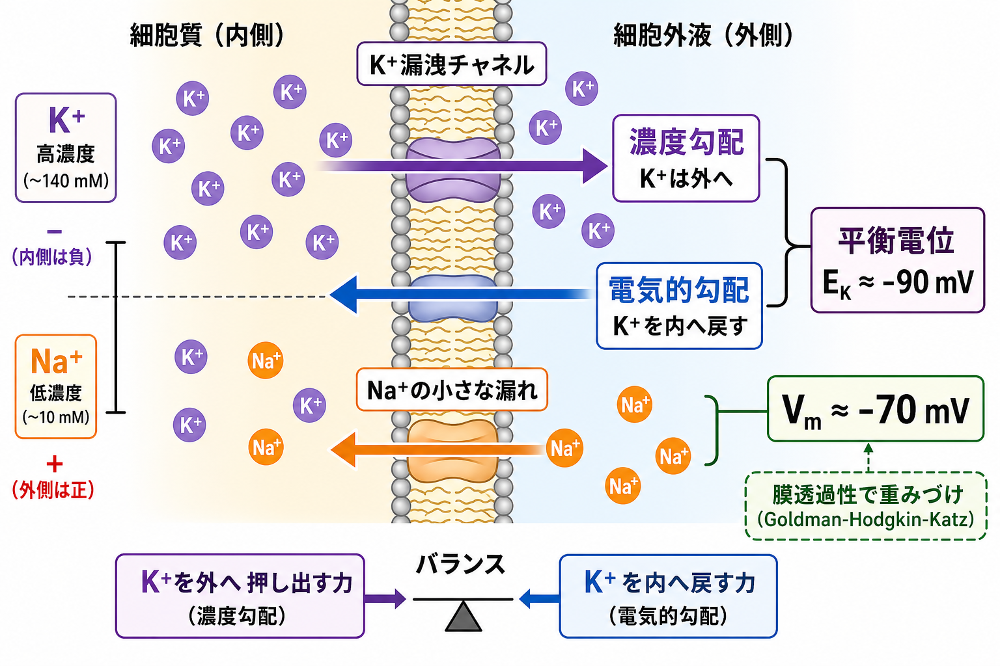
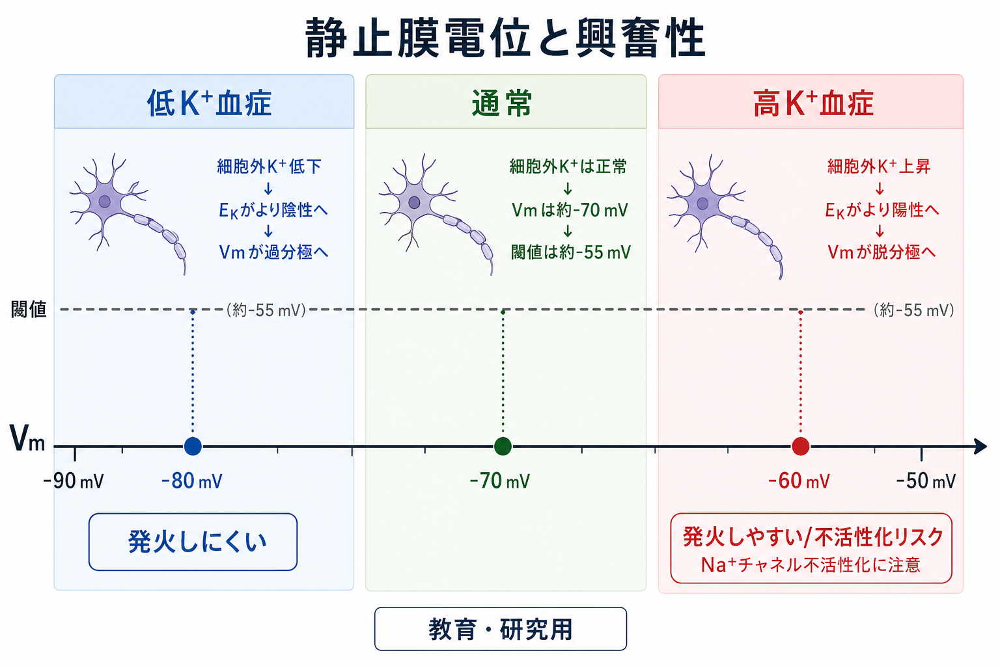

---
title: "静止膜電位はどのように生じるのか"
description: "K+漏洩チャネル、イオン濃度差、膜透過性から、ニューロンの静止膜電位がなぜ負の値になるのかを説明する。"
aliases:
  - "静止膜電位"
  - "resting membrane potential"
  - "膜電位"
tags:
  - neuroscience
  - basic-neuroscience
  - obsidian
created: "2026-04-27"
updated: "2026-04-27"
draft: true
publish: false
status: draft
enableToc: true
---

# 静止膜電位はどのように生じるのか

## 要点

- 静止膜電位とは、[[ニューロンとは何か|ニューロン]]などの興奮性細胞が外から強い入力を受けていないとき、細胞内が細胞外に対して負になっている電位差である。
- 典型的な神経細胞では、静止膜電位はおよそ -60 から -80 mV、説明上はしばしば約 -70 mV と表される[1][8]。
- 中心になるのは、細胞内に多い K+、細胞外に多い Na+ という濃度差と、静止時の膜が Na+ より K+ を通しやすいという選択的な膜透過性である[1][2]。
- K+漏洩チャネルを通って K+ が外へ出ると、細胞内に相対的な負電荷が残り、その負電位が K+ を内へ引き戻す。濃度勾配と電気的勾配が釣り合う点が K+ の平衡電位である[1][2]。
- 実際の静止膜電位は K+平衡電位そのものではない。少量の Na+ や Cl- の透過性も効くため、複数イオンの濃度差と透過性を重みづけする Goldman-Hodgkin-Katz の考え方が必要になる[2][5]。
- Na+/K+ ATPase は静止膜電位を一瞬で「作る」主役というより、Na+ と K+ の濃度差を長期的に維持する背景条件である[1][3]。

## この記事で答える問い

この記事では、[[神経細胞膜はどのように電気信号を生み出すのか]]を理解するための基礎として、次の問いに答える。

1. なぜ神経細胞の内側は外側より負になるのか。
2. K+漏洩チャネルは、静止膜電位の形成にどう関わるのか。
3. Na+/K+ポンプ、ネルンスト電位、Goldman-Hodgkin-Katz 式は、それぞれどの役割をもつのか。
4. 静止膜電位の変化は、発火しやすさや臨床・研究上の解釈にどうつながるのか。

## まず結論

静止膜電位は、「K+が多い細胞内」と「K+を比較的よく通す静止膜」が組み合わさることで生じる。K+は濃度勾配に従って細胞外へ出ようとする。しかし K+は正電荷をもつため、外へ出るほど細胞内は負になる。すると今度は、その負の電位が K+を細胞内へ引き戻す。外へ押し出す濃度勾配と、内へ戻す電気的勾配が釣り合う点が K+平衡電位であり、静止膜電位はそこに強く引き寄せられる[1][2]。

ただし、細胞膜は K+だけを通す完全な膜ではない。静止時にも少量の Na+ や Cl- が関わるため、実際の膜電位は K+平衡電位より少し正の側、典型的には約 -70 mV 付近に落ち着く[2][8]。この「どのイオンをどれだけ通すか」が、[[イオンチャネルとは何か|イオンチャネル]]の生理学的な重要性である。

## 背景

神経細胞は、膜を隔てた電位差を使って情報を扱う。金属線のように電子が長距離を流れているのではなく、膜近傍で Na+、K+、Cl-、Ca2+ などのイオンが選択的に移動し、その結果として電位差が変化する。

膜電位を理解するときは、次の二つを分けると見通しがよい。

- 濃度差: あるイオンが、濃い側から薄い側へ拡散しようとする力。
- 電位差: 正負の電荷の偏りによって、イオンが電気的に引かれたり押されたりする力。

K+の場合、細胞内濃度が高いため、濃度差だけを見れば外へ出ようとする。一方、K+が外へ出ると細胞内が負になり、その電気的な負の力が K+を内へ戻そうとする。この二つの力を合わせたものが電気化学的勾配である[1][2]。

## 基本概念

### 静止膜電位

静止膜電位は、細胞が活動電位を発していないときの膜電位である。神経細胞では内側を基準に「細胞内が細胞外より何 mV 低いか」として表す。約 -70 mV という値は、細胞内が細胞外より 70 mV 負である、という意味である[8]。

### 平衡電位

ある一種類のイオンだけが膜を通れると仮定したとき、そのイオンの濃度勾配による移動と電気的な引き戻しが釣り合う電位を平衡電位という。ネルンスト式は、この一種類のイオンに対する平衡電位を計算する式である[2]。

K+は細胞内に多いので、K+の平衡電位は通常かなり負の値になる。典型的な説明では、K+平衡電位はおよそ -90 mV 付近、Na+平衡電位はおよそ +60 mV 付近に置かれる。実際の値は細胞種、温度、イオン濃度で変わる[2][8]。

### 膜透過性

膜透過性とは、あるイオンが膜をどれだけ通りやすいかである。静止時の神経細胞膜は、Na+より K+をずっと通しやすい。そのため、静止膜電位は Na+平衡電位よりも K+平衡電位に近くなる[1][2]。

## 仕組み

### 1. Na+/K+ ATPase が濃度差を維持する

神経細胞では、Na+は細胞外に多く、K+は細胞内に多い。この偏りは、Na+/K+ ATPase などの輸送機構によって保たれる。Na+/K+ ATPase は ATP を使って、代表的には 3 個の Na+を細胞外へ、2 個の K+を細胞内へ運ぶ[8]。

ここで重要なのは、ポンプが静止膜電位の「直接の主原因」ではないという点である。ポンプは濃度差を保つ。膜電位を直近で決めるのは、その濃度差を背景に、どのイオンが開いたチャネルを通って流れるかである[1][3]。

### 2. K+漏洩チャネルが静止時の透過性を作る

静止時の膜には、K+を通す漏洩チャネルが開いている。分子実体としては、K2P、KCNK と呼ばれる二孔ドメイン K+チャネル群が、背景 K+電流の重要な担い手として研究されている[6][7]。

漏洩チャネルという名前は「何も制御されない穴」という意味ではない。K2Pチャネルは pH、温度、膜伸展、細胞内シグナル、薬物などで調節されうる。したがって、静止膜電位は固定された背景値ではなく、細胞の状態や環境に応じて調整される生理量である[6][7]。

### 3. K+流出が細胞内を負にする

K+は細胞内に多いので、K+漏洩チャネルが開いていると外へ出ようとする。K+が外へ出ると、正電荷が細胞外へ移るため、膜の内側は相対的に負になる。この負の電位は、今度は K+を内側へ引き戻す。

最初は濃度勾配が強く、K+は外へ出やすい。しかし膜内側が十分に負になると、電気的な引き戻しが強くなり、K+の正味の流れは小さくなる。この釣り合いが、K+平衡電位という考え方である[1][2]。

### 4. 複数イオンの透過性で実際の Vm が決まる

実際の神経細胞膜は、K+だけでなく Na+や Cl-にもある程度透過性をもつ。そのため、実際の静止膜電位は「K+平衡電位そのもの」ではなく、各イオンの濃度差と膜透過性で重みづけされた値になる。この考え方を表す代表的な式が Goldman-Hodgkin-Katz 式である[2][5]。

Hodgkin と Katz は、外液の K+濃度を変えると静止膜電位が予測どおり変化することを示し、静止膜電位が K+濃度勾配と K+透過性に強く依存することを実験的に支えた[1][4]。

## 図解

上の2枚の図は、静止膜電位の発生を「条件」と「力の釣り合い」に分けて示している。図を読むときは、次の順番で追うとよい。

1. 細胞内に K+が多く、細胞外に Na+が多い。
2. 静止時の膜は K+を相対的によく通す。
3. K+が外へ出るほど、細胞内は負になる。
4. 負の電位が K+を内へ戻そうとする。
5. K+だけなら K+平衡電位に近づくが、Na+などの小さな透過性があるため、実際の Vm は約 -70 mV 付近に落ち着く。

## 臨床・研究との接続

静止膜電位は、神経細胞がどれだけ発火しやすいかを決める基準線である。膜電位が閾値に近づけば発火しやすくなり、閾値から遠ざかれば発火しにくくなる。これは[[軸索小丘はなぜ発火の起点になるのか]]を理解するうえでも重要である。

血中 K+濃度の変化は、細胞外 K+濃度を通じて K+平衡電位と静止膜電位に影響する。一般に、細胞外 K+が上がると K+濃度勾配が小さくなり、膜電位は脱分極側へ動きやすい。逆に細胞外 K+が下がると、膜電位は過分極側へ動きやすい[8]。ただし臨床症状や治療判断は、心筋、神経、腎機能、薬剤、時間経過など多くの要因に依存する。ここでの説明は教育・研究目的の基礎知識であり、個別の診断や治療指示ではない。

研究では、静止膜電位はパッチクランプ法、電位感受性色素、計算モデルなどで扱われる。K2Pチャネルのような漏洩チャネルは、単なる背景ではなく、麻酔薬、pH、温度、機械刺激、神経修飾物質によって神経興奮性を変える調節点として研究されている[6][7]。

## よくある誤解

### 誤解1: 静止膜電位は Na+/K+ポンプが直接作る

Na+/K+ ATPase は不可欠だが、主な役割は Na+と K+の濃度差を維持することである。静止膜電位の瞬時の値は、開いているチャネルを通るイオン流と膜透過性の重みによって決まる[1][3]。

### 誤解2: 静止膜電位ではイオンは動いていない

「静止」は、細胞が何もしていないという意味ではない。K+や Na+には小さな漏れがあり、ポンプや輸送体が濃度差を保っている。正味の電位が安定して見えるだけで、膜の周囲では動的な平衡が続いている[3][8]。

### 誤解3: K+が外へ出るなら、細胞内のK+はすぐ枯渇する

膜電位を作るのに必要な電荷移動は、全体のイオン濃度を大きく変えるほど多くない。膜近傍のごく小さな電荷分離で、数十 mV の電位差を生み出せる[2][8]。

### 誤解4: 静止膜電位はすべての細胞で同じ

静止膜電位は細胞種、発達段階、チャネル発現、細胞外イオン環境、温度、神経修飾状態で変わる。約 -70 mV は便利な代表値であって、すべてのニューロンに固定された値ではない[7][8]。

## 関連ノート

- [[ニューロンとは何か]]
- [[神経細胞膜はどのように電気信号を生み出すのか]]
- [[イオンチャネルとは何か]]
- [[軸索小丘はなぜ発火の起点になるのか]]
- [[興奮性ニューロンと抑制性ニューロンは何が違うのか]]

今後の作成候補:

- ネルンスト電位とは何か
- Goldman-Hodgkin-Katz式とは何か
- Na+/K+ ATPaseは神経活動にどう関わるのか
- K2Pチャネルとは何か
- 細胞外カリウム濃度は神経興奮性をどう変えるのか

MOC更新候補:

- `content/00_MOC/MOC｜脳・神経科学.md` に本記事へのリンクを追加する。

## 理解チェック

1. 静止膜電位が K+平衡電位に近いのは、静止時の膜がどのイオンを相対的によく通すからか。
2. K+が細胞外へ出るほど、なぜ K+を内側へ戻す力が強くなるのか。
3. Na+/K+ ATPase は、静止膜電位の形成において「直接の電位決定因子」ではなく、どのような背景条件を維持しているのか。
4. ネルンスト式と Goldman-Hodgkin-Katz 式は、それぞれどのような場合を説明するのに向いているか。
5. 細胞外 K+濃度が上がると、静止膜電位と発火しやすさはどの方向に変わりやすいか。

## 参考文献

[1] Purves D, Augustine GJ, Fitzpatrick D, et al., editors. *Neuroscience. 2nd edition*. The Ionic Basis of the Resting Membrane Potential. NCBI Bookshelf, 2001. https://www.ncbi.nlm.nih.gov/books/NBK10931/

[2] Purves D, Augustine GJ, Fitzpatrick D, et al., editors. *Neuroscience. 2nd edition*. The Forces that Create Membrane Potentials. NCBI Bookshelf, 2001. https://www.ncbi.nlm.nih.gov/books/NBK11102/

[3] Wright SH. Generation of resting membrane potential. *Advances in Physiology Education*. 2004;28(4):139-142. https://doi.org/10.1152/advan.00029.2004

[4] Hodgkin AL, Katz B. The effect of sodium ions on the electrical activity of the giant axon of the squid. *The Journal of Physiology*. 1949;108(1):37-77. https://doi.org/10.1113/jphysiol.1949.sp004310

[5] Goldman DE. Potential, impedance, and rectification in membranes. *Journal of General Physiology*. 1943;27(1):37-60. https://doi.org/10.1085/jgp.27.1.37

[6] Goldstein SAN, Bockenhauer D, O'Kelly I, Zilberberg N. Potassium leak channels and the KCNK family of two-P-domain subunits. *Nature Reviews Neuroscience*. 2001;2:175-184. https://doi.org/10.1038/35058574

[7] Enyedi P, Czirjak G. Molecular background of leak K+ currents: two-pore domain potassium channels. *Physiological Reviews*. 2010;90(2):559-605. https://doi.org/10.1152/physrev.00029.2009

[8] Chrysafides SM, Bordes SJ, Sharma S. Physiology, Resting Potential. In: *StatPearls*. Updated 2023 Apr 10. NCBI Bookshelf. https://www.ncbi.nlm.nih.gov/sites/books/NBK538338/
