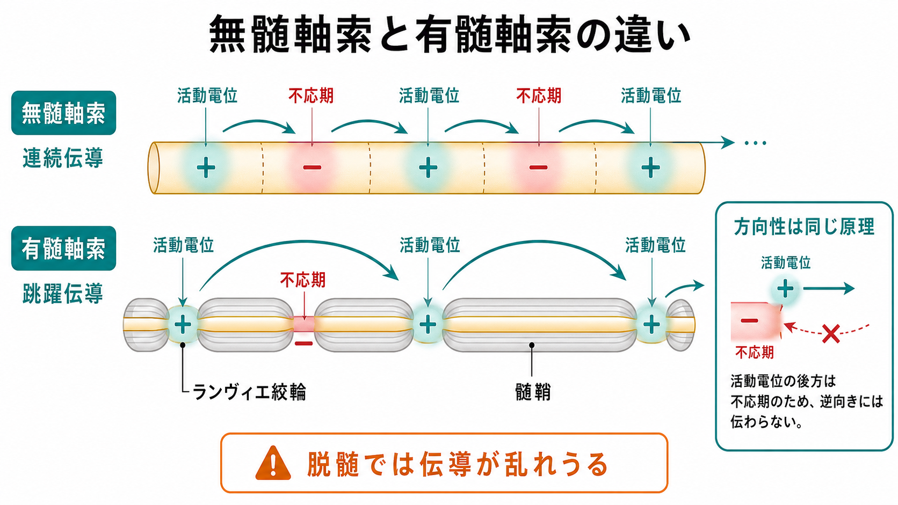
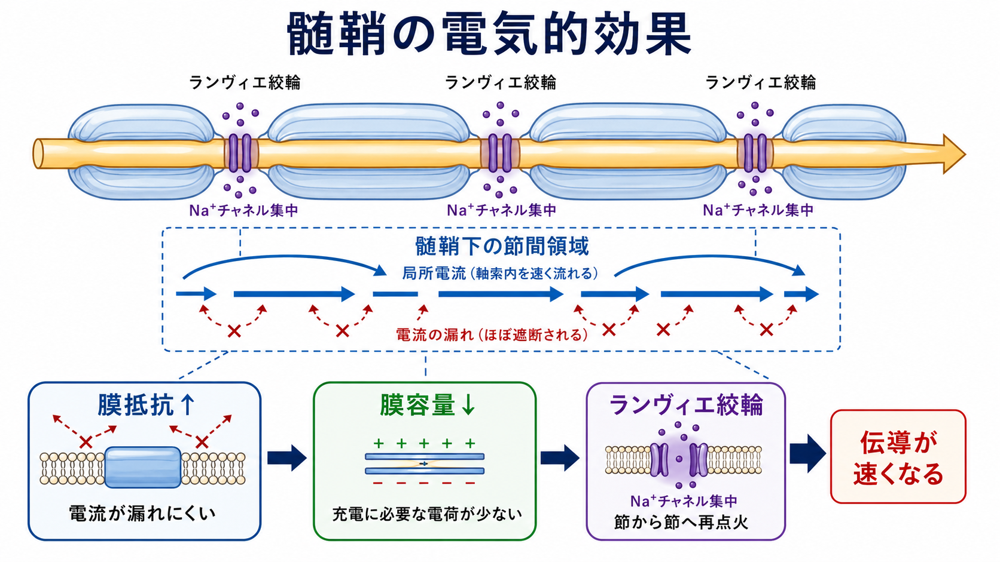
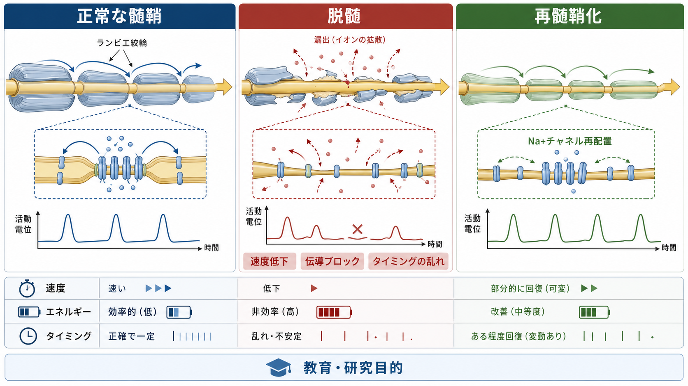

---
title: "髄鞘はなぜ神経伝導を速くするのか"
description: "電気的絶縁、膜抵抗、膜容量、ランヴィエ絞輪、跳躍伝導から、髄鞘が神経伝導を速く効率的にする理由を整理する。"
aliases:
  - "髄鞘"
  - "ミエリン"
  - "跳躍伝導"
  - "ランヴィエ絞輪"
tags:
  - neuroscience
  - basic-neuroscience
  - obsidian
  - myelin
created: "2026-04-27"
updated: "2026-04-27"
draft: true
publish: false
status: draft
enableToc: true
---

# 髄鞘はなぜ神経伝導を速くするのか

## 要点

- 髄鞘は、軸索を包む脂質に富む多層膜であり、電気的には「漏れにくく、充電しにくい」節間領域を作る[1][3]。
- 髄鞘で覆われた節間では膜抵抗が上がり、膜容量が下がるため、局所電流が次のランヴィエ絞輪へ速く届きやすい[1][2]。
- ランヴィエ絞輪には電位依存性 Na+ チャネルが高密度に集まり、弱まった電位変化を活動電位として再生する[2][4]。
- この「節から節へ再点火する」伝導が跳躍伝導であり、無髄軸索の連続伝導より速く、エネルギー効率も高い[1][5][6]。
- 脱髄やランヴィエ絞輪周辺構造の障害では、速度低下、タイミングの乱れ、伝導ブロックが起こりうる。ただし個別の診断や治療判断は専門的評価を要する[7]。

## この記事で答える問い

この記事では、[[軸索はどのように情報を遠くへ伝えるのか]]のうち、特に髄鞘とランヴィエ絞輪に関わる部分を掘り下げる。中心となる問いは次の三つである。

1. 髄鞘は、軸索膜の電気的性質をどう変えるのか。
2. ランヴィエ絞輪は、なぜ跳躍伝導に必要なのか。
3. 髄鞘が壊れると、神経伝導には何が起こりうるのか。

## まず結論

髄鞘が伝導を速くする理由は、「活動電位を髄鞘の中で全部作るから」ではない。むしろ逆である。有髄軸索では、活動電位を主にランヴィエ絞輪で作り、髄鞘に覆われた節間では電位変化を受動的に速く運ぶ[1][2]。

髄鞘は軸索膜を厚い絶縁層のように包み、膜を横切る電流漏れを減らす。同時に、軸索膜をコンデンサとして見たときの膜容量を小さくする。膜容量が小さいほど、同じだけ膜電位を変えるのに必要な電荷が少なくてすむ。したがって、節間では電位変化が素早く広がり、次のランヴィエ絞輪を閾値へ押し上げやすくなる[1][3]。

## 背景

神経細胞は、樹状突起や細胞体で入力を受け取り、軸索を通じて出力を遠くへ送る。活動電位そのものは、[[イオンチャネルとは何か]]で扱う電位依存性 Na+ チャネルと K+ チャネルの開閉によって生じる。無髄軸索では、この活動電位が軸索膜に沿って連続的に再生される。

しかし、長距離を高速に伝えるには、膜のすべての場所で毎回同じように活動電位を作る方法は効率が悪い。髄鞘は、軸索の多くの部分を電気的に絶縁し、興奮しやすい場所をランヴィエ絞輪へ集中させる。これは、信号を「全部の区間で作る」のではなく、「必要な節点で再生する」設計である[2][4]。

## 基本概念

### 髄鞘

髄鞘は、軸索の周囲に何重にも巻きついたグリア細胞由来の膜である。中枢神経系ではオリゴデンドロサイト、末梢神経系ではシュワン細胞が形成する。両者の違いは[[オリゴデンドロサイトとシュワン細胞は何が違うのか]]で詳しく扱う。

髄鞘の重要な特徴は、脂質に富む多層構造である。この構造は、軸索膜の外へ電流が漏れる経路を減らし、軸索膜を電気的に「節間」と「絞輪」へ分ける[1][3]。

### ランヴィエ絞輪

ランヴィエ絞輪は、隣り合う髄鞘節間の間にある短い無髄部分である。ここには電位依存性 Na+ チャネルが高密度に集まっており、節間を受動的に進んできた電位変化を活動電位として再生する[2][4]。

重要なのは、絞輪が単なる「隙間」ではないことである。絞輪、傍絞輪部、傍傍絞輪部には、Na+ チャネル、K+ チャネル、細胞接着分子、細胞骨格タンパク質が領域ごとに配置される。この分子配置が崩れると、髄鞘が残っていても伝導は不安定になりうる[4][7]。

### 膜抵抗と膜容量

膜抵抗は、膜を横切って電流が漏れにくい度合いである。髄鞘は膜抵抗を高め、軸索内を進む局所電流が外へ逃げにくい状態を作る[1][2]。

膜容量は、膜電位を変えるためにどれだけ電荷を蓄える必要があるかを表す。髄鞘は膜容量を下げるため、同じ電位変化を作るのに必要な電荷が少なくなる。したがって、節間の電位変化は速く立ち上がりやすい[1][3]。

## 仕組み

### 1. 髄鞘は電流漏れを減らす

無髄軸索では、活動部位の近くに局所電流が流れ、隣の膜を脱分極させる。しかし膜がむき出しなので、電流の一部は膜を横切って外へ漏れる。そのため、次の領域を閾値まで押し上げるには、軸索膜の各部位で連続的に活動電位を再生する必要がある[1]。

有髄軸索では、節間が髄鞘で包まれている。髄鞘は膜抵抗を上げるため、局所電流は膜外へ漏れにくく、軸索内部を次の絞輪へ向かって進みやすい[1][2]。

### 2. 髄鞘は膜容量を下げる

軸索膜は、電荷を蓄えて膜電位を変えるという意味でコンデンサに似ている。膜容量が大きいほど、膜電位を変えるには多くの電荷を動かす必要がある。

髄鞘で覆われた節間では、実効的な膜容量が小さくなる。すると、軸索内部を流れる局所電流は、節間の膜を広く充電するために消費されにくくなる。結果として、次の絞輪へ届く電位変化が速く、大きくなりやすい[1][3]。

### 3. ランヴィエ絞輪で活動電位が再点火される

節間を進む電位変化は、完全な活動電位ではなく、受動的に広がる電位変化である。距離とともに多少は弱まるため、どこかで再生しなければならない。その再生点がランヴィエ絞輪である[2][4]。

絞輪に届いた脱分極が閾値を超えると、絞輪の Na+ チャネルが開き、Na+ 流入が脱分極をさらに強める。これにより活動電位が再び立ち上がる。Huxley と Stämpfli の古典的研究は、末梢有髄神経線維で活動が節から節へ伝わる跳躍伝導の証拠を示した[5]。

### 4. 速さだけでなく効率も上がる

髄鞘化は、単に伝導速度を上げるだけではない。活動電位を主に絞輪で再生するため、イオンが膜を横切る場所が限られる。すると、Na+/K+ ポンプが後で戻すべきイオン勾配の乱れも相対的に少なくなる。つまり、有髄軸索は、小さな軸索径でも高速で、かつ比較的効率よく遠距離通信できる[3][6]。

進化的に見ると、神経伝導を速くする方法には、軸索を巨大化する方法と、髄鞘化する方法がある。髄鞘は、軸索を極端に太くしなくても高速伝導を可能にする点で、神経系の省スペース化にも関わる[6]。

## 図解

上の図は、髄鞘の働きを三つの層で見ると理解しやすい。

- 構造の層: 髄鞘、節間、ランヴィエ絞輪、傍絞輪部。
- 電気の層: 膜抵抗上昇、膜容量低下、局所電流、再点火。
- 分子配置の層: 絞輪の Na+ チャネル集中、周辺領域の K+ チャネル配置、軸索とグリアの接着。

髄鞘の効果は、この三つの層がそろって初めて成立する。したがって「髄鞘があるから速い」という表現は便利だが、より正確には「髄鞘が節間の電気的性質を変え、ランヴィエ絞輪が活動電位を再生する配置を作るから速い」と言える。

## 臨床・研究との接続

脱髄では、髄鞘による高抵抗・低容量の節間構造が崩れる。すると、局所電流が漏れやすくなり、次の絞輪を十分に脱分極できなくなる。軽度なら伝導速度の低下やタイミングの乱れとして現れ、重度なら伝導ブロックにつながりうる[7]。

また、病態は髄鞘そのものだけでなく、ランヴィエ絞輪、傍絞輪部、傍傍絞輪部の分子配置にも及ぶ。たとえば絞輪の長さ、Na+ チャネルの集積、傍絞輪部の絶縁シール、K+ チャネルの露出などが変わると、有髄軸索の信号伝導は大きく影響を受ける[4][7]。

この説明は教育・研究目的の基礎整理であり、個別の症状を診断したり治療方針を指示したりするものではない。臨床的な判断には、神経学的診察、電気生理検査、画像検査、血液・髄液検査などを含む専門的評価が必要である。

## よくある誤解

### 誤解1: 髄鞘は電線のビニール被覆と同じである

髄鞘は絶縁に似た働きをするが、金属線の被覆とは違う。軸索では、活動電位はイオンチャネルによって再生されながら進む。髄鞘はその再生場所をランヴィエ絞輪へ集中させる生物学的構造であり、分子配置やグリア細胞との相互作用を含む[2][4]。

### 誤解2: 有髄軸索では活動電位が髄鞘の中をそのまま走る

節間を進むのは主に受動的な電位変化である。活動電位は主にランヴィエ絞輪で再生される。したがって「節から節へ跳ぶ」という表現は、活動電位の再生点が離散的に配置されていることを指す[1][5]。

### 誤解3: 髄鞘が厚ければ厚いほど必ず速い

髄鞘の厚さ、軸索径、節間長、絞輪の分子構成には最適範囲がある。髄鞘が厚いことだけでなく、次の絞輪へ十分な電位変化を届けられる長さと、絞輪で再点火できるチャネル配置が重要である[3][4]。

### 誤解4: 脱髄の影響は速度低下だけである

脱髄は速度を下げるだけでなく、伝導ブロック、発火タイミングの乱れ、異所性興奮、軸索変性への脆弱性などと結びつきうる。特にランヴィエ絞輪周辺の構造変化は、単なる「被覆の欠損」以上の意味を持つ[7]。

## 関連ノート

- [[軸索はどのように情報を遠くへ伝えるのか]]
- [[イオンチャネルとは何か]]
- [[軸索小丘はなぜ発火の起点になるのか]]
- [[オリゴデンドロサイトとシュワン細胞は何が違うのか]]
- [[アストロサイトはシナプスと代謝をどう支えているのか]]

関連ノート候補:

- 髄鞘とは何か
- ランヴィエ絞輪では何が起きているのか
- 跳躍伝導とは何か
- 脱髄ではなぜ伝導ブロックが起こるのか
- 白質とは何か

MOC更新候補:

- バッチ統合時に [[MOC｜脳・神経科学]] の基礎神経科学またはグリア・白質関連の項目へ追加する。

## 理解チェック

1. 髄鞘が膜抵抗を上げると、局所電流には何が起こるか。
2. 髄鞘が膜容量を下げると、膜電位変化の速さには何が起こるか。
3. ランヴィエ絞輪に Na+ チャネルが集中している理由を、跳躍伝導と結びつけて説明できるか。
4. 有髄軸索の節間で、活動電位そのものではなく受動的電位変化が進むとはどういう意味か。
5. 脱髄が速度低下だけでなく伝導ブロックにつながりうる理由を説明できるか。

## 参考文献

[1] Morell P, Quarles RH. The Myelin Sheath. In: *Basic Neurochemistry: Molecular, Cellular and Medical Aspects. 6th edition.* NCBI Bookshelf. https://www.ncbi.nlm.nih.gov/books/NBK27954/

[2] Grider MH, Belcea CQ, Covington BP, Reddy V, Sharma S. Neuroanatomy, Nodes of Ranvier. *StatPearls.* NCBI Bookshelf, updated 2023. https://www.ncbi.nlm.nih.gov/books/NBK537273/

[3] Nave KA, Werner HB. Myelination of the nervous system: mechanisms and functions. *Annual Review of Cell and Developmental Biology.* 2014;30:503-533. https://doi.org/10.1146/annurev-cellbio-100913-013101

[4] Rasband MN, Peles E. Mechanisms of node of Ranvier assembly. *Nature Reviews Neuroscience.* 2021;22:7-20. https://doi.org/10.1038/s41583-020-00406-8

[5] Huxley AF, Stämpfli R. Evidence for saltatory conduction in peripheral myelinated nerve fibres. *The Journal of Physiology.* 1949;108(3):315-339. https://pubmed.ncbi.nlm.nih.gov/16991863/

[6] Hartline DK, Colman DR. Rapid conduction and the evolution of giant axons and myelinated fibers. *Current Biology.* 2007;17(1):R29-R35. https://doi.org/10.1016/j.cub.2006.11.042

[7] Arancibia-Carcamo IL, Attwell D. The node of Ranvier in CNS pathology. *Acta Neuropathologica.* 2014;128:161-175. https://doi.org/10.1007/s00401-014-1305-z

## 未解決問題

- 軸索径、髄鞘厚、節間長、絞輪長の最適な組み合わせは、細胞種ごとにどのように決まるのか。
- 活動依存的な髄鞘変化は、学習やタイミング調整にどの程度因果的に関わるのか。
- 脱髄後の再髄鞘化では、伝導速度だけでなく絞輪周辺の分子配置がどこまで回復するのか。
